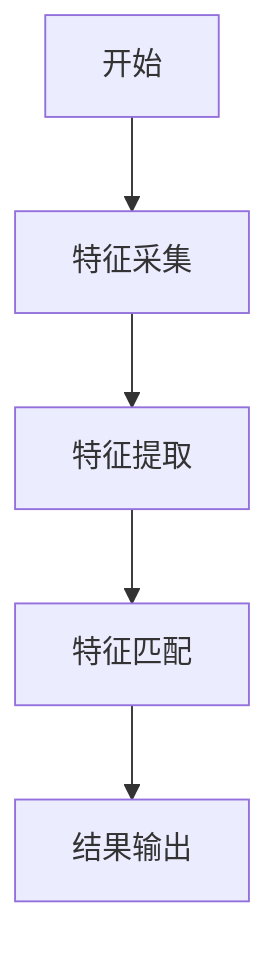
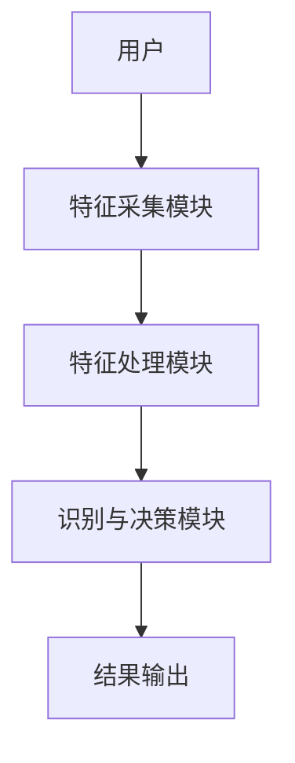

                 


# 生物识别技术的进步与安全产业投资机会

> 关键词：生物识别技术、安全产业、投资机会、身份验证、公共安全

> 摘要：生物识别技术作为一种新兴的安全技术，正在快速改变安全产业的格局。本文将详细探讨生物识别技术的核心概念、算法原理、系统架构以及在安全产业中的应用，并分析其投资机会。

---

## 第1章: 生物识别技术的背景与现状

### 1.1 生物识别技术的定义与核心概念

生物识别技术是一种通过人的生理特征或行为特征进行身份识别的技术。其核心概念包括以下几个方面：

1. **生物特征的定义**：生物特征是指人体所固有的、能够被测量和区分的特征，如指纹、掌纹、面部特征、虹膜、声音、步态等。
2. **生物识别的分类**：根据所使用的生物特征不同，生物识别技术可以分为指纹识别、虹膜识别、人脸识别、声音识别、步态识别等。
3. **生物识别的应用场景**：生物识别技术广泛应用于身份验证、公共安全、企业安全、金融支付等领域。

---

### 1.2 生物识别技术的历史演变

生物识别技术的发展可以分为以下几个阶段：

1. **早期阶段**：20世纪初，指纹识别技术开始应用于犯罪侦查。
2. **发展阶段**：20世纪末，计算机技术的发展推动了生物识别技术的数字化应用。
3. **现代阶段**：随着人工智能和深度学习技术的兴起，生物识别技术的精度和效率大幅提升。

---

### 1.3 生物识别技术在安全领域的应用现状

生物识别技术在安全领域的应用主要体现在以下几个方面：

1. **身份验证**：生物识别技术可以替代传统的密码验证方式，提高身份验证的安全性。
2. **公共安全**：生物识别技术被广泛应用于公安系统中的嫌疑人识别和犯罪预防。
3. **企业安全**：生物识别技术被用于企业的门禁系统和重要设备的访问控制。

---

## 第2章: 生物识别技术的核心概念与原理

### 2.1 生物识别技术的关键原理

生物识别技术的核心原理包括特征采集、特征提取和特征匹配三个步骤。

1. **特征采集**：通过传感器等设备采集生物特征数据。
2. **特征提取**：对采集到的特征数据进行处理，提取出具有代表性的特征向量。
3. **特征匹配**：将提取的特征向量与数据库中的特征模板进行匹配，判断是否为同一人。

---

### 2.2 生物识别技术的算法原理与数学模型

生物识别技术的算法原理可以通过以下步骤进行解释：

1. **特征采集**：例如，指纹采集可以通过光学传感器完成。
2. **特征提取**：通过算法对指纹图像进行处理，提取指纹的 ridge 和 valley 等特征。
3. **特征匹配**：将提取的特征向量与数据库中的模板进行匹配，计算相似度。

以下是一个简单的指纹识别算法流程图：



---

### 2.3 生物识别技术的优劣势对比

以下是一些常见的生物识别技术的优劣势对比：

| 技术类型 | 优势 | 劣势 |
|----------|------|------|
| 指纹识别 | 高精度、易操作 | 易受环境影响、可被 spoof 攻击 |
| 虹膜识别 | 高精度、强抗干扰性 | 成本高、设备复杂 |
| 人脸识别 | 非接触式、易部署 | 易受光线、角度影响 |

---

## 第3章: 生物识别技术在安全产业中的应用

### 3.1 安全产业中的生物识别技术

生物识别技术在安全产业中的应用主要包括以下几个方面：

1. **身份验证**：例如，银行的 ATM 机可以通过指纹识别或人脸识别进行身份验证。
2. **公共安全**：例如，公安机关可以通过指纹识别快速比对嫌疑人信息。
3. **企业安全**：例如，企业可以通过指纹识别实现门禁系统的访问控制。

---

### 3.2 生物识别技术在安全产业中的投资机会

1. **市场潜力**：随着技术的进步和成本的下降，生物识别技术的市场需求将快速增长。
2. **投资领域**：投资者可以关注以下领域的投资机会：
   - 高精度生物识别技术的研发
   - 生物识别技术在公共安全领域的应用
   - 生物识别技术在智能家居和消费电子领域的整合

---

## 第4章: 生物识别技术的算法原理与数学模型

### 4.1 生物识别技术的核心算法

生物识别技术的核心算法包括特征提取算法和特征匹配算法。

1. **特征提取算法**：例如，指纹识别中的 Gabor 滤波器组。
2. **特征匹配算法**：例如，人脸识别中的欧氏距离匹配。

---

### 4.2 生物识别技术的数学模型

以下是一个简单的特征匹配数学模型：

$$
\text{相似度} = \sum_{i=1}^{n} (f_i - t_i)^2
$$

其中，\( f_i \) 表示提取的特征向量，\( t_i \) 表示数据库中的特征模板。

---

## 第5章: 生物识别技术的系统架构与设计

### 5.1 生物识别系统的功能模块

生物识别系统的主要功能模块包括：

1. **特征采集模块**：负责采集生物特征数据。
2. **特征处理模块**：负责对采集到的特征数据进行处理和提取。
3. **识别与决策模块**：负责将提取的特征向量与数据库中的模板进行匹配，并输出识别结果。

---

### 5.2 生物识别系统的架构设计

以下是一个典型的生物识别系统的架构图：



---

## 第6章: 生物识别技术的项目实战与投资分析

### 6.1 项目实战: 人脸识别系统

1. **环境搭建**：需要安装 OpenCV 和深度学习框架（如 TensorFlow）。
2. **代码实现**：以下是人脸识别系统的简单代码示例：

```python
import cv2

face_cascade = cv2.CascadeClassifier('haarcascade_frontalface_default.xml')
cap = cv2.VideoCapture(0)

while True:
    ret, frame = cap.read()
    gray = cv2.cvtColor(frame, cv2.COLOR_BGR2GRAY)
    faces = face_cascade.detectMultiScale(gray, 1.3, 5)
    
    for (x, y, w, h) in faces:
        cv2.rectangle(frame, (x, y), (x + w, y + h), (255, 0, 0), 2)
    
    cv2.imshow('人脸识别系统', frame)
    if cv2.waitKey(1) & 0xFF == ord('q'):
        break

cap.release()
cv2.destroyAllWindows()
```

---

### 6.2 生物识别技术的投资分析

1. **市场分析**：生物识别技术的市场规模正在快速增长，预计未来几年将保持高增长率。
2. **投资建议**：投资者可以关注以下领域的投资机会：
   - 高精度生物识别技术的研发
   - 生物识别技术在公共安全领域的应用
   - 生物识别技术在智能家居和消费电子领域的整合

---

## 总结

生物识别技术的进步为安全产业带来了巨大的投资机会。随着技术的不断进步和市场需求的增加，生物识别技术将在未来几年内继续保持快速增长。投资者可以通过关注高精度生物识别技术的研发和应用，抓住这一领域的投资机会。

