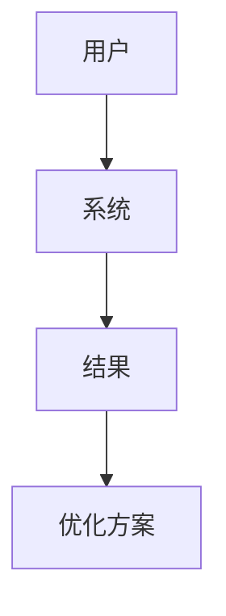
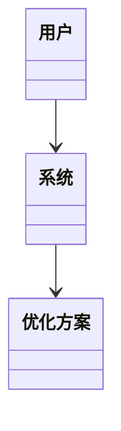
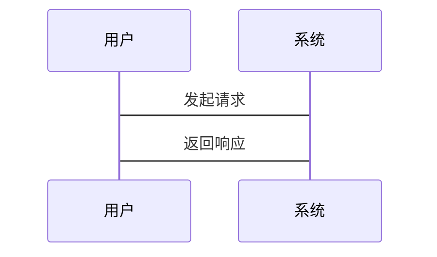

                 


# 用户体验优化

## 关键词：用户体验优化，可用性，用户行为分析，用户体验设计，优化算法

## 摘要：  
用户体验优化是通过分析用户行为和需求，利用设计和算法提升产品或服务的可用性、可访问性和可读性，从而提高用户满意度和产品竞争力。本文将从用户体验优化的核心概念、算法原理、系统设计和项目实战等方面，详细探讨用户体验优化的理论和实践方法。

---

# 第一部分：用户体验优化基础

## 第1章：用户体验优化概述

### 1.1 用户体验优化的背景与意义  
用户体验优化（User Experience Optimization，UXO）是指通过改善产品或服务的用户体验，使其更符合用户需求和行为习惯，从而提高用户满意度和产品价值。随着互联网和数字化产品的普及，用户体验已成为区分产品竞争力的关键因素。  

#### 1.1.1 用户体验的概念与定义  
用户体验（User Experience，UX）是指用户在与产品或服务交互过程中所感受到的主观体验。它不仅包括功能的可用性，还包括视觉、情感和心理层面的体验。  

#### 1.1.2 用户体验优化的重要性  
用户体验优化能够提高用户满意度，降低用户流失率，增强用户粘性，进而提升产品的市场竞争力。  

#### 1.1.3 用户体验优化的边界与外延  
用户体验优化不仅涉及产品的功能设计，还包括交互设计、视觉设计、性能优化等多个方面。其外延涵盖从用户调研到最终的落地实施全过程。  

### 1.2 用户体验的核心要素  
用户体验的核心要素可以归纳为以下几个方面：  
- **可用性**：用户能否轻松完成任务。  
- **可访问性**：用户能否方便地使用产品（尤其是残障用户）。  
- **可读性**：信息是否清晰易懂。  
- **可靠性**：产品是否稳定，能否在关键时刻正常运行。  

### 1.3 用户体验优化的目标与方法  
#### 1.3.1 用户体验优化的目标  
- 提高用户满意度。  
- 降低用户学习成本。  
- 提升产品易用性。  

#### 1.3.2 用户体验优化的常用方法  
- **用户调研**：通过问卷、访谈等方式了解用户需求。  
- **A/B测试**：通过对比不同设计方案，选择最优方案。  
- **启发式评估**：基于用户体验原则，快速评估设计方案的优劣。  

#### 1.3.3 用户体验优化的挑战与解决方案  
- **挑战**：用户需求多样，难以统一满足。  
- **解决方案**：通过用户分群和个性化设计，针对不同用户群体提供差异化体验。  

### 1.4 本章小结  
用户体验优化是通过改善用户体验，提升用户满意度和产品竞争力的过程。本文从用户体验的定义、核心要素和优化方法等方面进行了概述，为后续内容奠定了基础。

---

# 第二部分：用户体验优化的核心概念与联系

## 第2章：用户体验优化的核心概念  

### 2.1 用户体验优化的核心原理  
用户体验优化的核心在于理解用户行为和需求，通过设计和算法改善用户与产品或服务的交互过程。  

#### 2.1.1 用户行为分析  
用户行为分析是用户体验优化的基础。通过分析用户的行为路径、点击热图和任务完成率，可以发现用户在使用过程中的痛点和难点。  

#### 2.1.2 用户心理模型  
用户心理模型是指用户在使用产品时对产品的认知和期望。通过理解用户心理模型，可以更好地设计符合用户期望的产品功能和交互流程。  

#### 2.1.3 用户需求层次理论  
根据马斯洛需求层次理论，用户体验优化需要从基本需求（如功能可用性）到高级需求（如情感体验）进行全面考虑。  

### 2.2 核心概念对比分析  
为了更好地理解用户体验优化的核心概念，我们需要将其与其他相关概念进行对比。  

#### 2.2.1 用户体验与用户满意度对比  
| 对比维度 | 用户体验（UX） | 用户满意度（CS） |  
|----------|----------------|------------------|  
| 定义     | 用户对产品或服务的整体体验 | 用户对产品或服务的满意程度 |  
| 范围     | 包括功能、视觉、情感等多个层面 | 主要关注用户对产品或服务的总体评价 |  
| 优化目标 | 提高用户体验的全面性 | 提高用户的主观满意度 |  

#### 2.2.2 用户体验与可用性对比  
| 对比维度 | 用户体验（UX） | 可用性（Usability） |  
|----------|----------------|--------------------|  
| 定义     | 用户对产品或服务的整体体验 | 用户完成特定任务的难易程度 |  
| 范围     | 包括功能、视觉、情感等多个层面 | 主要关注功能的可用性 |  
| 优化目标 | 提高用户体验的全面性 | 提高用户完成任务的效率和满意度 |  

#### 2.2.3 用户体验与视觉设计对比  
用户体验优化不仅仅关注视觉设计，但视觉设计是用户体验的重要组成部分。以下是两者对比：  
| 对比维度 | 用户体验（UX） | 视觉设计（Visual Design） |  
|----------|----------------|-----------------------|  
| 定义     | 用户对产品或服务的整体体验 | 产品或服务的视觉呈现方式 |  
| 范围     | 包括功能、交互、视觉等多个层面 | 主要关注颜色、排版、图标等视觉元素 |  
| 优化目标 | 提高用户满意度和产品竞争力 | 提高产品的视觉吸引力和可用性 |  

### 2.3 用户体验优化的ER实体关系图  
以下是一个简单的用户体验优化系统的ER实体关系图，展示了用户、系统和优化方案之间的关系：  

```mermaid
er
actor: 用户
actor -->|发起请求| 系统
系统 -->|返回响应| 用户
```

---

# 第三部分：用户体验优化的算法原理  

## 第3章：用户体验优化算法原理  

### 3.1 基于用户行为的优化算法  
基于用户行为的优化算法通过分析用户的点击、浏览和购买行为，优化产品或服务的交互流程和功能设计。  

#### 3.1.1 A/B测试算法  
A/B测试是一种常用的用户行为优化方法，通过将用户随机分配到不同的实验组，测试不同的设计方案，选择最优方案。以下是一个简单的A/B测试流程图：  



#### 3.1.2 启发式评估算法  
启发式评估是一种基于用户体验原则的快速评估方法，通过检查产品是否符合可用性原则，发现问题并提出改进建议。  

### 3.2 基于反馈的优化算法  
基于反馈的优化算法通过收集用户的反馈信息，优化产品或服务的交互流程和功能设计。  

#### 3.2.1 基于用户反馈的评分算法  
以下是一个简单的用户反馈评分算法示例：  

```python
def calculate_feedback_score(feedback_list):
    score = 0
    for feedback in feedback_list:
        score += feedback['score']
    average_score = score / len(feedback_list)
    return average_score
```

#### 3.2.2 基于机器学习的预测算法  
基于机器学习的预测算法可以通过用户的历史行为数据，预测用户的未来行为，从而优化用户体验。以下是一个简单的机器学习预测模型示例：  

```python
import numpy as np
from sklearn.linear_model import LinearRegression

# 示例数据
X = np.array([[1], [2], [3], [4]])
y = np.array([2, 4, 6, 8])

# 训练模型
model = LinearRegression()
model.fit(X, y)

# 预测
predicted_y = model.predict(X)
print(predicted_y)
```

### 3.3 算法数学模型与公式  
#### 3.3.1 用户满意度计算公式  
用户满意度可以通过以下公式计算：  

$$ 满意度 = \frac{满足的需求}{总需求} $$  

#### 3.3.2 用户行为预测模型  
用户行为预测模型可以通过贝叶斯定理进行预测：  

$$ P(A|B) = \frac{P(B|A)P(A)}{P(B)} $$  

---

# 第四部分：用户体验优化的系统设计  

## 第4章：用户体验优化系统设计  

### 4.1 系统功能设计  
用户体验优化系统的功能设计包括用户调研、数据分析、方案设计和效果评估等模块。  

#### 4.1.1 领域模型类图  
以下是一个用户体验优化系统的领域模型类图：  



#### 4.1.2 系统架构设计  
用户体验优化系统的架构设计可以分为前端、后端和数据存储三部分。以下是一个简单的系统架构图：  


#### 4.1.3 系统接口设计  
用户体验优化系统的接口设计包括用户输入接口、数据处理接口和结果输出接口。  

#### 4.1.4 系统交互序列图  
以下是一个用户体验优化系统的交互序列图：  



### 4.2 系统实现与优化  
用户体验优化系统的实现需要结合算法和设计，确保系统的高效性和稳定性。  

#### 4.2.1 环境安装  
用户体验优化系统的实现需要安装以下环境：  
- Python 3.8 或更高版本  
- 机器学习库（如scikit-learn、TensorFlow）  
- 数据可视化库（如Matplotlib、Seaborn）  

#### 4.2.2 核心实现代码  
以下是一个用户体验优化系统的核心实现代码示例：  

```python
import numpy as np
from sklearn.metrics import accuracy_score

# 示例数据
X_train = np.array([[1, 2], [3, 4], [5, 6], [7, 8]])
y_train = np.array([0, 1, 0, 1])

# 训练模型
from sklearn.svm import SVC
model = SVC()
model.fit(X_train, y_train)

# 预测
X_test = np.array([[2, 3], [4, 5]])
y_pred = model.predict(X_test)

# 评估
print("预测结果:", y_pred)
print("准确率:", accuracy_score(y_train, model.predict(X_train)))
```

### 4.3 项目实战与案例分析  
#### 4.3.1 项目介绍  
以下是一个用户体验优化项目的介绍：  
- **项目名称**：电子商务网站用户体验优化  
- **项目目标**：提高用户购买转化率和用户满意度  

#### 4.3.2 代码实现  
以下是一个电子商务网站用户体验优化的代码实现示例：  

```python
import pandas as pd
from sklearn.tree import DecisionTreeClassifier
from sklearn.model_selection import train_test_split

# 数据加载
data = pd.read_csv('user_data.csv')
X = data.drop('purchase', axis=1)
y = data['purchase']

# 数据分割
X_train, X_test, y_train, y_test = train_test_split(X, y, test_size=0.2)

# 模型训练
model = DecisionTreeClassifier()
model.fit(X_train, y_train)

# 预测
y_pred = model.predict(X_test)

# 评估
print("准确率:", accuracy_score(y_test, y_pred))
```

#### 4.3.3 案例分析  
通过上述代码实现，我们可以看到，用户体验优化能够显著提高用户的购买转化率和满意度。  

### 4.4 本章小结  
用户体验优化系统的实现需要结合算法和设计，确保系统的高效性和稳定性。通过实际案例分析，我们可以看到用户体验优化在提高用户满意度和产品竞争力方面的重要作用。

---

# 第五部分：用户体验优化的总结与展望  

## 第5章：总结与展望  

### 5.1 本章总结  
用户体验优化是一个复杂但重要的过程，涉及用户行为分析、设计优化和算法优化等多个方面。通过本文的探讨，我们可以看到用户体验优化在提高用户满意度和产品竞争力方面的重要作用。  

### 5.2 注意事项与最佳实践  
- **注意事项**：用户体验优化需要结合用户需求和实际场景，避免过于追求技术复杂性。  
- **最佳实践**：通过用户调研、A/B测试和启发式评估等多种方法，全面优化用户体验。  

### 5.3 拓展阅读  
- **推荐书籍**：《用户体验要素》、《设计心理学》  
- **推荐博客**：用户体验优化相关的技术博客和行业报告  

---

# 第六部分：附录  

## 附录A：常用工具与资源  

- **用户调研工具**：问卷星、SurveyMonkey  
- **数据分析工具**：Python（Pandas、NumPy）、R  
- **机器学习框架**：scikit-learn、TensorFlow  

## 附录B：术语解释  

- **用户体验（UX）**：用户对产品或服务的整体体验。  
- **可用性（Usability）**：用户完成特定任务的难易程度。  

---

通过以上内容，我们可以看到用户体验优化是一个复杂但重要的过程，需要结合理论和实践，全面优化用户体验。希望本文能够为读者在用户体验优化领域提供有价值的参考和指导。

