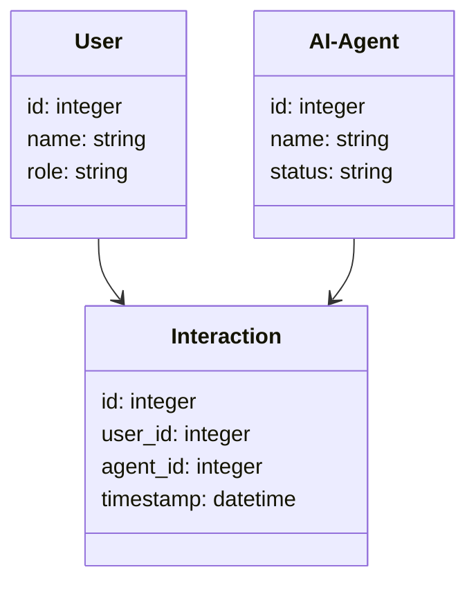
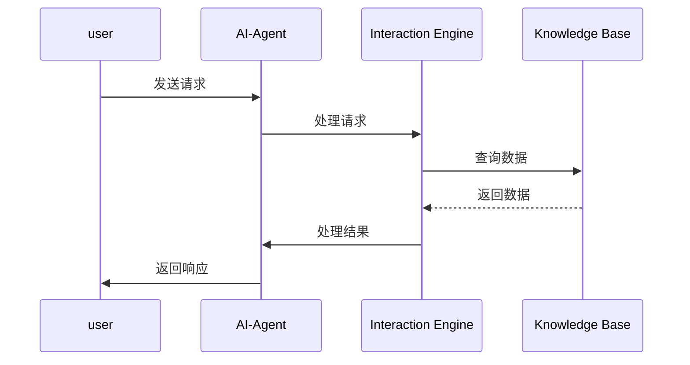

                 


# 用户体验研究：提升AI Agent的易用性

> **关键词**: 用户体验研究, AI Agent, 交互设计, 自然语言处理, 可用性评估

> **摘要**: 本文将深入探讨如何通过用户体验研究提升AI Agent的易用性。从用户需求分析到系统架构设计，结合实例分析，详细阐述AI Agent的交互设计、算法原理和系统实现。通过数学建模和代码实现，分析用户体验研究在AI Agent中的具体应用，为读者提供系统化的提升方法。

---

## 第一部分: 用户体验研究与AI Agent概述

### 第1章: 用户体验研究的核心概念

#### 1.1 用户体验研究的背景与意义

##### 1.1.1 用户体验的定义与重要性
用户体验（User Experience, UX）是用户在与产品交互过程中所感受到的情感、态度和体验。随着AI Agent（智能代理）的应用普及，用户体验成为决定用户满意度和产品成功的关键因素。良好的用户体验能够提高用户粘性，降低用户流失率。

##### 1.1.2 AI Agent的定义与特点
AI Agent是一种能够感知环境、自主决策并执行任务的智能系统。与传统软件不同，AI Agent具备以下特点：
- **自主性**: 能够独立执行任务，无需人工干预。
- **反应性**: 能够实时感知环境并做出响应。
- **学习能力**: 通过数据学习和优化自身行为。

##### 1.1.3 用户体验研究在AI Agent中的作用
用户体验研究在AI Agent中的作用主要体现在以下方面：
- **需求分析**: 通过用户调研确定用户需求和痛点。
- **设计优化**: 基于用户反馈优化AI Agent的交互设计。
- **性能提升**: 通过用户体验评估优化系统性能和响应速度。

#### 1.2 用户体验研究的基本方法

##### 1.2.1 用户调研与需求分析
用户调研是用户体验研究的基础，主要包括以下步骤：
1. **问卷调查**: 收集用户的基本信息、使用习惯和需求。
2. **深度访谈**: 通过与用户的一对一访谈，深入了解用户的使用场景和痛点。
3. **用户画像**: 基于调研数据构建用户画像，为后续设计提供依据。

##### 1.2.2 用户行为分析与建模
用户行为分析是通过观察用户在系统中的行为，提取用户的行为模式和规律。常用的方法包括：
- **日志分析**: 通过分析用户操作日志，识别用户的行为模式。
- **热图分析**: 使用热图工具分析用户在界面中的注意力分布。

##### 1.2.3 用户体验评估指标
用户体验评估指标是衡量AI Agent易用性的关键指标，包括：
- **任务完成率**: 用户是否能够顺利完成指定任务。
- **用户满意度**: 用户对AI Agent的满意度评分。
- **操作时间**: 用户完成任务所需的时间。

#### 1.3 AI Agent与用户体验的结合

##### 1.3.1 AI Agent的交互设计
交互设计是用户体验研究的核心部分，涉及以下几个方面：
- **对话设计**: 设计自然流畅的对话流程，确保用户能够轻松与AI Agent交互。
- **反馈机制**: 在用户操作后，AI Agent需要及时反馈操作结果，增强用户信任感。

##### 1.3.2 用户需求与AI Agent功能的匹配
用户需求与AI Agent功能的匹配是用户体验优化的关键。通过用户调研和需求分析，确保AI Agent的功能设计能够满足用户的真实需求。

##### 1.3.3 用户体验在AI Agent设计中的优先级
用户体验设计需要在AI Agent的设计中占据重要位置。通过优先考虑用户体验，可以提升用户满意度和产品易用性。

---

### 第2章: 用户体验研究的理论基础

#### 2.1 用户中心设计（UCD）原则

##### 2.1.1 UCD的核心理念
用户中心设计（User-Centered Design, UCD）是一种以用户需求为核心的设计方法。其核心理念包括：
- **以用户为中心**: 设计过程中始终以用户需求为出发点。
- **迭代优化**: 通过多次迭代优化设计方案，确保设计符合用户期望。

##### 2.1.2 UCD在AI Agent设计中的应用
在AI Agent设计中，UCD原则主要体现在以下方面：
- **需求分析**: 通过用户调研确定用户需求和痛点。
- **设计迭代**: 根据用户反馈不断优化AI Agent的设计。

##### 2.1.3 UCD与传统软件设计的差异
与传统软件设计相比，UCD在AI Agent设计中的应用更加注重动态性和适应性。AI Agent需要能够根据用户反馈实时调整自身的行为和交互方式。

#### 2.2 用户认知与行为模型

##### 2.2.1 用户认知模型的构建
用户认知模型是描述用户如何感知和理解系统的模型。构建用户认知模型需要结合用户调研和行为数据分析。

##### 2.2.2 用户行为模型的分析
用户行为模型是通过分析用户在系统中的行为，提取用户的行为模式和规律。常用的方法包括日志分析和热图分析。

##### 2.2.3 用户认知与行为模型在AI Agent中的应用
在AI Agent设计中，用户认知与行为模型主要用于优化交互设计和功能设计，确保用户能够轻松理解和使用AI Agent。

#### 2.3 用户体验的核心要素

##### 2.3.1 易用性
易用性是指用户能够轻松完成任务的特性。在AI Agent设计中，需要通过优化对话流程和操作步骤提升易用性。

##### 2.3.2 可用性
可用性是指系统在正常条件下能够稳定运行的特性。在AI Agent设计中，需要通过优化系统架构和算法提升可用性。

##### 2.3.3 可访问性
可访问性是指系统能够满足不同用户需求的特性。在AI Agent设计中，需要通过多模态交互设计提升可访问性。

---

### 第3章: AI Agent的交互设计

#### 3.1 交互设计的基本原则

##### 3.1.1 以用户为中心的设计
以用户为中心的设计是交互设计的核心原则。在AI Agent设计中，需要通过用户调研和需求分析确定用户需求和痛点。

##### 3.1.2 一致性原则
一致性原则是指在系统中保持一致的设计风格和操作流程。在AI Agent设计中，需要通过统一的界面设计和操作流程提升用户体验。

##### 3.1.3 反馈机制
反馈机制是指在用户操作后，系统需要及时反馈操作结果。在AI Agent设计中，需要通过实时反馈增强用户信任感。

#### 3.2 自然语言处理在AI Agent交互中的应用

##### 3.2.1 NLP的基本原理
自然语言处理（NLP）是实现人机交互的核心技术。NLP的基本原理包括文本分割、词干提取、句法分析等。

##### 3.2.2 NLP在对话设计中的应用
在AI Agent对话设计中，NLP主要用于实现自然语言理解（NLU）和自然语言生成（NLG）。通过NLU技术，AI Agent能够理解用户的意图；通过NLG技术，AI Agent能够生成自然流畅的对话响应。

##### 3.2.3 NLP的挑战与优化
NLP在AI Agent中的应用面临以下挑战：
- **歧义性**: 用户的表达可能存在歧义，需要通过上下文分析和意图识别技术解决。
- **语境理解**: 需要通过上下文分析和意图识别技术提升语境理解能力。

#### 3.3 AI Agent的多模态交互设计

##### 3.3.1 多模态交互的定义
多模态交互是指通过多种交互方式（如语音、文本、手势等）实现人机交互。

##### 3.3.2 多模态交互的优势
多模态交互的优势在于能够满足不同用户的交互需求，提升用户体验。

##### 3.3.3 多模态交互的设计挑战
多模态交互的设计挑战主要体现在如何实现多种交互方式的协同工作和统一管理。

---

## 第二部分: 用户体验研究的数学模型与算法原理

### 第4章: 用户体验研究的数学模型与算法原理

#### 4.1 用户行为建模的数学基础

##### 4.1.1 用户行为建模的核心要素
用户行为建模的核心要素包括用户特征、行为特征和环境特征。

##### 4.1.2 用户行为建模的数学模型
用户行为建模的数学模型主要包括概率模型、统计模型和机器学习模型。

#### 4.2 用户体验评估的算法原理

##### 4.2.1 用户体验评估的核心算法
用户体验评估的核心算法包括支持向量机（SVM）、随机森林（RF）和深度学习模型（如LSTM）。

##### 4.2.2 用户体验评估的实现步骤
用户体验评估的实现步骤包括数据预处理、模型训练和模型评估。

#### 4.3 AI Agent交互优化的算法实现

##### 4.3.1 AI Agent交互优化的核心算法
AI Agent交互优化的核心算法包括强化学习（RL）和迁移学习（Transfer Learning）。

##### 4.3.2 AI Agent交互优化的实现步骤
AI Agent交互优化的实现步骤包括数据收集、模型训练和模型部署。

---

## 第三部分: 系统分析与架构设计方案

### 第5章: 系统分析与架构设计方案

#### 5.1 问题场景介绍

##### 5.1.1 问题背景
在设计AI Agent时，需要考虑用户需求、技术实现和系统架构等多个方面。

##### 5.1.2 问题描述
AI Agent的易用性优化需要从用户需求分析、交互设计和系统实现等多个方面进行综合考虑。

#### 5.2 系统功能设计

##### 5.2.1 领域模型设计
领域模型设计是系统功能设计的核心部分，主要用于描述系统的功能模块和交互流程。

##### 5.2.2 领域模型的mermaid类图


##### 5.2.3 系统架构设计
系统架构设计是系统实现的核心部分，主要用于描述系统的整体架构和模块划分。

##### 5.2.4 系统架构的mermaid架构图
```mermaid
container AI-Agent System {
    User Interface
    Interaction Engine
    Knowledge Base
    Learning Engine
}
```

#### 5.3 系统接口设计

##### 5.3.1 系统接口设计的核心原则
系统接口设计的核心原则包括模块化设计、松耦合设计和可扩展性设计。

##### 5.3.2 系统接口的实现方案
系统接口的实现方案包括RESTful API设计和WebSocket协议设计。

#### 5.4 系统交互设计

##### 5.4.1 系统交互流程设计
系统交互流程设计是系统实现的核心部分，主要用于描述用户与AI Agent之间的交互流程。

##### 5.4.2 系统交互的mermaid序列图


---

## 第四部分: 项目实战

### 第6章: 项目实战

#### 6.1 环境安装

##### 6.1.1 开发环境要求
开发环境要求包括操作系统、编程语言和开发工具。

##### 6.1.2 环境安装步骤
环境安装步骤包括安装Python、安装依赖库和配置开发环境。

#### 6.2 系统核心实现

##### 6.2.1 核心代码实现
核心代码实现包括用户身份验证、自然语言处理和交互逻辑实现。

##### 6.2.2 代码解读与分析
代码解读与分析包括代码结构、核心模块和关键函数解读。

##### 6.2.3 代码实现的注意事项
代码实现的注意事项包括代码可读性、代码可维护性和代码安全性。

#### 6.3 实际案例分析

##### 6.3.1 案例背景介绍
案例背景介绍包括案例需求、案例目标和案例范围。

##### 6.3.2 案例实现过程
案例实现过程包括需求分析、设计实现和测试优化。

##### 6.3.3 案例分析与总结
案例分析与总结包括案例成果、案例经验总结和案例改进建议。

---

## 第五部分: 总结与展望

### 第7章: 总结与展望

#### 7.1 总结

##### 7.1.1 核心内容回顾
核心内容回顾包括用户体验研究的核心概念、AI Agent的交互设计和系统实现。

##### 7.1.2 关键知识点总结
关键知识点总结包括用户中心设计、自然语言处理和系统架构设计。

#### 7.2 未来展望

##### 7.2.1 用户体验研究的未来发展方向
用户体验研究的未来发展方向包括情感计算、增强现实和虚拟现实技术的应用。

##### 7.2.2 AI Agent技术的未来发展
AI Agent技术的未来发展包括多模态交互、边缘计算和分布式系统。

#### 7.3 最佳实践 tips

##### 7.3.1 设计原则
设计原则包括以用户为中心、注重反馈机制和保持一致性。

##### 7.3.2 注意事项
注意事项包括注重用户隐私保护、关注用户反馈和保持系统可扩展性。

##### 7.3.3 拓展阅读
拓展阅读包括用户体验研究的经典书籍、AI Agent的最新研究论文和相关技术博客文章。

---

## 结语

通过本文的深入探讨，我们了解了用户体验研究在提升AI Agent易用性中的重要作用。从用户需求分析到系统实现，通过理论与实践相结合，为读者提供了一套系统化的提升方法。未来，随着AI技术的不断发展，用户体验研究在AI Agent中的应用将更加广泛和深入。

