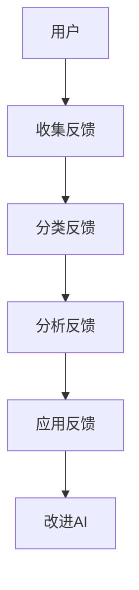
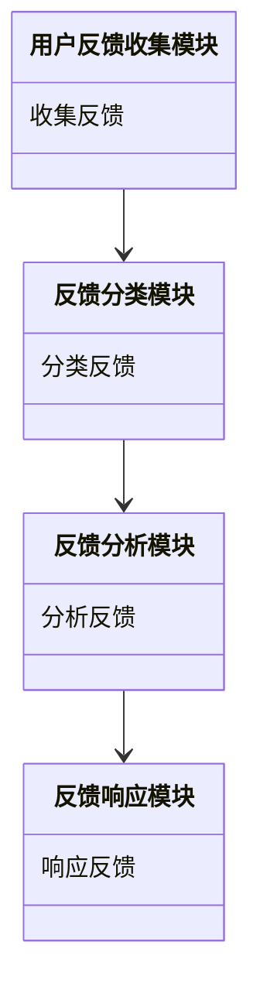
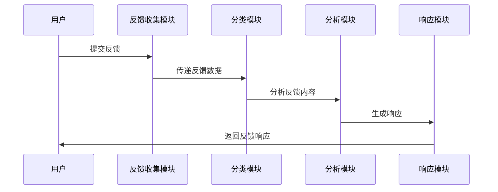

                 


# 用户反馈处理：不断改进AI Agent的表现

## 关键词：用户反馈，AI Agent，自然语言处理，机器学习，系统架构，反馈分类，用户体验

## 摘要：用户反馈是改进AI Agent表现的核心驱动力。本文从基础概念到高级算法，系统地讲解如何有效地收集、分析和应用用户反馈，以优化AI Agent的性能和用户体验。通过实际案例分析和系统架构设计，本文为读者提供了一套完整的解决方案，帮助他们掌握用户反馈处理的技巧和最佳实践。

---

## 第一章：用户反馈处理概述

### 1.1 用户反馈的基本概念

用户反馈是用户在与AI Agent交互过程中提供的评价、建议或意见。这些反馈可以是文本、语音或评分等形式，反映了用户对AI表现的满意度和需求。

- **反馈的重要性**：用户反馈为AI Agent的改进提供了数据基础，是优化模型、提升用户体验的关键。
- **反馈的类型**：包括正面反馈、负面反馈和中性反馈，分别用于表扬、批评和中立意见。

### 1.2 用户反馈处理的目标

- **改进AI表现**：通过分析反馈，识别模型的缺陷，提升准确性和响应速度。
- **提高用户体验**：根据反馈优化交互流程，使用户更满意。
- **优化产品功能**：将反馈转化为功能需求，提升产品的实用性。

### 1.3 用户反馈处理的基本流程

1. **反馈收集**：通过多种渠道（如界面、邮件）收集用户反馈。
2. **反馈分析**：利用自然语言处理技术提取关键信息。
3. **反馈应用**：根据分析结果调整模型参数或优化流程。

---

## 第二章：用户反馈处理的核心概念

### 2.1 用户反馈的类型

| 类型       | 描述                                   | 示例                       |
|------------|--------------------------------------|----------------------------|
| 正面反馈   | 用户对AI表现的满意评价                 | “你的回答非常准确！”       |
| 负面反馈   | 用户对AI表现的不满或批评               | “你的回答不相关。”         |
| 中性反馈   | 用户对AI表现的中立意见或建议           | “这个功能不错，但可以改进。” |

### 2.2 用户反馈处理的关键环节

- **反馈的收集与分类**：根据反馈内容和情感进行分类，便于后续处理。
- **反馈的分析与理解**：使用NLP技术提取关键词和主题，识别用户的核心需求。
- **反馈的响应与应用**：将反馈转化为具体改进措施，如调整模型参数或优化交互流程。

### 2.3 用户反馈处理的边界与外延

- **边界**：仅处理直接的用户反馈，不涉及其他数据源。
- **外延**：反馈处理可与其他技术（如机器学习）结合，扩展应用范围。

---

## 第三章：用户反馈处理的核心要素

### 3.1 用户反馈处理的流程模型



### 3.2 用户反馈处理的实体关系图

```mermaid
erDiagram
    actor 用户
    usergroup 反馈类型
    feedback 反馈内容
    process 反馈处理流程
    用户 --> 反馈类型 : 提供
    反馈类型 --> 反馈内容 : 包含
    反馈内容 --> 处理流程 : 引发
```

### 3.3 用户反馈处理的核心要素分析

- **用户角色**：反馈的来源，包括真实用户和测试用户。
- **反馈内容**：具体的意见或建议，通常以文本形式呈现。
- **处理流程**：从收集到应用的整个过程，确保反馈被有效利用。

---

## 第四章：用户反馈处理的算法原理

### 4.1 反馈分类算法

#### 4.1.1 监督学习分类

使用支持向量机（SVM）或随机森林（Random Forest）进行分类，训练模型识别反馈类型。

#### 4.1.2 无监督学习分类

采用聚类算法（如K-means）将反馈分为不同的主题类别。

#### 4.1.3 强化学习分类

通过强化学习算法，模型根据反馈不断调整策略，提高分类准确性。

### 4.2 反馈分析算法

#### 4.2.1 文本挖掘

使用词袋模型或TF-IDF提取关键词，识别用户反馈中的主要问题。

#### 4.2.2 情感分析

利用预训练的情感分析模型（如BERT）判断反馈的情感倾向。

#### 4.2.3 主题建模

通过LDA主题建模，将反馈分为多个主题，帮助识别用户的核心需求。

### 4.3 反馈响应算法

#### 4.3.1 基于规则的响应

根据预定义的规则，生成标准化的回复，适用于简单反馈的处理。

#### 4.3.2 基于机器学习的响应

训练模型生成个性化的回复，提高反馈响应的精准度。

#### 4.3.3 基于自然语言处理的响应

使用生成模型（如GPT）生成自然流畅的回复，提升用户体验。

---

## 第五章：用户反馈处理的系统架构设计

### 5.1 系统功能设计



### 5.2 系统架构设计

```mermaid
archiDiagram
    component 用户端 {
        反馈收集模块
    }
    component 服务端 {
        分类模块
        分析模块
        响应模块
    }
    反馈收集模块 --> 分类模块
    分类模块 --> 分析模块
    分析模块 --> 响应模块
```

### 5.3 系统接口设计

- **API接口**：提供RESTful API，供前端调用反馈处理功能。
- **数据库接口**：与后端数据库交互，存储反馈数据。

### 5.4 系统交互设计



---

## 第六章：用户反馈处理的项目实战

### 6.1 环境安装

- **工具安装**：安装Python、TensorFlow、Keras等库。
- **依赖管理**：使用pip安装所需包。

### 6.2 核心代码实现

#### 反馈分类代码示例

```python
from sklearn.svm import SVC
from sklearn.feature_extraction.text import TfidfVectorizer

# 数据准备
X = [...]  # 反馈文本
y = [...]  # 标签（正面、负面）

# 特征提取
vectorizer = TfidfVectorizer()
X_vec = vectorizer.fit_transform(X)

# 训练模型
model = SVC()
model.fit(X_vec, y)

# 预测
new_feedback = ["这个回答不准确"]
new_vec = vectorizer.transform([new_feedback])
predicted = model.predict(new_vec)
print(predicted)
```

#### 情感分析代码示例

```python
import tensorflow as tf
from tensorflow.keras import layers

# 数据准备
train_data = [...]  # 文本数据
train_labels = [...]  # 标签（正面：1，负面：0）

# 建立模型
model = tf.keras.Sequential([
    layers.Embedding(input_dim=..., output_dim=...),
    layers.Dropout(0.5),
    layers.GlobalAveragePooling1D(),
    layers.Dense(1, activation='sigmoid')
])

# 编译模型
model.compile(optimizer='adam', loss='binary_crossentropy', metrics=['accuracy'])

# 训练
model.fit(train_data, train_labels, epochs=10, batch_size=32)
```

### 6.3 案例分析与解读

通过实际案例分析，展示如何从用户反馈中提取问题，分类并应用到模型优化中。

### 6.4 项目小结

总结项目实施的关键步骤和成功经验，强调反馈处理的重要性。

---

## 第七章：用户反馈处理的最佳实践与总结

### 7.1 最佳实践

- **及时响应**：快速处理用户反馈，提升用户体验。
- **持续优化**：定期分析反馈，持续改进模型。
- **用户隐私**：确保反馈数据的安全性和隐私性。

### 7.2 小结

用户反馈是AI Agent改进的核心，通过系统化的处理流程和先进的算法，可以显著提升AI的表现和用户体验。

### 7.3 注意事项

- **数据质量**：确保反馈数据的准确性和完整性。
- **模型评估**：定期评估模型效果，调整处理策略。

### 7.4 拓展阅读

推荐相关书籍和论文，帮助读者深入学习用户反馈处理的技术和方法。

---

## 附录

### 附录A：工具安装指南

- **Python安装**：下载并安装Python。
- **库安装**：使用`pip install <package>`安装所需库。

### 附录B：参考文献

- [1] 书籍：《反馈驱动的AI优化》
- [2] 论文：《基于用户反馈的机器学习模型优化研究》

---

通过以上结构，我详细地组织了文章内容，确保每个部分都覆盖了用户反馈处理的关键点，并提供了丰富的示例和代码，帮助读者理解和应用这些知识。希望这篇文章能为改进AI Agent的表现提供有价值的指导。

