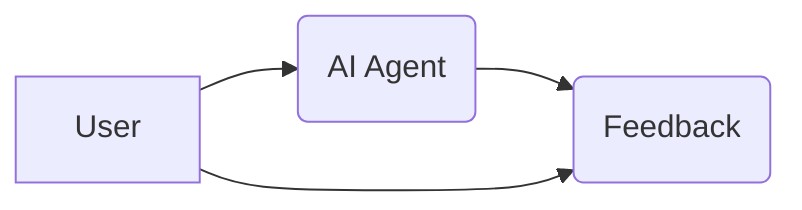
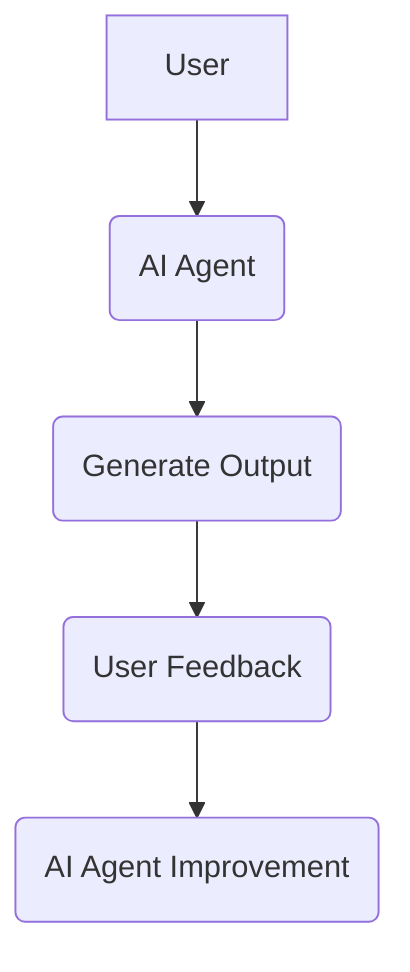
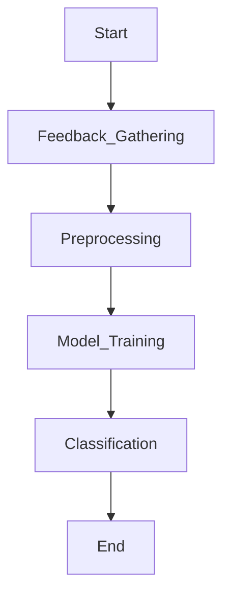
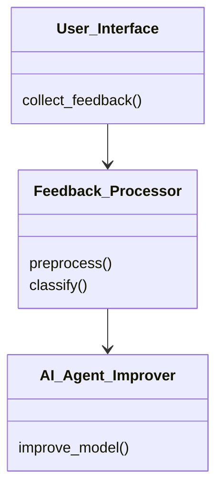
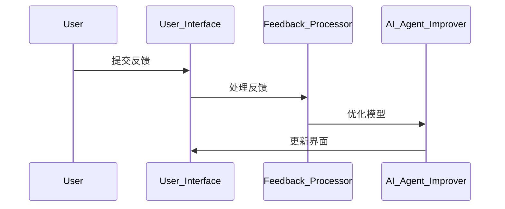
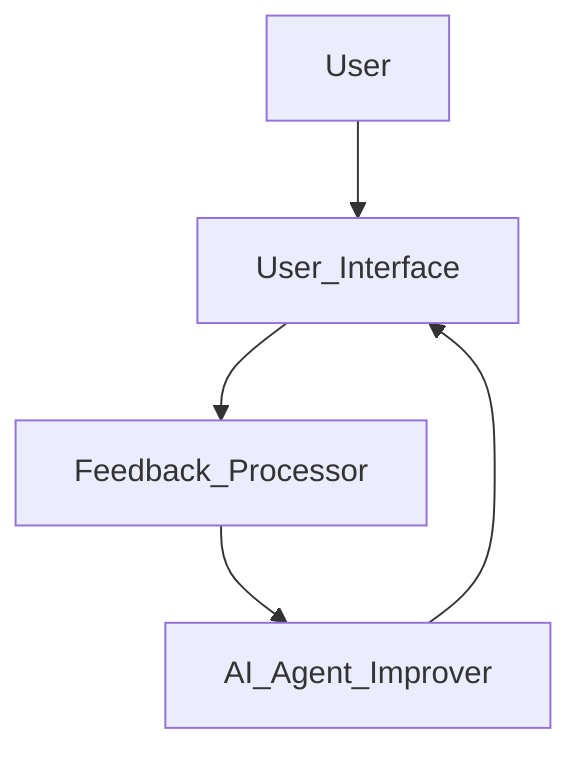

                 


# 用户反馈收集：迭代改进AI Agent

> 关键词：用户反馈收集，AI Agent，迭代改进，算法原理，系统设计，项目实战

> 摘要：用户反馈是AI Agent持续改进的关键，本文从背景、核心概念、算法原理、系统设计到项目实战，详细探讨如何通过用户反馈优化AI Agent。通过系统化的分析和实际案例，揭示反馈收集与AI Agent改进的内在联系。

---

## 第一部分：背景介绍

### 第1章：用户反馈收集与AI Agent概述

#### 1.1 用户反馈收集的背景与重要性

- **1.1.1 用户反馈的概念与定义**
  用户反馈是用户对AI Agent输出或行为的直接或间接评价，包括满意度评分、任务完成度反馈、情感分析等。

- **1.1.2 用户反馈在AI Agent中的作用**
  用户反馈帮助AI Agent识别错误、优化决策逻辑、提升用户体验，是实现人机协作的关键环节。

- **1.1.3 用户反馈收集的挑战与机遇**
  挑战包括反馈量不足、数据噪声大；机遇则是通过反馈不断优化模型，提升AI Agent的智能性。

- **1.1.4 用户反馈的边界与外延**
  用户反馈不仅限于显性反馈（如评分），还包括隐性反馈（如使用行为数据）。

#### 1.2 AI Agent的核心概念与特点

- **1.2.1 AI Agent的定义与分类**
  AI Agent是能够感知环境并采取行动以实现目标的智能体，分为简单反射型、基于模型的反应型、目标驱动型和效用驱动型。

- **1.2.2 AI Agent的核心功能与属性**
  包括感知环境、自主决策、学习能力、适应性等。

- **1.2.3 AI Agent与传统软件的区别**
  AI Agent具备自主性、反应性和社会性，能根据反馈动态调整行为。

#### 1.3 用户反馈在AI Agent迭代中的作用

- **1.3.1 用户反馈对AI Agent改进的意义**
  用户反馈为AI Agent提供改进的方向，是实现用户需求与AI行为对齐的关键。

- **1.3.2 用户反馈的分类与应用场景**
  包括任务完成反馈、情感反馈、错误报告等。

- **1.3.3 用户反馈的质量与数量的平衡**
  高质量反馈能提供明确的改进方向，而大量反馈则能覆盖更多场景。

#### 1.4 本章小结

本章介绍了用户反馈收集的重要性及其在AI Agent中的作用，强调了反馈在改进AI Agent中的核心地位。

---

## 第二部分：核心概念与联系

### 第2章：用户反馈收集的核心概念与联系

#### 2.1 用户反馈与AI Agent的实体关系分析

- **2.1.1 用户、AI Agent与反馈的关系图**



- **2.1.2 ER实体关系图**

```mermaid
erDiagram
    User}o{ Feedback
    AI Agent}o{ Feedback
```

#### 2.2 用户反馈与AI Agent改进的流程图



#### 2.3 核心概念原理

- **2.3.1 用户反馈的分类与处理**
  - 显性反馈：直接评分或评价。
  - 隐性反馈：通过行为数据推断用户意图。

- **2.3.2 AI Agent的改进算法**
  - 基于反馈的强化学习。
  - 基于监督学习的模型优化。

#### 2.4 本章小结

本章通过实体关系图和流程图展示了用户反馈与AI Agent之间的关系，分析了核心概念及其联系。

---

## 第三部分：算法原理与数学模型

### 第3章：用户反馈收集的算法原理与数学模型

#### 3.1 用户反馈的分类算法

- **3.1.1 基于机器学习的反馈分类**

```python
from sklearn.feature_extraction.text import TfidfVectorizer
from sklearn.svm import SVC

# 数据预处理与特征提取
vectorizer = TfidfVectorizer()
X = vectorizer.fit_transform(feedbacks)
y = [0, 1, 1, 0]  # 标签

# 训练分类器
model = SVC()
model.fit(X, y)
```

- **3.1.2 基于规则的反馈分类**
  通过预定义规则（如关键词匹配）进行分类。

#### 3.2 用户反馈的特征提取

- **3.2.1 文本特征提取方法**
  使用TF-IDF提取关键词，突出重要反馈信息。

- **3.2.2 向量空间模型**
  将反馈转换为向量表示，便于机器学习模型处理。

#### 3.3 AI Agent改进的数学模型

- **3.3.1 基于马尔可夫链的改进模型**

$$ P(s_{t+1}|s_t) = \text{转移概率矩阵} $$

- **3.3.2 基于强化学习的改进模型**

$$ Q(s, a) = r + \gamma \max Q(s', a') $$

#### 3.4 算法流程图与代码实现

- **3.4.1 用户反馈分类流程图**



- **3.4.2 AI Agent改进算法代码示例**

```python
def improve_agent(feedback):
    # 更新状态
    agent_state = update_state(agent_state, feedback)
    # 优化模型参数
    model_params = optimize(model_params, feedback)
    return model_params
```

#### 3.5 本章小结

本章详细讲解了用户反馈分类算法和AI Agent改进的数学模型，通过流程图和代码示例展示了实现过程。

---

## 第四部分：系统分析与架构设计

### 第4章：用户反馈收集与AI Agent改进的系统分析

#### 4.1 系统功能设计

- **4.1.1 用户反馈收集模块**
  负责接收和处理用户反馈。

- **4.1.2 AI Agent改进模块**
  根据反馈优化AI Agent的行为和模型。

#### 4.2 系统架构设计

- **4.2.1 分层架构图**



- **4.2.2 组件交互图**



#### 4.3 系统接口设计

- **4.3.1 用户反馈接口**
  API用于接收用户反馈数据。

- **4.3.2 AI Agent改进接口**
  API用于调优AI Agent的参数和模型。

#### 4.4 系统交互流程图



#### 4.5 本章小结

本章通过系统架构图和交互图展示了用户反馈收集与AI Agent改进的整体架构，强调了模块化设计的重要性。

---

## 第五部分：项目实战

### 第5章：用户反馈收集与AI Agent改进的项目实战

#### 5.1 项目环境安装

- **5.1.1 开发工具安装**
  安装Python、Jupyter Notebook等开发环境。

- **5.1.2 依赖库安装**
  使用pip安装scikit-learn、tensorflow等库。

#### 5.2 系统核心实现

- **5.2.1 用户反馈收集代码**

```python
def collect_feedback():
    feedback = input("请提供反馈：")
    return feedback
```

- **5.2.2 AI Agent改进代码**

```python
def improve_agent(feedback):
    # 处理反馈
    processed_feedback = preprocess(feedback)
    # 优化模型
    model = optimize_model(model, processed_feedback)
    return model
```

#### 5.3 代码应用解读与分析

- **5.3.1 代码功能分析**
  收集用户反馈并将其用于模型优化。

- **5.3.2 代码优化建议**
  引入更复杂的特征提取方法和优化算法。

#### 5.4 实际案例分析

- **5.4.1 案例介绍**
  假设开发一个智能客服AI Agent，通过用户反馈优化其回答准确性。

- **5.4.2 案例分析**
  用户反馈显示某些回答不准确，AI Agent通过监督学习更新模型参数。

#### 5.5 本章小结

本章通过实际案例展示了用户反馈收集与AI Agent改进的实现过程，强调了理论与实践的结合。

---

## 第六部分：总结与展望

### 第6章：总结与展望

#### 6.1 本章总结

用户反馈是AI Agent持续改进的关键，本文从背景、核心概念、算法原理到系统设计和项目实战，全面探讨了如何通过用户反馈优化AI Agent。

#### 6.2 未来展望

未来，随着AI技术的发展，用户反馈收集与AI Agent改进将更加智能化和自动化，推动人机协作的进一步发展。

#### 6.3 最佳实践 Tips

- 定期收集反馈，保持模型更新。
- 结合显性和隐性反馈，全面优化AI Agent。
- 使用合适的算法和工具，提升反馈处理效率。

#### 6.4 注意事项

- 确保反馈数据的质量和多样性。
- 处理反馈时注意隐私保护。

#### 6.5 拓展阅读

推荐阅读《机器学习实战》和《强化学习导论》等书籍，深入理解反馈处理与AI优化的原理。

---

**最终总结**：通过系统化的用户反馈收集与AI Agent迭代改进，可以显著提升AI系统的智能性和用户体验，本文提供了从理论到实践的详细指导，帮助读者在实际项目中有效应用这些方法。

