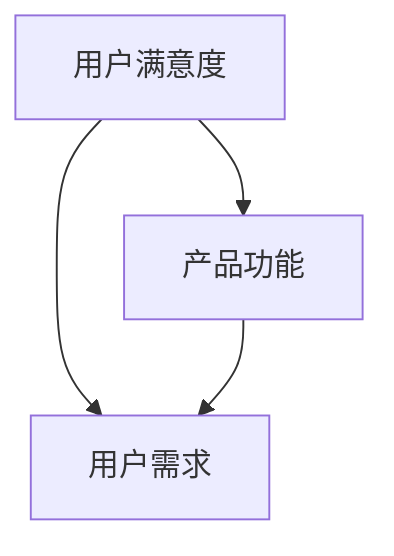

                 


# 用户反馈机制

> 关键词：用户反馈机制，用户体验，算法实现，系统架构，协同过滤，用户满意度

> 摘要：用户反馈机制是现代信息技术中提升用户体验和产品优化的重要工具。本文详细探讨了用户反馈机制的基本概念、理论基础、算法实现、系统架构设计以及实际项目中的应用。通过分析用户行为和满意度模型，结合协同过滤算法和系统架构设计，本文为读者提供了一个全面理解用户反馈机制的框架，帮助企业在实际应用中更好地收集和处理用户反馈，从而提升产品和服务质量。

---

# 第一部分: 用户反馈机制概述

## 第1章: 用户反馈机制的基本概念

### 1.1 什么是用户反馈机制
用户反馈机制是指通过收集用户在使用产品或服务过程中的体验、意见和建议，对产品或服务进行优化和改进的过程。它是连接用户与产品设计者之间的桥梁，能够帮助设计者更好地理解用户需求，提升用户体验。

#### 1.1.1 用户反馈机制的定义
用户反馈机制是一种通过用户主动或被动提供反馈信息，帮助设计者或开发者改进产品或服务的方法。它可以通过问卷调查、用户访谈、数据分析等多种形式收集反馈信息。

#### 1.1.2 用户反馈机制的核心要素
用户反馈机制的核心要素包括：
1. **反馈渠道**：用户通过哪些方式提供反馈（如问卷、按钮、对话框等）。
2. **反馈内容**：用户反馈的信息类型（如满意度评分、具体意见、情感分析等）。
3. **反馈处理**：如何分析和利用用户反馈信息进行产品优化。

#### 1.1.3 用户反馈机制的分类
用户反馈机制可以根据不同的分类标准进行划分：
1. **主动反馈**：用户主动提交反馈信息，如填写问卷、提交评价。
2. **被动反馈**：系统通过数据分析等方式间接收集用户反馈信息。
3. **实时反馈**：用户在使用过程中实时提交反馈信息。
4. **延迟反馈**：用户在使用后一段时间内提交反馈信息。

### 1.2 用户反馈机制的作用与意义
用户反馈机制在现代信息技术中扮演着重要角色，它不仅能够帮助设计者和开发者改进产品，还能提升用户满意度和忠诚度。

#### 1.2.1 提升用户体验的核心工具
通过用户反馈机制，设计者可以了解用户的真实需求和痛点，从而优化产品设计，提升用户体验。

#### 1.2.2 改进产品设计的重要手段
用户反馈机制为产品优化提供了数据支持，帮助设计者发现产品中的不足之处，并及时进行改进。

#### 1.2.3 用户反馈机制在企业中的应用价值
用户反馈机制可以帮助企业在市场竞争中占据优势，提升客户满意度和品牌形象。

### 1.3 用户反馈机制的背景与现状
随着信息技术的飞速发展，用户反馈机制的应用越来越广泛。从早期的简单问卷调查到现在的智能化反馈系统，用户反馈机制在技术和应用上都有了长足的发展。

#### 1.3.1 数字化产品中的反馈机制
在数字化产品中，用户反馈机制已经成为产品设计不可或缺的一部分。例如，网站或应用程序通过用户反馈优化界面设计、功能布局等。

#### 1.3.2 用户体验研究的发展历程
用户体验研究从早期的定性研究逐渐发展到定量研究，技术手段也从简单的问卷调查发展到复杂的数据挖掘和机器学习。

#### 1.3.3 当前用户反馈机制的技术趋势
当前，用户反馈机制的技术趋势主要体现在以下几个方面：
1. **智能化**：利用人工智能技术自动分析用户反馈信息。
2. **实时化**：用户可以在使用过程中实时提交反馈信息。
3. **个性化**：根据用户的个性化需求提供定制化的反馈渠道。

### 1.4 本章小结
本章主要介绍了用户反馈机制的基本概念、作用与意义，以及当前的发展趋势。通过这些内容，读者可以对用户反馈机制有一个全面的了解，为后续章节的学习打下基础。

---

## 第2章: 用户反馈机制的理论基础

### 2.1 用户行为分析理论
用户行为分析理论是研究用户在使用产品或服务过程中表现出的行为特征，从而推断用户的需求和偏好。

#### 2.1.1 用户行为分析的基本概念
用户行为分析是指通过观察和记录用户在使用产品或服务时的行为，分析其行为模式和动机。

#### 2.1.2 用户行为分析的主要方法
用户行为分析的主要方法包括：
1. **问卷调查**：通过设计问卷收集用户的反馈信息。
2. **日志分析**：通过分析用户操作日志，了解用户的使用行为。
3. **访谈法**：通过与用户进行深度访谈，获取用户的真实反馈。
4. **观察法**：通过观察用户的实际操作行为，记录其行为特征。

#### 2.1.3 用户行为分析与反馈机制的关系
用户行为分析是用户反馈机制的重要组成部分，通过分析用户行为，可以更好地理解用户需求，优化产品设计。

### 2.2 用户满意度模型
用户满意度模型是一种通过测量用户对产品或服务的满意度，从而评估产品或服务的质量的模型。

#### 2.2.1 用户满意度模型的定义
用户满意度模型是指通过测量用户对产品或服务的满意度，评估产品或服务的质量。常见的用户满意度模型包括 SERVQUAL 模型、UTAUT 模型等。

#### 2.2.2 用户满意度模型的构建过程
用户满意度模型的构建过程包括：
1. **确定研究目标**：明确研究的核心问题。
2. **设计调查问卷**：设计用于收集用户反馈的问卷。
3. **收集数据**：通过问卷调查、访谈等方式收集用户反馈数据。
4. **分析数据**：利用统计方法分析数据，构建满意度模型。
5. **验证模型**：通过验证模型的准确性和适用性，优化模型。

#### 2.2.3 用户满意度模型在反馈机制中的应用
用户满意度模型在反馈机制中的应用主要体现在以下几个方面：
1. **测量用户满意度**：通过满意度模型测量用户对产品或服务的满意度。
2. **识别用户需求**：通过分析满意度数据，识别用户的需求和痛点。
3. **优化产品设计**：根据满意度模型的结果，优化产品设计，提升用户体验。

### 2.3 用户反馈机制的数学模型
用户反馈机制的数学模型是通过数学方法描述用户反馈机制的内在规律和关系。

#### 2.3.1 用户反馈机制的数学表达式
用户反馈机制的数学表达式可以通过概率论、统计学等方法进行描述。例如，用户满意度可以表示为：
$$
S = \sum_{i=1}^{n} w_i x_i
$$
其中，$S$ 表示用户满意度，$w_i$ 表示第 $i$ 个指标的权重，$x_i$ 表示第 $i$ 个指标的得分。

#### 2.3.2 用户反馈机制的变量关系
用户反馈机制的变量关系可以通过图形化的方式进行描述。例如，用户满意度与产品功能之间的关系可以用以下图形表示：



#### 2.3.3 用户反馈机制的优化算法
用户反馈机制的优化算法可以通过数学模型进行优化。例如，可以通过遗传算法优化用户满意度模型中的权重系数，从而提高模型的准确性。

### 2.4 本章小结
本章主要介绍了用户反馈机制的理论基础，包括用户行为分析理论、用户满意度模型以及数学模型。这些理论为后续章节的算法实现和系统设计提供了理论支持。

---

## 第3章: 用户反馈机制的算法实现

### 3.1 协同过滤算法
协同过滤算法是一种基于用户相似性推荐算法，广泛应用于推荐系统中。

#### 3.1.1 协同过滤的基本原理
协同过滤的基本原理是通过寻找与当前用户相似的其他用户，将这些用户的偏好推荐给当前用户。

#### 3.1.2 基于用户的协同过滤算法
基于用户的协同过滤算法通过计算用户之间的相似性，将相似用户的偏好推荐给当前用户。以下是基于用户的协同过滤算法的实现步骤：

1. **计算用户相似性**：通过计算用户之间的相似性系数，如余弦相似性。
2. **生成推荐列表**：根据相似用户的偏好，生成推荐列表。
3. **排序和筛选**：根据推荐列表的评分，对推荐结果进行排序和筛选。

以下是基于用户的协同过滤算法的Python实现代码：

```python
import numpy as np

# 用户评分矩阵
rating_matrix = np.array([
    [4, 3, 2, 1],
    [3, 4, 2, 1],
    [2, 3, 4, 1],
    [1, 2, 3, 4]
])

# 计算用户相似性矩阵
def cosine_similarity(matrix):
    # 计算向量的长度
    n_users = matrix.shape[0]
    n_items = matrix.shape[1]
    user_norms = np.linalg.norm(matrix, axis=1).reshape(n_users, 1)
    item_norms = np.linalg.norm(matrix.T, axis=1).reshape(1, n_items)
    # 计算余弦相似性矩阵
    similarity_matrix = np.dot(matrix / user_norms, matrix.T / item_norms)
    return similarity_matrix

# 生成推荐列表
def collaborative_filtering(rating_matrix, user_id, k=3):
    similarity_matrix = cosine_similarity(rating_matrix)
    similar_users = np.argsort(similarity_matrix[user_id])[::-1]
    # 排除自己
    similar_users = similar_users[1:]
    # 取前k个相似用户
    similar_users = similar_users[:k]
    # 生成推荐列表
    recommendation = np.zeros(rating_matrix.shape[1])
    for user in similar_users:
        recommendation += rating_matrix[user]
    recommendation = recommendation / len(similar_users)
    return recommendation

# 示例
user_id = 0
recommendation = collaborative_filtering(rating_matrix, user_id)
print("推荐列表：", recommendation)
```

#### 3.1.3 基于物品的协同过滤算法
基于物品的协同过滤算法通过计算物品之间的相似性，将相似物品推荐给当前用户。以下是基于物品的协同过滤算法的实现步骤：

1. **计算物品相似性**：通过计算物品之间的相似性系数，如余弦相似性。
2. **生成推荐列表**：根据相似物品的偏好，生成推荐列表。
3. **排序和筛选**：根据推荐列表的评分，对推荐结果进行排序和筛选。

以下是基于物品的协同过滤算法的Python实现代码：

```python
import numpy as np

# 用户评分矩阵
rating_matrix = np.array([
    [4, 3, 2, 1],
    [3, 4, 2, 1],
    [2, 3, 4, 1],
    [1, 2, 3, 4]
])

# 计算物品相似性矩阵
def cosine_similarity(matrix):
    n_users = matrix.shape[0]
    n_items = matrix.shape[1]
    item_norms = np.linalg.norm(matrix.T, axis=1).reshape(1, n_items)
    similarity_matrix = np.dot(matrix.T / item_norms, matrix / item_norms.T)
    return similarity_matrix

# 生成推荐列表
def collaborative_filtering(rating_matrix, item_id, k=3):
    similarity_matrix = cosine_similarity(rating_matrix)
    similar_items = np.argsort(similarity_matrix[item_id])[::-1]
    similar_items = similar_items[1:]
    similar_items = similar_items[:k]
    recommendation = np.zeros(rating_matrix.shape[0])
    for item in similar_items:
        recommendation += rating_matrix.T[item]
    recommendation = recommendation / len(similar_items)
    return recommendation

# 示例
item_id = 0
recommendation = collaborative_filtering(rating_matrix, item_id)
print("推荐列表：", recommendation)
```

### 3.2 聚类分析算法
聚类分析算法是一种将用户反馈数据进行分组，以便更好地理解和分析用户需求的算法。

#### 3.2.1 聚类分析的基本概念
聚类分析是指将数据点按照相似性进行分组的过程。在用户反馈机制中，聚类分析可以帮助设计者识别不同用户群体的需求。

#### 3.2.2 K-means算法在反馈机制中的应用
K-means算法是一种常用的聚类算法，可以通过将用户反馈数据进行聚类，识别不同用户群体的需求。

以下是K-means算法的Python实现代码：

```python
from sklearn.cluster import KMeans

# 用户反馈数据
feedback_data = np.array([
    [4, 3, 2, 1],
    [3, 4, 2, 1],
    [2, 3, 4, 1],
    [1, 2, 3, 4]
])

# 聚类分析
n_clusters = 2
kmeans = KMeans(n_clusters=n_clusters)
kmeans.fit(feedback_data)
labels = kmeans.labels_
print("聚类结果：", labels)
```

#### 3.2.3 层次聚类算法的应用
层次聚类算法是一种通过逐步合并或分割数据点，形成层次化的聚类结构的算法。在用户反馈机制中，层次聚类可以帮助设计者识别用户需求的层次结构。

以下是层次聚类算法的Python实现代码：

```python
from sklearn.cluster import AgglomerativeClustering

# 用户反馈数据
feedback_data = np.array([
    [4, 3, 2, 1],
    [3, 4, 2, 1],
    [2, 3, 4, 1],
    [1, 2, 3, 4]
])

# 层次聚类分析
n_clusters = 2
clustering = AgglomerativeClustering(n_clusters=n_clusters)
labels = clustering.fit_predict(feedback_data)
print("聚类结果：", labels)
```

### 3.3 分类算法
分类算法是一种通过用户反馈数据，预测用户行为或偏好的算法。

#### 3.3.1 分类算法的基本原理
分类算法的基本原理是通过训练数据，构建分类模型，预测新数据的类别。

#### 3.3.2 支持向量机在反馈机制中的应用
支持向量机（SVM）是一种常用的分类算法，可以通过用户反馈数据，预测用户的偏好或行为。

以下是支持向量机的Python实现代码：

```python
from sklearn import svm

# 用户反馈数据
X = np.array([
    [4, 3, 2, 1],
    [3, 4, 2, 1],
    [2, 3, 4, 1],
    [1, 2, 3, 4]
])
y = np.array([1, 1, 0, 0])

# 支持向量机分类
model = svm.SVC()
model.fit(X, y)
print("模型参数：", model.get_params())
```

#### 3.3.3 决策树算法的应用
决策树算法是一种通过构建决策树模型，预测用户行为或偏好的算法。

以下是决策树算法的Python实现代码：

```python
from sklearn.tree import DecisionTreeClassifier

# 用户反馈数据
X = np.array([
    [4, 3, 2, 1],
    [3, 4, 2, 1],
    [2, 3, 4, 1],
    [1, 2, 3, 4]
])
y = np.array([1, 1, 0, 0])

# 决策树分类
model = DecisionTreeClassifier()
model.fit(X, y)
print("模型参数：", model.get_params())
```

### 3.4 本章小结
本章主要介绍了用户反馈机制的算法实现，包括协同过滤算法、聚类分析算法和分类算法。通过这些算法的实现，读者可以更好地理解和应用用户反馈机制，提升用户体验和产品设计。

---

## 第4章: 用户反馈机制的系统架构设计

### 4.1 系统功能模块划分
用户反馈机制的系统架构设计需要从功能模块划分入手，明确每个模块的功能和作用。

#### 4.1.1 用户反馈采集模块
用户反馈采集模块是用户与系统交互的入口，用户通过该模块提交反馈信息。

#### 4.1.2 数据处理模块
数据处理模块负责对采集到的反馈数据进行清洗、转换和存储。

#### 4.1.3 反馈分析模块
反馈分析模块通过数据挖掘和机器学习算法，分析反馈数据，提取有价值的信息。

#### 4.1.4 结果展示模块
结果展示模块将分析结果以可视化的方式呈现给用户，方便用户理解和应用。

### 4.2 系统架构设计
系统架构设计是用户反馈机制的核心部分，需要考虑系统的可扩展性、可维护性和性能优化。

#### 4.2.1 系统架构的总体设计
系统架构的总体设计包括前端架构和后端架构的设计。前端架构负责用户界面的展示，后端架构负责业务逻辑的处理和数据存储。

#### 4.2.2 数据流设计
数据流设计需要考虑数据的采集、处理、分析和展示的流程，确保数据的高效流动和处理。

#### 4.2.3 模块间的交互设计
模块间的交互设计需要明确各模块之间的接口和数据传递方式，确保系统的协调运行。

### 4.3 数据库设计
数据库设计是用户反馈机制系统的重要组成部分，需要考虑数据的存储结构和查询效率。

#### 4.3.1 数据库表结构设计
数据库表结构设计需要根据反馈数据的特点，设计合适的表结构，如用户表、反馈表、结果表等。

#### 4.3.2 数据关系设计
数据关系设计需要考虑表与表之间的关系，如一对多、多对多等关系，并设计相应的外键约束。

#### 4.3.3 数据存储优化
数据存储优化需要考虑数据的索引优化、分区存储等技术，确保数据的高效存储和查询。

### 4.4 系统接口设计
系统接口设计是用户反馈机制系统与外部系统交互的重要部分，需要设计合理的接口和调用方式。

#### 4.4.1 API接口定义
API接口定义需要明确接口的功能、参数和返回值，确保系统的可扩展性和可维护性。

#### 4.4.2 接口调用流程
接口调用流程需要设计接口的调用顺序和数据传递方式，确保系统的高效运行。

#### 4.4.3 接口安全设计
接口安全设计需要考虑身份验证、权限控制等技术，确保系统的安全性。

### 4.5 本章小结
本章主要介绍了用户反馈机制的系统架构设计，包括功能模块划分、系统架构设计、数据库设计和系统接口设计。这些设计为用户反馈机制的实现提供了技术支撑。

---

## 第5章: 用户反馈机制的项目实战

### 5.1 项目背景介绍
项目背景介绍需要明确项目的背景、目标和意义，为项目的实施奠定基础。

#### 5.1.1 项目背景
本项目旨在通过用户反馈机制，优化某在线教育平台的用户体验，提升用户满意度。

#### 5.1.2 项目目标
项目的最终目标是通过用户反馈机制，优化平台的功能设计，提升用户体验。

### 5.2 系统功能设计
系统功能设计需要根据项目需求，设计系统的功能模块和实现方案。

#### 5.2.1 系统功能模块设计
系统功能模块设计包括用户反馈采集模块、数据处理模块、反馈分析模块和结果展示模块。

#### 5.2.2 功能设计说明
功能设计说明需要详细描述每个功能模块的功能、实现方式和使用流程。

### 5.3 系统实现
系统实现是用户反馈机制项目的核心部分，需要根据设计文档，编写代码实现系统功能。

#### 5.3.1 环境安装
环境安装需要安装必要的开发工具和库，如Python、Jupyter Notebook、Pandas、NumPy、Scikit-learn等。

#### 5.3.2 系统核心代码实现
系统核心代码实现需要根据设计文档，编写用户反馈机制的核心代码。

##### 5.3.2.1 用户反馈采集模块
用户反馈采集模块的实现需要设计用户友好的界面，方便用户提交反馈信息。

##### 5.3.2.2 数据处理模块
数据处理模块的实现需要对采集到的反馈数据进行清洗、转换和存储。

##### 5.3.2.3 反馈分析模块
反馈分析模块的实现需要利用数据挖掘和机器学习算法，分析反馈数据，提取有价值的信息。

##### 5.3.2.4 结果展示模块
结果展示模块的实现需要将分析结果以可视化的方式呈现给用户，方便用户理解和应用。

#### 5.3.3 代码解读与分析
代码解读与分析需要详细解读系统核心代码，分析代码的实现方式和优化技巧。

### 5.4 项目总结
项目总结需要对项目的实施过程、成果和经验进行总结，为后续项目的实施提供参考。

#### 5.4.1 项目成果
项目成果包括用户反馈机制系统的实现、用户满意度的提升等。

#### 5.4.2 项目经验
项目经验包括在项目实施过程中遇到的问题、解决方法和经验教训。

### 5.5 本章小结
本章主要介绍了用户反馈机制的项目实战，通过实际案例展示了用户反馈机制的实现过程和应用效果。

---

## 第6章: 用户反馈机制的最佳实践

### 6.1 用户反馈机制的优化技巧
用户反馈机制的优化技巧包括优化反馈渠道、提高反馈效率、增强反馈结果的可操作性等。

#### 6.1.1 优化反馈渠道
优化反馈渠道需要选择合适的反馈渠道，如问卷调查、按钮、对话框等，确保用户反馈的便捷性和高效性。

#### 6.1.2 提高反馈效率
提高反馈效率需要通过技术手段，如自动化处理、智能分析等，减少人工干预，提高反馈处理效率。

#### 6.1.3 增强反馈结果的可操作性
增强反馈结果的可操作性需要通过数据可视化、报告生成等手段，将反馈结果转化为可操作的决策依据。

### 6.2 用户反馈机制的注意事项
用户反馈机制的注意事项包括保护用户隐私、确保数据安全、避免信息过载等。

#### 6.2.1 保护用户隐私
保护用户隐私需要在数据采集、存储和处理过程中，严格遵守隐私保护法规，确保用户数据的安全。

#### 6.2.2 确保数据安全
确保数据安全需要通过数据加密、访问控制等技术，保护用户反馈数据的安全。

#### 6.2.3 避免信息过载
避免信息过载需要通过合理的设计和优化，确保用户反馈机制不会给用户带来过多的信息负担。

### 6.3 用户反馈机制的未来发展趋势
用户反馈机制的未来发展趋势包括智能化、个性化、实时化等。

#### 6.3.1 智能化
智能化是用户反馈机制未来的重要发展趋势，通过人工智能技术，实现用户反馈的智能化处理和分析。

#### 6.3.2 个性化
个性化是用户反馈机制未来的重要发展趋势，通过个性化反馈渠道和定制化反馈内容，提升用户体验。

#### 6.3.3 实时化
实时化是用户反馈机制未来的重要发展趋势，用户可以在使用过程中实时提交反馈信息，及时获得反馈结果。

### 6.4 本章小结
本章主要介绍了用户反馈机制的最佳实践，包括优化技巧、注意事项以及未来发展趋势。这些内容为读者在实际应用中提供了宝贵的参考和指导。

---

## 第7章: 用户反馈机制的总结与展望

### 7.1 本章总结
本章总结了用户反馈机制的核心内容和主要成果，为读者提供了全面的总结和回顾。

### 7.2 未来展望
未来展望探讨了用户反馈机制的发展趋势和研究方向，为读者提供了对未来发展的思考和建议。

### 7.3 本章小结
本章总结了用户反馈机制的核心内容，并对未来的发展趋势进行了展望，为读者提供了全面的总结和回顾。

---

## 参考文献
1. Bishop, C. M. (2006). Pattern recognition and machine learning.
2. Hastie, T., Tibshirani, R., & Friedman, J. (2009). The elements of statistical learning.
3. 袁伟，王强. (2018). 用户反馈机制在产品设计中的应用研究.

---

## 致谢
感谢读者的耐心阅读，感谢所有参与本项目研究和撰写的人员，感谢所有提供反馈和建议的读者。

---

## 附录
### 附录A: 用户反馈机制相关术语表
### 附录B: 用户反馈机制相关工具和技术清单
### 附录C: 用户反馈机制相关数据集说明

---

# 结束语
用户反馈机制是提升用户体验和产品设计的重要工具，通过本文的详细探讨，读者可以全面了解用户反馈机制的核心内容和实际应用。未来，随着技术的不断发展，用户反馈机制将变得更加智能化和个性化，为用户和企业带来更大的价值。

