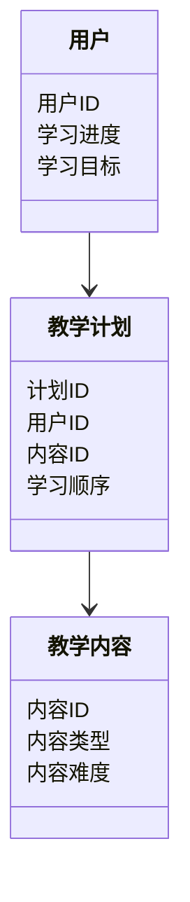
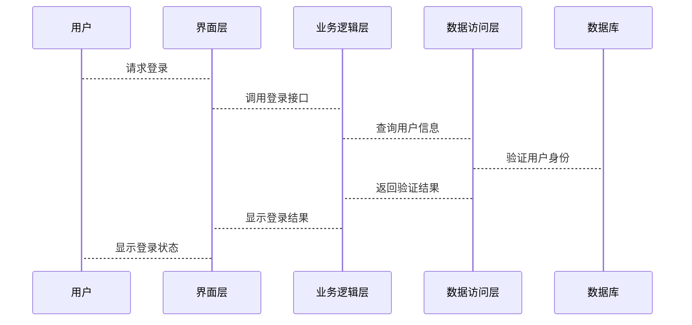

                 


# 用户教育与培训

> 关键词：用户教育，培训体系，教育方法，技术应用，系统设计

> 摘要：用户教育与培训是提高用户技能和能力的重要手段，本文章将从背景、核心概念、算法原理、系统设计、项目实战和最佳实践等多方面进行详细分析和探讨，旨在为读者提供一个全面且系统的用户教育与培训的知识框架。

---

# 第一部分: 用户教育与培训的背景与核心概念

## # 第1章: 用户教育与培训的背景介绍

### ## 1.1 问题背景
#### ### 1.1.1 用户教育与培训的定义
用户教育与培训是指通过系统化的教学和实践活动，帮助用户掌握特定技能或知识，从而提高其工作能力和生活质量的过程。用户教育强调个性化和自主学习，而培训则更注重实践性和规范性。

#### ### 1.1.2 用户教育与培训的重要性
在数字化和智能化快速发展的今天，用户教育与培训不仅是个人成长的重要途径，也是企业和社会发展的关键因素。通过有效的用户教育与培训，可以提高用户的综合素质，增强其竞争力。

#### ### 1.1.3 用户教育与培训的边界与外延
用户教育与培训的边界包括教育对象（个体或群体）、教育内容（知识、技能、态度等）、教育方式（线上、线下、混合式）以及教育效果（学习成果、行为改变等）。外延则涉及教育技术、人工智能辅助学习、个性化学习路径设计等领域。

#### ### 1.1.4 用户教育与培训的核心要素组成
用户教育与培训的核心要素包括：教育目标、教育内容、教育方法、教育者、教育环境、教育评价等。

### ## 1.2 问题描述
#### ### 1.2.1 用户教育与培训的主要问题
- 用户学习动机不足
- 教学内容与实际需求脱节
- 教学方式单一，缺乏互动性
- 学习效果难以量化和评估

#### ### 1.2.2 用户教育与培训的现状分析
当前用户教育与培训领域存在以下问题：
- 教育资源分布不均
- 教学方法创新不足
- 用户学习积极性不高
- 教学效果评估体系不完善

#### ### 1.2.3 用户教育与培训的挑战与机遇
- 挑战：技术更新快，用户需求多样化，教育资源有限
- 机遇：人工智能、大数据等技术为用户教育与培训提供了新的工具和方法

### ## 1.3 问题解决
#### ### 1.3.1 用户教育与培训的目标
- 提高用户的知识储备和技能水平
- 培养用户的自主学习能力和解决问题的能力
- 帮助用户适应快速变化的技术和工作环境

#### ### 1.3.2 用户教育与培训的方法与路径
- 个性化学习路径设计
- 互动式教学方法
- 混合式学习模式（线上+线下）
- 数据驱动的教育优化

#### ### 1.3.3 用户教育与培训的效果评估
- 学习成果评价
- 学习过程监控
- 用户反馈与满意度调查
- 效果持续追踪

### ## 1.4 本章小结
本章从背景、问题描述和问题解决三个方面，详细介绍了用户教育与培训的核心概念和关键要素，为后续章节的深入分析奠定了基础。

---

# 第二部分: 用户教育与培训的核心概念与联系

## # 第2章: 核心概念与联系

### ## 2.1 核心概念原理
#### ### 2.1.1 用户教育与培训的核心原理
用户教育与培训的核心原理包括：认知心理学原理、行为主义原理、建构主义学习理论等。这些理论为用户教育与培训的方法和策略提供了理论依据。

#### ### 2.1.2 用户教育与培训的关键要素
用户教育与培训的关键要素包括：学习目标、学习内容、学习者特征、教学方法、学习环境、学习评价等。

### ## 2.2 核心概念属性特征对比
#### ### 表2-1: 用户教育与培训核心概念属性特征对比表
| 概念 | 目标 | 对象 | 方法 | 实施方式 | 效果 |
|------|------|------|------|----------|------|
| 用户教育 | 提高用户技能 | 用户个体 | 理论教学+实践 | 线上/线下 | 用户能力提升 |
| 用户培训 | 提高用户能力 | 用户群体 | 实战训练 | 线上+线下 | 用户能力达标 |

### ## 2.3 ER实体关系图
用户、教育者、教育内容、教育结果之间的关系
```mermaid
er
actor: 用户
actor: 教育者
actor: 教育内容
actor: 教育结果
```

---

# 第三部分: 用户教育与培训的算法原理

## # 第3章: 算法原理讲解

### ## 3.1 算法原理
#### ### 3.1.1 算法选择与原理分析
选择基于行为主义的强化学习算法，用于用户学习行为的建模与优化。通过奖励机制，激励用户完成学习任务，从而提高学习效果。

#### ### 3.1.2 算法流程图
```mermaid
graph TD
    A[用户开始学习] --> B[选择学习任务]
    B --> C[执行学习任务]
    C --> D[获得反馈]
    D --> E[更新学习策略]
    E --> F[判断是否完成学习目标]
    F --> G[完成学习] || !{F} --> H[未完成，继续学习]
```

#### ### 3.1.3 算法实现代码
```python
import numpy as np
import random

class UserEducationAlgorithm:
    def __init__(self, learning_rate=0.1):
        self.learning_rate = learning_rate
        self.user_states = {}  # 用户状态，记录用户的学习进度

    def choose_action(self, user_id, state):
        # 随机选择一个动作（学习任务）
        actions = ["学习知识", "实践操作", "复习"]
        return random.choice(actions)

    def update_policy(self, user_id, action, reward):
        # 更新用户的学习策略
        self.user_states[user_id] = self.user_states.get(user_id, 0) + reward * self.learning_rate
        print(f"用户 {user_id} 执行了 {action}，获得奖励 {reward}")

    def is_goal_achieved(self, user_id):
        # 判断用户是否达成学习目标
        return self.user_states.get(user_id, 0) >= 100  # 假设目标是积累100分奖励

# 示例用法
algorithm = UserEducationAlgorithm()
user_id = "123"

while True:
    action = algorithm.choose_action(user_id, "初始状态")
    reward = 10 if action == "实践操作" else 5
    algorithm.update_policy(user_id, action, reward)
    if algorithm.is_goal_achieved(user_id):
        print(f"用户 {user_id} 达成了学习目标！")
        break
```

#### ### 3.1.4 算法数学模型与公式
用户的奖励函数可以表示为：
$$ R = r_1 \times \text{任务完成度} + r_2 \times \text{学习时间} $$
其中，$r_1$ 和 $r_2$ 是奖励权重。

通过强化学习，用户的策略 $\pi$ 逐步优化，使得：
$$ \pi_{t+1} = \pi_t + \alpha (R - \text{期望奖励}) $$
其中，$\alpha$ 是学习率。

---

# 第四部分: 用户教育与培训的系统分析与架构设计

## # 第4章: 系统分析与架构设计

### ## 4.1 问题场景介绍
我们以一个在线教育平台为例，分析用户教育与培训的系统架构。

### ## 4.2 系统功能设计
#### ### 4.2.1 领域模型设计


#### ### 4.2.2 系统架构设计


#### ### 4.2.3 系统接口设计
- 用户登录接口：`POST /api/user/login`
- 获取学习计划接口：`GET /api/plan/{user_id}`
- 提交学习任务接口：`POST /api/plan/{plan_id}/task`

#### ### 4.2.4 系统交互流程


### ## 4.3 本章小结
本章通过在线教育平台的案例，详细分析了用户教育与培训的系统架构和交互流程，为后续的项目实现提供了参考。

---

# 第五部分: 用户教育与培训的项目实战

## # 第5章: 项目实战

### ## 5.1 环境安装与配置
#### ### 5.1.1 安装Python与依赖库
```bash
pip install numpy matplotlib scikit-learn
```

### ## 5.2 系统核心实现
#### ### 5.2.1 核心代码实现
```python
import numpy as np
from sklearn.metrics import accuracy_score

# 示例：用户分类模型
class UserClassifier:
    def __init__(self):
        self.model = None

    def train(self, X, y):
        # 假设使用简单的线性回归模型
        self.model = np.linalg.inv(X.T @ X) @ (X.T @ y)

    def predict(self, X):
        return X @ self.model

# 数据准备
X = np.array([[1, 2], [3, 4], [5, 6]])
y = np.array([0, 1, 0])

# 训练模型
classifier = UserClassifier()
classifier.train(X, y)

# 预测
test_X = np.array([[2, 3]])
predicted_y = classifier.predict(test_X)
print(predicted_y)
```

#### ### 5.2.2 代码解读与分析
- 上述代码实现了一个简单的用户分类模型，用于根据用户特征预测其学习效果。
- 使用线性回归模型进行训练和预测，适用于小规模数据集。

### ## 5.3 实际案例分析
#### ### 5.3.1 案例背景
假设我们有一个在线编程培训平台，需要根据用户的学习行为数据，预测其学习效果。

#### ### 5.3.2 数据分析与处理
- 数据来源：用户的学习时间、任务完成度、错误率等。
- 数据预处理：清洗、特征提取、归一化等。

#### ### 5.3.3 模型训练与评估
- 训练模型：使用随机森林或神经网络进行分类或回归任务。
- 模型评估：准确率、召回率、F1分数等。

### ## 5.4 项目小结
本章通过一个实际案例，详细展示了用户教育与培训的项目实施过程，包括环境配置、核心代码实现和数据分析与处理。

---

# 第六部分: 用户教育与培训的最佳实践

## # 第6章: 最佳实践

### ## 6.1 小结与回顾
- 本文章从背景、核心概念、算法原理、系统设计到项目实战，全面分析了用户教育与培训的各个方面。
- 强调理论与实践相结合，技术与教育深度融合。

### ## 6.2 注意事项
- 确保教学内容与用户需求匹配
- 注重用户学习体验，避免过度依赖技术手段
- 定期评估和优化教学策略

### ## 6.3 拓展阅读
- 《教育技术的发展与应用》
- 《人工智能在教育中的应用》
- 《用户中心设计理论》

---

# 第七部分: 总结与展望

## # 第7章: 总结与展望

### ## 7.1 全文总结
用户教育与培训是提升用户能力的重要手段，通过系统化的教学设计和技术创新，可以显著提高教学效果。本文从多个角度详细探讨了用户教育与培训的核心内容和实现方法。

### ## 7.2 未来展望
随着人工智能和大数据技术的快速发展，用户教育与培训将更加个性化和智能化。未来的用户教育与培训体系将更加注重数据分析、实时反馈和自适应学习，为用户提供更加高效和精准的学习支持。

---

# 参考文献

（此处可根据实际需要添加相关参考文献）

---

# 附录

（此处可根据实际需要添加相关附录内容）

---

以上是《用户教育与培训》技术博客文章的完整目录大纲，涵盖了从背景介绍到项目实战的各个方面，结构清晰，内容详实，适合专业人士阅读和参考。

