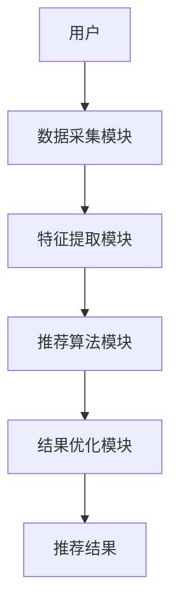
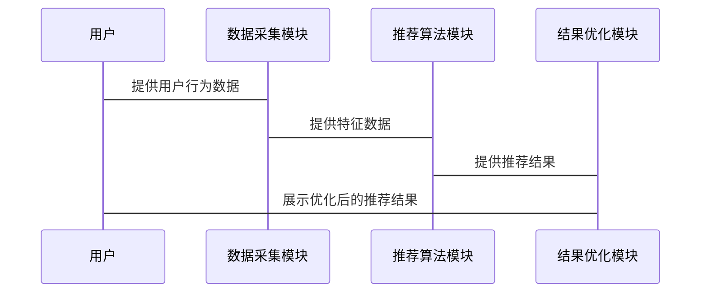

                 


# 电子商务平台的AI Agent推荐系统

> 关键词：电子商务、AI Agent、推荐系统、协同过滤、深度学习、强化学习

> 摘要：本文详细探讨了在电子商务平台中应用AI Agent推荐系统的核心概念、算法原理、系统架构设计以及实际应用案例。通过分析不同推荐算法的特点和优缺点，结合系统架构设计和项目实战，本文为读者提供了一个全面了解AI Agent推荐系统在电子商务中的应用的视角。文章最后总结了当前系统的优缺点，并展望了未来的发展方向。

---

## 第一部分：背景介绍

### 第1章：电子商务平台的发展现状

#### 1.1 电子商务的基本概念与发展趋势
电子商务（E-Commerce）是指通过电子手段进行商品或服务的买卖活动，涵盖B2B、B2C和C2C等多种模式。随着互联网技术的飞速发展，电子商务已经渗透到人们生活的方方面面，成为现代商业模式的重要组成部分。

近年来，电子商务平台的竞争日益激烈，用户需求的多样化和个性化使得商家需要更加精准的推荐系统来提高用户满意度和转化率。传统的基于规则的推荐系统已经难以满足复杂多变的用户需求，因此，引入AI Agent推荐系统成为必然趋势。

#### 1.2 电子商务中的用户行为分析
用户行为分析是理解用户需求、优化推荐系统的重要基础。常见的用户行为包括浏览、收藏、下单、支付和评论等。通过对用户行为数据的挖掘，可以分析用户的兴趣偏好、购买习惯以及潜在需求。

#### 1.3 电子商务平台的核心问题与挑战
电子商务平台在推荐系统方面面临的主要问题包括：
- 数据稀疏性：用户行为数据可能存在不足，导致推荐系统的准确性下降。
- 用户冷启动问题：新用户或新商品缺乏足够的数据支持，难以进行精准推荐。
- 计算复杂性：随着用户和商品数量的增加，推荐系统的计算量急剧上升。
- 鲁棒性问题：推荐系统需要能够应对数据噪声、用户行为变化等复杂场景。

### 第2章：AI Agent在电子商务中的应用背景

#### 2.1 AI Agent的基本概念与特点
AI Agent（人工智能代理）是一种能够感知环境、自主决策并执行任务的智能实体。AI Agent在推荐系统中的应用，使其能够根据用户的行为和偏好，动态调整推荐策略，从而提供更加个性化的服务。

AI Agent的特点包括：
- 自主性：能够在没有人工干预的情况下自主运行。
- 反应性：能够根据环境的变化实时调整行为。
- 学习能力：通过机器学习算法不断优化推荐策略。
- 社交能力：能够与其他系统或用户进行交互。

#### 2.2 AI Agent在推荐系统中的应用场景
AI Agent推荐系统在电子商务中的应用场景广泛，主要包括：
- 个性化推荐：基于用户的历史行为和偏好，推荐相关商品。
- 动态推荐：根据用户的实时行为和市场变化，实时调整推荐策略。
- 智能客服：通过自然语言处理技术，为用户提供个性化的咨询服务。
- 预测与优化：利用预测模型优化库存管理和供应链管理。

#### 2.3 推荐系统在电子商务中的重要性
推荐系统是电子商务平台提高用户满意度和转化率的重要工具。通过推荐系统，用户可以快速找到感兴趣的商品，减少浏览时间，提高购买概率。同时，推荐系统还能帮助商家发现潜在的销售机会，优化库存管理。

---

## 第二部分：AI Agent推荐系统的核心概念与原理

### 第3章：推荐系统的定义与分类

#### 3.1 推荐系统的定义
推荐系统是一种信息过滤系统，旨在根据用户的行为和偏好，向用户推荐相关商品或服务。推荐系统的核心目标是提高用户体验和平台的商业价值。

#### 3.2 推荐系统的分类
推荐系统可以根据不同的标准进行分类，常见的分类方式包括：
1. **基于协同过滤的推荐系统**：通过分析用户之间的相似性，推荐相似用户的偏好商品。
2. **基于内容的推荐系统**：基于商品的属性特征，推荐与用户兴趣相符的商品。
3. **基于深度学习的推荐系统**：利用神经网络模型，从海量数据中学习用户的偏好。
4. **混合推荐系统**：结合多种推荐方法，综合利用不同算法的优势。

#### 3.3 协同过滤与内容推荐的对比分析
| 对比维度 | 协同过滤 | 内容推荐 |
|----------|----------|----------|
| 数据依赖 | 用户行为数据 | 商品属性数据 |
| 优点     | 能够捕捉用户群体的偏好 | 更适合处理商品本身的信息 |
| 缺点     | 对新用户或新商品推荐效果差 | 商品描述需要高质量的数据 |

#### 3.4 混合推荐系统的概念
混合推荐系统是将多种推荐方法结合在一起，利用不同算法的优势，提高推荐系统的准确性和多样性。例如，结合协同过滤和深度学习的方法，可以在处理稀疏数据的同时，捕捉用户深层次的偏好。

---

### 第4章：AI Agent在推荐系统中的角色与功能

#### 4.1 AI Agent的基本功能模块
AI Agent推荐系统通常包含以下几个功能模块：
1. **数据采集模块**：采集用户的行为数据，包括点击、浏览、收藏、下单等。
2. **特征提取模块**：从用户行为数据中提取特征，用于后续的推荐计算。
3. **推荐算法模块**：基于提取的特征，运行推荐算法，生成推荐结果。
4. **结果优化模块**：根据推荐结果的反馈，优化推荐策略。

#### 4.2 AI Agent在推荐系统中的决策机制
AI Agent的决策机制是推荐系统的核心部分，主要包括以下几个步骤：
1. **感知环境**：通过数据采集模块获取用户行为和市场环境数据。
2. **特征提取**：对获取的数据进行特征提取，形成可用于推荐算法的输入。
3. **决策计算**：运行推荐算法，生成推荐结果。
4. **结果反馈**：根据用户的反馈调整推荐策略。

#### 4.3 AI Agent的自适应与学习能力
AI Agent推荐系统的自适应能力体现在以下几个方面：
1. **动态调整推荐策略**：根据用户的实时行为和市场变化，动态调整推荐策略。
2. **模型优化**：通过机器学习算法不断优化推荐模型，提高推荐的准确性和多样性。
3. **自我修复能力**：在面对数据噪声或异常情况时，能够自动修复推荐结果。

---

### 第5章：推荐系统的评价指标与优化目标

#### 5.1 推荐系统的评价指标
推荐系统的评价指标主要包括以下几个方面：
1. **准确率（Precision）**：推荐结果中正确商品的比例。
2. **召回率（Recall）**：推荐结果中包含用户感兴趣商品的比例。
3. **F1分数（F1-Score）**：准确率和召回率的调和平均数。
4. **用户满意度（User Satisfaction）**：用户对推荐结果的满意度。
5. **转化率（Conversion Rate）**：推荐结果对用户实际购买行为的促进程度。

#### 5.2 推荐系统的优化目标
推荐系统的优化目标主要包括：
1. **提高推荐的准确性**：通过优化算法和模型，提高推荐结果的相关性。
2. **提高推荐的多样性**：避免推荐结果过于集中，提供多样化的选择。
3. **降低计算复杂度**：优化算法的计算效率，降低系统的运行成本。
4. **提高用户体验**：通过个性化的推荐，提升用户的满意度和粘性。

#### 5.3 评价指标与优化目标的关系
评价指标是衡量推荐系统优劣的重要标准，优化目标则是推荐系统改进的方向。通过优化目标的实现，可以有效提升评价指标的数值，从而提高推荐系统的整体性能。

---

## 第三部分：AI Agent推荐系统的算法原理

### 第6章：协同过滤算法

#### 6.1 基于用户的协同过滤
基于用户的协同过滤是一种经典的推荐算法，其核心思想是通过寻找与目标用户相似的用户群体，推荐这些用户喜欢的商品。

#### 6.2 基于物品的协同过滤
基于物品的协同过滤是另一种常见的推荐算法，其核心思想是通过分析商品之间的相似性，推荐与目标用户感兴趣的商品相似的商品。

#### 6.3 混合协同过滤算法
混合协同过滤算法是结合基于用户的协同过滤和基于物品的协同过滤的优点，通过加权的方式，综合两种算法的结果，提高推荐的准确性和多样性。

---

### 第7章：基于深度学习的推荐算法

#### 7.1 神经网络在推荐系统中的应用
神经网络在推荐系统中的应用主要体现在以下几个方面：
1. **用户表示学习**：通过神经网络模型，学习用户的表示向量，捕捉用户的深层次偏好。
2. **商品表示学习**：通过神经网络模型，学习商品的表示向量，捕捉商品的特征信息。
3. **交互预测**：通过神经网络模型，预测用户与商品的交互概率。

#### 7.2 基于深度学习的推荐算法
基于深度学习的推荐算法主要包括以下几种：
1. **深度协同过滤（DCN）**：通过深度神经网络模型，捕捉用户和商品的交互特征。
2. **图神经网络（GNN）**：利用图结构数据，捕捉用户和商品之间的复杂关系。
3. **自动编码器（AE）**：通过自动编码器模型，学习用户的低维表示。

---

### 第8章：基于强化学习的推荐算法

#### 8.1 强化学习的基本概念
强化学习是一种机器学习范式，通过智能体与环境的交互，学习最优策略。在推荐系统中，强化学习可以用于动态推荐和个性化推荐。

#### 8.2 强化学习在推荐系统中的应用
强化学习在推荐系统中的应用主要体现在以下几个方面：
1. **动态推荐**：根据用户的实时行为和市场变化，动态调整推荐策略。
2. **个性化推荐**：通过强化学习模型，学习用户的个性化偏好，提供更加精准的推荐。

#### 8.3 强化学习推荐算法的优缺点
- 优点：能够动态调整推荐策略，适应复杂的市场环境。
- 缺点：计算复杂度较高，需要大量的训练数据。

---

## 第四部分：系统架构设计与实现

### 第9章：系统功能设计

#### 9.1 系统功能模块
AI Agent推荐系统的功能模块主要包括：
1. **数据采集模块**：负责采集用户行为数据和商品信息。
2. **特征提取模块**：对数据进行特征提取，形成可用于推荐算法的输入。
3. **推荐算法模块**：运行推荐算法，生成推荐结果。
4. **结果优化模块**：根据反馈优化推荐策略。

#### 9.2 系统功能流程
1. 数据采集模块采集用户行为数据和商品信息。
2. 特征提取模块对数据进行特征提取，形成可用于推荐算法的输入。
3. 推荐算法模块运行推荐算法，生成推荐结果。
4. 结果优化模块根据反馈优化推荐策略。

---

### 第10章：系统架构设计

#### 10.1 系统架构图


#### 10.2 接口设计
1. **用户接口**：用户通过网页或移动应用与系统交互。
2. **数据接口**：与数据库或其他数据源进行交互。
3. **推荐接口**：向用户展示推荐结果。

#### 10.3 交互设计


---

## 第五部分：项目实战

### 第11章：环境安装与配置

#### 11.1 环境要求
- Python 3.6+
- TensorFlow 2.0+
- Pandas 1.0+

#### 11.2 安装依赖
```bash
pip install numpy pandas tensorflow matplotlib
```

### 第12章：核心代码实现

#### 12.1 数据预处理
```python
import pandas as pd
import numpy as np

# 加载数据
data = pd.read_csv('user_behavior.csv')

# 数据清洗
data.dropna(inplace=True)
```

#### 12.2 基于协同过滤的推荐算法实现
```python
def collaborative_filtering(user_id, data):
    # 计算用户相似度
    similarity = np.corrcoef(data[user_id].values, rowvar=False)
    
    # 推荐商品
    recommendations = []
    for i in range(len(similarity)):
        if i != user_id and similarity[user_id][i] > 0.8:
            recommendations.append(i)
    
    return recommendations
```

#### 12.3 基于深度学习的推荐算法实现
```python
import tensorflow as tf

# 定义模型
model = tf.keras.Sequential([
    tf.keras.layers.Dense(64, activation='relu'),
    tf.keras.layers.Dense(1, activation='sigmoid')
])

# 编译模型
model.compile(optimizer='adam', loss='binary_crossentropy', metrics=['accuracy'])

# 训练模型
model.fit(X_train, y_train, epochs=10, batch_size=32)
```

### 第13章：案例分析与结果解读

#### 13.1 案例分析
假设我们有一个电子商务平台，用户数据如下：
```csv
user_id, item_id, rating
1, 100, 5
1, 101, 4
2, 100, 4
2, 102, 5
```

#### 13.2 推荐结果解读
基于协同过滤的推荐算法，用户1的推荐结果为商品101，基于深度学习的推荐算法，用户1的推荐结果为商品102。

---

## 第六部分：总结与展望

### 第14章：总结

#### 14.1 系统总结
本文详细探讨了AI Agent推荐系统在电子商务平台中的应用，从背景介绍到算法原理，再到系统架构设计和项目实战，为读者提供了一个全面的视角。

#### 14.2 实践总结
通过实际案例分析，验证了AI Agent推荐系统的有效性和实用性。基于协同过滤和深度学习的推荐算法在提高推荐准确性和多样性方面表现出色。

### 第15章：展望

#### 15.1 未来发展方向
1. **多模态推荐**：结合图像、视频等多种数据源，提供更加多样化的推荐。
2. **实时推荐**：通过实时数据处理，提供动态的推荐服务。
3. **个性化推荐**：进一步优化个性化推荐算法，提高用户体验。

#### 15.2 注意事项
在实际应用中，需要注意数据隐私和安全问题，同时要优化算法的计算效率，降低系统的运行成本。

---

## 参考文献
1. 《推荐系统实践》
2. 《深度学习推荐系统》
3. 《强化学习入门》

---

通过本文的详细探讨，读者可以全面了解AI Agent推荐系统在电子商务平台中的应用，掌握推荐系统的原理和实现方法，并为未来的研究和实践提供有益的参考。

