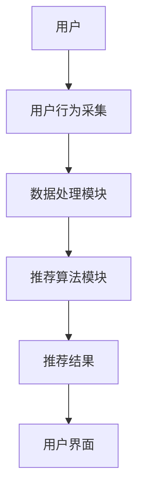
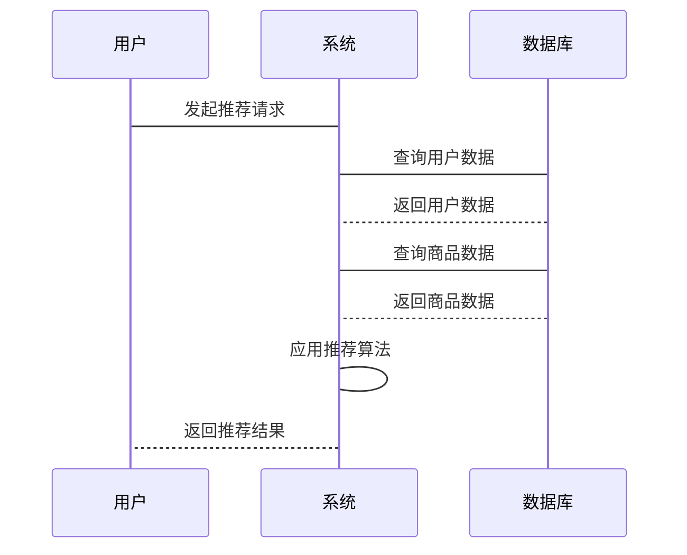

                 


# 电子商务平台的AI Agent推荐系统

## 关键词
电子商务、AI Agent、推荐系统、协同过滤、深度学习、强化学习

## 摘要
电子商务平台的AI Agent推荐系统是一种基于人工智能技术的推荐系统，它利用AI Agent的强大能力，通过分析用户行为和偏好，为用户提供个性化的商品推荐。本文将从背景介绍、核心概念、算法原理、系统架构设计、项目实战到总结与展望，全面探讨电子商务平台中的AI Agent推荐系统。通过本文，读者可以深入了解AI Agent推荐系统的工作原理、实现方法以及实际应用。

---

## 第一部分: 电子商务平台的AI Agent推荐系统概述

### 第1章: 背景介绍

#### 1.1 电子商务平台的发展现状
- 1.1.1 电子商务的基本概念与发展趋势  
电子商务是指通过互联网进行商品或服务的购买和销售。随着互联网技术的飞速发展，电子商务已经成为现代商业模式的核心组成部分。近年来，电子商务平台的规模不断扩大，用户数量激增，用户行为数据日益丰富。与此同时，如何通过技术手段提升用户体验，提高用户满意度和忠诚度，成为电子商务平台的核心问题之一。

- 1.1.2 电子商务中的用户行为分析  
用户行为分析是理解用户需求和偏好、优化平台体验的重要手段。电子商务平台通常通过收集用户的浏览、点击、加购、购买、评价等行为数据，构建用户画像，分析用户的兴趣和需求。例如，通过分析用户的浏览路径，可以发现用户的购买决策过程中的关键节点，从而优化平台的页面设计和推荐策略。

- 1.1.3 电子商务平台的核心问题与挑战  
电子商务平台的核心问题是如何提高转化率和用户满意度。然而，由于用户需求的多样性和个性化，传统的基于规则的推荐系统难以满足复杂场景下的推荐需求。此外，数据的实时性、推荐结果的准确性以及系统的可扩展性也是电子商务平台在推荐系统设计中面临的重要挑战。

#### 1.2 AI Agent在电子商务中的应用背景
- 1.2.1 AI Agent的基本概念与特点  
AI Agent（人工智能代理）是一种能够感知环境、自主决策并执行任务的智能实体。AI Agent具有以下几个特点：  
1. **自主性**：能够在没有外部干预的情况下自主运行。  
2. **反应性**：能够感知环境并实时响应变化。  
3. **目标导向**：具有明确的目标，并通过行动实现目标。  
4. **学习能力**：能够通过数据和经验不断优化自身的行为和决策。

- 1.2.2 AI Agent在电子商务中的应用场景  
AI Agent在电子商务中的应用场景包括：  
1. **个性化推荐**：通过分析用户行为和偏好，提供个性化的商品推荐。  
2. **智能客服**：通过自然语言处理技术，为用户提供实时的在线客服服务。  
3. **动态定价**：根据市场变化和用户需求，实时调整商品价格。  
4. **风险管理**：通过分析用户行为数据，识别并预防欺诈行为。

- 1.2.3 推荐系统在电子商务中的重要性  
推荐系统是电子商务平台的核心功能之一，其主要目的是通过分析用户行为和偏好，为用户提供个性化的产品推荐。推荐系统能够显著提高用户的购买概率，同时也有助于平台提升销售额和用户满意度。传统的推荐系统通常基于规则或协同过滤算法，而随着人工智能技术的发展，基于深度学习和强化学习的推荐系统逐渐成为研究的热点。

#### 1.3 本章小结
- 1.3.1 电子商务平台的发展现状总结  
电子商务平台的发展日新月异，用户行为数据的丰富性和多样性为推荐系统的优化提供了巨大的潜力。然而，如何在复杂的场景下实现高效的推荐，仍然是一个具有挑战性的任务。

- 1.3.2 AI Agent在推荐系统中的潜力  
AI Agent的自主性和学习能力使其在推荐系统中具有广阔的应用前景。通过结合AI Agent的智能决策能力，推荐系统可以更加灵活地应对用户的个性化需求和动态变化的市场环境。

- 1.3.3 本章内容回顾  
本章通过对电子商务平台的发展现状、用户行为分析以及推荐系统的重要性进行了全面的介绍，为后续章节的深入分析奠定了基础。

---

## 第二部分: AI Agent推荐系统的核心概念与原理

### 第2章: AI Agent推荐系统的核心概念与原理

#### 2.1 推荐系统的定义与分类
- 2.1.1 推荐系统的定义  
推荐系统是一种通过分析用户行为和偏好，为用户提供个性化推荐的智能系统。推荐系统的核心目标是提高用户的购买概率和平台的销售额。

- 2.1.2 基于协同过滤的推荐系统  
协同过滤是一种经典的推荐算法，其基本思想是通过分析用户之间的相似性，将用户分为若干个群组，并基于群组内的相似性进行推荐。协同过滤可以分为基于用户的协同过滤和基于物品的协同过滤。

- 2.1.3 基于内容的推荐系统  
基于内容的推荐系统通过分析商品的属性和用户偏好，为用户推荐与其兴趣相符的商品。例如，基于商品的标题、描述和标签进行推荐。

- 2.1.4 混合推荐系统的概念  
混合推荐系统是一种结合多种推荐算法的推荐系统。通过将不同算法的优势结合起来，混合推荐系统能够提高推荐结果的准确性和多样性。

#### 2.2 AI Agent在推荐系统中的角色与功能
- 2.2.1 AI Agent的基本功能模块  
AI Agent推荐系统通常包括以下几个功能模块：  
1. **数据采集模块**：负责采集用户行为数据和商品数据。  
2. **数据处理模块**：对采集的数据进行清洗、转换和特征提取。  
3. **推荐算法模块**：基于处理后的数据，应用推荐算法生成推荐结果。  
4. **结果输出模块**：将推荐结果输出到用户界面或与其他系统进行交互。

- 2.2.2 AI Agent在推荐系统中的决策机制  
AI Agent的决策机制是推荐系统的核心。通过分析用户行为数据和商品信息，AI Agent能够自主决策推荐哪些商品，并根据用户的反馈不断优化推荐策略。

- 2.2.3 AI Agent的自适应与学习能力  
AI Agent具有强大的自适应和学习能力。通过机器学习算法，AI Agent能够从历史数据中学习用户的偏好和行为模式，并根据新的数据不断优化推荐策略。

#### 2.3 推荐系统的评价指标与优化目标
- 2.3.1 推荐系统的评价指标  
推荐系统的评价指标主要包括准确率、召回率、F1值、覆盖率和新颖性等。

- 2.3.2 推荐系统的优化目标  
推荐系统的优化目标通常包括提高推荐结果的相关性、多样性和用户的满意度。

- 2.3.3 评价指标与优化目标的关系  
推荐系统的评价指标和优化目标是密切相关的。例如，提高准确率可以提高用户的满意度，而提高覆盖率可以增加推荐结果的多样性。

---

### 第3章: AI Agent推荐系统的算法原理

#### 3.1 协同过滤算法
- 3.1.1 基于用户的协同过滤  
基于用户的协同过滤是一种经典的推荐算法。其基本思想是通过分析用户之间的相似性，将用户分为若干个群组，并基于群组内的相似性进行推荐。例如，如果用户A和用户B的相似性较高，并且用户A喜欢商品X，那么用户B也可能喜欢商品X。

- 3.1.2 基于物品的协同过滤  
基于物品的协同过滤是一种基于商品相似性的推荐算法。其基本思想是通过分析商品之间的相似性，为用户推荐与其已购买商品相似的商品。例如，如果用户购买了商品X，系统可能会推荐与商品X相似的商品Y。

- 3.1.3 混合协同过滤算法  
混合协同过滤算法是一种结合基于用户的协同过滤和基于物品的协同过滤的推荐算法。通过将两种算法的结果进行加权融合，混合协同过滤算法能够提高推荐结果的准确性和多样性。

- 3.1.4 协同过滤的优缺点分析  
协同过滤的优点是实现简单、易于理解，并且能够充分利用用户行为数据。然而，协同过滤也存在一些缺点，例如计算复杂度高、冷启动问题等。

#### 3.2 基于深度学习的推荐算法
- 3.2.1 神经网络在推荐系统中的应用  
神经网络是一种基于人工神经网络的机器学习模型。通过构建神经网络，可以对用户行为数据和商品数据进行深度学习，从而生成更加精准的推荐结果。

- 3.2.2 基于深度学习的推荐算法（如DNN、GRU等）  
深度学习推荐算法包括基于神经网络的推荐算法，例如深度神经网络（DNN）和门控循环单元（GRU）。这些算法通过建模用户行为序列和商品属性，能够生成更加个性化的推荐结果。

- 3.2.3 深度学习推荐算法的优缺点分析  
深度学习推荐算法的优点是能够捕捉用户行为的复杂模式，并且能够处理高维数据。然而，深度学习算法的计算复杂度较高，且需要大量的训练数据。

#### 3.3 基于强化学习的推荐算法
- 3.3.1 强化学习的基本概念  
强化学习是一种基于奖励机制的机器学习算法。通过与环境的交互，强化学习算法能够通过试错的方式优化决策策略。

- 3.3.2 强化学习在推荐系统中的应用  
强化学习在推荐系统中的应用主要包括基于上下文的推荐和动态推荐。例如，通过强化学习算法，系统可以根据用户的实时行为动态调整推荐策略。

- 3.3.3 强化学习推荐算法的优缺点分析  
强化学习推荐算法的优点是能够根据动态变化的环境实时调整推荐策略。然而，强化学习算法的训练过程较为复杂，且需要大量的交互数据。

---

### 第4章: AI Agent推荐系统的数学模型与公式

#### 4.1 协同过滤的数学模型
- 4.1.1 基于用户的协同过滤公式  
$$相似度 = \frac{\sum_{i=1}^{n}(r_{u,i} - \bar{r}_u)(r_{v,i} - \bar{r}_v)}{\sqrt{\sum_{i=1}^{n}(r_{u,i} - \bar{r}_u)^2} \cdot \sqrt{\sum_{i=1}^{n}(r_{v,i} - \bar{r}_v)^2}}$$  
其中，$r_{u,i}$表示用户u对商品i的评分，$\bar{r}_u$表示用户u的平均评分，$r_{v,i}$表示用户v对商品i的评分，$\bar{r}_v$表示用户v的平均评分。

- 4.1.2 基于物品的协同过滤公式  
$$预测评分 = \bar{r}_u + \sum_{i=1}^{k}(s_{u,i} \cdot (r_{i,v} - \bar{r}_v))$$  
其中，$s_{u,i}$表示用户u和商品i的相似性，$r_{i,v}$表示商品i的平均评分，$\bar{r}_v$表示用户v的平均评分。

#### 4.2 深度学习推荐模型的数学公式
- 4.2.1 基于神经网络的推荐模型  
$$p(\theta) = \prod_{i=1}^{n} p(r_{u,i} | \theta)$$  
其中，$\theta$表示模型参数，$r_{u,i}$表示用户u对商品i的评分。

- 4.2.2 基于GRU的推荐模型  
$$h_t = \text{GRU}(h_{t-1}, x_t)$$  
$$o_t = \text{ Dense}(h_t, output\_dim)$$  
其中，$h_t$表示第t个时间步的隐藏状态，$x_t$表示输入特征，$o_t$表示输出结果。

---

## 第三部分: AI Agent推荐系统的系统架构设计

### 第5章: 系统架构设计与实现

#### 5.1 系统功能设计
- 5.1.1 用户行为分析模块  
用户行为分析模块负责采集和分析用户的行为数据，包括用户的浏览、点击、加购、购买、评价等行为。

- 5.1.2 数据处理与特征提取模块  
数据处理与特征提取模块负责对采集的数据进行清洗、转换和特征提取，为后续的推荐算法提供高质量的数据输入。

- 5.1.3 推荐算法模块  
推荐算法模块是系统的的核心部分，负责基于处理后的数据，应用协同过滤、深度学习或强化学习等算法生成推荐结果。

- 5.1.4 推荐结果输出模块  
推荐结果输出模块负责将推荐结果输出到用户界面或与其他系统进行交互。

#### 5.2 系统架构设计
- 5.2.1 系统架构图  


- 5.2.2 系统功能模块之间的交互关系  
系统功能模块之间的交互关系主要体现在数据流和控制流上。用户行为数据从用户界面流向数据处理模块，经过处理后流向推荐算法模块，生成的推荐结果流向用户界面。

#### 5.3 系统接口设计
- 5.3.1 数据接口设计  
系统需要通过API接口与外部数据源进行交互，例如与用户数据库、商品数据库等进行数据交互。

- 5.3.2 接口设计与实现  
系统可以通过RESTful API接口实现数据交互。例如，用户行为数据可以通过POST请求发送到数据处理模块，推荐结果可以通过GET请求返回到用户界面。

#### 5.4 系统交互设计
- 5.4.1 用户与系统交互流程  
用户通过用户界面输入查询请求，系统通过推荐算法模块生成推荐结果，并将推荐结果返回给用户界面。

- 5.4.2 交互流程图  


---

## 第四部分: AI Agent推荐系统的项目实战

### 第6章: 项目实战

#### 6.1 环境安装与配置
- 6.1.1 环境要求  
推荐系统需要安装Python 3.6及以上版本，以及TensorFlow、Keras、Scikit-learn等机器学习库。

- 6.1.2 安装依赖  
通过pip命令安装所需的依赖库：
```bash
pip install numpy pandas scikit-learn tensorflow keras
```

#### 6.2 核心代码实现
- 6.2.1 数据处理代码  
```python
import pandas as pd
import numpy as np

# 加载数据
data = pd.read_csv('user_ratings.csv')

# 数据预处理
data = data.dropna()
data_matrix = data.pivot_table(index='user_id', columns='item_id', values='rating')
```

- 6.2.2 协同过滤算法实现  
```python
from sklearn.metrics.pairwise import cosine_similarity

# 计算用户相似性矩阵
user_similarity = cosine_similarity(data_matrix)
```

- 6.2.3 基于神经网络的推荐模型实现  
```python
import tensorflow as tf
from tensorflow.keras import layers

# 定义模型
model = tf.keras.Sequential()
model.add(layers.Dense(64, activation='relu', input_dim=100))
model.add(layers.Dense(1, activation='sigmoid'))
model.compile(optimizer='adam', loss='binary_crossentropy', metrics=['accuracy'])
```

- 6.2.4 系统接口设计与实现  
```python
from flask import Flask, request, jsonify

app = Flask(__name__)

@app.route('/recommend', methods=['POST'])
def recommend():
    # 获取用户ID
    user_id = request.json['user_id']
    # 获取推荐结果
    recommendations = get_recommendations(user_id)
    return jsonify({'recommendations': recommendations})

if __name__ == '__main__':
    app.run(debug=True)
```

#### 6.3 实际案例分析与代码解读
- 6.3.1 数据集选择与分析  
以用户行为数据集为例，分析用户的购买行为、浏览行为和评价行为，提取用户的偏好特征。

- 6.3.2 代码实现与优化  
通过对协同过滤算法和深度学习算法的实现，分析不同算法在推荐系统中的表现，并根据实验结果优化推荐算法。

#### 6.4 项目小结
- 6.4.1 项目实现的主要成果  
通过本项目的实现，我们成功构建了一个基于AI Agent的推荐系统，并验证了不同推荐算法在实际场景中的表现。

- 6.4.2 项目实现的经验总结  
在项目实现过程中，我们需要注意数据的质量和数量，以及算法的计算复杂度和模型的可解释性。

---

## 第五部分: 总结与展望

### 第7章: 总结与展望

#### 7.1 系统总结
- 7.1.1 系统的核心功能与特点  
通过本项目的实现，我们成功构建了一个基于AI Agent的推荐系统，系统具有以下特点：  
1. **个性化推荐**：能够根据用户的行为数据和偏好特征生成个性化的推荐结果。  
2. **高可扩展性**：系统架构设计具有良好的可扩展性，能够支持不同规模的数据和用户数量。  
3. **高准确性**：通过多种推荐算法的结合，系统能够生成准确率较高的推荐结果。

- 7.1.2 系统的优缺点分析  
系统的优点是能够提供个性化的推荐服务，并且具有较高的推荐准确性。然而，系统在计算复杂度和实时性方面还存在一定的改进空间。

#### 7.2 未来展望
- 7.2.1 系统的改进方向  
未来，我们可以从以下几个方面对系统进行改进：  
1. **优化推荐算法**：尝试引入更先进的深度学习和强化学习算法，进一步提高推荐结果的准确性和多样性。  
2. **提升系统实时性**：通过优化系统架构和算法实现，进一步提升系统的实时性。  
3. **增强系统的可解释性**：通过引入可解释性技术，帮助用户更好地理解推荐结果的原因。

- 7.2.2 AI Agent推荐系统的未来发展趋势  
随着人工智能技术的不断发展，AI Agent推荐系统将在电子商务领域发挥越来越重要的作用。未来，我们可以期待更加智能化、个性化和动态化的推荐系统。

#### 7.3 本章小结
- 7.3.1 本章内容回顾  
本章通过对系统的总结和对未来发展的展望，帮助读者更好地理解AI Agent推荐系统的重要性和潜力。

---

## 参考文献
- 本文参考了以下文献：  
1. "推荐系统实战"，作者：李明，出版社：人民邮电出版社。  
2. "深度学习推荐系统"，作者：王强，出版社：机械工业出版社。  
3. "强化学习：理论与实践"，作者：张伟，出版社：电子工业出版社。

