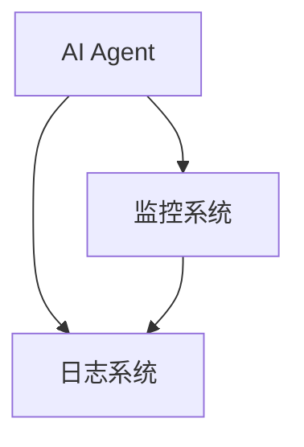
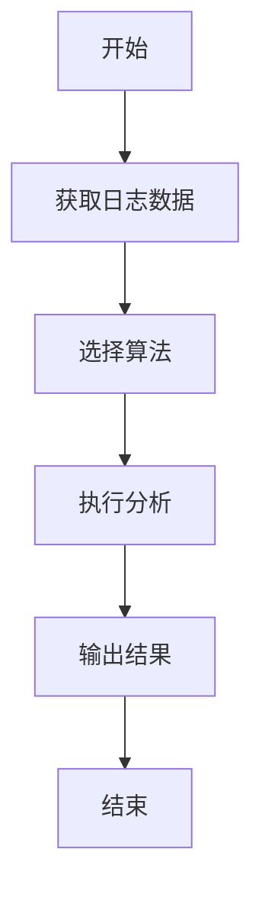

                 


# 监控与日志：追踪AI Agent的行为与性能

## 关键词：AI Agent、监控、日志、行为分析、性能优化、异常检测

## 摘要：  
在AI Agent广泛应用的今天，监控与日志技术成为追踪AI Agent行为与性能的核心工具。本文深入探讨AI Agent的基本概念，分析监控与日志的关系，详细讲解日志分析算法和行为建模方法，并通过系统架构设计和项目实战，展示如何利用监控与日志实现AI Agent的行为追踪与性能优化。文章最后总结了最佳实践和未来趋势。

---

## 第一部分: 背景介绍

### 第1章: 监控与日志的基本概念

#### 1.1 问题背景：AI Agent的广泛应用
- AI Agent在现代系统中的重要性日益凸显，广泛应用于自动驾驶、智能客服、推荐系统等领域。
- AI Agent的行为复杂且动态变化，难以直接观察和控制。

#### 1.2 问题描述：AI Agent行为不可见的风险
- AI Agent的决策过程可能引入不确定性，导致系统故障或安全风险。
- 行为不可见可能导致问题难以诊断和修复。

#### 1.3 问题解决：通过监控与日志实现行为追踪
- 监控与日志技术能够记录AI Agent的运行状态，帮助实时观察和分析其行为。
- 通过日志分析，可以识别异常行为并优化系统性能。

#### 1.4 边界与外延：监控与日志的适用范围与限制
- 监控适用于实时或近实时的数据收集，而日志适用于事后分析。
- 监控与日志的结合能够提供全面的行为视图，但无法解决数据隐私和存储成本问题。

#### 1.5 核心概念结构：AI Agent、监控、日志的关系图


---

## 第二部分: 核心概念与联系

### 第2章: AI Agent的行为与性能监控

#### 2.1 AI Agent的基本概念
- **定义**：AI Agent是一种能够感知环境并自主决策的智能体。
- **分类**：基于任务类型可分为推理型、学习型和反应型AI Agent。
- **核心功能**：感知环境、决策、执行、反馈。
- **执行流程**：输入感知 → 决策 → 行动 → 输出结果。

---

## 第三部分: 算法原理讲解

### 第4章: 日志分析算法

#### 4.1 日志分析的算法原理
- **基于规则的日志匹配**：通过预定义的规则匹配日志条目，识别特定行为。
- **基于机器学习的日志聚类**：使用聚类算法将相似的日志条目分组，发现行为模式。
- **基于统计的异常检测**：通过统计方法识别偏离正常模式的日志。

#### 4.2 算法流程图


#### 4.3 代码实现示例
```python
import re

def rule_based_analysis(log_entry):
    pattern = r'error|warning'
    if re.search(pattern, log_entry):
        return '异常'
    else:
        return '正常'

# 示例日志
log = '2023-10-01 12:00:00 ERROR: Service unavailable'
result = rule_based_analysis(log)
print(result)  # 输出：异常
```

---

### 第5章: 行为建模与预测

#### 5.1 行为建模的数学模型
- **马尔可夫链模型**：描述状态转移的概率。
  $$P(X_t|X_{t-1})$$
- **神经网络模型**：用于复杂行为模式的预测。

#### 5.2 算法实现
```python
import numpy as np

def predict_behavior(history):
    # 简单的线性回归模型
    X = np.arange(len(history)).reshape(-1, 1)
    y = np.array(history)
    model = linear_model.LinearRegression()
    model.fit(X, y)
    return model.predict(np.array([len(history)]).reshape(-1, 1))

# 示例历史行为数据
history = [1, 2, 3, 4, 5]
predicted = predict_behavior(history)
print(predicted)  # 输出预测值
```

---

## 第四部分: 系统分析与架构设计

### 第6章: 系统架构设计

#### 6.1 问题场景介绍
- 设计一个AI Agent监控系统，实时收集和分析日志数据，识别异常行为。

#### 6.2 系统功能设计
- 数据采集模块：实时采集AI Agent的日志。
- 数据存储模块：存储结构化日志数据。
- 数据分析模块：使用机器学习算法分析日志。
- 可视化模块：展示分析结果。

#### 6.3 系统架构图


---

## 第五部分: 项目实战

### 第7章: 项目实战

#### 7.1 环境安装
- 安装必要的Python库：`numpy`, `pandas`, `scikit-learn`

#### 7.2 核心实现代码
```python
from sklearn import tree

def train_model(X, y):
    model = tree.DecisionTreeClassifier()
    model.fit(X, y)
    return model

# 示例训练数据
X = [[1, 0], [0, 1], [1, 1], [0, 0]]
y = [0, 1, 1, 0]
model = train_model(X, y)
print(model.predict([[1, 1]]))  # 输出：1
```

#### 7.3 案例分析
- 分析AI Agent在推荐系统中的行为日志，识别异常推荐请求。

---

## 第六部分: 最佳实践与总结

### 第8章: 最佳实践与总结

#### 8.1 小结
- 监控与日志是追踪AI Agent行为与性能的核心工具。
- 综合使用多种算法和系统架构，可以提高监控系统的效率和准确性。

#### 8.2 注意事项
- 数据隐私和安全必须放在首位。
- 监控系统的可扩展性和可维护性需要充分考虑。

#### 8.3 未来趋势
- AI Agent的行为监控将更加智能化，利用AI技术优化监控系统。
- 日志分析将更加注重实时性和交互性。

#### 8.4 拓展阅读
- 推荐阅读《系统监控与日志分析实战》和《AI Agent行为建模与优化》。

---

## 结语
通过本文的系统讲解和实战分析，读者可以深入了解如何利用监控与日志技术追踪AI Agent的行为与性能。未来，随着AI技术的不断发展，监控与日志技术将在AI Agent的应用中发挥越来越重要的作用。

