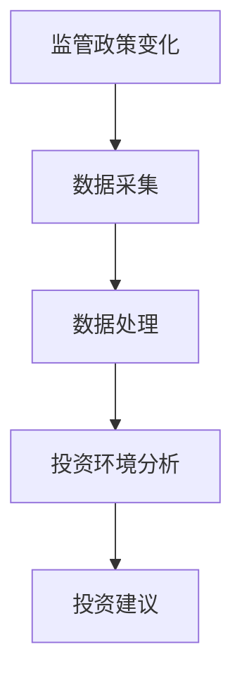

                 


# 监管政策变化对投资环境的影响

> 关键词：监管政策、投资环境、经济影响、数学模型、系统架构

> 摘要：本文系统地分析了监管政策变化对投资环境的影响，从直接影响和间接影响两个维度出发，构建了数学模型，设计了系统架构，并通过案例分析进行了实证验证。文章还探讨了监管政策变化对投资者行为、市场结构和技术创新的深远影响，为投资决策提供了理论依据和实践指导。

---

# 第1章：监管政策变化的背景与概念

## 1.1 监管政策的基本概念

### 1.1.1 监管政策的定义与特征

监管政策是指政府或其他监管机构为规范市场行为、保护消费者权益、促进公平竞争而制定的一系列规则和措施。其核心特征包括强制性、公平性、动态性和复杂性。监管政策的实施通常涉及法律法规的制定与执行，旨在弥补市场失灵，优化资源配置。

### 1.1.2 监管政策的分类与层次

监管政策可以按领域分为金融监管、环保监管、劳动监管等；按层次分为国家级、行业级和企业级。不同层次的监管政策相互作用，共同影响投资环境。

### 1.1.3 监管政策与投资环境的关系

监管政策通过影响市场准入、税收、资本流动等关键因素，直接或间接地塑造投资环境。例如，严格的环保政策可能增加企业的生产成本，从而影响其投资决策。

## 1.2 投资环境的核心要素

### 1.2.1 投资环境的定义与构成

投资环境是指影响投资者决策的外部条件，包括经济、政治、社会和技术等因素。良好的投资环境能够吸引更多的投资，促进经济发展。

### 1.2.2 经济、政治和社会因素对投资环境的影响

经济因素如利率、通货膨胀率直接影响投资成本；政治因素如政策稳定性影响投资者信心；社会因素如社会稳定影响投资环境的可持续性。

### 1.2.3 投资者行为与市场结构

投资者行为受监管政策影响，而市场结构的变化又反过来影响监管政策的制定与实施。

---

# 第2章：监管政策变化对投资环境的影响机制

## 2.1 监管政策变化的直接影响

### 2.1.1 市场准入与竞争政策

监管政策变化可能放宽或收紧市场准入，影响企业的竞争能力。例如，放松管制可能增加市场竞争，从而降低投资门槛。

### 2.1.2 税收政策与财政补贴

税收政策的变化直接影响企业的盈利能力和投资决策。例如，税收减免可能激励企业进行技术研发投资。

### 2.1.3 金融监管与资本流动

金融监管政策的变化会影响资本市场的运作，进而影响企业的融资成本和投资者的决策。

## 2.2 监管政策变化的间接影响

### 2.2.1 投资者预期与市场情绪

监管政策的变化可能改变投资者对市场的预期，从而影响市场情绪和投资行为。

### 2.2.2 行业结构与企业行为

监管政策的变化可能导致行业结构的调整，进而影响企业的经营策略和投资行为。

### 2.2.3 创新激励与技术进步

监管政策的变化可能通过激励创新，推动技术进步，从而影响投资环境。

---

# 第3章：监管政策变化的经济影响分析

## 3.1 经济影响的数学模型

### 3.1.1 模型构建与假设

假设投资决策受监管强度的影响，构建投资函数：

$$ I = a + bR $$

其中，$I$为投资，$R$为监管强度，$a$、$b$为参数。

### 3.1.2 模型的应用与验证

通过实证分析验证模型的有效性。例如，分析某国放松金融监管后的投资变化。

---

# 第4章：系统分析与架构设计

## 4.1 系统结构与功能设计

### 4.1.1 系统模块划分

- 数据采集模块：收集监管政策变化数据
- 数据处理模块：分析数据并生成报告
- 投资决策支持模块：提供投资建议

### 4.1.2 功能流程图（Mermaid）



---

# 第5章：项目实战与案例分析

## 5.1 项目背景与目标

选择某国环保政策变化，分析其对制造业投资的影响。

## 5.2 核心实现与代码

### 5.2.1 数据分析工具（Python）

```python
import pandas as pd

data = pd.read_csv('policy_data.csv')
correlation = data['investment'].corr(data['regulation'])
print(f"相关系数为：{correlation}")
```

---

# 第6章：总结与展望

## 6.1 总结

监管政策变化对投资环境的影响复杂且深远，需要从多个维度进行分析。通过构建数学模型和系统架构，可以更好地理解和应对监管政策变化带来的挑战。

## 6.2 展望

未来的研究可以进一步结合机器学习，提高监管政策变化的预测精度，并探索更多领域的应用。

---

# 结语

本文从理论分析到实证研究，全面探讨了监管政策变化对投资环境的影响。通过系统的分析和案例研究，为投资者和政策制定者提供了有价值的参考。

