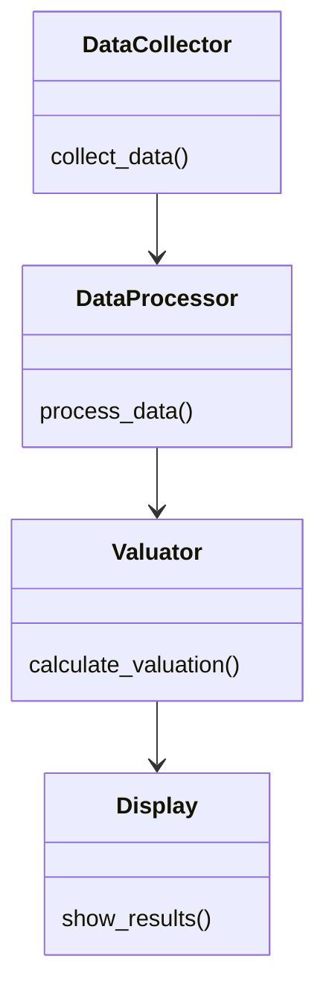

                 


# 相对估值法：市场比较视角下的资产定价

## 关键词：
相对估值法、资产定价、市场比较、可比公司分析、EV/EBITDA

## 摘要：
相对估值法是一种通过市场比较来确定资产价值的方法，主要应用于股票定价和企业估值。本文从理论基础、算法实现、系统架构到项目实战，全面解析相对估值法的核心原理和应用场景，帮助读者掌握这一重要的资产定价工具。

---

# 第1章 相对估值法的概述

## 1.1 相对估值法的起源与发展

### 1.1.1 估值方法的演变历程
相对估值法起源于20世纪初，随着金融市场的成熟而逐渐发展。早期的估值方法主要依赖于基本面分析，而相对估值法则通过比较市场中类似资产的价格，提供了一种更加灵活和实用的估值方式。

### 1.1.2 相对估值法的定义与特点
相对估值法是通过比较目标资产与市场上类似资产的市场倍数（如市盈率、市净率等）来确定目标资产价值的一种方法。其特点包括简单易懂、适用于市场有效性的假设，以及能够快速进行估值。

### 1.1.3 相对估值法在资产定价中的地位
相对估值法在资产定价中占据重要地位，尤其是在缺乏详细财务数据的情况下，它为投资者提供了一种快速而有效的方法来评估资产价值。

## 1.2 相对估值法的核心概念

### 1.2.1 可比公司分析
可比公司分析是相对估值法的核心，通过选择与目标公司具有相似业务模式、行业地位和财务表现的公司，计算其市场倍数，进而推导目标公司的价值。

### 1.2.2 市场倍数与比率
市场倍数是相对估值法的关键指标，包括市盈率（P/E）、市净率（P/B）和企业价值倍数（EV/EBITDA）等。这些指标反映了市场对类似资产的定价标准。

### 1.2.3 估值的相对性与市场参与者的认知
相对估值法强调资产价格的相对性，认为市场价格反映了市场参与者的认知和预期。通过比较市场倍数，可以发现资产价格的偏离，从而指导投资决策。

## 1.3 相对估值法的应用场景

### 1.3.1 企业价值评估
相对估值法常用于企业并购中的目标公司估值，帮助买方确定合理的收购价格。

### 1.3.2 股票定价
在股票市场中，相对估值法通过比较可比公司的市场倍数，评估目标公司的股价是否合理。

### 1.3.3 并购与重组中的应用
相对估值法在企业并购中广泛应用，用于评估目标公司的价值，确保交易价格合理。

## 1.4 相对估值法的优缺点

### 1.4.1 相对估值法的优势
- 简单易懂，易于操作。
- 适用于市场有效性的假设，能够快速进行估值。
- 通过比较市场倍数，发现资产价格的偏离。

### 1.4.2 相对估值法的局限性
- 过于依赖市场参与者的认知，可能导致价格泡沫。
- 可比公司选择的主观性，影响估值的准确性。
- 无法反映公司特有的风险和竞争优势。

### 1.4.3 相对估值法与其他估值方法的结合
相对估值法可以与绝对估值法（如DCF模型）结合使用，提高估值的准确性和全面性。

---

# 第2章 相对估值法的理论基础

## 2.1 市场有效性的假设

### 2.1.1 弱有效市场与相对估值法的适用性
在弱有效市场中，资产价格反映了所有公开信息，相对估值法能够有效指导投资决策。

### 2.1.2 强有效市场中的相对估值法挑战
在强有效市场中，资产价格反映了所有信息，相对估值法的可比性可能降低，但仍然可以用于发现价格偏差。

## 2.2 资产定价的相对性原理

### 2.2.1 资产定价的基本公式
资产价值 = 市场倍数 × 财务指标

### 2.2.2 市场参与者的定价行为
市场参与者的认知和预期影响资产价格，相对估值法通过比较市场倍数反映这些因素。

### 2.2.3 相对估值法的市场比较逻辑
通过比较可比公司的市场倍数，确定目标公司的合理价值范围。

## 2.3 相对估值法的数学模型

### 2.3.1 市盈率（P/E）模型
市盈率 = 股价 ÷ 每股收益

### 2.3.2 市净率（P/B）模型
市净率 = 股价 ÷ 每股净资产

### 2.3.3 企业价值倍数（EV/EBITDA）模型
EV/EBITDA = 企业价值 ÷ 息税折旧及摊销前利润

---

# 第3章 相对估值法的核心算法与实现

## 3.1 可比公司分析的步骤

### 3.1.1 确定可比公司
选择与目标公司具有相似业务模式、行业地位和财务表现的公司作为可比公司。

### 3.1.2 计算关键市场倍数
计算可比公司的市盈率、市净率和EV/EBITDA等市场倍数。

### 3.1.3 调整与估值
根据目标公司的特有因素，调整可比公司的市场倍数，计算目标公司的估值。

## 3.2 市场倍数的计算与比较

### 3.2.1 市盈率计算
目标公司市盈率 = 目标公司股价 ÷ 目标公司每股收益

### 3.2.2 市净率计算
目标公司市净率 = 目标公司股价 ÷ 目标公司每股净资产

### 3.2.3 EV/EBITDA计算
目标公司EV/EBITDA = 目标公司企业价值 ÷ 目标公司EBITDA

## 3.3 相对估值法的实现流程

### 3.3.1 数据收集与整理
收集目标公司和可比公司的财务数据，包括收入、利润、现金流等。

### 3.3.2 市场倍数计算
计算可比公司的市场倍数，并与目标公司进行比较。

### 3.3.3 目标公司估值
根据市场倍数的差异，调整目标公司的估值。

## 3.4 算法实现的Python代码

### 3.4.1 数据收集与处理
```python
import pandas as pd
import numpy as np

# 假设我们已经收集了目标公司和可比公司的财务数据
# 数据包括：收入、利润、现金流、股价等
```

### 3.4.2 计算市场倍数
```python
# 计算市盈率
pe_ratio = stock_price / earnings_per_share

# 计算市净率
pb_ratio = stock_price / book_value_per_share

# 计算EV/EBITDA
ev = enterprise_value
ebitda = earnings_before_interest_tax_depreciation_and_amortization
ev_ebitda_ratio = ev / ebitda
```

### 3.4.3 相对估值法的实现
```python
def relative_valuation(target_data, comparable_data):
    # 计算可比公司的市场倍数
    comparable_pe = comparable_data['股价'] / comparable_data['每股收益']
    comparable_pb = comparable_data['股价'] / comparable_data['每股净资产']
    comparable_ev_ebitda = comparable_data['企业价值'] / comparable_data['EBITDA']
    
    # 计算目标公司的市场倍数
    target_pe = target_data['股价'] / target_data['每股收益']
    target_pb = target_data['股价'] / target_data['每股净资产']
    target_ev_ebitda = target_data['企业价值'] / target_data['EBITDA']
    
    # 调整市场倍数
    adjusted_ev_ebitda = target_ev_ebitda * (comparable_ev_ebitda.mean() / target_ev_ebitda)
    
    return adjusted_ev_ebitda

# 应用相对估值法计算目标公司的调整EV/EBITDA
adjusted_ev_ebitda = relative_valuation(target_data, comparable_data)
```

---

# 第4章 相对估值法的系统分析与架构设计

## 4.1 系统功能设计

### 4.1.1 数据收集模块
负责收集目标公司和可比公司的财务数据。

### 4.1.2 数据处理模块
对收集到的数据进行清洗和整理，计算市场倍数。

### 4.1.3 相对估值模块
根据市场倍数进行目标公司估值。

### 4.1.4 结果展示模块
将估值结果以图表形式展示，帮助用户理解。

## 4.2 系统架构设计

### 4.2.1 类图


### 4.2.2 架构图


---

# 第5章 项目实战

## 5.1 环境配置

```bash
pip install pandas numpy matplotlib
```

## 5.2 核心实现

### 5.2.1 数据收集与处理
```python
import pandas as pd

# 假设我们已经收集了目标公司和可比公司的数据
target_data = pd.DataFrame({
    '股价': [100],
    '每股收益': [5],
    '每股净资产': [20],
    '企业价值': [1000],
    'EBITDA': [100]
})

comparable_data = pd.DataFrame({
    '股价': [80, 90, 110],
    '每股收益': [4, 5, 6],
    '每股净资产': [18, 20, 22],
    '企业价值': [800, 900, 1100],
    'EBITDA': [80, 90, 110]
})
```

### 5.2.2 计算市场倍数
```python
# 计算可比公司的市场倍数
comparable_pe = comparable_data['股价'] / comparable_data['每股收益']
comparable_pb = comparable_data['股价'] / comparable_data['每股净资产']
comparable_ev_ebitda = comparable_data['企业价值'] / comparable_data['EBITDA']

# 计算目标公司的市场倍数
target_pe = target_data['股价'] / target_data['每股收益']
target_pb = target_data['股价'] / target_data['每股净资产']
target_ev_ebitda = target_data['企业价值'] / target_data['EBITDA']
```

### 5.2.3 调整与估值
```python
# 调整目标公司的EV/EBITDA
average_ev_ebitda = comparable_ev_ebitda.mean()
adjusted_ev_ebitda = target_ev_ebitda * (average_ev_ebitda / target_ev_ebitda)

print(f"Adjusted EV/EBITDA: {adjusted_ev_ebitda}")
```

---

# 第6章 总结与展望

## 6.1 总结
相对估值法是一种简单而有效的资产定价方法，通过市场比较确定资产价值。本文从理论基础、算法实现到项目实战，全面解析了相对估值法的核心原理和应用。

## 6.2 展望
未来，相对估值法将与机器学习等技术结合，进一步提升估值的准确性和效率。同时，随着市场的发展，相对估值法的应用场景将更加广泛。

---

# 附录

## 附录A 相对估值法的数学公式
- 市盈率（P/E）= 股价 ÷ 每股收益
- 市净率（P/B）= 股价 ÷ 每股净资产
- 企业价值倍数（EV/EBITDA）= 企业价值 ÷ 息税折旧及摊销前利润

## 附录B 相对估值法的Python代码
```python
import pandas as pd

def relative_valuation(target_data, comparable_data):
    # 计算可比公司的市场倍数
    comparable_pe = comparable_data['股价'] / comparable_data['每股收益']
    comparable_pb = comparable_data['股价'] / comparable_data['每股净资产']
    comparable_ev_ebitda = comparable_data['企业价值'] / comparable_data['EBITDA']
    
    # 计算目标公司的市场倍数
    target_pe = target_data['股价'] / target_data['每股收益']
    target_pb = target_data['股价'] / target_data['每股净资产']
    target_ev_ebitda = target_data['企业价值'] / target_data['EBITDA']
    
    # 调整市场倍数
    average_ev_ebitda = comparable_ev_ebitda.mean()
    adjusted_ev_ebitda = target_ev_ebitda * (average_ev_ebitda / target_ev_ebitda)
    
    return adjusted_ev_ebitda

# 示例
target_data = pd.DataFrame({
    '股价': [100],
    '每股收益': [5],
    '每股净资产': [20],
    '企业价值': [1000],
    'EBITDA': [100]
})

comparable_data = pd.DataFrame({
    '股价': [80, 90, 110],
    '每股收益': [4, 5, 6],
    '每股净资产': [18, 20, 22],
    '企业价值': [800, 900, 1100],
    'EBITDA': [80, 90, 110]
})

adjusted_ev_ebitda = relative_valuation(target_data, comparable_data)
print(f"Adjusted EV/EBITDA: {adjusted_ev_ebitda}")
```

---

# 结语

相对估值法是一种简单而有效的资产定价方法，通过市场比较确定资产价值。本文从理论基础、算法实现到项目实战，全面解析了相对估值法的核心原理和应用。希望读者通过本文能够掌握相对估值法的精髓，并在实际投资中灵活运用。

