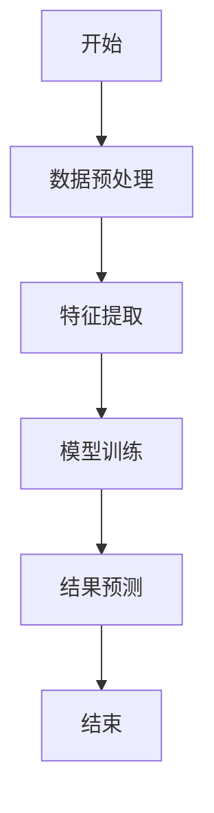
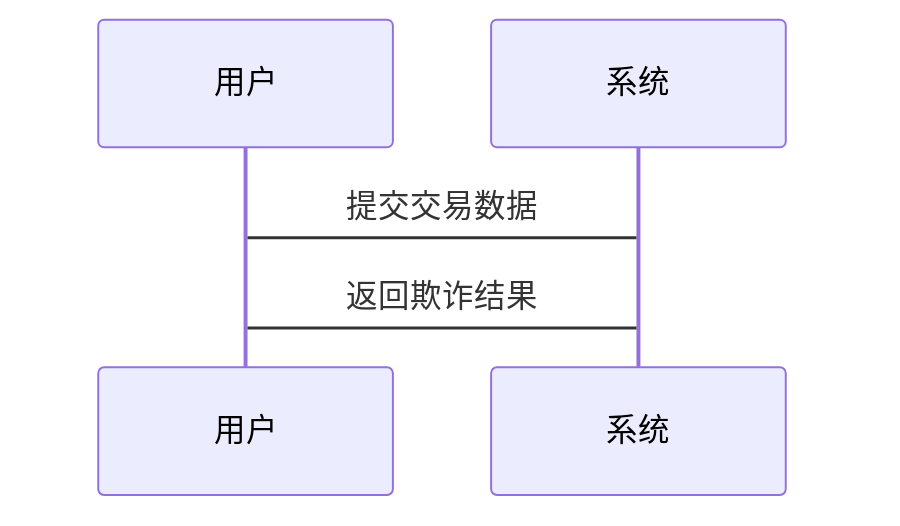

                 


# 知识图谱在金融欺诈检测中的应用

## 关键词：
知识图谱、金融欺诈检测、图嵌入、聚类算法、系统架构

## 摘要：
知识图谱作为一种强大的数据结构，能够有效表示实体及其关系，广泛应用于金融欺诈检测。本文系统地介绍了知识图谱的核心概念、构建方法及检测算法，结合实际案例，详细讲解了知识图谱在金融欺诈检测中的应用，包括系统架构设计和项目实战。最后，总结了最佳实践和未来发展方向。

---

# 第1章：知识图谱与金融欺诈检测的背景

## 1.1 知识图谱的定义与特点
### 1.1.1 知识图谱的定义
知识图谱是一种以图结构表示知识的数据库，由节点（实体）和边（关系）组成，支持复杂的语义查询。

### 1.1.2 知识图谱的核心特点
- **语义丰富性**：能够表达实体之间的复杂关系。
- **可扩展性**：支持动态扩展和更新。
- **结构化数据**：便于计算机理解和推理。

### 1.1.3 知识图谱与传统数据库的区别
| 特性          | 传统数据库       | 知识图谱       |
|---------------|------------------|----------------|
| 数据结构      | 行为表结构       | 图结构         |
| 查询方式      | SQL              | SPARQL         |
| 表达能力      | 简单关系         | 复杂关系       |

## 1.2 金融欺诈检测的背景与挑战
### 1.2.1 金融欺诈的定义与类型
金融欺诈是指故意欺骗金融机构或客户的行为，常见类型包括信用卡欺诈、洗钱等。

### 1.2.2 传统金融欺诈检测的局限性
- **规则依赖**：难以应对新型欺诈手段。
- **数据孤岛**：各部门数据分散，难以关联分析。
- **计算能力**：处理大规模数据时效率低下。

### 1.2.3 知识图谱在金融欺诈检测中的优势
- **关联分析**：发现隐藏的关联关系。
- **实时检测**：快速识别异常行为。
- **知识推理**：基于语义进行智能决策。

## 1.3 知识图谱与金融欺诈检测的结合
### 1.3.1 知识图谱在金融欺诈检测中的应用场景
- **交易监控**：识别异常交易模式。
- **身份验证**：防止身份盗用。
- **风险管理**：评估客户信用风险。

### 1.3.2 知识图谱的优势与局限性
- **优势**：语义能力强，关联性高。
- **局限性**：构建和维护成本较高。

### 1.3.3 知识图谱在金融欺诈检测中的未来发展方向
- **智能化**：结合机器学习提升检测精度。
- **实时化**：优化查询效率，支持实时检测。

## 1.4 案例分析：知识图谱在金融欺诈中的实际应用
### 1.4.1 某银行的欺诈检测案例
通过构建知识图谱，识别出一个跨国洗钱网络，涉及多个账户和交易。

### 1.4.2 知识图谱在案例中的具体应用
- **关联分析**：发现多个账户之间的联系。
- **知识推理**：识别异常交易模式。

### 1.4.3 案例总结与启示
知识图谱能够有效发现隐藏的欺诈模式，提升检测效率。

---

# 第2章：知识图谱的核心概念与原理

## 2.1 知识图谱的核心概念
### 2.1.1 实体与属性
实体是知识图谱的基本单元，属性描述实体的特征。

### 2.1.2 关系与边
关系表示实体之间的关联，边是关系的可视化形式。

## 2.2 知识图谱的构建方法
### 2.2.1 数据抽取与清洗
从结构化和非结构化数据中提取信息，并去除噪声。

### 2.2.2 实体识别与链接
通过NLP技术识别实体，并建立实体间的映射关系。

### 2.2.3 关系抽取与构建
使用自然语言处理技术识别文本中的关系，并构建关系网络。

## 2.3 知识图谱的存储与查询
### 2.3.1 知识图谱的存储方式
常用RDF格式存储，支持多种存储引擎，如Neo4j。

### 2.3.2 知识图谱的查询语言
使用SPARQL查询语言，支持复杂语义查询。

### 2.3.3 知识图谱的查询优化
通过索引和缓存技术优化查询效率。

## 2.4 知识图谱的可视化
### 2.4.1 知识图谱的可视化工具
常用工具包括Gephi和Cytoscape。

### 2.4.2 知识图谱的可视化方法
- **节点布局**：优化节点排列，减少边交叉。
- **边样式**：使用不同颜色区分不同关系类型。

### 2.4.3 知识图谱的可视化应用
通过可视化工具，帮助用户直观理解知识图谱结构。

---

# 第3章：金融欺诈检测的核心算法原理

## 3.1 常用算法介绍
### 3.1.1 聚类算法
- **K-means**：将交易数据聚类，识别异常簇。
- **DBSCAN**：基于密度的聚类算法，适用于高维数据。

### 3.1.2 分类算法
- **随机森林**：通过特征提取进行分类。
- **XGBoost**：梯度提升树，适合高精度预测。

### 3.1.3 图嵌入算法
- **Word2Vec**：通过上下文嵌入表示节点。
- **Node2Vec**：结合节点和路径信息的嵌入方法。

## 3.2 算法流程图


## 3.3 算法实现
### 3.3.1 聚类算法实现
```python
from sklearn.cluster import DBSCAN
import numpy as np

# 示例数据
X = np.array([[1, 2], [2, 3], [3, 4], [4, 5], [5, 6], [10, 11], [11, 12], [12, 13]])

# 聚类模型
db = DBSCAN(eps=3, min_samples=2)
db.fit(X)
labels = db.labels_
print(labels)
```

### 3.3.2 图嵌入算法实现
```python
from sklearn.feature_extraction.text import TfidfVectorizer
from sklearn.decomposition import LatentDirichletAllocation

# 示例文本数据
texts = ["Detecting fraud in financial transactions", "Identifying suspicious patterns"]

# TF-IDF向量化
vectorizer = TfidfVectorizer()
tfidf = vectorizer.fit_transform(texts)

# LDA主题建模
lda = LatentDirichletAllocation(n_components=2)
lda.fit(tfidf)
```

## 3.4 算法数学模型
### 3.4.1 K-means算法
目标函数：
$$ J = \sum_{i=1}^{k} \sum_{x_i \in S_i} (x_i - c_i)^2 $$
其中，$c_i$为第i个簇的中心，$x_i$为簇中的点。

### 3.4.2 Word2Vec算法
目标函数：
$$ \text{损失函数} = -\sum_{j} \log P(w_j|w_{j-1}) + \text{参数正则化项} $$

---

# 第4章：知识图谱与金融欺诈检测的系统架构设计

## 4.1 系统分析
### 4.1.1 需求分析
- **输入**：金融交易数据。
- **输出**：欺诈检测结果。

### 4.1.2 系统功能设计
- **数据处理模块**：清洗和转换数据。
- **知识图谱构建模块**：提取实体和关系。
- **欺诈检测模块**：应用算法进行检测。

## 4.2 系统架构设计
### 4.2.1 分层架构


## 4.3 接口设计
- **RESTful API**：提供数据查询接口。
- **GraphQL**：支持复杂查询。

## 4.4 交互设计


---

# 第5章：知识图谱金融欺诈检测系统项目实战

## 5.1 环境搭建
### 5.1.1 安装依赖
```bash
pip install neo4j sklearn networkx
```

## 5.2 核心代码实现
### 5.2.1 知识图谱构建
```python
import neo4j
from neo4j.exceptions import ServiceUnavailable

# 连接到Neo4j数据库
driver = neo4j.Driver("bolt://localhost:7687", auth=("neo4j", "password"))
```

### 5.2.2 数据处理
```python
import pandas as pd

# 读取数据
df = pd.read_csv("transactions.csv")
```

### 5.2.3 特征提取
```python
from sklearn.decomposition import PCA

# 提取特征
features = PCA(n_components=2).fit_transform(df)
```

### 5.2.4 模型训练
```python
from sklearn.ensemble import RandomForestClassifier

# 训练模型
model = RandomForestClassifier()
model.fit(features, df['is_fraud'])
```

## 5.3 案例分析
### 5.3.1 数据准备
```python
transactions = [
    {'amount': 100, 'is_fraud': 0},
    {'amount': 500, 'is_fraud': 1},
    # 更多数据...
]
```

### 5.3.2 模型预测
```python
# 预测结果
predicted = model.predict(features)
print(predicted)
```

---

# 第6章：知识图谱在金融欺诈检测中的最佳实践

## 6.1 小结
知识图谱通过关联分析和语义推理，显著提升了金融欺诈检测的效率和精度。

## 6.2 注意事项
- 数据隐私：确保数据安全和合规。
- 模型泛化：防止过拟合，提升模型鲁棒性。

## 6.3 拓展阅读
- 推荐书籍：《知识图谱实战》。
- 相关论文：《Graph Neural Networks for Fraud Detection》。

---

# 第7章：结论与展望

知识图谱在金融欺诈检测中的应用前景广阔，未来将结合图神经网络和实时计算技术，进一步提升检测效率和准确性。

---

# 总结
本文系统介绍了知识图谱在金融欺诈检测中的应用，从理论到实践，全面探讨了其优势和挑战，为相关研究和实践提供了有价值的参考。

