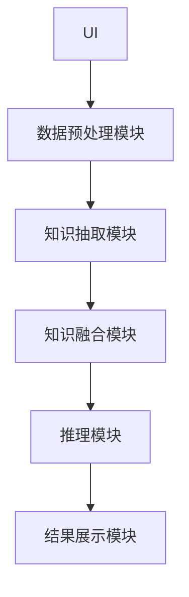

                 


# 知识图谱在金融知识推理中的应用

> 关键词：知识图谱、金融推理、知识建模、图嵌入、规则推理、金融实体、关系抽取

> 摘要：本文详细探讨了知识图谱在金融知识推理中的应用，从背景介绍到核心概念，从算法原理到系统架构，从项目实战到总结展望，全面解析了知识图谱如何助力金融领域的知识推理。文章通过丰富的案例和详细的代码示例，深入浅出地展示了知识图谱在金融数据整合、知识表示和智能推理中的重要作用。

---

# 第一部分: 知识图谱与金融知识推理的背景介绍

## 第1章: 知识图谱的基本概念与应用

### 1.1 知识图谱的定义与特点

知识图谱是一种以图结构形式表示知识的语义网络，节点表示实体或概念，边表示实体之间的关系。其特点包括：

- **语义性**：知识图谱不仅存储数据，还描述数据之间的语义关系。
- **结构化**：通过图结构将知识组织起来，便于计算机理解和推理。
- **动态性**：支持实时更新和扩展，适应金融市场的变化。

### 1.2 金融知识推理的定义与挑战

金融知识推理是指在金融领域中，基于已有知识和数据，通过推理技术推导出新的知识或结论。其核心挑战包括：

- **数据异构性**：金融数据来源多样，格式和语义差异大。
- **知识复杂性**：金融市场涉及众多实体和复杂的关系。
- **实时性要求**：金融市场的动态变化要求推理系统具有实时性。

### 1.3 知识图谱与金融知识推理的关联

知识图谱为金融知识推理提供了语义表示和知识整合的基础，能够有效解决金融数据异构性和复杂性问题，为推理提供结构化的知识支持。

---

## 第2章: 知识图谱在金融领域的关联性

### 2.1 知识图谱与金融数据的关系

金融数据包括股票价格、财务报表、市场新闻等，知识图谱通过抽取和整合这些数据，构建金融领域的知识网络。

- **数据整合**：知识图谱将分散的金融数据整合为统一的知识网络。
- **语义关联**：通过图结构描述数据之间的语义关系。

### 2.2 金融知识推理的背景与问题描述

金融知识推理的背景是金融市场日益复杂，传统基于统计的方法难以应对复杂的知识需求。知识图谱的引入为金融推理提供了结构化的知识基础。

### 2.3 知识图谱在金融知识推理中的作用

- **知识表示**：提供结构化的知识表示，便于计算机理解和推理。
- **语义关联**：通过图结构揭示数据之间的语义关联。
- **推理支持**：基于知识图谱进行路径分析、相似性计算等推理任务。

---

## 第3章: 知识图谱的核心概念与联系

### 3.1 知识图谱的结构与组成

知识图谱由实体、关系和属性三部分组成：

- **实体**：表示独立的个体或概念。
- **关系**：表示实体之间的关联。
- **属性**：描述实体的特征或性质。

### 3.2 知识图谱的ER实体关系图

```mermaid
er
    entity(金融实体) {
        id: string
        name: string
        type: string
    }
    relation(金融关系) {
        id: string
        name: string
        direction: string
    }
    attribute(金融属性) {
        id: string
        name: string
        value: string
    }
    entity -[拥有]-> attribute
    entity -[具有]-> relation
```

### 3.3 知识图谱的领域模型

```mermaid
classDiagram
    class 金融实体 {
        id: string
        name: string
        type: string
    }
    class 金融关系 {
        id: string
        name: string
        direction: string
    }
    class 金融属性 {
        id: string
        name: string
        value: string
    }
    entity -[拥有]-> attribute
    entity -[具有]-> relation
```

---

## 第4章: 知识图谱的构建与推理算法

### 4.1 知识图谱的构建流程

1. **数据获取**：从多种数据源获取金融数据。
2. **数据清洗**：去除噪声数据，确保数据质量。
3. **知识抽取**：从文本中抽取实体、关系和属性。
4. **知识融合**：将多个数据源的知识整合到统一的知识图谱中。
5. **知识存储**：将知识图谱存储在图数据库中。

### 4.2 知识图谱的推理算法

知识图谱的推理算法主要包括基于规则的推理和基于图嵌入的推理。

- **基于规则的推理**：通过预定义的规则进行推理。
- **基于图嵌入的推理**：通过图嵌入技术将图结构转化为向量，利用向量进行推理。

### 4.3 图嵌入算法的数学模型

图嵌入算法的核心是将图中的节点表示为低维向量。常用的算法包括TransE、TransH等。

**TransE模型**：
$$ E_{r}(h, t) = ||h + r - t||_p $$

**TransH模型**：
$$ E_{r}(h, t) = ||h_r + r - t_r||_p $$

---

## 第5章: 知识图谱在金融领域的应用

### 5.1 金融实体识别

通过自然语言处理技术，从金融文本中识别出实体，例如公司名称、股票代码等。

### 5.2 金融关系抽取

通过模式匹配或机器学习方法，从文本中抽取实体之间的关系，例如“公司A收购公司B”。

### 5.3 金融知识推理

基于知识图谱进行推理，例如预测股票价格走势、分析公司风险等。

---

## 第6章: 知识图谱系统的架构设计

### 6.1 系统功能设计

- **数据预处理模块**：负责数据清洗和转换。
- **知识抽取模块**：负责从文本中抽取实体、关系和属性。
- **知识融合模块**：负责将多个数据源的知识整合到统一的知识图谱中。
- **推理模块**：负责基于知识图谱进行推理任务。

### 6.2 系统架构设计



---

## 第7章: 项目实战

### 7.1 项目环境安装

安装必要的库，例如Python的networkx、numpy等。

### 7.2 核心代码实现

```python
import networkx as nx

# 创建知识图谱
G = nx.Graph()

# 添加节点
G.add_nodes_from(["A", "B", "C"])

# 添加边
G.add_edges_from([("A", "B"), ("B", "C")])

# 可视化
nx.draw(G, node_size=1500, font_size=10, edge_color="red")
plt.show()
```

### 7.3 案例分析与结果解读

通过具体案例展示知识图谱在金融知识推理中的应用，例如预测公司股价走势。

---

## 第8章: 总结与展望

### 8.1 总结

知识图谱为金融知识推理提供了结构化的知识表示和推理基础，能够有效解决金融数据异构性和复杂性问题。

### 8.2 展望

未来，知识图谱在金融领域的应用将更加广泛，包括金融风险评估、智能投顾等领域。

### 8.3 最佳实践 Tips

- 在构建知识图谱时，要注意数据质量和多样性。
- 在进行推理时，可以结合规则推理和图嵌入推理。

---

通过以上内容，我们详细探讨了知识图谱在金融知识推理中的应用，从理论到实践，为读者提供了全面的指导和参考。

