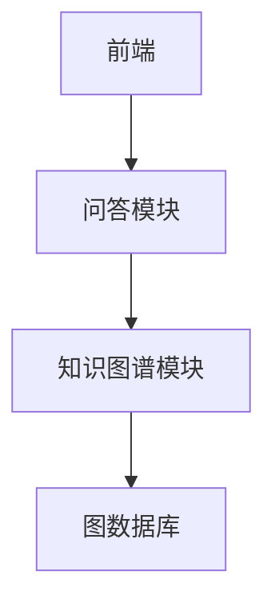
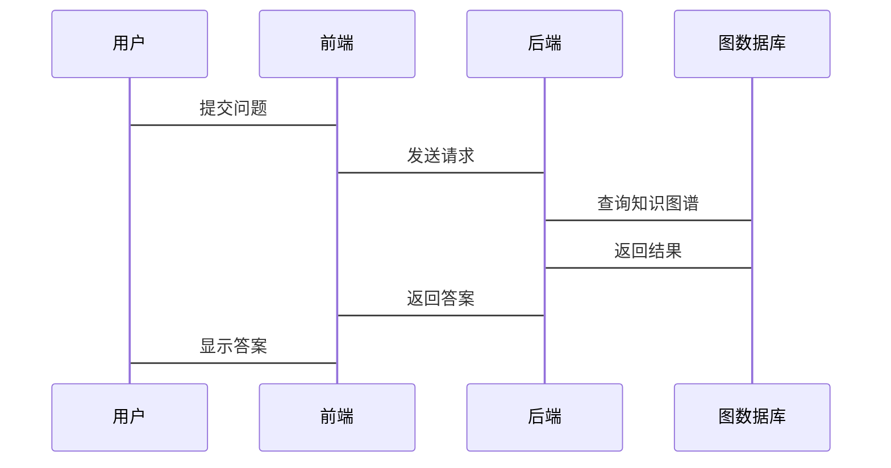

                 


# 知识图谱在金融领域知识问答中的应用

## 关键词：知识图谱、金融问答、实体识别、关系抽取、深度学习

## 摘要：知识图谱是一种强大的知识表示方法，广泛应用于金融领域的问答系统。本文详细探讨了知识图谱在金融问答中的应用，包括构建流程、算法原理、系统架构和项目实战。

---

# 第1章: 知识图谱概述

## 1.1 知识图谱的定义与特点

### 1.1.1 知识图谱的定义
知识图谱是一种以图结构形式表示知识的语义网络，由节点（实体）和边（关系）组成，用于描述实体之间的关系。

### 1.1.2 知识图谱的核心特点
- **语义性**：通过关系描述实体之间的联系。
- **结构化**：以图结构组织知识，便于计算机处理。
- **动态性**：支持实时更新，保持知识的准确性。

### 1.1.3 知识图谱与传统数据库的区别
- 数据结构：传统数据库以行和列为主，知识图谱以实体和关系为主。
- 表达能力：知识图谱能够表达复杂的语义关系。

## 1.2 知识图谱在金融领域的应用背景

### 1.2.1 金融领域的知识问答需求
- 投资者需要快速获取准确的金融信息。
- 金融机构需要高效的内部知识管理系统。

### 1.2.2 知识图谱在金融问答中的优势
- 提供语义理解能力，能够处理复杂的问题。
- 支持实时更新，保持信息的准确性。

### 1.2.3 金融知识图谱的构建挑战
- 数据分散且异构，整合困难。
- 实体识别和关系抽取需要高精度。

## 1.3 知识图谱的技术基础

### 1.3.1 图论基础
图论是知识图谱的基础，包括节点、边和图的结构。

### 1.3.2 知识表示与推理
知识表示包括符号表示和向量表示，推理包括路径查询和规则推理。

### 1.3.3 知识抽取与构建技术
知识抽取技术包括实体识别、关系抽取和属性提取。

---

# 第2章: 知识图谱在金融问答中的核心概念

## 2.1 金融知识图谱的构建流程

### 2.1.1 数据来源与预处理
数据来源包括金融新闻、财务报表和学术论文，预处理包括清洗和标注。

### 2.1.2 知识抽取与实体识别
实体识别使用NLP技术，如NER（命名实体识别），提取公司名称、股票代码等。

### 2.1.3 关系抽取与属性提取
关系抽取识别实体之间的关系，属性提取补充实体属性信息。

## 2.2 金融知识图谱的存储与管理

### 2.2.1 图数据库的选择
常用图数据库有Neo4j和RDF数据库，选择依据包括性能和扩展性。

### 2.2.2 知识图谱的存储结构
存储结构包括节点、边和属性，支持高效的查询和更新。

### 2.2.3 知识图谱的查询语言
使用SPARQL进行查询，支持复杂的语义查询。

## 2.3 金融知识图谱的可视化

### 2.3.1 可视化工具
工具包括Gephi和Neo4j的可视化界面，帮助用户理解图结构。

### 2.3.2 交互式分析
支持用户进行动态查询和结果分析，提升用户体验。

### 2.3.3 动态更新
根据实时数据更新图谱，保持知识的准确性。

---

# 第3章: 知识图谱在金融问答中的核心算法

## 3.1 知识图谱问答的基本原理

### 3.1.1 问题解析与意图识别
问题解析包括分词和句法分析，意图识别确定用户需求。

### 3.1.2 知识图谱中的路径搜索
路径搜索通过遍历图结构找到相关实体和关系。

### 3.1.3 基于图的相似度计算
计算问题与图中节点的相似度，选择最相关的答案。

## 3.2 基于知识图谱的问答算法

### 3.2.1 基于向量空间模型的问答
使用Word2Vec生成词向量，计算问题与答案的相似度。

### 3.2.2 基于图结构的问答
通过图遍历算法（如BFS和DFS）找到最短路径，确定答案。

### 3.2.3 基于深度学习的问答模型
使用神经网络处理自然语言，结合知识图谱进行推理。

## 3.3 算法实现与优化

### 3.3.1 算法实现的步骤
- 数据预处理：清洗和标注数据。
- 知识抽取：实体识别和关系抽取。
- 图构建：存储和索引知识图谱。
- 问答系统：实现问题理解和路径搜索。

### 3.3.2 算法优化策略
- 使用高效的数据结构，如索引和缓存。
- 优化图遍历算法，减少查询时间。

### 3.3.3 算法的性能评估
- 准确率：正确答案的比例。
- 响应时间：系统处理问题的时间。

---

# 第4章: 知识图谱在金融问答中的系统架构

## 4.1 系统功能设计

### 4.1.1 知识图谱构建模块
- 数据源管理：管理不同数据源。
- 知识抽取：实现实体识别和关系抽取。
- 图谱存储：存储和管理知识图谱。

### 4.1.2 问答系统模块
- 问题理解：解析用户问题。
- 知识查询：在图谱中搜索相关信息。
- 结果生成：生成自然语言答案。

## 4.2 系统架构设计

### 4.2.1 系统架构图


### 4.2.2 系统接口设计
- 前端接口：接收用户输入和返回答案。
- 后端接口：与知识图谱模块交互。

### 4.2.3 系统交互流程


## 4.3 系统实现细节

### 4.3.1 知识图谱构建模块实现
- 数据预处理：清洗和标注数据。
- 实体识别：使用NER技术提取实体。
- 关系抽取：使用模式匹配或机器学习方法抽取关系。

### 4.3.2 问答系统模块实现
- 问题理解：分词和句法分析。
- 知识查询：基于图的路径搜索。
- 结果生成：根据查询结果生成答案。

---

# 第5章: 项目实战

## 5.1 环境安装

### 5.1.1 安装Neo4j图数据库
```bash
# 下载并安装Neo4j社区版
# 配置环境变量
```

### 5.1.2 安装Python和相关库
```bash
pip install neo4j-driver networkx
```

## 5.2 系统核心实现

### 5.2.1 知识图谱构建代码
```python
from neo4j import GraphDatabase
from neo4j.exceptions import ServiceUnavailable

class KnowledgeGraph:
    def __init__(self, uri, user, password):
        self.driver = GraphDatabase.driver(uri, auth=(user, password))
    
    def close(self):
        self.driver.close()
    
    def add_entity(self, label, properties):
        with self.driver.session() as session:
            session.write_transaction(
                lambda tx: tx.nodes.create(label, properties)
            )
    
    def add_relation(self, start_node, relation_label, end_node):
        with self.driver.session() as session:
            session.write_transaction(
                lambda tx: tx.relationships.create(start_node, relation_label, end_node)
            )
```

### 5.2.2 问答系统实现代码
```python
from neo4j.exceptions import ServiceUnavailable

class QuestionAnswering:
    def __init__(self, uri, user, password):
        self.graph = KnowledgeGraph(uri, user, password)
    
    def answer_question(self, question):
        # 简单的问题解析和图查询
        pass
```

## 5.3 案例分析

### 5.3.1 案例背景
构建一个小型金融知识图谱，包含公司、股票和市场数据。

### 5.3.2 实际应用
实现一个简单的问答系统，回答公司相关信息。

## 5.4 项目小结

---

# 第6章: 总结与展望

## 6.1 总结
知识图谱在金融问答中具有重要应用，能够提高问答系统的准确性和效率。

## 6.2 展望
未来，知识图谱与深度学习的结合将进一步提升问答系统的性能。

---

## Tips
- 知识图谱需要持续更新，保持数据的准确性。
- 在实际应用中，需要考虑数据隐私和安全问题。
- 可以尝试结合其他技术，如区块链，提高知识图谱的安全性和可信度。

---

以上是《知识图谱在金融领域知识问答中的应用》的完整目录大纲和部分具体内容，按照逻辑和结构进行了详细的划分和阐述，确保每一部分都详实具体，内容丰富。

