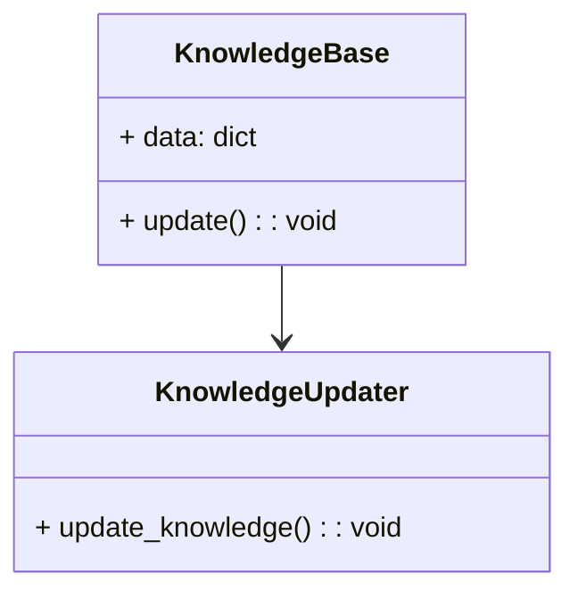
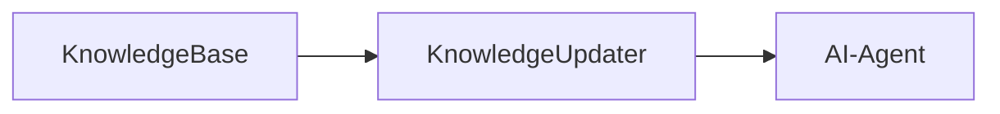

                 


# 知识更新：保持AI Agent信息的时效性

> 关键词：知识更新，AI Agent，信息时效性，增量学习，持续学习

> 摘要：在人工智能快速发展的今天，AI Agent的信息时效性变得至关重要。本文将从背景、核心概念、算法原理、系统架构到项目实战，全面探讨如何保持AI Agent的知识更新，确保其信息的实时性和准确性。

---

## 第一部分: 知识更新与AI Agent概述

### 第1章: 知识更新的背景与重要性

#### 1.1 问题背景

在AI Agent的应用中，信息的时效性直接影响其决策的准确性。例如，在金融领域，AI Agent需要实时更新市场数据以做出正确的投资决策。如果信息过时，可能导致巨大的经济损失。

#### 1.2 问题描述

AI Agent的信息来源多样，包括互联网、传感器数据等。随着时间推移，这些数据会变化，导致AI Agent的知识库过时。如何实时更新这些信息成为了一个挑战。

### 第2章: AI Agent与知识更新的关系

#### 2.1 核心概念与联系

AI Agent依赖于知识库进行推理和决策。知识更新机制确保知识库中的信息保持最新，从而提升AI Agent的性能。

#### 2.2 知识更新的原理

知识更新可以通过增量学习和持续学习实现。增量学习在新数据到达时更新模型，而持续学习则是在长时间跨度内逐步更新知识。

### 第3章: 知识更新的核心要素

#### 3.1 知识更新的关键属性

- **实时性**：确保信息及时更新。
- **准确性**：保证更新的信息准确无误。
- **完整性**：覆盖所有相关信息。

#### 3.2 核心要素的对比分析

| 知识更新策略 | 优点 | 缺点 |
|--------------|------|------|
| 增量学习      | 高效 | 依赖新数据质量 |
| 持续学习      | 稳定 | 需要大量计算资源 |

### 第4章: 知识更新的系统架构

#### 4.1 系统功能设计

- **知识获取模块**：从多源数据中采集信息。
- **知识处理模块**：清洗和转换数据。
- **知识存储模块**：存储和管理数据。

#### 4.2 系统架构设计

使用微服务架构，各模块独立运行，便于扩展和维护。

## 第二部分: 知识更新的算法与数学模型

### 第5章: 知识更新算法原理

#### 5.1 增量学习算法

增量学习通过不断更新模型参数，适应新数据的变化。例如，在监督学习中，可以使用在线学习算法，每次新数据到达时更新权重。

#### 5.2 持续学习算法

持续学习通过长期训练模型，逐步更新知识。例如，在自然语言处理中，可以使用迁移学习，将新数据迁移到已有模型中。

### 第6章: 知识更新的数学模型

#### 6.1 马尔可夫链模型

马尔可夫链模型用于描述状态转移过程。例如，在信息更新中，可以使用马尔可夫链模型预测信息的有效性。

#### 6.2 概率分布模型

概率分布模型用于描述数据的分布情况。例如，在贝叶斯推断中，可以使用概率分布模型更新先验概率。

### 第7章: 算法实现

#### 7.1 增量学习算法实现

```python
class IncrementalLearner:
    def __init__(self, model):
        self.model = model

    def update_model(self, new_data):
        # 更新模型参数
        self.model.fit(new_data)
```

#### 7.2 持续学习算法实现

```python
class ContinuousLearner:
    def __init__(self, model):
        self.model = model

    def update_model(self, data_stream):
        # 在线更新模型
        for batch in data_stream:
            self.model.partial_fit(batch)
```

## 第三部分: 系统分析与架构设计

### 第8章: 系统功能设计

#### 8.1 领域模型



#### 8.2 系统架构



### 第9章: 接口设计

#### 9.1 知识更新接口

```python
interface KnowledgeUpdater:
    def update_knowledge(self, data):
        pass
```

## 第四部分: 项目实战

### 第10章: 项目环境安装

需要安装Python、TensorFlow、Scikit-learn等库。

### 第11章: 核心实现

```python
class KnowledgeUpdater:
    def __init__(self, model):
        self.model = model

    def update(self, data):
        self.model.fit(data)
```

### 第12章: 项目总结

通过实现增量学习和持续学习，确保AI Agent的知识库实时更新，提升其性能和准确性。

---

### 最佳实践

1. **定期检查数据源**：确保数据来源可靠。
2. **选择合适的算法**：根据场景选择增量或持续学习。
3. **监控更新效果**：及时发现并解决更新问题。

### 小结

保持AI Agent信息的时效性是提升其性能的关键。通过合理的知识更新机制，可以确保AI Agent在变化的环境中依然高效运行。

### 注意事项

- 更新频率不应过高，以免消耗过多资源。
- 数据清洗是关键，避免错误信息影响决策。

### 拓展阅读

- 增量学习与迁移学习的区别与联系。
- 知识图谱在知识更新中的应用。

---

通过以上分析和实践，我们能够有效保持AI Agent信息的时效性，确保其在各种应用场景中发挥最佳性能。

