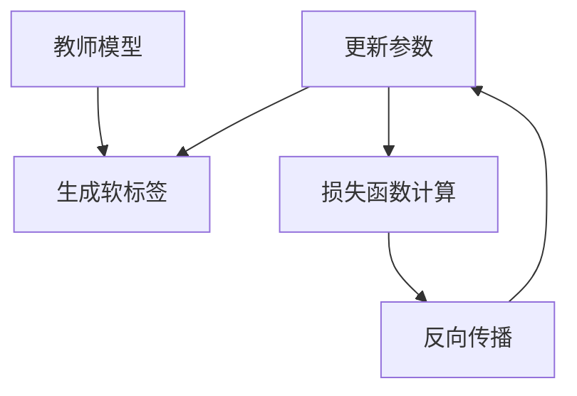
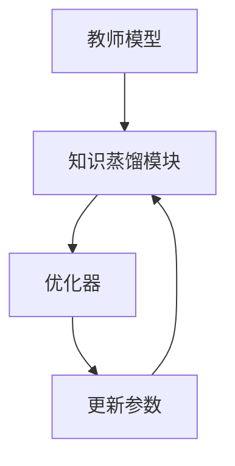

                 


# 知识蒸馏在AI Agent轻量化中的应用

> 关键词：知识蒸馏，AI Agent，轻量化，机器学习，深度学习

> 摘要：本文深入探讨了知识蒸馏技术在AI Agent轻量化中的应用，分析了知识蒸馏的核心原理、算法实现、系统架构设计，并通过实际案例展示了其在AI Agent优化中的优势和效果。

---

## 第一部分：知识蒸馏与AI Agent轻量化背景

### 第1章：知识蒸馏的起源与AI Agent的发展

#### 1.1 知识蒸馏的起源
知识蒸馏（Knowledge Distillation）是一种将大型模型的知识迁移到更小、更高效模型的技术。它的核心思想是通过教师模型（Teacher）生成软标签（soft labels），指导学生模型（Student）进行学习。知识蒸馏起源于20世纪90年代，但真正引起广泛关注是在深度学习兴起之后。

- **1.1.1 知识蒸馏的定义与核心概念**
  知识蒸馏通过教师模型生成的概率分布（软标签）来指导学生模型学习，使学生模型能够捕捉到教师模型的决策边界和特征表示。这种方法不仅能够提升学生模型的性能，还能显著减少模型的大小和计算成本。

- **1.1.2 知识蒸馏的历史发展**
  知识蒸馏技术最早由Hinton等人提出，主要用于将大型神经网络的知识迁移到小型网络中。近年来，随着深度学习模型的不断增大，知识蒸馏在图像分类、自然语言处理等领域得到了广泛应用。

- **1.1.3 知识蒸馏在AI领域的应用现状**
  目前，知识蒸馏已经被成功应用于模型压缩、边缘计算、实时推理等多个场景。特别是在AI Agent领域，知识蒸馏成为实现模型轻量化的重要手段。

#### 1.2 AI Agent的轻量化需求
AI Agent（人工智能代理）是一种能够感知环境、执行任务并做出决策的智能系统。随着AI技术的快速发展，AI Agent的应用场景越来越广泛，但其性能和资源消耗的需求也在不断提高。

- **1.2.1 AI Agent的基本概念与分类**
  AI Agent可以分为简单反射型、基于模型的反应型、基于效用的、基于知识的等多种类型。其中，基于知识的AI Agent通常依赖于大型模型，这使得其在资源受限的环境中难以部署。

- **1.2.2 轻量化AI Agent的意义与挑战**
  轻量化AI Agent的目标是减少模型的计算成本和存储需求，同时保持或提升其性能。然而，如何在不显著降低性能的前提下实现模型压缩是当前面临的主要挑战。

- **1.2.3 知识蒸馏在AI Agent轻量化中的作用**
  知识蒸馏通过将大型模型的知识迁移到小型模型中，为AI Agent的轻量化提供了有效的解决方案。它不仅能够降低计算成本，还能提高模型的推理速度和响应效率。

---

### 第2章：知识蒸馏与AI Agent的结合

#### 2.1 知识蒸馏的基本原理
知识蒸馏的核心思想是通过教师模型生成的概率分布来指导学生模型学习。与传统的硬标签（one-hot标签）不同，知识蒸馏使用软标签（soft labels）来传递更丰富的信息。

- **2.1.1 知识蒸馏的核心思想**
  知识蒸馏的核心思想是通过教师模型生成的概率分布来指导学生模型学习。与传统的硬标签（one-hot标签）不同，知识蒸馏使用软标签（soft labels）来传递更丰富的信息。

- **2.1.2 知识蒸馏的关键步骤**
  1. **教师模型训练**：首先训练一个高性能的大型模型（教师模型）。
  2. **软标签生成**：教师模型生成概率分布（软标签）。
  3. **学生模型训练**：学生模型通过最小化与教师模型的概率分布差异来学习知识。

- **2.1.3 知识蒸馏的优缺点分析**
  优点：
  - 能够显著减少模型的大小和计算成本。
  - 提高模型的泛化能力和鲁棒性。
  
  缺点：
  - 需要教师模型和学生模型之间的协调，增加了训练的复杂性。
  - 在某些情况下，知识蒸馏的效果可能不如直接训练小型模型。

#### 2.2 AI Agent轻量化中的知识蒸馏应用
在AI Agent轻量化中，知识蒸馏主要用于将大型模型的知识迁移到小型模型中，从而实现模型的轻量化。

- **2.2.1 知识蒸馏在AI Agent中的目标**
  知识蒸馏的目标是将教师模型的知识迁移到学生模型中，使学生模型能够在保持高性能的同时显著降低计算成本和存储需求。

- **2.2.2 知识蒸馏与AI Agent性能优化的关系**
  知识蒸馏通过压缩模型的大小和减少计算成本，直接提升了AI Agent的性能和部署能力。

- **2.2.3 知识蒸馏在AI Agent部署中的优势**
  知识蒸馏在AI Agent部署中的优势主要体现在以下几个方面：
  - 减少计算资源消耗。
  - 提高模型的推理速度。
  - 降低存储需求。

---

### 第3章：知识蒸馏的核心概念与联系

#### 3.1 知识蒸馏的核心原理
知识蒸馏的核心原理是通过教师模型生成的概率分布来指导学生模型学习。

- **3.1.1 蒸馏损失函数的数学模型**
  知识蒸馏的核心是通过最小化教师模型和学生模型之间的KL散度来实现知识传递。数学模型如下：
  $$ L_{distill} = \sum_{i=1}^{n} KL(P_i || Q_i) $$
  其中，\(P_i\) 是教师模型在第\(i\)个样本上的概率分布，\(Q_i\) 是学生模型在第\(i\)个样本上的概率分布。

- **3.1.2 知识蒸馏的直觉对比**
  知识蒸馏通过软标签传递信息，与传统的硬标签相比，能够传递更丰富的信息。例如，在图像分类任务中，教师模型生成的概率分布可以告诉学生模型每个类别的重要性，从而指导学生模型更好地学习。

- **3.1.3 知识蒸馏的对抗性训练**
  知识蒸馏可以通过对抗性训练来进一步优化学生模型的性能。对抗性训练通过引入对抗网络，进一步提升学生模型的鲁棒性和泛化能力。

#### 3.2 知识蒸馏的算法流程图


#### 3.3 知识蒸馏的核心概念对比表
| 对比项 | 教师模型 | 学生模型 | 蒸馏损失 |
|-------|---------|---------|---------|
| 输入 | 大型模型 | 轻量级模型 | 软标签 |
| 输出 | 高质量特征 | 低质量特征 | 损失值 |
| 作用 | 提供知识 | 学习知识 | 桥接知识传递 |

---

## 第4章：知识蒸馏的算法实现

### 4.1 算法原理
知识蒸馏的核心算法是通过最小化教师模型和学生模型之间的KL散度来实现知识传递。

- **4.1.1 KL散度公式**
  KL散度的公式为：
  $$ KL(P || Q) = \sum_{i=1}^{n} P_i \log \frac{P_i}{Q_i} $$
  其中，\(P\) 是教师模型的概率分布，\(Q\) 是学生模型的概率分布。

- **4.1.2 算法实现步骤**
  1. **教师模型训练**：训练一个高性能的教师模型。
  2. **软标签生成**：教师模型生成概率分布（软标签）。
  3. **学生模型训练**：学生模型通过最小化与教师模型的概率分布差异来学习知识。

### 4.2 算法流程图


### 4.3 Python代码实现
以下是一个简单的知识蒸馏算法实现示例：

```python
import torch
import torch.nn as nn
import torch.optim as optim

class TeacherModel(nn.Module):
    def __init__(self):
        super(TeacherModel, self).__init__()
        self.fc = nn.Linear(10, 5)

    def forward(self, x):
        return torch.softmax(x, dim=1)

class StudentModel(nn.Module):
    def __init__(self):
        super(StudentModel, self).__init__()
        self.fc = nn.Linear(10, 5)

    def forward(self, x):
        return torch.softmax(x, dim=1)

def distillation_loss(teacher_logits, student_logits, temperature=1.0):
    teacher_probs = torch.softmax(teacher_logits / temperature, dim=1)
    student_probs = torch.softmax(student_logits / temperature, dim=1)
    loss = torch.mean(torch.sum(-teacher_probs * torch.log(student_probs), dim=1))
    return loss

def train(student_model, teacher_model, optimizer, criterion, device, batch_size=32):
    student_model.train()
    teacher_model.eval()
    for batch_idx in range(num_batches):
        data = next(iter DataLoader(train_dataset, batch_size=batch_size))
        data = data.to(device)
        
        with torch.no_grad():
            teacher_logits = teacher_model(data)
        student_logits = student_model(data)
        
        loss = criterion(student_logits, data.labels) + distillation_loss(teacher_logits, student_logits)
        
        optimizer.zero_grad()
        loss.backward()
        optimizer.step()

if __name__ == "__main__":
    teacher_model = TeacherModel()
    student_model = StudentModel()
    optimizer = optim.Adam(student_model.parameters(), lr=0.001)
    criterion = nn.CrossEntropyLoss()
    device = torch.device("cuda" if torch.cuda.is_available() else "cpu")
    
    train(student_model, teacher_model, optimizer, criterion, device)
```

---

## 第5章：知识蒸馏在AI Agent轻量化中的应用

### 5.1 系统架构设计
AI Agent的系统架构设计需要考虑教师模型和学生模型的协作。

#### 5.1.1 系统功能设计
- 教师模型负责生成软标签。
- 学生模型负责学习软标签。
- 知识蒸馏模块负责计算蒸馏损失并优化学生模型。

#### 5.1.2 系统架构图


#### 5.1.3 接口设计
- 教师模型接口：提供软标签生成接口。
- 学生模型接口：提供概率分布计算接口。
- 知识蒸馏模块接口：提供损失计算和优化接口。

### 5.2 项目实战
以下是一个简单的知识蒸馏在AI Agent中的应用示例：

#### 5.2.1 环境配置
```python
import torch
import torch.nn as nn
import torch.optim as optim
```

#### 5.2.2 代码实现
```python
class AI-Agent:
    def __init__(self):
        self.teacher_model = TeacherModel()
        self.student_model = StudentModel()
        self.optimizer = optim.Adam(self.student_model.parameters(), lr=0.001)
        self.criterion = nn.CrossEntropyLoss()
        self.device = torch.device("cuda" if torch.cuda.is_available() else "cpu")
    
    def train(self):
        for batch_idx in range(num_batches):
            data = next(iter DataLoader(train_dataset, batch_size=batch_size))
            data = data.to(self.device)
            
            with torch.no_grad():
                teacher_logits = self.teacher_model(data)
            student_logits = self.student_model(data)
            
            loss = self.criterion(student_logits, data.labels) + distillation_loss(teacher_logits, student_logits)
            
            self.optimizer.zero_grad()
            loss.backward()
            self.optimizer.step()
```

#### 5.2.3 案例分析
通过上述代码，我们可以看到知识蒸馏在AI Agent中的应用。教师模型生成软标签，学生模型通过学习软标签来提升性能。同时，蒸馏损失的计算和优化过程确保了学生模型能够有效捕捉到教师模型的知识。

---

## 第6章：总结与展望

### 6.1 总结
知识蒸馏是一种有效的AI Agent轻量化技术，通过将大型模型的知识迁移到小型模型中，显著降低了模型的计算成本和存储需求，同时保持了高性能。

### 6.2 展望
未来，知识蒸馏在AI Agent中的应用将更加广泛。随着深度学习模型的不断增大，知识蒸馏技术将在边缘计算、实时推理等领域发挥更重要的作用。

---

### 6.3 最佳实践Tips
- 在知识蒸馏中，选择合适的温度参数（temperature）非常重要，过大的温度可能导致信息丢失，过小的温度可能导致学生模型过于依赖教师模型。
- 在实际应用中，可以结合其他模型压缩技术（如剪枝、量化）进一步提升模型的轻量化效果。

---

### 6.4 小结
知识蒸馏在AI Agent轻量化中的应用不仅能够降低模型的计算成本，还能提高模型的推理速度和响应效率。随着技术的不断发展，知识蒸馏将在更多场景中展现出其独特的优势。

---

### 6.5 注意事项
- 在实际应用中，需要确保教师模型和学生模型的兼容性。
- 知识蒸馏的效果依赖于教师模型的质量，因此在训练教师模型时需要特别注意数据质量和模型设计。

---

### 6.6 拓展阅读
- 建议读者进一步阅读Hinton等人提出的原始知识蒸馏论文。
- 关注最新的知识蒸馏技术，如自适应蒸馏、对抗蒸馏等。

---

通过以上内容，我们系统地探讨了知识蒸馏在AI Agent轻量化中的应用，从核心概念到算法实现，再到实际应用，全面分析了其在AI Agent优化中的优势和效果。希望本文能够为相关领域的研究者和实践者提供有价值的参考和启发。

