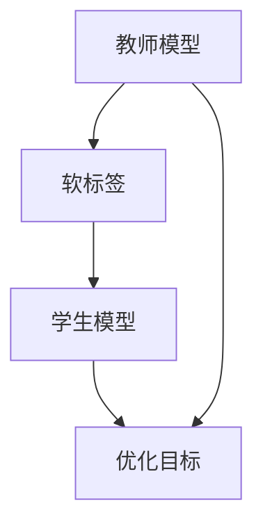
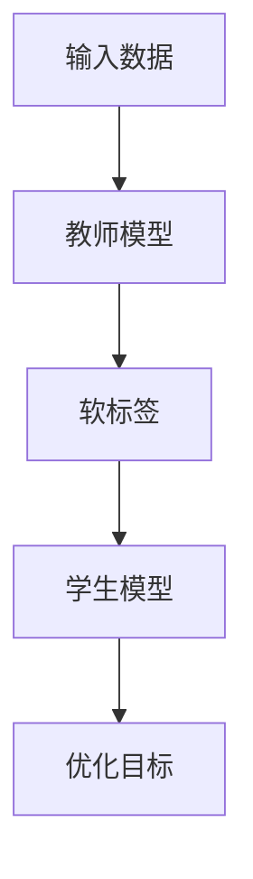

                 


# 知识蒸馏：压缩模型大小的同时保持性能

> 关键词：知识蒸馏、模型压缩、深度学习、神经网络、性能优化

> 摘要：知识蒸馏是一种有效的模型压缩技术，通过提取教师模型的知识，训练出更小但性能相近的学生模型。本文将从背景、原理、算法实现、系统设计、项目实战等方面，详细解析知识蒸馏的核心概念和技术细节，帮助读者深入理解并掌握这一技术。

---

# 第一部分: 知识蒸馏概述

## 第1章: 知识蒸馏的背景与概念

### 1.1 知识蒸馏的背景介绍

#### 1.1.1 深度学习模型的压缩需求

在深度学习领域，模型的复杂度和计算需求不断提高，这导致模型的体积越来越大，难以在资源受限的场景中（如移动设备、边缘计算）高效运行。因此，模型压缩技术应运而生，旨在在不显著降低性能的前提下，减小模型的体积。

#### 1.1.2 模型压缩的背景与意义

模型压缩的主要目标是通过减少模型参数数量或降低计算复杂度，使其能够在资源受限的环境中运行。常见的模型压缩技术包括剪枝（Pruning）、量化（Quantization）、知识蒸馏（Knowledge Distillation）等。这些技术各有优缺点，而知识蒸馏因其独特的思想和较好的效果，逐渐成为研究的热点。

#### 1.1.3 知识蒸馏的概念与目标

知识蒸馏是一种通过教师模型（Teacher）指导学生模型（Student）学习的技术。教师模型通常是一个训练好的大模型，具有较高的准确性和丰富的特征表示能力。学生模型则是一个参数较少、结构更简单的模型，通过模仿教师模型的行为和特征，逐步学习到教师模型的知识。

### 1.2 知识蒸馏的核心概念

#### 1.2.1 知识蒸馏的定义

知识蒸馏的核心思想是通过教师模型的输出（概率分布）来指导学生模型的优化。具体来说，教师模型的输出作为软标签（Soft Label），用于计算学生模型的损失函数，从而引导学生模型学习教师模型的决策边界和特征表示。

#### 1.2.2 知识蒸馏的核心要素

知识蒸馏的关键要素包括：
- **教师模型**：通常是一个预训练的大模型，具有较高的准确性和丰富的特征表示能力。
- **学生模型**：一个参数较少、结构更简单的模型，用于学习教师模型的知识。
- **软标签（Soft Label）**：教师模型输出的概率分布，用于指导学生模型的优化。
- **蒸馏温度（Temperature）**：一种调节软标签“软化”程度的超参数，通常用于控制概率分布的集中程度。

#### 1.2.3 知识蒸馏与模型压缩的关系

知识蒸馏是一种特殊的模型压缩技术，其核心在于通过知识转移（Knowledge Transfer）的方式，将教师模型的特征和决策边界迁移到学生模型中。与传统的剪枝和量化技术相比，知识蒸馏的优势在于能够保持模型的可解释性和任务相关性。

### 1.3 知识蒸馏的应用场景

#### 1.3.1 移动端模型部署

在移动设备上运行深度学习模型时，计算资源和存储空间的限制使得轻量级模型成为必然选择。知识蒸馏可以通过训练一个小型的学生模型，使其具备与大型教师模型相近的性能，从而满足移动端部署的需求。

#### 1.3.2 边缘计算中的应用

边缘计算场景中，模型需要在本地设备上快速响应，对计算效率和资源利用率要求较高。知识蒸馏可以通过压缩模型体积，降低计算复杂度，提升边缘设备的运行效率。

#### 1.3.3 大模型压缩的实际案例

以BERT、GPT等大语言模型为例，通过知识蒸馏可以将这些模型压缩为更小的版本（如TinyBERT），在保持性能的同时大幅降低计算资源消耗。

### 1.4 本章小结

本章介绍了知识蒸馏的背景、核心概念及其在模型压缩中的作用。通过与传统模型压缩技术的对比，突出了知识蒸馏的独特优势和应用场景。

---

## 第2章: 知识蒸馏的核心概念与联系

### 2.1 知识蒸馏的原理

#### 2.1.1 知识蒸馏的基本原理

知识蒸馏的核心原理是通过教师模型的软标签，引导学生模型学习教师模型的决策边界和特征表示。具体来说，学生模型在优化过程中不仅要考虑真实标签的损失，还需要考虑教师模型软标签的损失。

#### 2.1.2 蒸馏过程中的信息传递

知识蒸馏的过程可以分为以下几个步骤：
1. **教师模型输出软标签**：教师模型对输入样本进行前向传播，得到一个概率分布（软标签）。
2. **计算学生模型的损失**：学生模型的输出与教师模型的软标签之间的差异作为损失函数的一部分。
3. **优化学生模型**：通过反向传播优化学生模型的参数，使其损失函数最小化。

#### 2.1.3 知识蒸馏的核心算法

知识蒸馏的核心算法包括以下步骤：
1. **获取教师模型的输出**：教师模型对输入样本进行前向传播，得到概率分布（软标签）。
2. **计算蒸馏损失**：学生模型的输出与教师模型软标签之间的KL散度（Kullback-Leibler Divergence）作为损失函数。
3. **优化学生模型**：通过反向传播优化学生模型的参数，使其蒸馏损失最小化。

### 2.2 知识蒸馏与模型压缩的关系

#### 2.2.1 知识蒸馏的优缺点

- **优点**：
  - 知识蒸馏能够保持模型的性能，甚至在某些情况下超越教师模型的性能。
  - 学生模型的体积较小，适合在资源受限的环境中运行。
- **缺点**：
  - 知识蒸馏需要额外的计算开销，尤其是在训练阶段需要同时维护教师模型和学生模型。
  - 对某些特定任务（如小样本数据集）的效果可能不如传统模型压缩技术。

#### 2.2.2 知识蒸馏与其他模型压缩技术的对比

以下是知识蒸馏与其他模型压缩技术的对比表格：

| 技术         | 剪枝（Pruning） | 量化（Quantization） | 知识蒸馏（Knowledge Distillation） |
|--------------|----------------|----------------------|----------------------------------|
| 核心思想     | 删除冗余参数    | 降低数值精度         | 通过软标签传递知识              |
| 优点         | 显著减小模型体积 | 降低计算复杂度       | 保持性能，适合多任务场景         |
| 缺点         | 可能破坏模型结构 | 信息损失较大         | 训练阶段需要额外计算             |
| 应用场景       | 单任务优化       | 通用性强             | 多任务学习，边缘计算             |

#### 2.2.3 知识蒸馏在实际应用中的优势

知识蒸馏的主要优势在于其灵活性和通用性。它不仅适用于图像分类、自然语言处理等任务，还可以与其他模型压缩技术（如剪枝、量化）结合使用，进一步提升压缩效果。

### 2.3 知识蒸馏的核心概念图

以下是知识蒸馏的核心概念图，使用Mermaid绘制：



---

## 第3章: 知识蒸馏的算法原理

### 3.1 知识蒸馏的基本算法

#### 3.1.1 知识蒸馏的三要素

知识蒸馏的三要素包括：
- **教师模型**：提供软标签。
- **学生模型**：学习教师模型的知识。
- **蒸馏温度**：控制软标签的软化程度。

#### 3.1.2 知识蒸馏的核心算法步骤

知识蒸馏的核心算法步骤如下：
1. **前向传播**：教师模型和学生模型分别对输入样本进行前向传播，得到各自的输出。
2. **计算损失**：计算学生模型输出与教师模型软标签之间的KL散度，作为蒸馏损失。
3. **优化模型**：通过反向传播优化学生模型的参数，使其蒸馏损失最小化。

#### 3.1.3 知识蒸馏的数学模型

以下是知识蒸馏的数学模型，使用Latex公式表示：

$$
L_{\text{distill}} = \text{KL}(P_{\text{teacher}} || P_{\text{student}})
$$

其中，$P_{\text{teacher}}$ 和 $P_{\text{student}}$ 分别表示教师模型和学生模型的输出概率分布，$\text{KL}$ 表示KL散度。

KL散度的公式为：

$$
\text{KL}(P || Q) = \sum_i P_i \log \frac{P_i}{Q_i}
$$

#### 3.1.4 知识蒸馏的算法实现

以下是知识蒸馏的Python代码实现示例：

```python
import torch
import torch.nn as nn
import torch.optim as optim

# 定义教师模型和学生模型
class TeacherModel(nn.Module):
    def __init__(self):
        super(TeacherModel, self).__init__()
        # 定义教师模型的网络结构
        pass
    
    def forward(self, x):
        # 前向传播
        return x

class StudentModel(nn.Module):
    def __init__(self):
        super(StudentModel, self).__init__()
        # 定义学生模型的网络结构
        pass
    
    def forward(self, x):
        # 前向传播
        return x

# 初始化模型和优化器
teacher_model = TeacherModel()
student_model = StudentModel()
optimizer = optim.SGD(student_model.parameters(), lr=0.001)
criterion = nn.KLDivLoss()

# 训练过程
for epoch in range(num_epochs):
    for inputs, labels in dataloaders:
        # 前向传播
        teacher_outputs = teacher_model(inputs)
        student_outputs = student_model(inputs)
        
        # 计算软标签
        teacher_probs = F.softmax(teacher_outputs / temperature, dim=1)
        student_probs = F.softmax(student_outputs / temperature, dim=1)
        
        # 计算蒸馏损失
        loss = criterion(student_probs, teacher_probs)
        
        # 反向传播和优化
        optimizer.zero_grad()
        loss.backward()
        optimizer.step()
```

---

## 第4章: 知识蒸馏的数学模型与公式推导

### 4.1 知识蒸馏的数学模型

#### 4.1.1 知识蒸馏的损失函数

知识蒸馏的损失函数通常由两部分组成：蒸馏损失和传统分类损失。综合损失函数可以表示为：

$$
L = \alpha L_{\text{distill}} + (1 - \alpha) L_{\text{cls}}
$$

其中，$\alpha$ 是一个超参数，用于平衡蒸馏损失和分类损失的比例。

#### 4.1.2 蒸馏温度对概率分布的影响

蒸馏温度（Temperature）是一个关键的超参数，用于控制软标签的软化程度。当温度较高时，概率分布会更加分散，从而降低学生模型对特定类别的过度依赖；当温度较低时，概率分布会更加集中，从而提高学生模型的分类性能。

#### 4.1.3 蒸馏损失的公式推导

KL散度的公式推导如下：

$$
\text{KL}(P || Q) = \sum_i P_i \log \frac{P_i}{Q_i}
$$

其中，$P$ 和 $Q$ 分别表示教师模型和学生模型的输出概率分布。

---

## 第5章: 知识蒸馏的系统设计

### 5.1 系统架构设计

#### 5.1.1 系统架构图

以下是知识蒸馏的系统架构图，使用Mermaid绘制：



---

## 第6章: 项目实战与案例分析

### 6.1 环境配置与代码实现

#### 6.1.1 环境安装

需要安装以下依赖：

```bash
pip install torch
pip install numpy
pip install matplotlib
```

#### 6.1.2 核心代码实现

以下是知识蒸馏的Python代码实现示例：

```python
import torch
import torch.nn as nn
import torch.optim as optim

# 定义教师模型和学生模型
class TeacherModel(nn.Module):
    def __init__(self):
        super(TeacherModel, self).__init__()
        self.fc = nn.Linear(10, 5)
    
    def forward(self, x):
        return torch.relu(self.fc(x))

class StudentModel(nn.Module):
    def __init__(self):
        super(StudentModel, self).__init__()
        self.fc = nn.Linear(10, 5)
    
    def forward(self, x):
        return torch.relu(self.fc(x))

# 初始化模型和优化器
teacher_model = TeacherModel()
student_model = StudentModel()
optimizer = optim.SGD(student_model.parameters(), lr=0.001)
criterion = nn.KLDivLoss()

# 训练过程
for epoch in range(100):
    for inputs, labels in dataloaders:
        # 前向传播
        teacher_outputs = teacher_model(inputs)
        student_outputs = student_model(inputs)
        
        # 计算软标签
        teacher_probs = F.softmax(teacher_outputs / 2, dim=1)
        student_probs = F.softmax(student_outputs / 2, dim=1)
        
        # 计算蒸馏损失
        loss = criterion(student_probs, teacher_probs)
        
        # 反向传播和优化
        optimizer.zero_grad()
        loss.backward()
        optimizer.step()
```

---

## 第7章: 总结与展望

### 7.1 总结

知识蒸馏是一种有效的模型压缩技术，通过教师模型的软标签引导学生模型学习教师模型的知识，从而在保持性能的同时减小模型体积。本文从背景、原理、算法实现、系统设计、项目实战等方面，详细解析了知识蒸馏的核心概念和技术细节。

### 7.2 展望

未来，知识蒸馏技术将在以下方面继续发展：
- **多任务学习**：通过知识蒸馏实现多任务模型的压缩和性能优化。
- **动态蒸馏**：研究蒸馏过程中的动态调整策略，以提高蒸馏效率和效果。
- **跨模态蒸馏**：将知识蒸馏技术扩展到跨模态任务（如图像-文本）中，提升模型的泛化能力。

---

通过本文的详细解析，读者可以全面了解知识蒸馏的核心概念和实现细节，并能够在实际项目中灵活运用这一技术，实现模型的高效压缩和性能优化。

