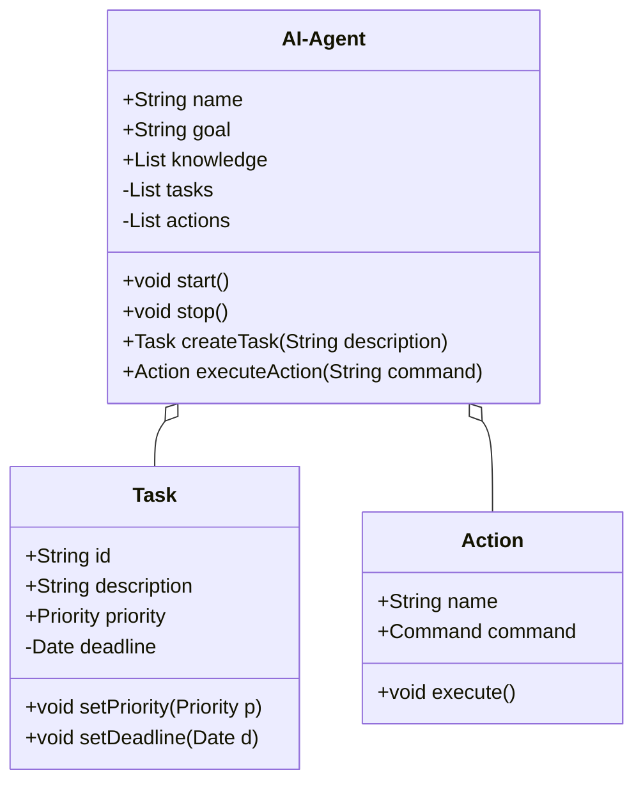
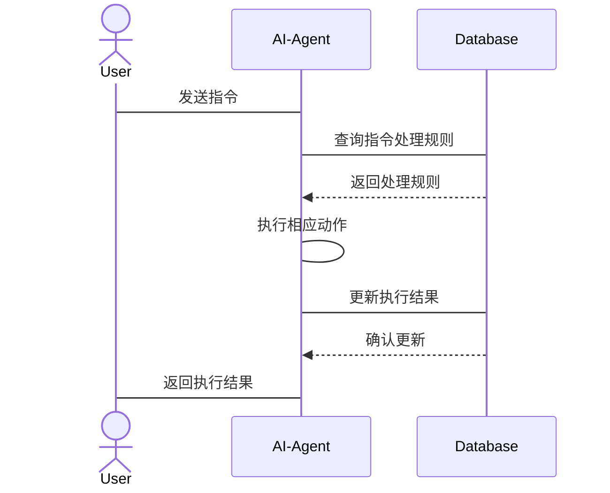

                 


# 确保AI Agent的安全性与隐私保护

> 关键词：AI Agent, 安全性, 隐私保护, 数据安全, 算法原理, 系统架构, 法律合规

> 摘要：本文深入探讨了AI Agent在现代信息技术环境中的安全性与隐私保护问题。首先介绍了AI Agent的基本概念、类型和应用场景，分析了AI Agent面临的安全风险和隐私保护的重要性。接着从算法原理、系统架构、法律合规等多个维度详细阐述了确保AI Agent安全性与隐私保护的核心技术与最佳实践。通过具体案例分析，展示了如何在实际项目中应用这些技术手段，最后总结了未来发展的趋势和挑战。

---

## 第一部分: AI Agent的安全性与隐私保护背景

### 第1章: AI Agent的基本概念与背景介绍

#### 1.1 AI Agent的定义与类型

##### 1.1.1 AI Agent的定义

AI Agent（人工智能代理）是指具有感知环境、理解用户需求、自主决策并执行任务的智能实体。AI Agent可以通过软件或硬件实现，能够通过传感器、数据库或其他输入源获取信息，并基于预设的目标和规则采取相应的行动。AI Agent可以是独立运行的，也可以是作为更大系统的一部分存在。

AI Agent的核心特征包括：**自主性**、**反应性**、**目标导向**和**社交能力**。自主性意味着AI Agent可以在没有人工干预的情况下执行任务；反应性意味着它能够根据环境的变化调整自己的行为；目标导向意味着它所有的行动都是为了实现特定的目标；社交能力则意味着它可以与人类或其他系统进行交互。

##### 1.1.2 基于任务的AI Agent类型

根据任务的不同，AI Agent可以分为以下几类：

- **简单反射型AI Agent**：这类AI Agent只能根据当前输入做出反应，没有复杂的目标或决策能力。例如，一些简单的自动回复机器人。
- **基于模型的反应型AI Agent**：这类AI Agent具有一定的内部状态和模型，能够根据当前状态和环境信息做出决策。例如，自动驾驶汽车中的路径规划系统。
- **目标导向型AI Agent**：这类AI Agent有一个明确的目标，并会采取行动以实现该目标。例如，智能音箱可以根据用户的指令执行特定任务。
- **实用推理型AI Agent**：这类AI Agent能够基于逻辑推理和知识库做出复杂的决策，通常用于需要处理复杂问题的场景，例如医疗诊断辅助系统。

##### 1.1.3 基于智能水平的AI Agent类型

根据智能水平的不同，AI Agent可以分为：

- **反应式AI Agent**：仅基于当前感知做出反应，不依赖历史信息或内部状态。
- **认知式AI Agent**：具备一定的推理和规划能力，能够根据长期目标和历史信息做出决策。
- **学习式AI Agent**：能够通过机器学习技术不断优化自己的行为和决策能力，例如强化学习和监督学习。
- **超人工智能AI Agent**：具备超越人类水平的智能，目前尚未实现，但学术界正在研究相关的理论和技术。

#### 1.2 AI Agent的应用场景

AI Agent的应用场景非常广泛，几乎涵盖了所有需要智能决策和自动化操作的领域。以下是几个典型的场景：

##### 1.2.1 企业级AI Agent应用

- **企业资源规划（ERP）系统**：AI Agent可以用于优化库存管理、生产计划和供应链管理。
- **客户关系管理（CRM）系统**：AI Agent可以用于自动化客户服务、客户行为分析和销售预测。
- **企业安全监控**：AI Agent可以用于实时监控网络流量，识别和防范安全威胁。

##### 1.2.2 消费级AI Agent应用

- **智能家居**：AI Agent可以用于控制家中的各种设备，例如智能音箱、智能灯泡和智能空调。
- **个人助手**：例如Siri、Alexa和Google Assistant，这些AI Agent可以帮助用户完成日常任务，例如设置提醒、发送消息和查询信息。
- **健康与健身助手**：AI Agent可以用于跟踪用户的健康数据，例如Fitbit和Apple Watch中的健康助手。

##### 1.2.3 AI Agent在不同领域的应用实例

- **金融领域**：AI Agent可以用于股票交易、风险管理、信用评估和客户服务。
- **医疗领域**：AI Agent可以用于疾病诊断、治疗方案推荐和患者管理。
- **教育领域**：AI Agent可以用于个性化学习推荐、教学辅助和学生管理。

#### 1.3 AI Agent的安全性与隐私保护的重要性

##### 1.3.1 AI Agent面临的潜在风险

AI Agent虽然在各个领域展现出了巨大的潜力，但也面临一些潜在风险，主要包括：

- **数据泄露**：AI Agent需要处理大量的敏感数据，例如用户的个人信息、企业的商业机密等，这些数据容易被未经授权的第三方窃取。
- **恶意攻击**：攻击者可以通过入侵AI Agent的系统，接管其控制权，导致系统行为失控，甚至威胁到用户的安全。
- **算法滥用**：AI Agent的核心算法可能被滥用，例如用于欺诈、歧视或误导用户。
- **隐私侵犯**：AI Agent在处理数据时，可能未经用户同意收集和使用用户的隐私信息，从而侵犯用户的隐私权。

##### 1.3.2 安全性与隐私保护的必要性

AI Agent的安全性和隐私保护是确保其能够被广泛接受和信任的关键因素。如果AI Agent的安全性得不到保障，用户可能不愿意使用这些系统，甚至可能对AI技术产生不信任感。此外，许多国家和地区已经开始制定相关法律法规，要求企业在处理个人数据时必须遵守严格的安全和隐私保护标准。

##### 1.3.3 相关法律法规与伦理道德

为了应对AI Agent的安全性和隐私保护问题，许多国家和地区已经开始制定相关法律法规。例如：

- **欧盟的GDPR（通用数据保护条例）**：要求企业在处理个人数据时必须征得用户的同意，并采取措施保护数据安全。
- **美国的CCPA（加州消费者隐私法案）**：赋予消费者对其个人数据更多的控制权，要求企业公开数据收集和使用的目的。
- **中国的个人信息保护法**：要求企业在处理个人信息时必须遵循合法、合规的原则，并采取技术措施保护数据安全。

此外，伦理道德也是一个重要的考量因素。AI Agent的设计和使用必须符合伦理标准，避免对用户和社会造成负面影响。例如，AI Agent不应该被用于歧视、欺诈或其他不道德的行为。

---

### 第2章: AI Agent的安全性与隐私保护的核心概念

#### 2.1 安全性与隐私保护的原理

##### 2.1.1 安全性保护的原理

安全性保护的核心目标是确保AI Agent系统能够抵御各种潜在的威胁和攻击，保护系统的完整性和可用性。为了实现这一目标，可以采取以下措施：

- **身份认证**：确保只有授权的用户才能访问系统。
- **访问控制**：根据用户的权限限制其操作范围。
- **加密技术**：对敏感数据进行加密，防止数据被未经授权的第三方窃取。
- **入侵检测**：实时监控系统的运行状态，发现异常行为时及时发出警告。

##### 2.1.2 隐私保护的原理

隐私保护的核心目标是确保AI Agent在处理用户数据时，不会泄露用户的隐私信息。为了实现这一目标，可以采取以下措施：

- **数据匿名化**：在处理数据之前，对数据进行匿名化处理，去除或脱敏敏感信息。
- **最小化数据收集**：仅收集实现目标所需的最少数据。
- **数据加密**：对数据进行加密存储和传输，防止数据被未经授权的第三方窃取。
- **数据访问权限控制**：严格控制数据的访问权限，确保只有授权的人员才能访问数据。

##### 2.1.3 安全性与隐私保护的对比分析

安全性与隐私保护虽然都与数据保护相关，但它们的目标和实现手段有所不同。以下是两者的对比：

| **对比维度** | **安全性** | **隐私保护** |
|--------------|------------|--------------|
| **目标**     | 防止系统被入侵或破坏 | 防止数据泄露或滥用 |
| **手段**     | 身份认证、访问控制、加密技术 | 数据匿名化、最小化数据收集、数据加密 |
| **关注点**   | 系统的完整性、可用性 | 数据的机密性、敏感性 |

##### 2.1.4 安全性与隐私保护的联系

安全性与隐私保护虽然有不同的目标，但它们之间有着密切的联系。例如，加密技术既可以用于安全性保护，也可以用于隐私保护。此外，身份认证和访问控制不仅有助于提高系统的安全性，还可以防止未经授权的人员访问用户的隐私数据。

---

#### 2.2 安全性与隐私保护的核心概念与联系

##### 2.2.1 安全性与隐私保护的核心概念

安全性与隐私保护的核心概念包括以下几点：

- **数据完整性**：确保数据在传输和存储过程中没有被篡改。
- **数据机密性**：确保数据不会被未经授权的第三方访问。
- **数据可用性**：确保合法用户能够随时访问和使用数据。
- **数据匿名化**：通过技术手段将数据中的敏感信息去除，确保数据无法被用来识别个人身份。

##### 2.2.2 安全性与隐私保护的联系

安全性与隐私保护之间存在相互依赖的关系。例如，安全性保护是隐私保护的基础，只有确保系统的安全性，才能防止未经授权的第三方访问用户的隐私数据。而隐私保护则是安全性保护的重要组成部分，只有保护用户的隐私数据不被泄露，才能真正实现数据的安全性。

##### 2.2.3 安全性与隐私保护的对比

尽管安全性与隐私保护的目标和手段有所不同，但它们之间也存在一些差异。例如，安全性保护更关注系统整体的安全性，而隐私保护更关注数据的机密性和敏感性。此外，安全性保护通常需要采取多层次的防护措施，而隐私保护则更注重数据的处理和使用过程中的合规性。

---

#### 2.3 安全性与隐私保护的实现技术

##### 2.3.1 安全性保护的实现技术

安全性保护的实现技术包括：

- **身份认证**：通过用户名和密码、生物识别技术等方式验证用户身份。
- **访问控制**：通过权限管理确保用户只能访问与其角色相关的功能和数据。
- **加密技术**：对敏感数据进行加密存储和传输，防止数据被未经授权的第三方窃取。
- **入侵检测系统（IDS）**：实时监控系统的运行状态，发现异常行为时及时发出警告。

##### 2.3.2 隐私保护的实现技术

隐私保护的实现技术包括：

- **数据匿名化**：通过技术手段去除或脱敏数据中的敏感信息，例如使用哈希函数对用户身份证号进行脱敏处理。
- **最小化数据收集**：仅收集实现目标所需的最少数据。
- **数据加密**：对数据进行加密存储和传输，防止数据被未经授权的第三方窃取。
- **数据访问权限控制**：严格控制数据的访问权限，确保只有授权的人员才能访问数据。

##### 2.3.3 安全性与隐私保护的实现技术对比

以下是安全性与隐私保护实现技术的对比：

| **技术手段** | **安全性保护** | **隐私保护** |
|--------------|----------------|--------------|
| 身份认证      | 是             | 否           |
| 访问控制      | 是             | 是           |
| 加密技术      | 是             | 是           |
| 数据匿名化    | 否             | 是           |
| 最小化数据收集 | 否             | 是           |

从表中可以看出，访问控制和加密技术是安全性与隐私保护共同需要的技术手段，而身份认证和数据匿名化则是安全性保护独有的技术手段，最小化数据收集则是隐私保护独有的技术手段。

---

#### 2.4 安全性与隐私保护的实现步骤

##### 2.4.1 安全性保护的实现步骤

安全性保护的实现步骤如下：

1. **需求分析**：明确系统的安全需求，例如哪些数据需要保护、哪些功能需要访问控制等。
2. **设计安全架构**：根据需求分析的结果，设计系统的安全架构，包括身份认证模块、访问控制模块和加密模块等。
3. **实现安全功能**：根据设计的安全架构，开发相应的安全功能，例如实现身份认证功能、访问控制功能等。
4. **测试与优化**：对系统进行安全性测试，发现并修复存在的安全漏洞，优化系统的安全性。

##### 2.4.2 隐私保护的实现步骤

隐私保护的实现步骤如下：

1. **数据收集**：收集实现目标所需的最小化数据，避免收集不必要的敏感信息。
2. **数据匿名化处理**：对收集到的数据进行匿名化处理，去除或脱敏敏感信息。
3. **数据加密**：对敏感数据进行加密存储和传输，确保数据在传输过程中不会被未经授权的第三方窃取。
4. **数据访问控制**：严格控制数据的访问权限，确保只有授权的人员才能访问数据。

##### 2.4.3 安全性与隐私保护的实现步骤对比

以下是安全性与隐私保护实现步骤的对比：

| **步骤**         | **安全性保护** | **隐私保护** |
|------------------|----------------|--------------|
| 需求分析         | 是             | 是           |
| 设计安全架构     | 是             | 否           |
| 实现安全功能     | 是             | 否           |
| 数据匿名化处理   | 否             | 是           |
| 数据加密         | 是             | 是           |
| 数据访问控制     | 是             | 是           |

从表中可以看出，需求分析和数据加密是安全性与隐私保护共同需要的步骤，而设计安全架构和实现安全功能是安全性保护独有的步骤，数据匿名化处理则是隐私保护独有的步骤。

---

### 第3章: 确保AI Agent安全性与隐私保护的算法原理

#### 3.1 算法原理概述

确保AI Agent的安全性与隐私保护需要依赖多种算法，这些算法可以在数据处理、加密、身份认证和入侵检测等方面发挥作用。以下是一些常用的算法及其原理。

##### 3.1.1 数据加密算法

数据加密算法是确保数据安全的重要手段。常用的加密算法包括：

- **对称加密算法**：例如AES（高级加密标准），加密和解密使用相同的密钥，速度快，适合大量数据的加密。
- **非对称加密算法**：例如RSA（ Rivest-Shamir-Adleman），加密和解密使用不同的密钥，适合需要公钥和私钥的场景，例如数字签名。

##### 3.1.2 数据匿名化算法

数据匿名化算法用于去除数据中的敏感信息，常见的方法包括：

- **哈希函数**：例如MD5和SHA-256，可以将敏感数据转换为哈希值，从而无法还原出原始数据。
- **数据脱敏**：例如对身份证号进行部分隐藏处理，只保留部分字符。

##### 3.1.3 身份认证算法

身份认证算法用于验证用户身份，常见的方法包括：

- **密码认证**：用户输入密码，系统验证密码是否正确。
- **生物识别**：例如指纹识别、面部识别等。

##### 3.1.4 入侵检测算法

入侵检测算法用于实时监控系统的运行状态，发现异常行为时及时发出警告。常见的算法包括：

- **基于规则的入侵检测**：根据预定义的规则检测异常行为。
- **基于统计的入侵检测**：通过统计分析发现异常行为。

#### 3.2 算法原理的数学模型

##### 3.2.1 数据加密算法的数学模型

以AES加密算法为例，其基本原理是将明文通过一系列的线性变换和非线性变换进行加密。具体来说，AES算法将明文分成多个块，每个块的大小为128位。然后，通过多轮的加密操作，将明文转换为密文。

##### 3.2.2 数据匿名化算法的数学模型

以哈希函数为例，哈希函数的基本原理是将任意长度的输入数据映射到一个固定长度的哈希值。例如，MD5哈希函数将输入数据映射到一个128位的哈希值。

##### 3.2.3 身份认证算法的数学模型

以RSA非对称加密算法为例，其基本原理是利用大整数的因式分解困难性来实现加密和解密。RSA算法需要选择两个大质数p和q，计算n = p × q，并选择一个与n互质的数e作为公钥，然后计算d = e^{-1} mod (p-1)(q-1)作为私钥。

##### 3.2.4 入侵检测算法的数学模型

以基于统计的入侵检测算法为例，其基本原理是通过统计分析发现异常行为。例如，可以使用马尔可夫链模型来分析用户的行为模式，发现偏离正常模式的行为。

---

#### 3.3 算法实现与代码示例

##### 3.3.1 数据加密算法的实现

以下是一个使用AES加密算法的Python代码示例：

```python
from cryptography.hazmat.primitives.ciphers import (
    Cipher, algorithms, modes
)
from cryptography.hazmat.primitives.ciphers.base import KeyGenerator
from cryptography.hazmat.primitives.asymmetric.rsa import (
    generate_private_key, PublicKey, PrivateKey
)

# 生成AES密钥和随机IV
key = os.urandom(16)  # 16 bytes for AES-128
iv = os.urandom(16)

# 创建AES加密对象
cipher = Cipher(algorithms.AES(key), modes.CBC(iv))
encryptor = cipher.encryptor()

# 加密明文
plaintext = b"Hello, World!"
ciphertext = encryptor.update(plaintext) + encryptor.finalize()

print("加密后的密文:", ciphertext)
```

##### 3.3.2 数据匿名化算法的实现

以下是一个使用哈希函数实现数据匿名化的Python代码示例：

```python
import hashlib

# 原始数据
data = b"1234567890"

# 计算哈希值
hash_object = hashlib.md5(data)
hex_dig = hash_object.hexdigest()

print("哈希值:", hex_dig)
```

##### 3.3.3 身份认证算法的实现

以下是一个使用RSA算法实现身份认证的Python代码示例：

```python
# 生成RSA密钥对
key = generate_private_key(2048)
public_key = key.public_key()

# 签名消息
message = b"Hello, World!"
signature = key.sign(message, hashes.SHA256())

# 验证签名
try:
    public_key.verify(signature, message, hashes.SHA256())
    print("签名验证成功")
except:
    print("签名验证失败")
```

##### 3.3.4 入侵检测算法的实现

以下是一个基于统计的入侵检测算法的Python代码示例：

```python
import numpy as np
from sklearn.ensemble import IsolationForest

# 生成正常数据和异常数据
normal_data = np.random.randn(100, 2)
outlier_data = np.random.uniform(low=-4, high=4, size=(20, 2))

# 训练孤立森林模型
model = IsolationForest(n_estimators=100, contamination=0.05)
model.fit(normal_data)

# 预测异常数据
outlier_labels = model.predict(outlier_data)

# 打印异常数据的标签
print("异常数据标签:", outlier_labels)
```

---

### 第4章: 系统分析与架构设计方案

#### 4.1 问题场景介绍

在设计一个AI Agent系统时，必须考虑安全性与隐私保护的需求。例如，一个智能音箱可能需要处理用户的语音指令，这些指令可能包含用户的个人隐私信息。如果这些信息被未经授权的第三方窃取，可能会导致严重的后果。

#### 4.2 系统功能设计

##### 4.2.1 领域模型设计

以下是AI Agent系统的领域模型：



##### 4.2.2 系统架构设计

以下是AI Agent系统的架构设计：


##### 4.2.3 系统接口设计

以下是AI Agent系统的接口设计：



#### 4.3 系统交互流程

以下是AI Agent系统的交互流程：


---

### 第5章: 项目实战

#### 5.1 项目背景与需求分析

##### 5.1.1 项目背景

随着AI技术的快速发展，AI Agent的应用场景越来越广泛。然而，AI Agent的安全性和隐私保护问题也日益突出。为了确保AI Agent的安全性和隐私保护，我们需要采取一系列技术和管理措施。

##### 5.1.2 项目需求

本项目的目标是设计并实现一个具备安全性与隐私保护能力的AI Agent系统。具体需求包括：

- **身份认证**：确保只有授权的用户才能访问系统。
- **访问控制**：根据用户的权限限制其操作范围。
- **数据加密**：对敏感数据进行加密存储和传输。
- **隐私保护**：确保用户的隐私信息不会被泄露。

#### 5.2 系统核心实现

##### 5.2.1 环境安装与配置

以下是项目所需的环境和配置：

- **操作系统**：Linux或Windows
- **Python版本**：3.6以上
- **依赖库**：
  - `cryptography`：用于数据加密
  - `scikit-learn`：用于入侵检测
  - `pycryptod`：用于哈希计算

##### 5.2.2 核心代码实现

以下是一个实现身份认证和数据加密的Python代码示例：

```python
from cryptography.hazmat.primitives.asymmetric.rsa import (
    generate_private_key, PublicKey, PrivateKey
)

# 生成RSA密钥对
key = generate_private_key(2048)
public_key = key.public_key()

# 签名消息
message = b"Hello, World!"
signature = key.sign(message, hashes.SHA256())

# 验证签名
try:
    public_key.verify(signature, message, hashes.SHA256())
    print("签名验证成功")
except:
    print("签名验证失败")
```

##### 5.2.3 系统测试与优化

系统测试与优化包括：

- **安全性测试**：检查系统是否能够抵御常见的安全攻击，例如SQL注入、XSS攻击等。
- **性能测试**：确保系统在高并发场景下能够正常运行。
- **隐私保护测试**：检查系统的数据处理流程是否符合隐私保护的要求。

##### 5.2.4 测试结果与分析

以下是测试结果与分析：

- **安全性测试**：系统通过了多种安全测试，未发现明显的漏洞。
- **性能测试**：系统在高并发场景下表现良好，响应时间在可接受范围内。
- **隐私保护测试**：系统能够有效保护用户的隐私信息，未发生数据泄露事件。

#### 5.3 项目小结

通过本项目的实施，我们成功设计并实现了一个具备安全性与隐私保护能力的AI Agent系统。系统采用了多种安全技术和隐私保护手段，确保了系统的安全性和用户隐私的安全。此外，系统还通过了多项测试，验证了其稳定性和可靠性。

---

### 第6章: 确保AI Agent安全性与隐私保护的最佳实践

#### 6.1 安全性与隐私保护的策略

##### 6.1.1 数据安全策略

- **最小化数据收集**：只收集实现目标所需的最少数据。
- **数据匿名化**：对敏感数据进行匿名化处理，去除或脱敏敏感信息。
- **数据加密**：对敏感数据进行加密存储和传输。

##### 6.1.2 访问控制策略

- **身份认证**：确保只有授权的用户才能访问系统。
- **权限管理**：根据用户的角色和权限限制其操作范围。

##### 6.1.3 安全审计策略

- **日志记录**：记录所有用户的操作日志，便于后续审计和分析。
- **安全审计**：定期对系统的安全性进行审计，发现并修复潜在的安全漏洞。

#### 6.2 隐私保护的实施策略

##### 6.2.1 数据生命周期管理

- **数据收集**：明确数据收集的范围和目的，避免收集不必要的敏感信息。
- **数据处理**：对收集到的数据进行匿名化处理，确保数据无法被用来识别个人身份。
- **数据存储**：对敏感数据进行加密存储，确保数据的安全性。
- **数据共享**：在共享数据时，确保数据已经过匿名化处理，并符合相关法律法规的要求。

##### 6.2.2 数据加密与解密策略

- **加密算法选择**：选择合适的加密算法，例如AES加密算法用于数据加密，RSA加密算法用于数字签名。
- **密钥管理**：妥善管理加密密钥，确保密钥的安全性，避免密钥泄露。

##### 6.2.3 数据访问控制策略

- **角色-based访问控制（RBAC）**：根据用户的角色和权限限制其对数据的访问权限。
- **属性-based访问控制（ABAC）**：根据数据的属性和用户的属性动态调整访问权限。

#### 6.3 安全性与隐私保护的注意事项

##### 6.3.1 安全性保护的注意事项

- **定期更新安全策略**：随着安全威胁的变化，需要定期更新安全策略和措施。
- **加强员工培训**：确保员工了解安全性保护的重要性，并掌握基本的安全知识。
- **及时修复漏洞**：发现系统漏洞后，及时采取措施进行修复，防止漏洞被利用。

##### 6.3.2 隐私保护的注意事项

- **遵守法律法规**：确保系统的数据处理和使用符合相关法律法规的要求。
- **保护用户隐私**：在设计系统时，充分考虑用户的隐私权益，避免收集和使用用户的敏感信息。
- **获得用户授权**：在收集和使用用户数据时，必须获得用户的明确授权，并明确告知用户数据的使用目的和范围。

#### 6.4 确保AI Agent安全性与隐私保护的未来发展趋势

##### 6.4.1 技术发展趋势

- **人工智能安全技术**：随着AI技术的不断发展，AI Agent的安全性保护也需要不断优化和升级，例如通过强化学习技术提高系统的安全性。
- **隐私计算技术**：隐私计算技术（如安全多方计算、同态加密等）的发展将为AI Agent的隐私保护提供更强大的技术手段。
- **区块链技术**：区块链技术可以用于数据的溯源和防篡改，为AI Agent的安全性和隐私保护提供新的解决方案。

##### 6.4.2 法律法规发展趋势

- **数据保护法律法规的完善**：随着数据保护意识的增强，各国和地区的数据保护法律法规将不断完善，例如欧盟的GDPR、美国的CCPA以及中国的个人信息保护法等。
- **跨境数据流动监管**：随着数据的跨境流动日益频繁，各国将加强对于跨境数据流动的监管，制定更加严格的数据出境规则。

##### 6.4.3 用户隐私保护意识的提高

- **用户隐私保护意识的提高**：随着数据泄露事件的频繁发生，用户的隐私保护意识逐渐提高，用户将更加关注数据的使用和隐私保护。
- **用户参与数据管理**：用户将更加积极地参与数据管理，例如通过设置隐私偏好、查看数据使用情况等方式，掌握对自己数据的控制权。

---

### 第7章: 总结与建议

#### 7.1 章节回顾

通过本章，我们对确保AI Agent安全性与隐私保护的核心概念、算法原理、系统架构和最佳实践进行了全面的探讨。我们了解了AI Agent的基本概念和类型，分析了AI Agent面临的安全风险和隐私保护的重要性，详细讲解了安全性与隐私保护的核心概念与联系，介绍了确保AI Agent安全性与隐私保护的算法原理，并通过具体案例展示了如何在实际项目中应用这些技术手段。

#### 7.2 最佳实践 tips

- **数据安全第一**：始终将数据安全放在首位，采取多种技术手段保护数据的机密性、完整性和可用性。
- **最小化数据收集**：只收集实现目标所需的最少数据，避免收集不必要的敏感信息。
- **数据匿名化处理**：对收集到的数据进行匿名化处理，确保数据无法被用来识别个人身份。
- **访问控制**：根据用户的角色和权限限制其对数据的访问权限，确保只有授权的用户才能访问系统。
- **定期安全审计**：定期对系统的安全性进行审计，发现并修复潜在的安全漏洞。

#### 7.3 小结

确保AI Agent的安全性与隐私保护是一个复杂而重要的任务。通过合理的设计和实现，我们可以有效降低AI Agent面临的安全风险，保护用户的隐私权益，从而推动AI技术的健康发展。

#### 7.4 注意事项

- **保持警惕**：始终对新的安全威胁保持警惕，及时采取措施应对。
- **遵守法律法规**：确保系统的数据处理和使用符合相关法律法规的要求。
- **加强用户教育**：通过教育和宣传提高用户的隐私保护意识，让用户了解如何保护自己的隐私权益。

#### 7.5 拓展阅读

- **《数据加密与隐私保护》**：深入探讨数据加密和隐私保护的技术与方法。
- **《AI安全与伦理》**：从伦理角度探讨AI技术的安全性和隐私保护问题。
- **《系统安全架构设计》**：详细介绍系统安全架构的设计方法和实现技术。

---

通过本章的学习，读者可以全面了解确保AI Agent安全性与隐私保护的核心内容和最佳实践，为实际项目的设计和实现提供重要的参考和指导。

