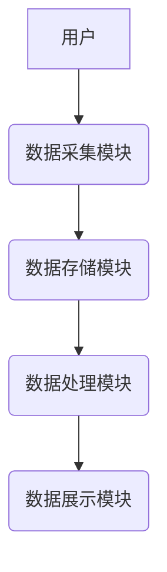
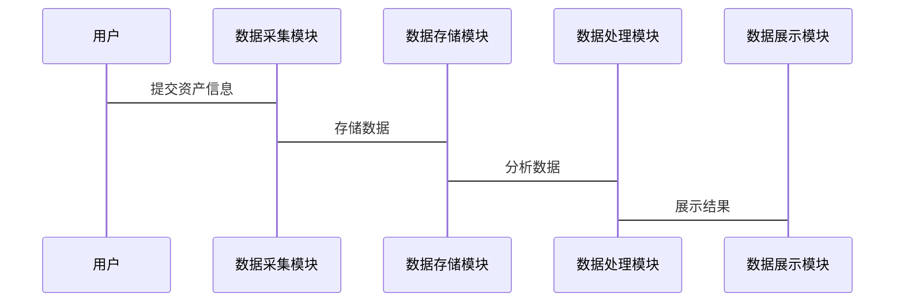

                 


# 确保投资理财智能助手的数据安全与隐私保护

> 关键词：投资理财智能助手, 数据安全, 隐私保护, 加密算法, 访问控制, 数据分类, 安全架构

> 摘要：本文深入探讨了投资理财智能助手在数据安全与隐私保护方面的重要性，结合实际案例分析，详细讲解了数据分类、加密算法、访问控制、隐私保护技术等核心概念，并通过系统架构设计和项目实战，展示了如何在实际项目中实现数据安全与隐私保护的目标。

---

## 第一部分：投资理财智能助手的背景与需求

### 第1章：投资理财智能助手的背景

#### 1.1 投资理财智能助手的背景
- 1.1.1 投资理财的数字化转型  
  随着人工智能技术的发展，投资理财领域逐渐从传统的线下服务转向线上化、智能化。智能助手通过大数据分析和机器学习算法，为用户提供个性化的投资建议和风险管理工具。

- 1.1.2 智能助手在投资理财中的作用  
  智能助手不仅能够实时监控市场动态，还能根据用户的风险偏好和财务状况，提供个性化的投资策略。然而，这也意味着需要处理大量敏感的用户数据，如资产配置、交易记录和财务状况。

- 1.1.3 数据安全与隐私保护的重要性  
  用户数据的安全性和隐私性是投资理财智能助手的核心问题。一旦数据泄露或被篡改，可能导致用户的经济损失和信任危机。

#### 1.2 数据安全与隐私保护的核心概念
- 1.2.1 数据安全的基本定义  
  数据安全是指通过技术手段确保数据的完整性、机密性和可用性。在投资理财智能助手中，数据安全是防止未经授权的访问、数据泄露和篡改的关键。

- 1.2.2 隐私保护的法律与伦理要求  
  隐私保护不仅是法律要求，也是企业社会责任的体现。在投资理财领域，用户数据可能包含敏感的财务信息，必须遵守相关法律法规，如GDPR（通用数据保护条例）和中国的个人信息保护法。

- 1.2.3 智能助手中的数据分类与敏感性分析  
  数据分类是数据安全和隐私保护的基础。根据数据的敏感程度，可以将数据分为公开数据、一般数据和敏感数据。敏感数据需要额外的保护措施，如加密和访问控制。

### 第2章：投资理财智能助手中的数据安全与隐私保护需求

#### 2.1 数据安全与隐私保护的目标
- 2.1.1 数据完整性  
  确保数据在存储和传输过程中不被篡改，保持数据的真实性和一致性。

- 2.1.2 数据机密性  
  防止未经授权的人员访问敏感数据，确保只有授权用户才能查看或操作数据。

- 2.1.3 数据可用性  
  确保数据在需要时可以被快速访问和处理，尤其是在投资理财场景中，实时性至关重要。

#### 2.2 投资理财智能助手中的数据流分析
- 2.2.1 数据采集阶段  
  用户输入的财务信息、市场数据等需要通过安全通道采集，并进行初步验证。

- 2.2.2 数据存储阶段  
  数据存储在数据库中，需要通过加密和访问控制来保护，防止物理或逻辑上的数据泄露。

- 2.2.3 数据处理与分析阶段  
  数据在后台进行清洗、分析和建模，需要确保分析过程中的数据安全，防止中间结果被滥用。

- 2.2.4 数据输出与展示阶段  
  最终结果展示给用户时，需要确保数据的隐私性，避免敏感信息泄露。

#### 2.3 数据安全与隐私保护的边界与外延
- 2.3.1 数据安全的边界  
  数据安全不仅涉及技术手段，还包括组织架构、人员管理和流程控制。企业需要建立完善的安全管理制度，确保数据安全的边界清晰。

- 2.3.2 隐私保护的外延  
  隐私保护不仅仅是数据的加密和脱敏，还包括数据的生命周期管理。从数据生成、存储、处理到销毁，每个环节都需要考虑隐私保护。

- 2.3.3 智能助手中的数据共享与第三方服务  
  投资理财智能助手可能需要与第三方服务（如支付平台、数据供应商）进行数据共享。此时，必须确保数据共享过程中的安全性和隐私性，避免数据被滥用或泄露。

---

## 第二部分：数据安全与隐私保护的核心概念与联系

### 第3章：数据安全与隐私保护的核心概念原理

#### 3.1 数据安全的原理
- 3.1.1 数据加密技术  
  数据加密是保护数据机密性的核心手段。通过将数据转化为密文，可以防止未经授权的人员读取数据。

- 3.1.2 数据访问控制  
  通过权限管理，确保只有授权的用户或系统才能访问敏感数据。

- 3.1.3 数据完整性保障  
  通过校验码（如哈希值）或加密签名，确保数据在存储和传输过程中不被篡改。

#### 3.2 隐私保护的原理
- 3.2.1 数据匿名化技术  
  将数据中的个人信息去除或脱敏，使其无法直接关联到具体个人。

- 3.2.2 数据脱敏技术  
  对敏感数据进行变形处理，使其在不改变数据用途的前提下，降低被识别的风险。

- 3.2.3 数据最小化原则  
  在数据收集和处理过程中，只收集必要的信息，避免过度收集用户数据。

### 第4章：核心概念的属性特征对比

#### 4.1 数据安全与隐私保护的对比分析
| 属性       | 数据安全                          | 隐私保护                          |
|------------|-----------------------------------|-----------------------------------|
| 目标       | 防止数据泄露和篡改                | 防止未经授权的访问和识别          |
| 实现手段    | 加密、访问控制、完整性校验        | 匿名化、脱敏、最小化原则          |
| 关注点      | 数据的机密性、完整性和可用性      | 用户隐私的保护                    |

#### 4.2 数据安全与隐私保护的联系与区别
- 联系：  
  数据安全是隐私保护的基础，隐私保护是数据安全的目标之一。两者都需要技术手段和管理制度的双重保障。

- 区别：  
  数据安全关注的是数据的整体安全，而隐私保护关注的是数据中的个人信息和敏感数据的安全。

---

## 第三部分：算法原理讲解

### 第5章：数据加密与隐私保护算法

#### 5.1 数据加密算法
- 5.1.1 对称加密算法  
  使用相同的密钥进行加密和解密。常见的对称加密算法有AES、DES等。

- 5.1.2 非对称加密算法  
  使用公钥和私钥进行加密和解密。常见的非对称加密算法有RSA、椭圆曲线加密（ECC）等。

- 5.1.3 密钥管理  
  加密算法的实现需要安全的密钥管理机制，防止密钥泄露或被篡改。

#### 5.2 数据脱敏算法
- 5.2.1 数据替换  
  将敏感数据替换为其他值，如将真实姓名替换为随机字符串。

- 5.2.2 数据变形  
  对数据进行数学变换，如将年龄增加10岁，使其无法直接关联到真实用户。

- 5.2.3 数据哈希  
  使用哈希函数对数据进行处理，生成不可逆的哈希值，用于数据验证。

---

## 第四部分：系统分析与架构设计方案

### 第6章：投资理财智能助手的系统架构设计

#### 6.1 问题场景介绍
- 投资理财智能助手需要处理大量的用户数据，包括资产信息、交易记录、市场数据等。这些数据需要在多个系统模块之间传输，涉及数据采集、存储、处理和展示等多个环节。

#### 6.2 系统功能设计
- 6.2.1 数据采集模块  
  负责采集用户的资产信息、交易记录和市场数据。

- 6.2.2 数据存储模块  
  负责存储采集到的数据，并进行加密和访问控制。

- 6.2.3 数据处理模块  
  对数据进行清洗、分析和建模，生成投资建议。

- 6.2.4 数据展示模块  
  将处理结果展示给用户，确保数据的隐私性。

#### 6.3 系统架构设计


#### 6.4 系统接口设计
- 数据采集模块通过API接口与第三方数据源对接。
- 数据存储模块通过加密通道与数据处理模块通信。
- 数据展示模块通过安全的Web接口向用户展示结果。

#### 6.5 系统交互设计


---

## 第五部分：项目实战

### 第7章：投资理财智能助手的数据安全实现

#### 7.1 环境配置
- 操作系统：Linux
- 开发工具：Python、Django框架
- 数据库：MySQL
- 加密库：cryptography

#### 7.2 数据加密实现
```python
from cryptography.fernet import Fernet

# 生成密钥
key = Fernet.generate_key()
cipher = Fernet(key)

# 加密数据
encrypted_data = cipher.encrypt(b"用户资产信息")
```

#### 7.3 数据脱敏实现
```python
def anonymize_age(age):
    return age + 10 if age >= 18 else "未成年人"
```

#### 7.4 数据访问控制实现
```python
from django.contrib.auth.models import User, Group
from django.shortcuts import render, get_object_or_404

# 权限管理
@login_required
def view_asset(request, asset_id):
    asset = get_object_or_404(Asset, pk=asset_id)
    return render(request, 'asset_detail.html', {'asset': asset})
```

#### 7.5 案例分析
- 案例背景：某投资理财平台遭遇数据泄露事件，导致用户资产信息被公开。
- 问题分析：数据存储时未进行加密，且访问控制机制不完善。
- 解决方案：对敏感数据进行加密存储，并实施严格的访问控制策略。

---

## 第六部分：最佳实践与小结

### 第8章：数据安全与隐私保护的注意事项

#### 8.1 实施指南
- 定期进行安全审计，发现潜在的安全漏洞。
- 建立完善的安全管理制度，明确数据访问权限。
- 使用专业的安全工具和技术，确保数据安全。

#### 8.2 注意事项
- 数据安全不仅仅是技术问题，还需要团队协作和管理制度的配合。
- 隐私保护需要在数据的全生命周期中进行，而不仅仅是存储和传输阶段。
- 第三方服务的引入需要谨慎评估其安全性，避免成为数据泄露的薄弱环节。

#### 8.3 拓展阅读
- 《数据安全实战：从入门到精通》
- 《隐私保护与数据合规》
- 《投资理财智能化的挑战与机遇》

---

## 总结

投资理财智能助手的数据安全与隐私保护是一个复杂而重要的任务。通过本文的分析，我们可以看到，数据安全和隐私保护不仅需要技术手段的支持，还需要管理制度和团队协作的配合。在未来的投资理财领域，随着人工智能和大数据技术的不断发展，数据安全和隐私保护的需求将更加迫切，相关技术也将不断创新和进步。

--- 

**注：由于篇幅限制，本文仅为部分内容的展示，完整文章请根据上述大纲进行扩展。**

