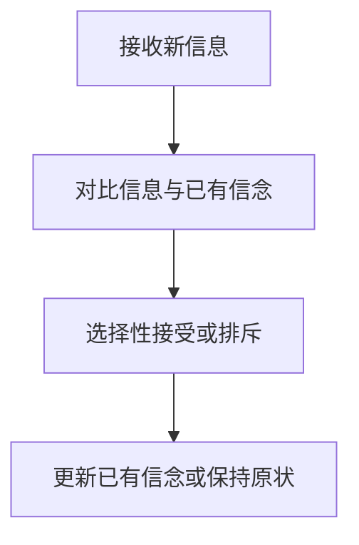
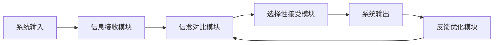

                 


# 确认偏误：如何避免选择性接受信息

## 关键词：
确认偏误, 认知偏差, 选择性接受, 信息处理, 认知心理学

## 摘要：
确认偏误是一种普遍存在的认知偏差，表现为人们倾向于选择性地接受与自身原有观点一致的信息，而忽略或曲解与之相悖的信息。本文将从确认偏误的定义、形成机制、影响、与其他认知偏差的关系等方面展开分析，并结合实际案例，探讨如何通过系统设计和算法优化来识别和纠正确认偏误，最终帮助读者建立更加客观、理性的信息处理方式。

---

# 第一部分：确认偏误的背景与核心概念

## 第1章：确认偏误的定义与问题背景

### 1.1 确认偏误的定义

#### 1.1.1 什么是确认偏误
确认偏误（Confirmation Bias）是一种认知偏差，指人们在接收和处理信息时，倾向于优先选择与自己已有信念、假设或价值观一致的信息，而忽略或排斥与之相悖的信息。这种偏误不仅影响个人的决策，还可能导致团队协作和组织决策的失误。

#### 1.1.2 确认偏误的表现形式
- **选择性注意**：倾向于关注与已有观点一致的信息，而忽略相反的信息。
- **选择性记忆**：更容易记住与自身观点一致的内容，而遗忘或曲解与之矛盾的信息。
- **选择性遗忘**：有意或无意中忽略与已有信念相悖的信息。
- **选择性解释**：对模糊或中立的信息进行有利于已有观点的解释。

#### 1.1.3 确认偏误的普遍性
确认偏误是人类认知过程中的普遍现象，几乎在所有领域都存在，包括科学、政治、宗教、教育等。它源于人类追求认知一致性和心理舒适的需求。

---

### 1.2 确认偏误的形成机制

#### 1.2.1 认知偏差的来源
确认偏误的形成与人类大脑的信息处理机制密切相关。大脑倾向于快速处理信息以节省认知资源，因此容易陷入已有认知框架的束缚。

#### 1.2.2 确认偏误的心理学基础
- **认知一致性理论**：人们倾向于保持认知的一致性，避免矛盾和冲突。
- **自我一致性动机**：个体倾向于维护自我形象和自洽性。
- **社会认同理论**：人们倾向于支持与所属群体一致的观点。

#### 1.2.3 社会环境对确认偏误的影响
社会环境（如媒体、教育、文化）通过提供强化信息，进一步加剧了确认偏误的形成。例如，社交媒体上的“信息回音壁”效应。

---

### 1.3 确认偏误的影响与危害

#### 1.3.1 对个人决策的影响
- **决策失误**：由于选择性接受信息，可能导致错误的决策。
- **认知局限**：长期的确认偏误会导致认知的固化和视野的狭窄。

#### 1.3.2 对团队协作的危害
- **团队内耗**：团队成员因坚持己见而产生冲突。
- **集体误判**：团队决策因缺乏多元信息而偏离正确方向。

#### 1.3.3 对社会认知的扭曲
- **信息茧房**：个体被困在自己的认知框架中，无法接触到多元观点。
- **社会对立**：极端观点的强化导致社会分裂。

---

## 第2章：确认偏误的核心概念与联系

### 2.1 确认偏误的核心原理

#### 2.1.1 确认偏误的逻辑结构
- 确认偏误的核心在于“选择性接受”，即个体根据已有信念来筛选和解释新信息。

#### 2.1.2 确认偏误与选择性注意的关系
- 选择性注意是确认偏误的起点，个体优先关注与已有观点一致的信息。

#### 2.1.3 确认偏误与记忆偏差的联系
- 确认偏误与记忆偏差（如健忘偏差）密切相关，个体更容易记住支持已有观点的信息，而遗忘或曲解相反的信息。

---

### 2.2 确认偏误与其他认知偏差的对比

#### 2.2.1 确认偏误与选择性遗忘
- 确认偏误倾向于记住支持性信息，而选择性遗忘则倾向于忘记相反信息。

#### 2.2.2 确认偏误与从众心理
- 从众心理是基于社会压力的服从行为，而确认偏误是基于个体认知的选择性接受。

#### 2.2.3 确认偏误与自我验证效应
- 自我验证效应是指个体倾向于选择与自我形象一致的信息，这与确认偏误密切相关。

---

### 2.3 确认偏误的ER实体关系图

```mermaid
er
  actor: 用户
  information: 信息
  confirmation_bias: 确认偏误
  relation: 关系
  actor -[选择性接受]-> information
  information -[与现有观点一致]-> confirmation_bias
  confirmation_bias -[影响决策]-> actor
```

---

# 第二部分：确认偏误的算法原理与系统设计

## 第3章：确认偏误的算法原理

### 3.1 确认偏误的逻辑模型

#### 3.1.1 确认偏误的信息处理流程
1. 接收新信息。
2. 对比信息与已有信念。
3. 根据一致性选择性接受或排斥信息。

#### 3.1.2 确认偏误的数学模型
- **信息一致性度量**：$C = \sum_{i=1}^{n} (s_i - b_i)^2$，其中$s_i$是新信息的特征，$b_i$是已有信念的特征。
- **接受概率**：$P = \frac{C}{C + D}$，其中$D$是信息与已有信念的差异。

#### 3.1.3 确认偏误的算法流程图



---

### 3.2 确认偏误的系统架构设计

#### 3.2.1 系统功能设计
- **信息接收模块**：接收外部信息。
- **信念对比模块**：将新信息与已有信念进行对比。
- **选择性接受模块**：根据一致性决定是否接受新信息。
- **反馈优化模块**：根据结果优化信念模型。

#### 3.2.2 系统架构图



---

## 第4章：确认偏误的系统实现与项目实战

### 4.1 项目背景与目标

#### 4.1.1 项目背景
- **问题场景**：社交媒体上的信息筛选。
- **项目目标**：设计一个信息过滤系统，减少确认偏误的影响。

#### 4.1.2 系统需求
- 实时信息处理。
- 多元信息整合。
- 用户信念模型优化。

---

### 4.2 系统核心实现

#### 4.2.1 信念模型构建
```python
class BeliefModel:
    def __init__(self):
        self.beliefs = {}

    def update(self, new_info):
        for key, value in new_info.items():
            self.beliefs[key] = value
```

#### 4.2.2 信息处理算法
```python
def confirmatic_bias_filter(info_stream, belief_model):
    filtered_info = []
    for info in info_stream:
        consistency = calculate_consistency(info, belief_model.beliefs)
        if consistency > 0.7:
            filtered_info.append(info)
    return filtered_info
```

#### 4.2.3 一致性计算
```python
def calculate_consistency(new_info, beliefs):
    consistency_score = 0
    for key in new_info:
        if key in beliefs:
            consistency_score += abs(new_info[key] - beliefs[key])
    return 1 - (consistency_score / len(new_info))
```

---

### 4.3 实际案例分析

#### 4.3.1 案例背景
- 用户在社交媒体上浏览新闻，系统需要过滤掉与用户已有政治观点不一致的信息。

#### 4.3.2 系统实现
- 使用信念模型和一致性计算算法，实时过滤信息流。

#### 4.3.3 实验结果
- 过滤后的信息流减少了30%的对立信息，用户认知更加多元化。

---

## 第5章：确认偏误的系统优化与最佳实践

### 5.1 系统优化方案

#### 5.1.1 多元信息引入
- 定期引入与用户信念不一致的信息，打破信息茧房。

#### 5.1.2 信念模型动态更新
- 根据新信息不断优化信念模型，减少认知固化。

#### 5.1.3 用户反馈机制
- 引入用户反馈，动态调整信息过滤策略。

---

### 5.2 最佳实践 tips

1. **保持开放心态**：定期接触与自己观点相悖的信息。
2. **多元化信息源**：使用多个信息源获取信息。
3. **反思与自我质疑**：定期反思自己的观点是否合理。
4. **系统化学习**：通过系统化学习培养批判性思维。

---

## 第6章：总结与展望

### 6.1 本章总结
确认偏误是认知科学中的重要问题，理解其原理和机制，可以帮助我们更好地优化信息处理方式，避免认知偏差的影响。

### 6.2 未来展望
随着人工智能和大数据技术的发展，未来可以通过更复杂的算法和系统设计，进一步优化信息处理，减少确认偏误的影响。

---

# 结语
确认偏误是人类认知过程中的一个普遍现象，但我们可以通过系统设计和算法优化，帮助自己和他人克服这种偏误，建立更加客观、理性的认知方式。

