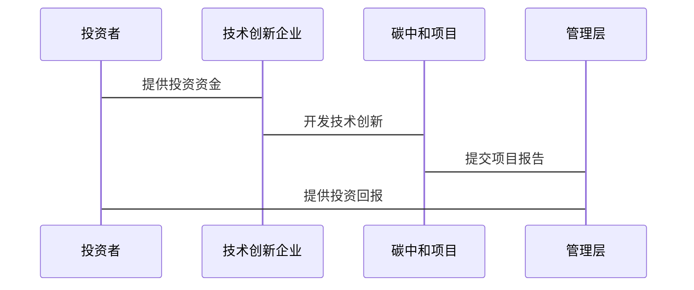

                 


# 碳中和技术创新企业的早期投资机会

> **关键词**：碳中和、技术创新企业、早期投资、投资机会、技术评估、风险分析

> **摘要**：本文探讨了在碳中和目标下，技术创新企业带来的早期投资机会。通过分析技术创新的核心原理、投资模式的对比、算法评估模型的实现，以及实际案例的分析，本文揭示了如何识别和评估这些机会，并提供了成功的投资策略和风险管理建议。

---

# 第一部分：碳中和技术创新企业的背景与概念

## 第1章：碳中和与技术创新企业的概述

### 1.1 碳中和的背景与目标

#### 1.1.1 碳中和的定义与意义
碳中和是指通过减少温室气体排放和增加碳汇，使碳排放总量在一定时间内达到净零。这一目标旨在应对气候变化，保护环境，推动可持续发展。碳中和不仅是全球共识，也是各国政策的核心目标。

#### 1.1.2 全球碳中和的目标与时间表
全球多个国家和地区已经设定了明确的碳中和时间表，例如欧盟计划在2050年实现碳中和，中国则承诺在2060年实现碳中和。这些目标推动了技术创新企业的发展，特别是在清洁能源、节能减排等领域。

#### 1.1.3 碳中和对经济和社会的影响
碳中和将推动经济结构的转型，促进绿色产业的发展，同时减少对化石能源的依赖。技术创新企业在这一过程中扮演着关键角色，通过开发新技术、新产品和新服务，推动社会向低碳经济转型。

### 1.2 技术创新企业的定义与特点

#### 1.2.1 技术创新企业的核心特征
技术创新企业是指那些通过技术研发和创新，提供具有市场竞争力的产品或服务的企业。这些企业通常具有较强的创新能力、研发投入较高，并且能够快速适应市场变化。

#### 1.2.2 技术创新与碳中和的关系
技术创新是实现碳中和的核心驱动力。通过技术创新，可以开发出更高效的能源利用技术、清洁生产工艺和环保技术，从而减少碳排放，推动可持续发展。

#### 1.2.3 技术创新企业在碳中和中的角色
技术创新企业是实现碳中和的关键力量。它们不仅提供技术解决方案，还推动产业链的优化和升级，为实现碳中和目标提供技术支持和产业支撑。

### 1.3 早期投资的重要性与挑战

#### 1.3.1 早期投资的定义与特点
早期投资是指在企业发展的初期阶段进行的投资，通常在种子期或初创期。早期投资具有高风险、高回报的特点，需要投资者具备较强的风险承受能力和市场洞察力。

#### 1.3.2 碳中和技术创新企业的早期投资机会
碳中和目标的推动为技术创新企业提供了广阔的市场空间。早期投资者可以通过投资这些企业，抓住技术变革带来的机会，实现资本增值。

#### 1.3.3 早期投资中的主要挑战与风险
早期投资面临技术风险、市场风险和政策风险等多重挑战。技术创新企业可能面临技术失败、市场需求不确定以及政策变化等问题，这些都会影响投资的回报。

---

## 第2章：碳中和技术创新的核心概念与联系

### 2.1 碳中和技术创新的核心原理

#### 2.1.1 碳中和技术创新的关键领域
碳中和技术创新涉及多个关键领域，包括清洁能源技术、节能减排技术、碳捕获与封存技术等。这些技术的应用可以显著减少碳排放，推动实现碳中和目标。

#### 2.1.2 各种技术创新的原理与机制
清洁能源技术通过替代化石能源，减少碳排放；节能减排技术通过提高能源利用效率，降低碳排放；碳捕获与封存技术则通过捕获和封存二氧化碳，实现碳中和。

#### 2.1.3 技术创新之间的相互关系
各种技术创新之间存在协同效应。例如，清洁能源技术的发展可以减少对化石能源的依赖，从而降低碳排放；而碳捕获技术则可以作为补充，进一步减少碳排放。

### 2.2 技术创新与投资模式的对比分析

#### 2.2.1 不同技术创新模式的对比
技术创新模式包括内部创新和外部创新。内部创新由企业自身进行技术研发，外部创新则通过合作、并购等方式获取技术。

#### 2.2.2 不同投资模式的优缺点
早期投资模式包括风险投资、天使投资和孵化器投资等。每种模式都有其优缺点，投资者需要根据自身情况选择合适的投资模式。

#### 2.2.3 技术创新与投资模式的协同效应
技术创新与投资模式的协同效应体现在技术创新推动企业发展，而投资模式为企业提供资金支持和技术资源。这种协同效应可以加速技术的商业化进程，实现双赢。

### 2.3 碳中和技术创新的ER实体关系图

```mermaid
er
actor:投资者
actor -[投资]-> 企业:技术创新企业
actor -[评估]-> 项目:碳中和项目
企业 -[开发]-> 技术:碳中和技术创新
项目 -[应用]-> 技术:碳中和技术创新
```

---

## 第3章：碳中和技术创新企业的算法原理

### 3.1 碳中和技术创新评估模型

#### 3.1.1 碳中和技术创新评估模型的定义
碳中和技术创新评估模型是一种用于评估技术创新企业在碳中和目标下投资价值的模型。该模型通过分析技术的可行性和市场潜力，帮助企业制定投资策略。

#### 3.1.2 碳中和技术创新评估模型的输入与输出
**输入**：技术创新企业的技术参数、市场需求、政策环境等。  
**输出**：技术创新企业的投资价值评估结果，包括技术可行性、市场潜力和投资回报率。

#### 3.1.3 碳中和技术创新评估模型的实现步骤
1. 收集技术创新企业的相关信息。  
2. 评估技术的可行性和创新性。  
3. 分析市场需求和政策环境。  
4. 计算投资回报率和风险。

### 3.2 碳中和技术创新评估的Python实现

```python
import numpy as np
import pandas as pd

def calculate_carbon_impact(technology, market_size):
    # 技术的碳影响系数
    carbon_impact = 0.5 * technology + 0.5 * market_size
    return carbon_impact

def assess_investment(value):
    if value > 0.8:
        return "High Potential"
    elif 0.5 < value <= 0.8:
        return "Medium Potential"
    else:
        return "Low Potential"

# 示例数据
technology = 0.7  # 技术创新度
market_size = 1.2  # 市场规模

impact = calculate_carbon_impact(technology, market_size)
investment_assessment = assess_investment(impact)

print(f"碳影响：{impact}")
print(f"投资评估：{investment_assessment}")
```

### 3.3 碳中和技术创新评估的数学模型

碳中和技术创新评估模型可以通过以下公式表示：

$$
\text{投资价值} = \alpha \times \text{技术创新度} + \beta \times \text{市场需求} + \gamma \times \text{政策支持}
$$

其中，$\alpha$、$\beta$、$\gamma$ 是模型的权重系数，技术创新度、市场需求和政策支持是模型的输入变量。

---

## 第4章：碳中和技术创新企业的系统分析与架构设计

### 4.1 问题场景介绍

碳中和技术创新企业的系统设计需要解决以下问题：如何高效评估技术创新企业的投资价值，如何实现技术创新的商业化，如何管理投资风险等。

### 4.2 系统功能设计

#### 4.2.1 领域模型（Mermaid 类图）

```mermaid
classDiagram

class 投资者 {
    - 投资金额
    - 投资目标
    - 投资策略
}

class 技术创新企业 {
    - 技术研发
    - 市场需求
    - 技术创新度
}

class 碳中和项目 {
    - 项目目标
    - 项目进度
    - 项目风险
}

抽像类抽像 {
    <<抽像类>>
}

抽像类抽像 <|-- 投资者
抽像类抽像 <|-- 技术创新企业
抽像类抽像 <|-- 碳中和项目
```

#### 4.2.2 系统架构设计（Mermaid 架构图）

```mermaid
container 碳中和技术创新系统 {
    participant 投资者
    participant 技术创新企业
    participant 碳中和项目
    participant 管理层
}

抽像类抽像抽像 <connect> 碳中和技术创新系统
抽像类抽像抽像 <connect> 投资者
抽像类抽像抽像 <connect> 技术创新企业
抽像类抽像抽像 <connect> 碳中和项目
抽像类抽像抽像 <connect> 管理层
```

#### 4.2.3 系统接口设计

系统接口包括投资者与技术创新企业的交互接口、技术创新企业与碳中和项目的接口等。每个接口需要定义输入和输出参数，确保系统的协同工作。

#### 4.2.4 系统交互（Mermaid 序列图）



---

## 第5章：碳中和技术创新企业的项目实战

### 5.1 环境配置与代码实现

#### 5.1.1 环境配置
安装必要的Python库，如numpy、pandas、matplotlib等。

#### 5.1.2 代码实现

```python
import numpy as np
import pandas as pd
import matplotlib.pyplot as plt

def visualize_trend(data):
    plt.plot(data.index, data['投资回报率'], label='投资回报率')
    plt.xlabel('时间')
    plt.ylabel('回报率')
    plt.title('投资回报率趋势')
    plt.legend()
    plt.show()

# 示例数据
data = pd.DataFrame({
    '投资回报率': [0.1, 0.2, 0.15, 0.25, 0.3]
})

visualize_trend(data)
```

### 5.2 案例分析与经验总结

#### 5.2.1 案例分析
以某新能源汽车企业为例，分析其技术创新和投资回报情况。

#### 5.2.2 经验总结
技术创新企业在碳中和目标下具有广阔的发展前景，早期投资需要关注技术可行性和市场需求。

---

## 第6章：碳中和技术创新企业的最佳实践

### 6.1 投资策略与风险管理

#### 6.1.1 投资策略
制定明确的投资策略，关注技术创新企业的技术可行性和市场潜力。

#### 6.1.2 风险管理
建立风险管理机制，识别和评估潜在风险，制定应对策略。

#### 6.1.3 退出机制
设计合理的退出机制，确保投资回报。

### 6.2 小结与展望

#### 6.2.1 小结
碳中和技术创新企业的早期投资机会巨大，但需要投资者具备较高的风险识别和管理能力。

#### 6.2.2 展望
随着碳中和目标的推进，技术创新企业将发挥越来越重要的作用。早期投资者应抓住机遇，积极布局，实现可持续发展。

---

## 结语

碳中和技术创新企业的早期投资机会是实现碳中和目标的重要途径。通过技术创新和投资模式的结合，投资者可以抓住市场机遇，推动技术创新企业的成长，实现共赢。未来，随着技术的进步和市场的成熟，碳中和技术创新企业将发挥更大的作用，为全球可持续发展做出贡献。

--- 

**注**：由于篇幅限制，以上内容为部分章节的示例，实际文章将包含更多细节和具体案例。

