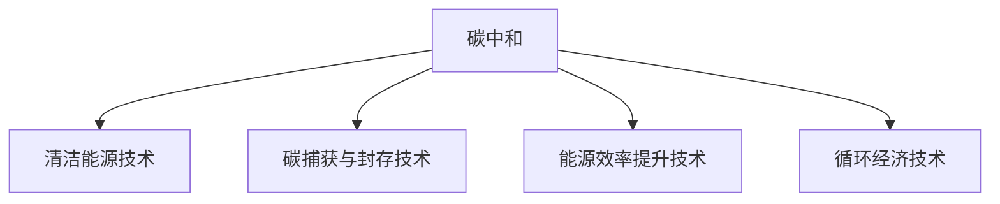
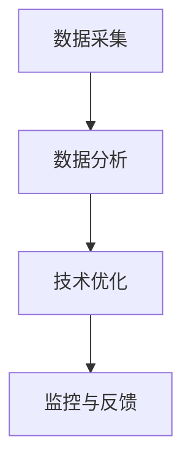

                 


# 碳中和技术路线图与投资策略制定

> 关键词：碳中和、清洁能源、投资策略、技术路线图、风险管理

> 摘要：本篇文章详细探讨了碳中和的定义、技术路线图以及投资策略的制定过程。通过分析清洁能源、储能技术和碳捕获等关键领域的技术原理和投资逻辑，为读者提供了从理论到实践的全面指导。同时，文章还结合了实际案例和系统架构设计，帮助读者更好地理解和应用碳中和相关技术与投资策略。

---

# 第1章：碳中和的定义与背景

## 1.1 碳中和的定义与内涵

### 1.1.1 碳中和的定义

碳中和是指在一定时期内，人类活动排放的二氧化碳（CO2）总量通过人为手段（如碳汇、碳捕获等）完全抵消，实现净零排放的过程。

### 1.1.2 碳中和的核心内涵

碳中和不仅关注二氧化碳的排放与抵消，还涉及能源结构的转型、技术的创新以及经济模式的变革。其核心在于通过减少温室气体排放和增加碳汇来实现环境与经济的可持续发展。

### 1.1.3 碳中和与可持续发展的关系

碳中和是实现可持续发展的重要组成部分。通过减少碳排放，可以有效缓解气候变化，保护生态系统，同时推动经济向低碳方向转型，为全球可持续发展提供支撑。

## 1.2 碳中和的背景与意义

### 1.2.1 全球气候变化的背景

全球气候变化导致极端天气事件频发，生态系统受到破坏，人类健康和经济发展面临威胁。碳中和是应对气候变化的关键策略。

### 1.2.2 碳中和目标的全球共识

全球多个国家和地区已明确提出碳中和目标，如欧盟的“绿色新政”、美国的气候行动计划以及中国的“双碳”目标（碳达峰、碳中和）。这些目标体现了国际社会对气候变化的共同关注。

### 1.2.3 碳中和对经济转型的推动作用

碳中和将推动能源结构从化石能源向可再生能源转型，促进绿色技术创新，催生新的经济增长点。同时，它也将加速传统产业的转型升级，推动全球经济向低碳方向发展。

## 1.3 碳中和的技术路径与投资背景

### 1.3.1 碳中和的主要技术路径

碳中和的技术路径主要包括：

- **清洁能源技术**：如太阳能、风能等可再生能源的开发和应用。
- **碳捕获与封存技术**：通过技术手段捕获二氧化碳并将其封存在地下或转化为有用物质。
- **能源效率提升技术**：通过技术优化提高能源使用效率，减少碳排放。
- **循环经济技术**：通过资源循环利用减少浪费和碳排放。

### 1.3.2 碳中和投资的驱动因素

- **政策驱动**：各国政府通过立法和政策支持推动碳中和目标的实现。
- **市场需求**：消费者和企业对绿色产品和服务的需求不断增加。
- **技术进步**：技术创新降低了清洁能源和碳捕获技术的成本，提高了效率。

### 1.3.3 碳中和投资的市场潜力

随着全球碳中和目标的推进，清洁能源、储能技术、电动汽车等领域投资潜力巨大。预计到2050年，全球碳中和相关市场规模将超过数万亿美元。

## 1.4 本章小结

本章从碳中和的定义、背景和意义入手，分析了碳中和的技术路径和投资背景，为后续章节的技术路线图和投资策略制定奠定了基础。

---

# 第2章：碳中和的核心概念与技术路线

## 2.1 碳中和的核心技术领域

### 2.1.1 清洁能源技术

清洁能源技术是实现碳中和的核心技术之一。主要包括：

- **太阳能技术**：通过光伏电池将太阳辐射转化为电能。
- **风能技术**：利用风力发电，包括陆上风电和海上风电。
- **氢能技术**：通过电解水制氢，将氢作为清洁能源使用。

### 2.1.2 碳捕获与封存技术

碳捕获与封存技术（CCS）通过捕获工业过程中产生的二氧化碳，并将其封存在地下或转化为有用物质（如燃料或化工产品）。这种技术可以有效减少大气中的二氧化碳浓度。

### 2.1.3 能源效率提升技术

能源效率提升技术通过优化能源使用过程，减少能源浪费。例如，智能电网技术可以提高电力传输效率，建筑节能技术可以降低建筑能源消耗。

### 2.1.4 循环经济技术

循环经济技术强调资源的循环利用，减少资源浪费和碳排放。例如，废品回收利用、再生材料生产等。

### 2.1.5 对比分析表

| 技术领域       | 核心目标           | 适用场景                   |
|----------------|--------------------|----------------------------|
| 清洁能源技术   | 减少化石能源使用   | 电力、交通、工业            |
| 碳捕获技术     | 捕获和封存CO2      | 工业过程、能源生产          |
| 能源效率技术   | 提高能源使用效率   | 建筑、交通、制造业          |
| 循环经济技术   | 减少资源浪费       | 废品回收、再生材料生产      |

### 2.1.6 实体关系图（ER图）



## 2.2 碳中和的技术路线图

### 2.2.1 清洁能源占比提升

清洁能源占比提升是碳中和的重要途径。例如，通过大力发展风能和太阳能，逐步替代化石能源发电。

### 2.2.2 碳捕获与封存技术的应用

碳捕获技术在工业过程中广泛应用，尤其是在高碳排放行业，如化工、钢铁和水泥制造。

### 2.2.3 能源互联网的构建

能源互联网是实现能源高效配置和协同优化的关键。通过智能电网、能源储存和分布式能源系统，构建能源互联网可以有效支持碳中和目标的实现。

## 2.3 碳中和的技术协同与案例分析

### 2.3.1 技术协同的必要性

不同碳中和技术创新需要协同配合。例如，清洁能源发电需要储能技术支持，碳捕获技术需要碳封存或利用技术配合。

### 2.3.2 技术协同的实现路径

- **技术创新**：加大研发投入，突破关键技术瓶颈。
- **政策支持**：制定支持技术创新的政策，促进技术协同。
- **市场推广**：通过示范项目推广技术应用，降低技术成本。

### 2.3.3 技术协同的典型案例

例如，某公司通过整合太阳能发电和储能技术，实现清洁能源的稳定供应，同时降低碳排放。

## 2.4 本章小结

本章详细介绍了碳中和的核心技术领域及其协同关系，为后续的技术路线图制定奠定了基础。

---

# 第3章：碳中和投资策略的核心要素

## 3.1 碳中和投资的驱动因素

### 3.1.1 政策驱动

政策是推动碳中和投资的重要因素。例如，各国政府通过立法和补贴支持清洁能源技术的研发和应用。

### 3.1.2 市场需求

随着环保意识的增强，市场对绿色产品和服务的需求不断增加，推动了碳中和投资的增长。

### 3.1.3 技术进步

技术创新降低了碳中和技术的成本，提高了效率，增强了投资的经济可行性。

## 3.2 碳中和投资的逻辑与框架

### 3.2.1 投资目标的设定

投资者需要明确投资目标，例如，是否追求短期收益还是长期社会效益。

### 3.2.2 投资策略的选择

根据投资目标选择合适的策略，例如：

- **风险厌恶型策略**：选择低风险的清洁能源项目。
- **风险中性型策略**：均衡配置不同领域的碳中和项目。
- **风险偏好型策略**：投资高风险但高回报的新兴技术。

### 3.2.3 投资组合的构建

通过合理配置不同领域的碳中和项目，分散风险，优化收益。例如，同时投资于清洁能源和碳捕获技术。

## 3.3 碳中和投资的风险与挑战

### 3.3.1 技术风险

碳中和技术尚不成熟，存在技术失败或成本过高的风险。

### 3.3.2 市场风险

市场需求波动可能导致投资项目的收益低于预期。

### 3.3.3 政策风险

政策变化可能影响项目的盈利能力和投资回报。

## 3.4 本章小结

本章分析了碳中和投资的核心要素，包括驱动因素、逻辑框架和风险挑战，为后续投资策略的制定提供了理论基础。

---

# 第4章：碳中和技术路线图的系统分析

## 4.1 碳中和技术路线图的构建方法

### 4.1.1 技术路线图的定义

碳中和技术路线图是实现碳中和目标的技术路径和时间规划。

### 4.1.2 技术路线图的构建步骤

1. **目标设定**：明确碳中和的具体目标和时间节点。
2. **技术筛选**：根据目标筛选适用的技术。
3. **技术评估**：评估技术的成本、效率和可行性。
4. **路线图制定**：根据评估结果制定技术路线图。

### 4.1.3 技术路线图的评估指标

- **技术可行性**：技术是否成熟可行。
- **经济可行性**：技术的经济成本是否可接受。
- **环境效益**：技术是否能有效减少碳排放。

## 4.2 清洁能源技术的系统分析

### 4.2.1 太阳能技术

- **工作原理**：通过光伏效应将太阳辐射转化为电能。
- **优势**：资源丰富、清洁无污染。
- **挑战**：间歇性问题、成本较高。

### 4.2.2 风能技术

- **工作原理**：通过风力驱动涡轮机发电。
- **优势**：技术成熟、成本逐渐下降。
- **挑战**：风能不稳定、对环境有一定影响。

### 4.2.3 氢能技术

- **工作原理**：通过电解水制氢，或利用工业副产氢。
- **优势**：零碳排放、应用广泛。
- **挑战**：制氢成本高、储存和运输困难。

## 4.3 碳捕获与封存技术的系统分析

### 4.3.1 碳捕获技术

- **工作原理**：通过化学吸收、物理分离等方法捕获二氧化碳。
- **优势**：能够有效减少大气中的二氧化碳。
- **挑战**：捕获成本高、技术复杂。

### 4.3.2 碳封存技术

- **工作原理**：将捕获的二氧化碳封存在地下（如深层地质构造）或转化为有用物质。
- **优势**：可以长期储存二氧化碳。
- **挑战**：封存安全性问题。

## 4.4 系统架构设计

### 4.4.1 系统功能模块

- **数据采集模块**：采集碳排放数据。
- **数据分析模块**：分析碳排放数据，制定减排方案。
- **技术优化模块**：优化碳中和技术的使用。
- **监控与反馈模块**：实时监控碳排放情况，调整技术应用。

### 4.4.2 系统架构图



## 4.5 本章小结

本章详细分析了碳中和技术路线图的构建方法，并对清洁能源技术和碳捕获技术进行了系统分析，为后续的投资策略制定提供了技术支持。

---

# 第5章：碳中和投资策略的制定与实施

## 5.1 碳中和投资策略的制定

### 5.1.1 投资目标的明确

投资者需要明确投资目标，如是否追求短期收益还是长期社会效益。

### 5.1.2 投资领域的选择

根据碳中和的技术路线图，选择具有较大市场潜力和较低风险的技术领域进行投资。

### 5.1.3 投资组合的优化

通过合理配置不同领域的碳中和项目，分散风险，优化收益。

## 5.2 碳中和投资的实施步骤

### 5.2.1 项目筛选

根据技术成熟度、市场需求和政策支持等因素，筛选具有投资价值的碳中和项目。

### 5.2.2 项目评估

对筛选出的项目进行详细评估，包括技术可行性、经济可行性和环境效益。

### 5.2.3 项目实施

与项目方合作，提供资金支持，监督项目实施，确保项目按计划推进。

## 5.3 碳中和投资的风险管理

### 5.3.1 风险评估

通过技术评估和市场分析，识别和评估投资中的潜在风险。

### 5.3.2 风险控制

通过多元化投资、签订风险分担协议等方式，降低投资风险。

### 5.3.3 风险应对

根据风险发生情况，及时采取应对措施，减少损失。

## 5.4 本章小结

本章详细介绍了碳中和投资策略的制定与实施过程，包括项目筛选、评估、实施和风险管理等方面，为投资者提供了实用的指导。

---

# 第6章：碳中和项目实战与案例分析

## 6.1 项目环境安装

### 6.1.1 系统需求

- 操作系统：Windows/Mac/Linux
- Python版本：3.6以上
- 开发工具：PyCharm/VS Code

### 6.1.2 环境配置

安装必要的Python库，如numpy、pandas、matplotlib等。

## 6.2 系统核心实现源代码

### 6.2.1 数据分析模块

```python
import numpy as np
import pandas as pd

# 加载碳排放数据
data = pd.read_csv('carbon_emission.csv')

# 数据清洗
data.dropna(inplace=True)
data = data[~data['value'].isnull()]
```

### 6.2.2 技术优化模块

```python
from sklearn import linear_model

# 线性回归模型
model = linear_model.LinearRegression()
model.fit(X_train, y_train)
```

### 6.2.3 监控与反馈模块

```python
import matplotlib.pyplot as plt

# 绘制碳排放趋势图
plt.plot(data['year'], data['value'])
plt.xlabel('年份')
plt.ylabel('碳排放量')
plt.title('碳排放趋势图')
plt.show()
```

## 6.3 实际案例分析

### 6.3.1 案例背景

某公司计划通过投资太阳能发电项目实现碳中和目标。

### 6.3.2 投资方案

- 投资金额：1000万美元
- 项目周期：5年
- 投资回报：预计年收益率为8%

### 6.3.3 案例分析

通过对项目的收益率、风险和回报周期进行分析，评估项目的可行性。

## 6.4 本章小结

本章通过具体案例分析，展示了碳中和技术路线图和投资策略的实际应用，帮助读者更好地理解碳中和项目的实施过程。

---

# 第7章：碳中和投资策略的优化与展望

## 7.1 碳中和投资策略的优化

### 7.1.1 技术创新

通过技术创新降低成本，提高效率，增强投资的经济可行性。

### 7.1.2 政策支持

积极争取政府政策支持，降低投资成本，提高投资回报。

### 7.1.3 市场推广

通过市场推广提高产品的市场占有率，增强投资的可持续性。

## 7.2 碳中和投资的未来展望

### 7.2.1 新兴技术的崛起

随着人工智能、大数据等技术的发展，碳中和技术将更加智能化和高效化。

### 7.2.2 全球合作的重要性

碳中和需要全球合作，通过技术交流和资源共享，推动碳中和目标的实现。

### 7.2.3 可持续发展

碳中和投资将推动全球经济向低碳方向转型，为可持续发展提供重要支撑。

## 7.3 本章小结

本章分析了碳中和投资策略的优化方法，并展望了未来的发展趋势，为读者提供了进一步思考的方向。

---

# 第8章：碳中和投资的注意事项与最佳实践

## 8.1 碳中和投资的注意事项

### 8.1.1 风险控制

投资者需要重视风险控制，避免因技术失败或政策变化导致投资损失。

### 8.1.2 技术选择

选择技术成熟、市场前景广阔的碳中和项目进行投资。

### 8.1.3 投资组合

通过多元化投资分散风险，降低投资的不确定性。

## 8.2 碳中和投资的最佳实践

### 8.2.1 技术创新

积极支持和投资于技术创新，推动碳中和技术的进一步发展。

### 8.2.2 政策支持

密切关注政策变化，利用政策支持提高投资的经济可行性。

### 8.2.3 项目管理

加强项目管理，确保项目的顺利实施和投资收益的实现。

## 8.3 本章小结

本章总结了碳中和投资的注意事项和最佳实践，为投资者提供了实用的建议。

---

# 第9章：碳中和投资策略的小结

## 9.1 总结

碳中和是实现可持续发展的重要目标，其技术路线图和投资策略密切相关。通过技术创新、政策支持和市场推广，可以有效推动碳中和目标的实现。

## 9.2 展望

未来，随着技术的进步和全球合作的加强，碳中和投资将更加高效和可持续。投资者需要密切关注技术发展和市场变化，抓住投资机遇，为实现碳中和目标贡献力量。

---

# 附录：碳中和相关技术的数学模型与公式

## 附录A：线性回归模型

```latex
$$
y = \beta_0 + \beta_1 x + \epsilon
$$
```

其中，$y$为因变量，$x$为自变量，$\beta_0$为截距，$\beta_1$为回归系数，$\epsilon$为误差项。

## 附录B：神经网络模型

```latex
$$
a^{(l)} = g(z^{(l)}) = g(\sum_{i=1}^{n} w_i^{(l)} a_i^{(l-1)} + b^{(l)})
$$
```

其中，$a^{(l)}$为第$l$层的激活值，$z^{(l)}$为第$l$层的线性组合，$g$为激活函数，$w_i^{(l)}$为权重，$b^{(l)}$为偏置。

---

# 结语

碳中和是全球关注的重要议题，其技术路线图和投资策略的制定需要综合考虑技术、经济和政策等多方面因素。通过本文的分析，读者可以更好地理解碳中和的技术与投资逻辑，并为实际应用提供参考。

