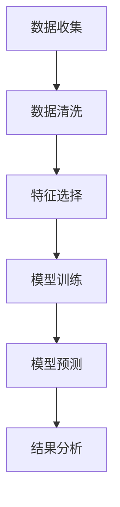
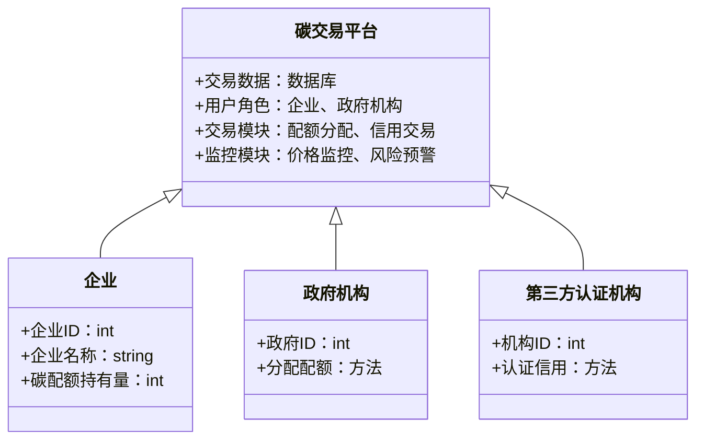

                 


# 《碳交易市场的发展与投资机会分析》

> 关键词：碳交易市场, 碳配额, 碳信用, 定价模型, 可持续发展

> 摘要：碳交易市场是全球应对气候变化的重要机制，通过碳配额和碳信用的交易，推动企业减少碳排放，促进可持续发展。本文将从碳交易市场的背景、核心机制、定价模型、系统架构及投资机会等多方面进行深入分析，帮助读者全面理解碳交易市场的运作及其带来的投资机遇。

---

# 第一部分：碳交易市场的背景与发展

## 第1章：碳交易市场的定义与背景

### 1.1 碳交易市场的定义与背景

碳交易市场是通过买卖碳配额或碳信用来实现减少温室气体排放的市场机制。它是全球应对气候变化的重要组成部分，旨在通过市场化的手段，将碳排放权转化为可交易的资源，推动企业主动减少碳排放。

#### 1.1.1 碳交易市场的定义

碳交易市场是指允许企业或组织在遵守一定规则和标准的前提下，通过买卖碳配额或碳信用来实现碳排放的减少。碳配额是一种允许排放一定量二氧化碳的许可，而碳信用则是通过减少碳排放或增加碳吸收（如植树造林）所获得的信用。

#### 1.1.2 碳交易市场的背景与发展趋势

随着全球气候变化问题的加剧，国际社会通过《京都议定书》和《巴黎协定》等国际条约，推动各国采取行动减少碳排放。碳交易市场作为一种市场化的减排工具，逐渐成为各国实现减排目标的重要手段。

全球碳交易市场规模持续增长，从欧洲的碳市场到北美的碳市场，再到亚洲的逐步发展，碳交易市场在全球范围内不断扩展。未来，随着更多国家和地区的加入，碳交易市场将更加成熟和完善。

#### 1.1.3 碳交易市场与可持续发展的关系

碳交易市场是实现可持续发展的重要工具。通过碳市场的运作，企业不仅能够实现减排目标，还能通过碳信用的交易获得经济收益，推动绿色技术创新和产业升级。碳交易市场在促进经济可持续发展的同时，也为全球应对气候变化提供了重要支持。

---

## 第2章：碳交易市场的核心机制

### 2.1 碳配额与碳信用的定义

碳配额是指政府分配给企业的一定时期内的碳排放额度，企业可以将未使用的配额在市场上出售，或者购买额外的配额以满足排放需求。碳信用则是通过减排项目产生的，每减少一吨二氧化碳排放，就可以获得一个碳信用。

#### 表2-1 碳配额与碳信用的对比

| **属性** | **碳配额** | **碳信用** |
|----------|------------|------------|
| **定义** | 政府分配的排放许可 | 通过减排项目获得的信用 |
| **用途** | 满足企业自身的排放需求 | 在市场上出售以获得收益 |
| **来源** | 政府分配 | 碳减排项目 |

### 2.2 碳交易市场的运作机制

碳交易市场的运作机制包括碳配额的分配、碳信用的生成与交易、碳市场的价格形成以及监管与合规等环节。

#### 图2-1 碳交易市场实体关系ER图

```mermaid
erDiagram
    actor 碳市场参与者 {
        +id : int
        +name : string
    }
    actor 企业 {
        +id : int
        +name : string
    }
    actor 政府机构 {
        +id : int
        +name : string
    }
    actor 第三方认证机构 {
        +id : int
        +name : string
    }
    actor 碳交易平台 {
        +id : int
        +name : string
    }
    碳配额 <o- 企业
    碳信用 <o- 第三方认证机构
    碳信用 <o- 碳交易平台
    碳配额 <o- 政府机构
```

---

## 第3章：碳交易市场的定价模型与算法原理

### 3.1 碳定价模型的概述

碳定价模型是用于预测和确定碳配额或碳信用价格的工具。常见的定价模型包括线性回归模型、非线性回归模型等。

#### 图3-1 线性回归模型流程图



#### 线性回归模型的数学公式

碳价格预测公式：
$$ \text{碳价格} = \beta_0 + \beta_1 \times \text{需求} + \beta_2 \times \text{供给} + \epsilon $$

其中，$\beta_0$是截距，$\beta_1$和$\beta_2$是回归系数，$\epsilon$是误差项。

### 3.2 碳定价模型的实现

以下是使用Python实现的线性回归模型代码：

```python
import numpy as np
from sklearn.linear_model import LinearRegression

# 示例数据
X = np.array([[1], [2], [3], [4], [5]])
y = np.array([2, 4, 5, 4, 6])

# 创建线性回归模型
model = LinearRegression()

# 训练模型
model.fit(X, y)

# 预测
new_X = np.array([[6]])
prediction = model.predict(new_X)

print("预测碳价格：", prediction[0])
```

---

## 第4章：碳交易市场的系统架构与设计

### 4.1 问题场景与系统功能设计

碳交易系统需要实现碳配额的分配、碳信用的生成与交易、价格监控等功能。以下是系统功能设计的类图：

#### 图4-1 碳交易系统类图



---

## 第5章：碳交易市场的投资机会与风险

### 5.1 投资机会分析

碳交易市场的快速发展带来了多种投资机会，包括碳配额交易、碳信用项目开发、碳金融产品等。投资者可以通过参与碳市场交易、投资低碳技术企业或开发碳减排项目等方式获利。

### 5.2 投资风险与应对策略

碳交易市场存在政策风险、市场波动风险和技术风险。投资者需要密切关注政策变化，合理分散投资组合，并选择具备技术优势的企业进行投资。

---

## 第6章：最佳实践与未来展望

### 6.1 最佳实践

- **多元化投资**：避免过度集中在某一类型的投资项目，分散风险。
- **关注政策动向**：及时了解各国碳政策的变化，抓住政策机遇。
- **技术支持**：利用大数据和人工智能技术优化投资决策。

### 6.2 未来展望

随着全球碳中和目标的推进，碳交易市场将更加成熟。未来，碳交易市场将与更多领域深度融合，如绿色金融、智能电网等，为投资者带来更多的机遇。

---

# 结语

碳交易市场作为应对气候变化的重要工具，正在全球范围内快速发展。通过本文的分析，读者可以全面了解碳交易市场的运作机制、定价模型及投资机会。未来，随着技术的进步和政策的完善，碳交易市场将继续推动全球经济的可持续发展。

