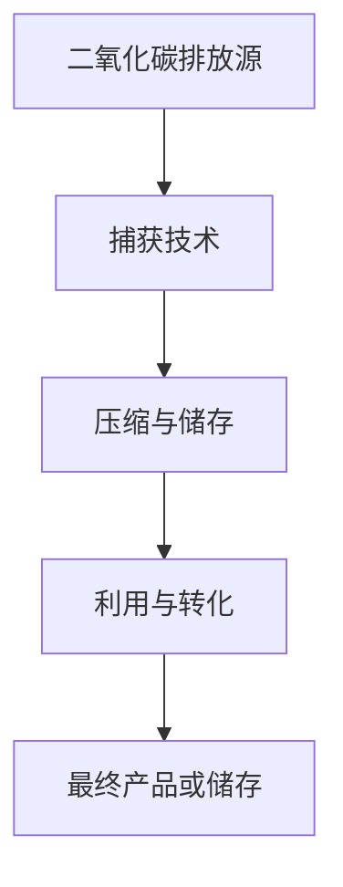
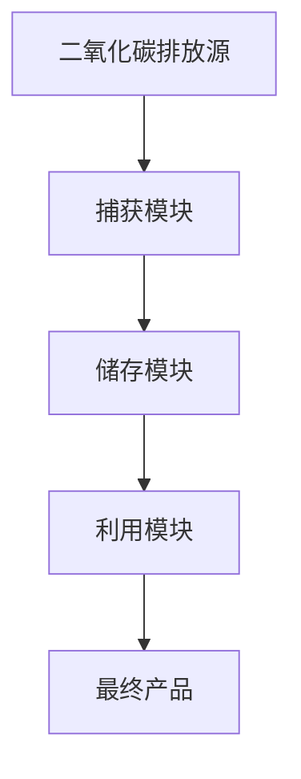

                 

# 碳捕获与利用技术的经济可行性分析

> 关键词：碳捕获与利用，经济可行性，碳中和，技术经济性，商业模式

> 摘要：碳捕获与利用技术是实现碳中和目标的重要手段之一。本文从技术背景、经济性分析、商业模式创新等方面，详细探讨了碳捕获与利用技术的经济可行性。通过成本-收益分析、技术路线对比和实际案例研究，提出了实现经济可行性的关键策略和建议。

---

# 第一部分: 碳捕获与利用技术的背景与概念

## 第1章: 碳捕获与利用技术概述

### 1.1 碳捕获与利用技术的背景

#### 1.1.1 全球气候变化的挑战
气候变化已成为全球性问题，温室气体排放是主要诱因。碳捕获与利用技术作为一种新兴的环保技术，能够有效减少大气中的二氧化碳浓度，缓解气候变化。

#### 1.1.2 工业化对碳排放的影响
工业化进程加速了化石燃料的使用，导致二氧化碳排放量急剧增加。传统减排手段（如能源转型）难以完全替代碳捕获技术。

#### 1.1.3 碳捕获与利用技术的必要性
碳捕获与利用技术能够从源头上减少碳排放，是实现碳中和目标的关键技术之一。

### 1.2 碳捕获与利用的核心概念

#### 1.2.1 碳捕获的定义与技术类型
碳捕获是指通过物理或化学方法捕获二氧化碳的过程。主要技术包括：
- **吸收法**：利用化学吸收剂（如胺类）捕获二氧化碳。
- **吸附法**：利用多孔材料（如活性炭）吸附二氧化碳。
- **膜分离法**：通过膜的选择透过性分离二氧化碳。

#### 1.2.2 碳利用的定义与应用场景
碳利用是将捕获的二氧化碳转化为高附加值产品或能源的过程。主要应用包括：
- **化工产品**：生产尿素、甲醇等。
- **建筑材料**：制备碳酸盐、生物水泥等。
- **能源存储**：合成甲烷、液化二氧化碳等。

#### 1.2.3 碳捕获与利用技术的边界与外延
碳捕获与利用技术的边界包括：
- **上游**：二氧化碳的捕获与压缩。
- **中游**：二氧化碳的运输与储存。
- **下游**：二氧化碳的利用与产品销售。

### 1.3 碳捕获与利用技术的核心要素

#### 1.3.1 技术流程图（Mermaid）

---

# 第二部分: 碳捕获与利用技术的经济性分析

## 第2章: 碳捕获与利用技术的经济性评估

### 2.1 碳捕获与利用技术的成本结构

#### 2.1.1 技术研发成本
技术研发成本包括实验室研究、小试、中试等阶段的投入。例如，某碳捕获技术的研发成本可能高达数百万美元。

#### 2.1.2 设备投资成本
碳捕获设备的初期投资成本较高，例如，一套大型碳捕获装置的投资成本可能在数千万美元以上。

#### 2.1.3 运行与维护成本
包括设备的日常维护、能源消耗、人工成本等。例如，每年的运维成本可能占总成本的10%-20%。

### 2.2 碳捕获与利用技术的收益分析

#### 2.2.1 碳信用额的收入
通过碳捕获技术捕获的二氧化碳可以转化为碳信用额，出售给需要减排的企业。碳信用额的价格取决于市场需求和政策支持。

#### 2.2.2 产品销售的收入
捕获的二氧化碳可以转化为高附加值产品，例如甲醇、尿素等，销售收入是重要的收益来源。

#### 2.2.3 技术服务的收入
碳捕获技术的开发和应用可以提供技术服务，例如技术转让、技术咨询等。

### 2.3 经济可行性分析模型

#### 2.3.1 成本-收益分析框架
成本-收益分析框架包括以下步骤：
1. 确定项目的总成本和总收益。
2. 计算净现值（NPV）和内部收益率（IRR）。
3. 评估项目的经济可行性。

#### 2.3.2 投资回收期计算
投资回收期 = 初始投资成本 / 年均净收益

#### 2.3.3 内部收益率（IRR）分析
IRR是使净现值为零的折现率，反映了项目的盈利能力。

### 2.4 碳捕获与利用技术的经济性对比

#### 2.4.1 不同技术路线的经济性对比
例如，吸收法的成本可能高于吸附法，但吸收法的技术成熟度更高。

#### 2.4.2 不同应用场景的经济性对比
工业领域碳捕获的经济性可能优于能源领域。

#### 2.4.3 经济性与技术成熟度的关系
技术成熟度越高，经济性越强。

---

# 第三部分: 碳捕获与利用技术的商业模式

## 第3章: 碳捕获与利用技术的商业模式

### 3.1 碳捕获与利用技术的商业模式类型

#### 3.1.1 技术授权模式
技术持有者通过授权使用技术获得收入。

#### 3.1.2 碳信用额交易模式
碳捕获企业通过出售碳信用额获得收入。

#### 3.1.3 产品销售模式
碳捕获企业通过销售利用产品获得收入。

### 3.2 碳捕获与利用技术的商业模式创新

#### 3.2.1 新型商业模式的特点
例如，碳捕获与可再生能源的结合，形成一体化商业模式。

#### 3.2.2 商业模式创新的案例分析
例如，某公司通过碳捕获技术生产生物燃料，实现碳减排和经济效益的双重目标。

#### 3.2.3 创新商业模式的可行性分析
需要考虑市场需求、技术可行性、政策支持等因素。

### 3.3 碳捕获与利用技术的经济性提升策略

#### 3.3.1 技术创新对经济性的影响
技术创新可以降低成本，提高效率，增强经济性。

#### 3.3.2 市场机制对经济性的影响
碳交易市场的完善可以提高碳捕获技术的经济性。

#### 3.3.3 政策支持对经济性的影响
政府补贴、税收优惠等政策可以降低技术成本，提高经济性。

---

# 第四部分: 碳捕获与利用技术的系统架构与实现

## 第4章: 碳捕获与利用技术的系统架构设计

### 4.1 碳捕获与利用技术的系统架构

#### 4.1.1 系统功能模块划分
- 捕获模块：捕获二氧化碳。
- 储存模块：压缩和储存二氧化碳。
- 利用模块：将二氧化碳转化为产品。

#### 4.1.2 系统架构图（Mermaid）

### 4.2 碳捕获与利用技术的实现

#### 4.2.1 碳捕获技术的实现
例如，使用化学吸收法捕获二氧化碳。

#### 4.2.2 碳利用技术的实现
例如，将二氧化碳转化为甲醇。

#### 4.2.3 系统的优化与集成
通过优化各模块的协同工作，提高系统的整体效率。

---

# 第五部分: 结论与展望

## 第5章: 结论与展望

### 5.1 研究结论
碳捕获与利用技术在经济上具有可行性，但需要技术创新和政策支持。

### 5.2 未来展望
随着技术的进步和政策的支持，碳捕获与利用技术有望成为实现碳中和的重要手段。

---

以上是《碳捕获与利用技术的经济可行性分析》的目录大纲，具体内容将围绕这些章节展开，涵盖技术背景、经济性分析、商业模式和系统架构等多个方面。

