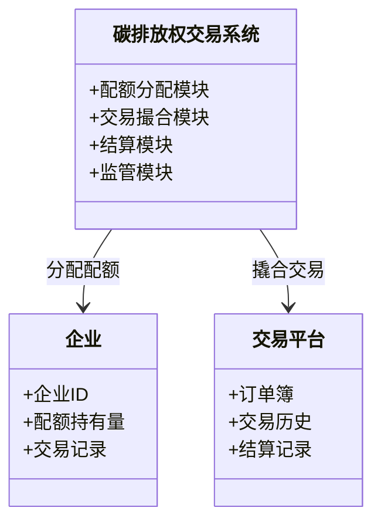
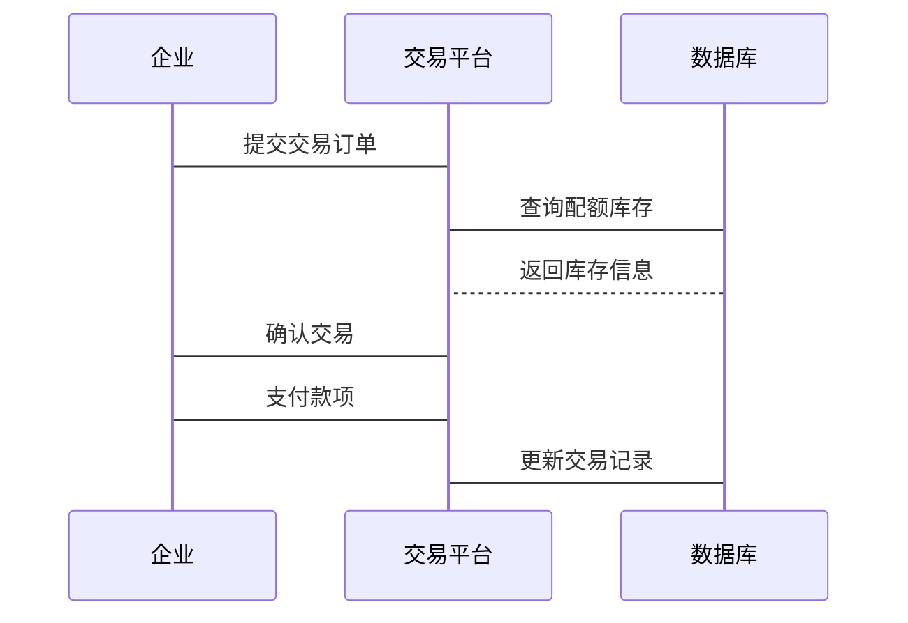

                 


# 《碳排放权交易市场的价格形成机制研究》

## 关键词：碳排放权交易、价格形成机制、市场供需、拍卖机制、气候变化应对

## 摘要：
碳排放权交易市场是应对气候变化的重要政策工具，其价格形成机制是市场运作的核心。本文系统分析了碳排放权交易市场的价格形成机制，探讨了供需关系、拍卖机制、信息不对称等因素对价格的影响，并通过案例分析和数学模型，深入剖析了价格波动的原因及影响。最后，本文提出了优化价格形成机制的建议，以提高市场的效率和稳定性。

---

# 第一部分: 碳排放权交易市场的背景与概念

## 第1章: 碳排放权交易市场的概述

### 1.1 碳排放权交易市场的定义与背景

#### 1.1.1 碳排放权交易的起源与发展
碳排放权交易起源于20世纪90年代，最初为应对气候变化，《京都议定书》确立了市场化的减排机制。随后，欧盟于2005年启动了世界首个碳排放权交易系统（EU ETS），标志着碳交易市场的正式形成。随着全球气候变化问题的加剧，碳排放权交易逐渐成为各国政府和企业的重要减排工具。

#### 1.1.2 碳排放权交易的全球现状
目前，全球多个地区建立了碳排放权交易市场，如欧盟的EU ETS、中国的全国碳市场、美国的区域温室气体 Initiative（RGGI）等。这些市场的规模和影响力不断提升，碳价格逐渐成为衡量减排成本的重要指标。

#### 1.1.3 碳排放权交易与气候变化应对的关系
碳排放权交易通过设定总量目标，将减排责任分配给企业和机构，激励其采取低成本减排措施。这种市场机制不仅降低了减排成本，还促进了低碳技术的创新和应用。

### 1.2 碳排放权交易市场的核心概念

#### 1.2.1 碳排放配额的定义与分配
碳排放配额是政府分配给企业的排放权，通常以吨二氧化碳当量为单位。配额可以通过免费分配或拍卖方式发放。免费分配基于历史排放和行业基准，而拍卖则通过市场竞价确定配额价格。

#### 1.2.2 碳排放权交易的基本流程
1. 配额分配：政府根据政策确定配额总量，并将其分配给企业。
2. 交易撮合：企业在交易平台上买卖配额，交易平台负责撮合交易并记录交易数据。
3. 履约与结算：企业根据分配的配额进行履约，交易平台进行结算。

#### 1.2.3 碳排放权交易市场的参与者
- **政府机构**：制定政策、分配配额、监管市场。
- **重点排放企业**：购买或出售配额以满足减排要求。
- **金融机构**：参与交易、提供融资支持。
- **非政府组织**：提供碳核查、咨询服务。

### 1.3 碳排放权交易市场的经济属性

#### 1.3.1 市场供需关系对价格的影响
碳排放权交易市场的价格受供需关系影响，供不应求时价格上涨，供大于求时价格下跌。

#### 1.3.2 价格弹性与市场效率
价格弹性反映了价格变动对交易量的影响。高效市场中，价格能够真实反映减排成本，促进资源优化配置。

#### 1.3.3 碳排放权交易的政策驱动因素
政府政策（如配额分配、监管力度）直接影响市场供需，进而影响碳价格。政策不确定性可能导致市场波动。

---

# 第二部分: 碳排放权交易市场的价格形成机制

## 第2章: 碳排放权交易市场的核心机制

### 2.1 碳排放权交易的基本原理

#### 2.1.1 配额分配的逻辑
配额分配需平衡公平性和激励性。公平性要求企业基于历史排放获得配额，激励性则要求企业通过技术进步或减排措施获得更多配额。

#### 2.1.2 交易的撮合机制
交易平台通过订单匹配系统撮合买卖双方交易，确保交易的透明性和公平性。交易系统记录交易数据，并提供实时价格信息。

#### 2.1.3 价格的形成过程
价格由市场供需决定，供需关系通过拍卖、竞价等方式形成。政府政策和市场参与者行为共同影响价格走势。

### 2.2 碳排放权交易市场的供需模型

#### 2.2.1 供给曲线的构建
供给曲线反映了碳配额供给量与价格的关系。当价格上升时，企业愿意提供更多配额。

#### 2.2.2 需求曲线的构建
需求曲线反映了企业在不同价格水平下的碳配额需求量。当价格上升时，企业需求量减少。

#### 2.2.3 市场均衡点的确定
市场均衡点是供给曲线和需求曲线的交点，此时价格和交易量达到平衡。

### 2.3 碳排放权交易市场的价格传导机制

#### 2.3.1 价格信号的传递路径
价格信号通过市场机制传递给企业，影响其减排行为和投资决策。

#### 2.3.2 市场参与者的定价策略
企业基于市场信息和自身成本制定交易策略，影响市场价格。

#### 2.3.3 价格波动对减排行为的影响
价格波动可能引发企业调整生产计划，改变减排行为。

---

## 第3章: 碳排放权交易市场的价格影响因素

### 3.1 市场供需关系的动态分析

#### 3.1.1 经济周期对需求的影响
经济繁荣时期，企业需求可能增加，导致碳配额需求上升，价格上升。

#### 3.1.2 政策调整对供给的影响
政府政策变化（如配额总量调整）会影响供给量，进而影响价格。

#### 3.1.3 技术进步对供需的改变
技术进步可能降低减排成本，减少对碳配额的需求，导致价格下降。

### 3.2 价格形成机制的数学模型

#### 3.2.1 基于供需均衡的价格模型
设供给函数为 $Q_s = a + bp$，需求函数为 $Q_d = c - dp$。市场均衡时 $Q_s = Q_d$，解方程组可得均衡价格 $p^* = (c - a)/(b + d)$。

#### 3.2.2 市场参与者行为的博弈模型
纳什均衡模型：企业基于自身利益选择最优策略，影响市场价格。

#### 3.2.3 价格波动的随机过程模型
碳价格可视为随机过程，服从几何布朗运动模型：$dP = \mu P dt + \sigma P dW$。

### 3.3 市场风险与价格稳定性的分析

#### 3.3.1 市场波动的来源
政策变化、经济波动、技术不确定性等因素可能导致价格波动。

#### 3.3.2 风险定价的机制
市场参与者通过套期保值、风险对冲等方式管理价格波动风险。

#### 3.3.3 价格稳定性对市场的作用
稳定的碳价格有助于企业制定长期减排计划，促进市场健康发展。

---

## 第4章: 碳排放权交易市场的实际案例分析

### 4.1 欧盟碳排放权交易系统（EU ETS）案例

#### 4.1.1 系统概述
EU ETS 是全球最大的碳市场，覆盖欧盟27个国家，涉及电力、工业等多个行业。

#### 4.1.2 价格形成机制
EU ETS 通过拍卖和二级市场交易确定碳价格，政府设定配额总量，市场供需决定价格。

#### 4.1.3 经验与启示
拍卖机制确保了价格的公平性，二级市场提高了市场的流动性和效率。

---

## 第5章: 碳排放权交易市场的系统分析与架构设计

### 5.1 系统功能设计

#### 5.1.1 领域模型（mermaid类图）


#### 5.1.2 系统架构设计（mermaid架构图）


### 5.2 系统接口设计

#### 5.2.1 交易接口
- `POST /trade`：提交交易订单
- `GET /price`：查询当前价格
- `PUT /settlement`：确认交易结算

### 5.3 系统交互设计（mermaid序列图）


---

## 第6章: 碳排放权交易市场的项目实战

### 6.1 环境安装

#### 6.1.1 安装Python环境
```bash
python --version
pip install --upgrade pip
```

#### 6.1.2 安装交易模拟工具
```bash
pip install carbon-trade-simulator
```

### 6.2 系统核心实现源代码

#### 6.2.1 配额分配模块
```python
def allocate_permit(total_emissions, num_enterprises):
    # 均匀分配
    permits_per_enterprise = total_emissions / num_enterprises
    return permits_per_enterprise
```

#### 6.2.2 交易撮合模块
```python
def match_trades(buy_orders, sell_orders):
    # 简单撮合算法
    matched_trades = []
    for price, qty in buy_orders.items():
        if price in sell_orders:
            qty_matched = min(qty, sell_orders[price])
            matched_trades.append((price, qty_matched))
    return matched_trades
```

### 6.3 案例分析

#### 6.3.1 模拟案例
假设某地区有5家企业，总配额为100万吨。模拟企业A和B的交易：
- 企业A购买50万吨，价格为每吨50欧元。
- 企业B出售30万吨，价格为每吨50欧元。
- 匹配后，企业A剩余20万吨需求，企业B剩余20万吨供给。

### 6.4 项目小结

#### 6.4.1 项目总结
通过模拟交易，验证了价格形成机制的合理性，证明了拍卖和供需关系对价格的影响。

#### 6.4.2 最佳实践
建议政府加强监管，确保市场公平透明；企业应积极参与交易，优化减排策略。

---

## 第7章: 结论与展望

### 7.1 研究总结
本文系统分析了碳排放权交易市场的价格形成机制，探讨了供需关系、拍卖机制、信息不对称等因素对价格的影响，并通过案例分析和数学模型，深入剖析了价格波动的原因及影响。

### 7.2 展望
未来，随着技术进步和政策完善，碳排放权交易市场将更加成熟，价格形成机制将更加优化，为全球气候变化应对做出更大贡献。

---

## 参考文献
1. 《京都议定书》
2. 《欧盟碳排放权交易系统规则》
3. 相关学术论文与研究报告

