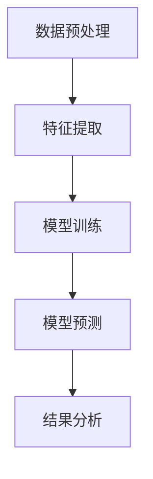
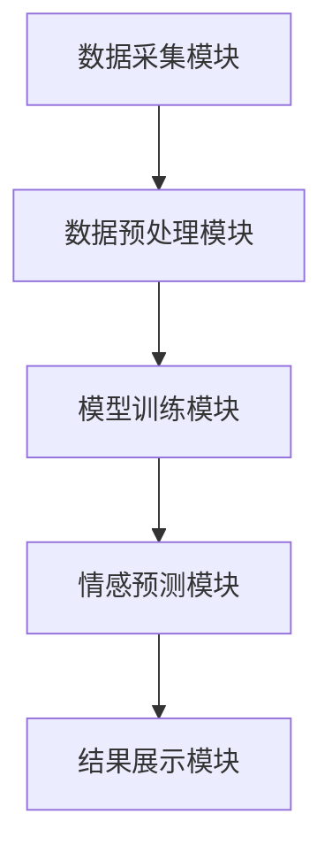

                 

# 社交媒体情绪分析：新型市场预测指标

## 关键词：
- 社交媒体情绪分析
- 市场预测
- 自然语言处理
- 深度学习
- 情感计算

## 摘要：
社交媒体情绪分析是一种利用自然语言处理技术，从社交媒体文本中提取情感信息的方法。随着社交媒体的普及，用户生成的内容成为重要的数据来源，通过分析这些内容中的情感倾向，可以为市场预测提供新的指标。本文详细探讨了社交媒体情绪分析的核心概念、算法原理、系统架构，并通过实战案例展示了其在市场预测中的应用。

---

# 第一部分: 社交媒体情绪分析的背景与核心概念

## 第1章: 社交媒体情绪分析的背景与应用

### 1.1 情绪分析的定义与背景

#### 1.1.1 情绪分析的定义
情绪分析（Sentiment Analysis），又称情感计算，是一种自然语言处理技术，旨在识别和分类文本中的情感倾向。它通过分析文本中的词汇、句法和语义信息，判断文本表达的情感是正面、负面还是中性。

#### 1.1.2 社交媒体在情绪分析中的重要性
社交媒体作为信息传播的主要平台，每天产生大量用户生成内容（UGC），如 tweets、帖子和评论。这些内容反映了用户对品牌、产品或事件的真实情感，成为市场预测的重要数据来源。

#### 1.1.3 情绪分析的应用领域
情绪分析广泛应用于金融、消费、社交媒体监控等领域。例如，在金融领域，投资者可以通过分析社交媒体上的情绪数据来预测市场走势；在消费领域，企业可以通过情绪分析了解消费者对产品的反馈，优化产品设计和服务。

### 1.2 社交媒体情绪分析的背景

#### 1.2.1 数字化时代的社交媒体发展
随着互联网和移动设备的普及，社交媒体成为人们日常生活的重要组成部分。每天有数十亿条社交媒体帖子产生，这些数据为情绪分析提供了丰富的原材料。

#### 1.2.2 情绪分析在市场预测中的作用
情绪分析可以帮助企业在市场预测中捕捉市场情绪的变化。例如，在金融领域，情绪分析可以用于股票价格预测；在消费领域，情绪分析可以帮助企业识别市场趋势和消费者偏好。

#### 1.2.3 当前情绪分析技术的挑战与机遇
尽管情绪分析技术已经取得了显著进展，但仍面临诸多挑战，如处理歧义性、讽刺和隐喻等复杂情感。这些挑战为技术改进和创新提供了机遇。

### 1.3 情绪分析的市场预测应用

#### 1.3.1 情绪分析与市场预测的关系
情绪分析通过识别社交媒体上的情感倾向，帮助市场预测者了解市场情绪的变化趋势。市场情绪的变化往往会影响市场行为，从而影响市场走势。

#### 1.3.2 情绪分析在金融市场的应用
在金融市场中，情绪分析可以帮助投资者预测股票价格的变化。例如，通过分析社交媒体上的情绪数据，投资者可以预测市场波动和趋势。

#### 1.3.3 情绪分析在消费市场的应用
在消费市场中，情绪分析可以帮助企业了解消费者对产品和服务的反馈，从而优化产品设计和市场策略。

---

## 第2章: 情绪分析的核心概念与联系

### 2.1 情绪分析的核心概念

#### 2.1.1 情感计算的定义与特点
情感计算是一种通过计算机技术分析和处理人类情感信息的方法。它不仅关注情感的识别和分类，还关注情感的生成和应用。

#### 2.1.2 文本处理的基本原理
文本处理是情绪分析的基础，包括文本的预处理、特征提取和分类。预处理包括分词、去停用词和词干提取；特征提取包括TF-IDF和词嵌入；分类包括情感分类和主题分类。

#### 2.1.3 情感特征提取的原理
情感特征提取是从文本中提取与情感相关特征的过程。常用的特征包括词汇、句法和语义特征。情感特征提取可以通过统计方法或机器学习方法实现。

### 2.2 情绪分析的核心要素

#### 2.2.1 数据采集与预处理
数据采集是情绪分析的第一步，包括从社交媒体API获取数据。预处理包括文本清洗、分词和停用词处理。

#### 2.2.2 情感分类模型的构建
情感分类模型是情绪分析的核心，包括特征提取和模型训练。特征提取包括TF-IDF和词嵌入；模型训练包括机器学习和深度学习方法。

#### 2.2.3 情感分析结果的解释与应用
情感分析结果可以通过可视化工具进行展示，并应用于市场预测和品牌监控等领域。

### 2.3 情感分析的核心要素联系

#### 2.3.1 情感计算与自然语言处理
情感计算与自然语言处理密切相关，情感分析是自然语言处理的重要应用之一。

#### 2.3.2 情感分类与文本挖掘
情感分类是文本挖掘的重要任务，文本挖掘通过从文本中提取信息，帮助情感分析。

#### 2.3.3 情感分析与数据挖掘
情感分析是数据挖掘的重要应用，数据挖掘通过分析情感数据，帮助市场预测和决策。

---

## 第3章: 情绪分析的算法原理

### 3.1 情感分类的常见算法

#### 3.1.1 词袋模型与TF-IDF
词袋模型是一种基于词袋的文本表示方法，TF-IDF是一种常用的特征加权方法。

#### 3.1.2 词嵌入技术（如Word2Vec、GloVe）
词嵌入技术通过将词表示为低维向量，捕捉词的语义信息。

#### 3.1.3 深度学习模型（如LSTM、BERT）
深度学习模型通过学习长序列依赖，捕捉文本的语义信息。

### 3.2 基于机器学习的情感分类

#### 3.2.1 支持向量机（SVM）的原理
SVM通过构建超平面，将数据分成不同的类别。

#### 3.2.2 随机森林的原理
随机森林通过构建多个决策树，投票决定最终结果。

#### 3.2.3 神经网络模型的原理
神经网络模型通过多层感知机，学习文本的特征表示。

### 3.3 情感分类的流程图

---

## 第4章: 情感分析的数学模型与公式

### 4.1 词袋模型与TF-IDF

#### 4.1.1 词袋模型的向量表示
词袋模型将文本表示为词袋，每个词的位置和数量决定了文本的表示。

#### 4.1.2 TF-IDF的计算公式
$$TF-IDF(t, d) = TF(t, d) \times ID(d, t)$$

### 4.2 逻辑回归模型

#### 4.2.1 逻辑回归的损失函数
$$L = -\sum_{i=1}^{n} [y_i \ln p_i + (1 - y_i) \ln (1 - p_i)]$$

#### 4.2.2 逻辑回归的优化目标
$$\min_{\theta} L + \lambda \|\theta\|^2$$

### 4.3 神经网络模型

#### 4.3.1 LSTM的结构
LSTM通过门控机制，解决RNN的梯度消失问题。

#### 4.3.2 BERT的预训练目标
$$\text{Masked Loss} = -\sum_{i=1}^{n} \text{CrossEntropy}(y_i, \hat{y}_i)$$

---

## 第5章: 情感分析系统的架构设计

### 5.1 系统功能设计

#### 5.1.1 数据采集模块
数据采集模块负责从社交媒体API获取数据。

#### 5.1.2 数据预处理模块
数据预处理模块负责清洗和标注数据。

#### 5.1.3 模型训练
模型训练模块负责训练情感分类模型。

#### 5.1.4 情感预测
情感预测模块负责对新数据进行情感分类。

#### 5.1.5 结果展示
结果展示模块负责可视化情感分析结果。

### 5.2 系统架构图

---

## 第6章: 情感分析系统的实现

### 6.1 项目实战

#### 6.1.1 环境安装
需要安装Python、TensorFlow和Keras等库。

#### 6.1.2 数据预处理
使用NLTK库进行文本清洗和分词。

#### 6.1.3 模型训练
使用预训练的词嵌入和深度学习模型进行训练。

#### 6.1.4 情感预测
对测试数据进行情感预测，并评估模型性能。

#### 6.1.5 结果分析
分析情感预测结果，并可视化情感分布。

### 6.2 案例分析

#### 6.2.1 数据来源
从Twitter API获取社交媒体数据。

#### 6.2.2 数据清洗
去除停用词和标点符号。

#### 6.2.3 模型训练
使用LSTM模型进行情感分类。

#### 6.2.4 情感预测
对新数据进行情感预测，并展示结果。

#### 6.2.5 结果分析
分析情感预测结果，并优化模型性能。

---

## 第7章: 总结与展望

### 7.1 总结
社交媒体情绪分析是一种重要的市场预测工具，可以帮助企业和投资者了解市场情绪的变化趋势。

### 7.2 未来展望
未来，情绪分析技术将更加智能化和自动化，应用场景将更加广泛。同时，情感分析也将更加注重情感的深度理解和生成。

---

通过以上内容，我们可以看到，社交媒体情绪分析在市场预测中的应用前景广阔。随着技术的不断发展，情感分析将成为企业决策的重要工具，帮助企业更好地理解市场和消费者的需求。

