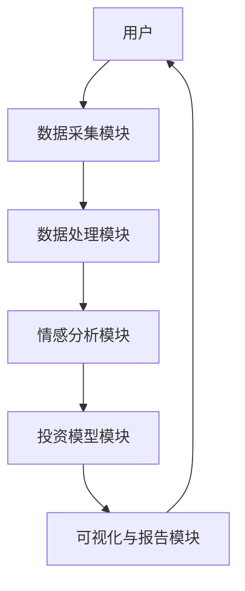

                 


# 社交媒体数据分析：新型投资信息来源

## 关键词：社交媒体数据、数据分析、投资信息、自然语言处理、情感分析、网络分析

## 摘要：  
社交媒体数据作为一种新兴的投资信息来源，正在改变传统的金融分析方式。通过自然语言处理和情感分析等技术，投资者可以从社交媒体中提取实时的市场情绪、行业趋势和潜在投资机会。本文将详细探讨社交媒体数据分析的核心方法，包括数据收集、预处理、情感分析、社交网络分析，以及如何将这些分析结果应用于投资决策。通过实际案例分析和系统架构设计，本文为读者提供了一套完整的社交媒体数据分析解决方案，帮助投资者在数字化时代中获得竞争优势。

---

## 第一部分：背景与核心概念

### 第1章：社交媒体数据分析的背景与重要性

#### 1.1 社交媒体数据的兴起  
- **1.1.1 社交媒体的定义与特点**  
  社交媒体是互联网时代的重要产物，用户通过社交平台分享信息、表达观点、建立联系。社交媒体数据包括文本、图片、视频、点赞、评论、转发等多种形式，具有实时性、互动性和海量性的特点。  

- **1.1.2 社交媒体数据的爆发式增长**  
  随着移动互联网和社交媒体应用的普及，社交媒体数据呈现指数级增长。据统计，全球每天产生的社交媒体数据超过25亿条，这些数据蕴含着丰富的市场信息和投资机会。  

- **1.1.3 社交媒体数据在投资中的潜在价值**  
  传统的金融分析依赖于历史数据和基本面研究，而社交媒体数据提供了实时的市场情绪、用户行为和行业动态，为投资者提供了新的视角。例如，可以通过社交媒体数据预测市场趋势、评估公司声誉或发现新兴行业热点。  

#### 1.2 投资信息的新来源  
- **1.2.1 传统投资信息来源的局限性**  
  传统投资信息来源包括财务报表、行业报告和新闻媒体，这些数据通常具有滞后性，且难以捕捉市场的实时情绪和用户行为。  

- **1.2.2 社交媒体数据作为投资信息的新渠道**  
  社交媒体数据的实时性和多样性使其成为投资信息的重要来源。例如，通过分析社交媒体上的用户评论，可以预测某只股票的市场情绪变化。  

- **1.2.3 社交媒体数据的实时性和互动性优势**  
  社交媒体数据能够捕捉市场的实时动态，例如突发事件、政策变化或用户反馈，这些信息可以帮助投资者快速调整投资策略。  

---

### 第2章：社交媒体数据分析的核心概念

#### 2.1 数据收集与处理  
- **2.1.1 数据获取的挑战与解决方案**  
  社交媒体数据的获取需要面对API限制、数据格式多样性和隐私保护等问题。解决方案包括使用公开API、爬虫技术或第三方数据服务提供商。  

- **2.1.2 数据清洗与预处理方法**  
  数据清洗包括去除噪声、处理缺失值和标准化数据。预处理步骤包括分词、停用词过滤和词干提取，以便后续的文本挖掘和情感分析。  

- **2.1.3 数据标注与特征提取**  
  数据标注包括情感标签、主题分类和实体识别。特征提取可以通过TF-IDF或词嵌入技术（如Word2Vec）实现。  

#### 2.2 情感分析与情绪指标  
- **2.2.1 情感分析的基本原理**  
  情感分析是通过自然语言处理技术判断文本的情感倾向（如正面、负面或中性）。常用算法包括基于规则的分类和机器学习模型（如SVM、随机森林）。  

- **2.2.2 情绪指标的构建与应用**  
  情绪指标是将社交媒体上的情绪数据进行量化，用于衡量市场整体情绪或特定资产的情绪变化。例如，可以将情绪指标与股票价格进行对比，寻找情绪与价格的相关性。  

- **2.2.3 基于社交媒体情绪的市场预测**  
  通过分析社交媒体情绪的变化，可以预测市场的短期波动。例如，当市场情绪突然转向负面时，可能预示着股价的下跌。  

#### 2.3 社交网络分析  
- **2.3.1 社交网络的结构特征**  
  社交网络分析包括节点（用户）和边（关系）的分析。节点的度数、中心性和社区划分可以帮助识别关键用户和信息传播路径。  

- **2.3.2 社会网络分析在投资中的应用**  
  通过社交网络分析，可以识别市场中的意见领袖和信息传播者，从而预测市场趋势或发现投资机会。  

- **2.3.3 基于网络效应的投资策略**  
  网络效应可以通过分析社交网络的结构特征来优化投资策略。例如，关注高影响力用户的动向可以帮助投资者提前发现市场变化。  

---

## 第二部分：数据分析方法与模型构建

### 第3章：文本挖掘与情感分析

#### 3.1 文本挖掘的基本原理  
- **3.1.1 分词与词袋模型**  
  分词是将文本分割成词语的过程，词袋模型将文本表示为词语的集合。  

- **3.1.2 词嵌入与文本表示**  
  词嵌入（如Word2Vec）通过将词语映射到低维向量空间，捕捉词语的语义信息。  

- **3.1.3 基于深度学习的文本理解**  
  深度学习模型（如LSTM和Transformer）可以捕捉文本的上下文关系，提升文本理解能力。  

#### 3.2 情感分析算法  
- **3.2.1 基于传统机器学习的情感分析**  
  使用SVM或随机森林模型进行情感分类，特征包括词袋模型、TF-IDF和情感词典。  

- **3.2.2 基于深度学习的情感分析模型**  
  Transformer模型（如BERT）通过预训练任务捕捉文本的情感信息，提升分类准确率。  

- **3.2.3 情感分析的评估指标与优化方法**  
  常见评估指标包括准确率、召回率和F1分数。优化方法包括数据增强、超参数调优和模型集成。  

#### 3.3 情感分析的数学模型  
- **情感分析的二分类模型**  
  使用逻辑回归进行二分类（正面或负面）：  
  $$ P(y=1|x) = \frac{e^{\beta x}}{1 + e^{\beta x}} $$  
  其中，$\beta$是模型参数，$x$是文本特征向量。  

- **基于深度学习的情感分类模型**  
  使用Transformer架构进行情感分类，模型结构包括编码层和解码层。  

#### 3.4 情感分析的案例分析  
- **案例：股票市场情绪分析**  
  通过分析社交媒体上的评论，预测某只股票的情绪变化。例如，当情绪指数超过阈值时，触发买入信号。  

---

### 第4章：基于社交媒体数据的投资模型

#### 4.1 投资模型的构建逻辑  
- **4.1.1 数据特征的选择与权重分配**  
  特征包括情感指标、市场情绪、关键词提及频率等。权重分配可以通过特征重要性分析确定。  

- **4.1.2 模型的输入与输出设计**  
  输入包括文本数据和情感指标，输出包括投资决策（如买入、卖出或持有）。  

- **4.1.3 模型的训练与验证**  
  使用训练数据进行模型训练，通过验证集评估模型性能。  

#### 4.2 常见的投资模型与算法  
- **4.2.1 基于逻辑回归的投资预测模型**  
  逻辑回归模型用于预测股票价格的变化方向。  
  $$ P(y=1|x) = \frac{e^{\beta x}}{1 + e^{\beta x}} $$  

- **4.2.2 基于随机森林的特征重要性分析**  
  随机森林通过特征重要性分析识别影响投资决策的关键因素。  

- **4.2.3 基于神经网络的情感驱动模型**  
  使用LSTM或Transformer模型捕捉社交媒体数据中的情感动态。  

#### 4.3 模型的优化与调参  
- **4.3.1 超参数调优方法**  
  使用网格搜索或随机搜索优化模型参数。  

- **4.3.2 基于网格搜索的参数优化**  
  通过网格搜索找到最优参数组合，例如学习率、批次大小和隐藏层大小。  

- **4.3.3 模型的鲁棒性与泛化能力提升**  
  通过数据增强、正则化和交叉验证提升模型的泛化能力。  

---

## 第三部分：系统分析与架构设计

### 第5章：投资信息分析系统的架构设计

#### 5.1 系统功能模块划分  
- **5.1.1 数据采集模块**  
  通过API或爬虫获取社交媒体数据。  

- **5.1.2 数据处理模块**  
  对数据进行清洗、分词和特征提取。  

- **5.1.3 情感分析模块**  
  使用深度学习模型进行情感分类。  

- **5.1.4 投资模型模块**  
  构建投资预测模型并生成投资信号。  

- **5.1.5 可视化与报告模块**  
  可视化分析结果并生成报告。  

#### 5.2 系统架构设计  
- **5.2.1 分层架构设计**  
  系统分为数据层、业务逻辑层和用户界面层。  

- **5.2.2 微服务架构设计**  
  通过微服务架构实现模块化设计，提升系统的可扩展性和可维护性。  

- **5.2.3 系统交互流程**  
  用户输入查询条件，系统返回分析结果和投资建议。  

#### 5.3 系统架构图  


---

### 第6章：系统实现与案例分析

#### 6.1 系统实现  
- **6.1.1 环境安装**  
  安装Python、TensorFlow、Keras和自然语言处理库（如spaCy和NLTK）。  

- **6.1.2 核心实现代码**  
  ```python
  import tensorflow as tf
  from tensorflow.keras import layers

  model = tf.keras.Sequential()
  model.add(layers.Embedding(input_dim=10000, output_dim=16))
  model.add(layers.Dropout(0.5))
  model.add(layers.Dense(1, activation='sigmoid'))
  model.compile(loss='binary_crossentropy', optimizer='adam', metrics=['accuracy'])
  ```

- **6.1.3 代码解读与分析**  
  上述代码实现了一个简单的文本分类模型，使用嵌入层、Dropout层和全连接层进行情感分类。  

#### 6.2 案例分析  
- **案例：社交媒体情绪与股票价格预测**  
  通过分析社交媒体数据，构建情绪指标并与股票价格进行对比，验证情绪指标对股价预测的准确性。  

---

## 结语  
社交媒体数据分析为投资领域带来了新的机遇和挑战。通过自然语言处理和深度学习技术，投资者可以更高效地捕捉市场情绪和用户行为，制定更具前瞻性的投资策略。未来，随着技术的进步，社交媒体数据分析将在投资领域发挥更大的作用，成为投资者不可或缺的工具。  

---

