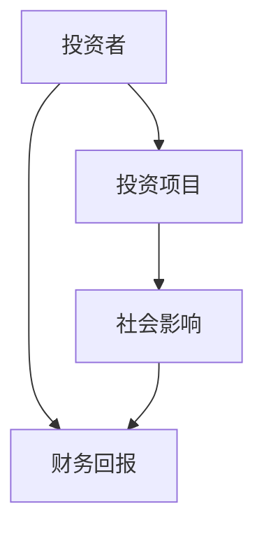
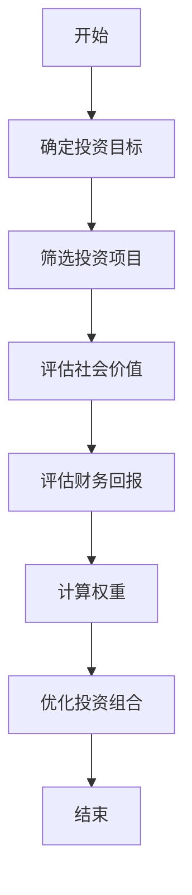
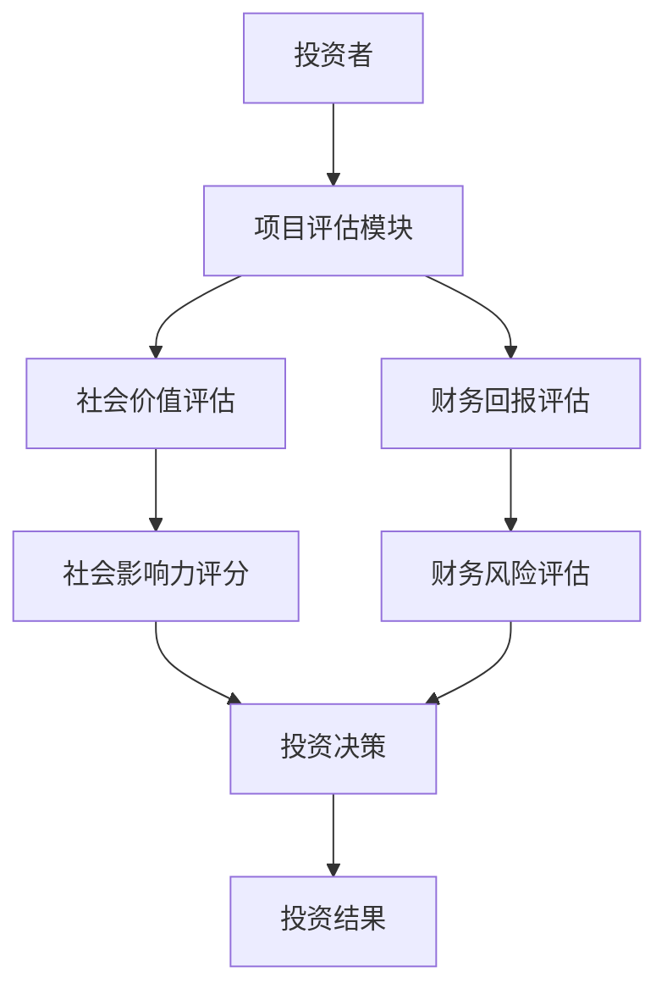
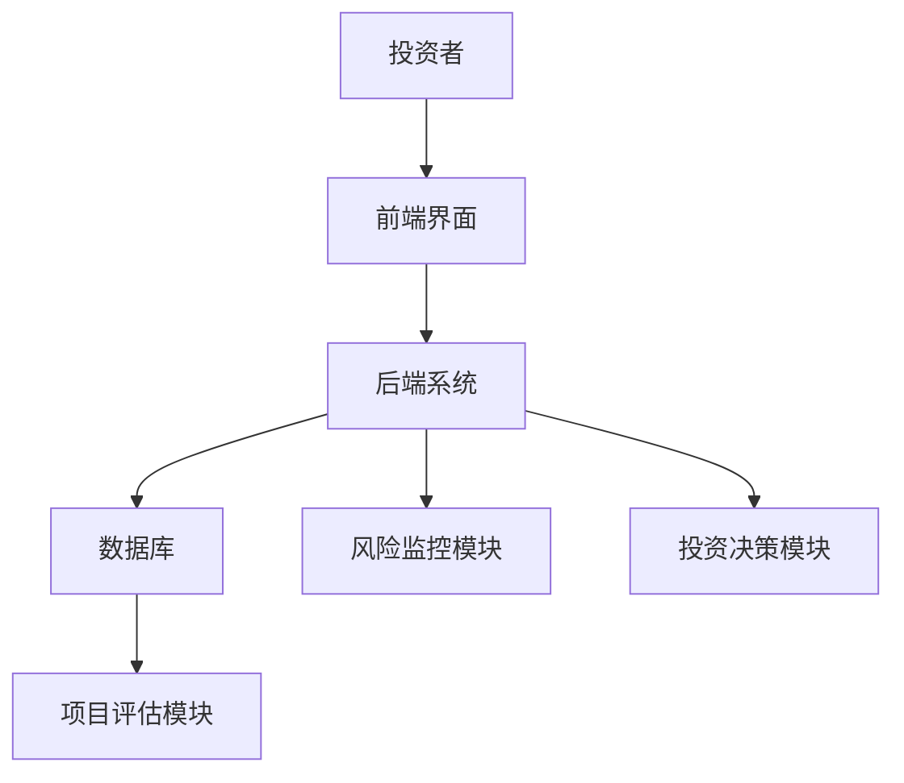

                 


# 社会影响力投资：追求双重回报的策略

## 关键词
社会影响力投资、双重回报、可持续发展、财务回报、社会价值

## 摘要
社会影响力投资是一种结合了社会责任和投资回报的投资策略，旨在通过投资实现财务回报的同时，推动社会问题的解决。本文将详细探讨社会影响力投资的背景、理论基础、策略与方法、系统架构、项目实战以及未来展望，帮助读者理解如何在投资中实现社会价值与财务回报的双重目标。

---

# 第一部分: 社会影响力投资的背景与概念

## 第1章: 社会影响力投资的背景介绍

### 1.1 社会问题与投资背景
#### 1.1.1 当前社会问题的现状
全球面临气候变化、贫富差距、教育不平等、环境污染等一系列社会问题，这些问题需要通过多方努力来解决。投资作为资源配置的重要手段，可以在其中发挥关键作用。

#### 1.1.2 投资在社会问题中的角色
投资不仅是经济发展的驱动力，也可以成为推动社会变革的工具。通过将资金投入到解决社会问题的项目中，投资者可以在实现财务回报的同时，为社会做出贡献。

#### 1.1.3 可持续发展与投资的结合
可持续发展理念的兴起，使得越来越多的投资者关注环境保护、社会责任和公司治理（ESG）等因素。社会影响力投资正是这一趋势的体现。

### 1.2 社会影响力投资的定义与问题描述
#### 1.2.1 社会影响力投资的核心概念
社会影响力投资是指通过投资于企业和项目，旨在解决社会问题并产生积极的社会影响，同时追求财务回报的投资方式。

#### 1.2.2 投资中的社会价值与财务回报的平衡
社会影响力投资强调在追求财务回报的同时，创造社会价值。这种平衡可以通过优化投资组合和选择合适的项目来实现。

#### 1.2.3 社会影响力投资的边界与外延
社会影响力投资不仅限于非营利组织，也包括企业和社会企业。其外延涉及教育、医疗、环保、就业等多个领域。

### 1.3 社会影响力投资的核心要素
#### 1.3.1 投资目标的设定
社会影响力投资的目标通常包括解决社会问题、改善民生、促进可持续发展等。

#### 1.3.2 投资对象的选择标准
投资者需要选择那些在创造社会价值的同时具备良好财务回报潜力的项目或企业。

#### 1.3.3 投资过程中的社会价值评估
通过建立科学的评估体系，投资者可以量化投资项目带来的社会影响，确保投资目标的实现。

## 第2章: 社会影响力投资的核心概念与联系

### 2.1 核心概念原理
#### 2.1.1 社会影响力投资的理论基础
社会影响力投资的理论基础包括社会价值论、投资组合理论和可持续发展理论。这些理论为社会影响力投资提供了坚实的学术支持。

#### 2.1.2 投资中的社会价值创造机制
通过优化资源配置、支持创新和社会企业的成长，投资可以有效推动社会问题的解决。

#### 2.1.3 社会影响力与财务回报的协同作用
社会影响力投资通过平衡社会价值和财务回报，实现双重目标。

### 2.2 核心概念属性特征对比表
| 属性 | 社会影响力投资 | 传统投资 |
|------|----------------|----------|
| 目标 | 解决社会问题 + 财务回报 | 财务回报为主 |
| 风险 | 社会风险 + 金融风险 | 金融风险为主 |
| 评估 | 社会价值 + 财务指标 | 财务指标为主 |

### 2.3 ER实体关系图


---

# 第二部分: 社会影响力投资的理论与方法

## 第3章: 社会影响力投资的理论基础

### 3.1 社会价值评估模型
#### 3.1.1 社会价值的定义与测量
社会价值是指投资项目对社会问题解决的贡献，可以通过量化指标进行评估。

#### 3.1.2 社会价值评估的数学模型
$$ S = \sum_{i=1}^{n} w_i \cdot V_i $$
其中，$S$ 表示社会价值，$w_i$ 是第 $i$ 个社会价值维度的权重，$V_i$ 是第 $i$ 个维度的值。

### 3.2 社会影响力投资框架
#### 3.2.1 投资框架的构建
社会影响力投资框架包括目标设定、项目选择、评估与反馈等环节。

#### 3.2.2 投资决策中的社会影响力权重分配
$$ W = \alpha \cdot W_s + (1-\alpha) \cdot W_f $$
其中，$W$ 是总权重，$\alpha$ 是社会影响力权重，$W_s$ 是社会价值权重，$W_f$ 是财务回报权重。

### 3.3 算法原理讲解
#### 3.3.1 社会影响力投资组合优化算法


#### 3.3.2 代码实现
```python
def social_influence_score(project_data):
    # 项目数据包括社会价值和社会回报率
    social_value = project_data['social_value']
    financial_return = project_data['financial_return']
    alpha = 0.7  # 社会影响权重
    score = alpha * social_value + (1 - alpha) * financial_return
    return score
```

---

## 第4章: 社会影响力投资的策略与方法

### 4.1 投资策略
#### 4.1.1 社会影响力投资的目标设定
投资者需要明确投资目标，例如减少碳排放、提高教育水平等。

#### 4.1.2 投资工具的选择
投资者可以使用股票、债券、基金等多种工具进行社会影响力投资。

#### 4.1.3 风险管理与控制
社会影响力投资需要考虑社会风险和财务风险，通过分散投资和严格评估来降低风险。

### 4.2 项目选择标准
#### 4.2.1 社会影响力项目的识别
选择那些在社会价值创造方面表现突出的项目。

#### 4.2.2 项目可行性分析
评估项目的财务可行性和社会影响力。

#### 4.2.3 项目评估与监控
通过定期评估和监控，确保投资项目实现预定的社会目标。

### 4.3 系统架构设计
#### 4.3.1 系统功能设计
社会影响力投资管理系统包括项目评估、投资决策、风险监控等功能模块。

#### 4.3.2 系统架构图


---

## 第5章: 社会影响力投资的系统分析与架构设计方案

### 5.1 问题场景介绍
社会影响力投资需要解决如何在复杂的社会和经济环境中，实现社会价值与财务回报的平衡。

### 5.2 项目介绍
本项目旨在构建一个社会影响力投资管理系统，帮助投资者进行科学决策。

### 5.3 系统功能设计
#### 5.3.1 领域模型


#### 5.3.2 系统架构设计


---

## 第6章: 项目实战

### 6.1 环境、社会和治理（ESG）投资案例
#### 6.1.1 案例背景
某环保企业通过减少碳排放，同时实现盈利。

#### 6.1.2 投资策略
投资者选择该企业进行投资，同时关注其ESG表现。

#### 6.1.3 实施过程
通过定期评估和调整投资组合，确保实现社会目标和财务回报。

### 6.2 社会影响评分系统代码实现
```python
def calculate_social_impact(company_data):
    # 公司数据包括环境、社会、治理三个维度的评分
    environment_score = company_data['environment']
    social_score = company_data['social']
    governance_score = company_data['governance']
    overall_score = (environment_score + social_score + governance_score) / 3
    return overall_score
```

---

## 第7章: 总结与展望

### 7.1 成功经验总结
社会影响力投资已经在多个领域取得成功，证明了其可行性和有效性。

### 7.2 挑战与未来趋势
尽管取得了成功，但社会影响力投资仍面临信息不对称、评估标准不统一等挑战。未来需要进一步完善评估体系和加强国际合作。

### 7.3 小结
通过本文的探讨，读者可以全面了解社会影响力投资的背景、理论、策略和系统架构，并能够在实际投资中应用这些方法。

---

## 参考文献
1. 社会影响力投资报告，全球社会影响力投资联盟，2023年。
2. 可持续发展与投资，联合国全球契约，2022年。

---

## 结语
社会影响力投资不仅是实现财务回报的手段，更是推动社会进步的重要工具。通过科学的投资策略和系统的架构设计，投资者可以在追求利润的同时，为社会做出积极贡献。未来，随着技术的进步和社会的发展，社会影响力投资将发挥更大的作用。

