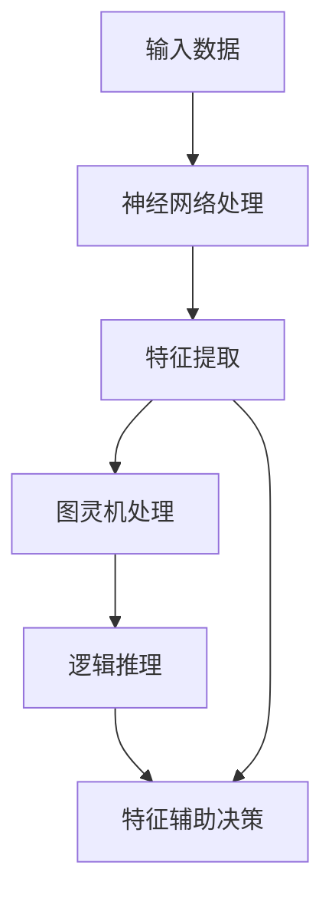
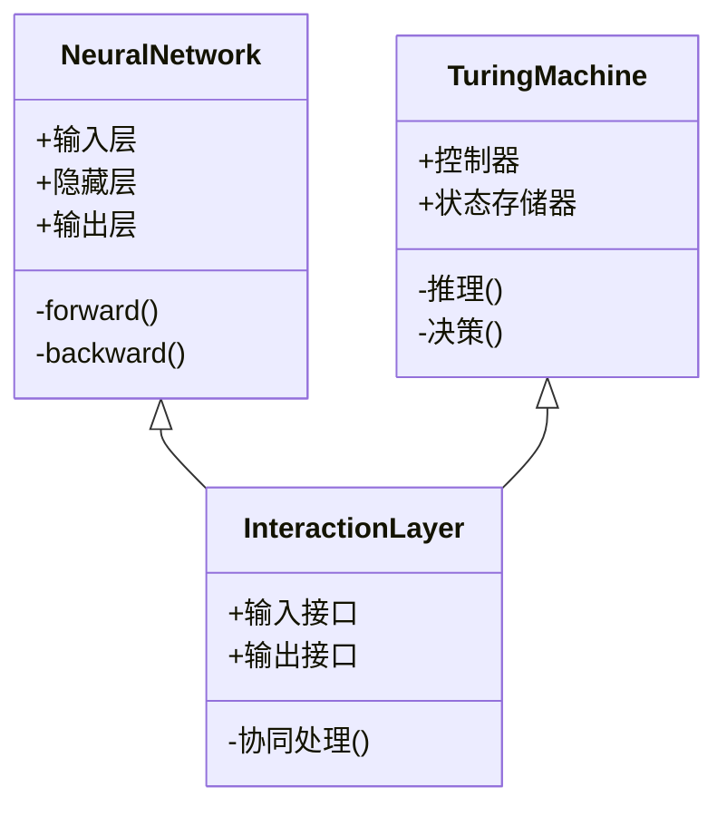

                 


# 神经图灵机：增强AI Agent的算法学习能力

> 关键词：神经图灵机，AI Agent，增强学习，算法优化，系统架构设计

> 摘要：神经图灵机结合了神经网络和经典图灵机的计算模型，通过强化学习和自适应算法优化，显著提升了AI Agent的学习能力和问题解决能力。本文将从核心概念、算法原理、系统架构设计等方面详细阐述神经图灵机的理论与实践应用，帮助读者深入理解其在增强AI Agent算法学习能力中的关键作用。

---

## 第1章：神经图灵机的背景与核心概念

### 1.1 神经图灵机的起源
神经图灵机的概念起源于对AI Agent学习能力的进一步探索。传统神经网络在模式识别和分类任务中表现出色，但缺乏推理和逻辑处理能力。而图灵机模型虽然具备强大的逻辑推理能力，却难以处理复杂的感知任务。神经图灵机通过结合这两者的优点，形成了一个能够同时处理感知和认知任务的新模型。

### 1.2 神经图灵机的核心概念
神经图灵机的核心概念包括：
- **神经网络模块**：负责感知和特征提取，类似于人脑的感知层。
- **图灵机模块**：负责逻辑推理和决策，类似于人脑的认知层。
- **交互模块**：连接神经网络和图灵机模块，实现信息的双向传递和协同工作。

### 1.3 神经图灵机与传统AI的区别
| 特性                | 传统AI                | 神经图灵机          |
|---------------------|-----------------------|--------------------|
| 学习能力            | 弱，依赖规则和特征工程| 强，具备自适应学习能力|
| 处理任务            | 适合模式识别和分类    | 适合复杂推理和决策  |
| 模块化程度          | 较低，模块间耦合度高   | 高，模块化设计灵活  |

---

## 第2章：神经图灵机的核心概念与联系

### 2.1 神经图灵机的核心概念
神经图灵机由以下三个核心部分组成：
1. **神经网络部分**：用于处理输入数据，提取特征。
2. **图灵机部分**：用于基于特征进行逻辑推理和决策。
3. **交互机制**：连接神经网络和图灵机，实现信息的协同处理。

### 2.2 神经图灵机的ER实体关系图
```mermaid
er
    entity 神经网络模块 {
        常规神经网络层
        注意力机制层
    }

    entity 图灵机模块 {
        控制器
        状态存储器
        操作序列
    }

    entity 交互机制 {
        输入接口
        输出接口
    }

    神经网络模块 -[输入]-> 交互机制
    交互机制 -[输出]-> 神经网络模块
    图灵机模块 -[输入]-> 交互机制
    交互机制 -[输出]-> 图灵机模块
```

---

## 第3章：神经图灵机的算法原理

### 3.1 神经图灵机的算法流程


### 3.2 神经图灵机的数学模型
神经图灵机的数学模型可以表示为：
$$
P(s', r | s, a) = \sigma(f(s, a))
$$
其中：
- $s$ 表示当前状态
- $a$ 表示动作
- $r$ 表示奖励
- $s'$ 表示下一个状态
- $\sigma$ 表示激活函数
- $f$ 表示模型函数

### 3.3 神经图灵机的算法实现
```python
class NeuralTuringMachine:
    def __init__(self, input_dim, hidden_dim):
        self.neural_network = NeuralNetwork(input_dim, hidden_dim)
        self.turing_machine = TuringMachine(hidden_dim)
        self.interaction_layer = InteractionLayer(hidden_dim)

    def forward(self, x):
        features = self.neural_network(x)
        decisions = self.turing_machine(features)
        return self.interaction_layer(features, decisions)

    def backward(self, loss):
        self.neural_network.backward(loss)
        self.turing_machine.backward(loss)
        self.interaction_layer.backward(loss)
```

---

## 第4章：神经图灵机的系统分析与架构设计

### 4.1 系统应用场景
神经图灵机适用于以下场景：
- **智能对话系统**：通过神经网络提取语义特征，利用图灵机进行逻辑推理，生成自然语言回复。
- **自动决策系统**：在自动驾驶中，神经网络处理视觉信息，图灵机进行路径规划和决策。
- **多任务学习系统**：在同一模型中同时处理多种任务，如语音识别和语义理解。

### 4.2 系统功能设计


---

## 第5章：神经图灵机的系统架构与接口设计

### 5.1 系统架构设计


### 5.2 系统接口设计
- **输入接口**：接收原始数据，如图像、文本或传感器数据。
- **输出接口**：输出决策结果，如动作、文本回复或状态更新。

### 5.3 系统交互流程
```mermaid
sequenceDiagram
    用户输入 --> 输入接口
    输入接口 --> 神经网络模块
    神经网络模块 --> 特征提取
    特征提取 --> 图灵机模块
    图灵机模块 --> 逻辑推理
    逻辑推理 --> 决策输出
    决策输出 --> 用户反馈
```

---

## 第6章：神经图灵机的项目实战

### 6.1 环境安装
- 安装Python和深度学习框架（如TensorFlow或PyTorch）。
- 安装Mermaid图表工具和相关依赖。

### 6.2 核心代码实现
```python
import tensorflow as tf
from tensorflow import keras

class NeuralTuringMachine:
    def __init__(self, input_dim, hidden_dim):
        self.neural_network = keras.Sequential([
            keras.layers.Dense(hidden_dim, activation='relu', input_dim=input_dim),
            keras.layers.Dense(hidden_dim)
        ])
        self.turing_machine = keras.Sequential([
            keras.layers.Dense(hidden_dim, activation='relu'),
            keras.layers.Dense(hidden_dim)
        ])
        self.interaction_layer = keras.Sequential([
            keras.layers.Dense(hidden_dim, activation='relu'),
            keras.layers.Dense(hidden_dim)
        ])

    def call(self, x):
        features = self.neural_network(x)
        decisions = self.turing_machine(features)
        return self.interaction_layer(features) + decisions
```

### 6.3 案例分析
以自然语言处理任务为例，神经图灵机能够同时处理语言特征和上下文信息，生成更准确的语义理解结果。

---

## 第7章：神经图灵机的最佳实践与小结

### 7.1 最佳实践
- **模块化设计**：确保神经网络和图灵机模块的独立性和可扩展性。
- **数据预处理**：对输入数据进行清洗和特征工程，提升模型性能。
- **超参数调优**：通过试验调整学习率、批量大小等参数，优化模型表现。

### 7.2 小结
神经图灵机通过结合神经网络和图灵机的优势，显著提升了AI Agent的学习和推理能力。在实际应用中，需要注重模块化设计、数据预处理和超参数调优，以充分发挥其潜力。

### 7.3 注意事项
- 神经图灵机的训练过程可能较为复杂，需要大量的计算资源。
- 在实际应用中，需注意模型的可解释性和鲁棒性。

### 7.4 拓展阅读
- 《神经图灵机：增强学习的创新与实践》
- 《深度学习与强化学习的结合：从理论到应用》

---

通过以上章节的详细讲解，我们深入探讨了神经图灵机的核心概念、算法原理、系统架构设计以及实际应用案例。希望读者能够通过本文，全面理解神经图灵机的优势，并在实际项目中灵活运用，进一步提升AI Agent的学习和推理能力。

