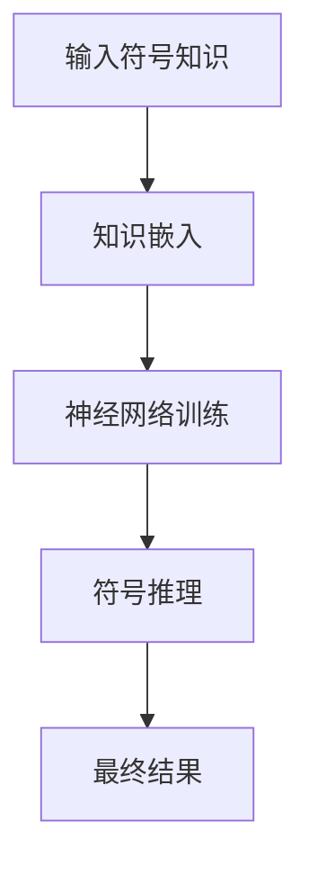
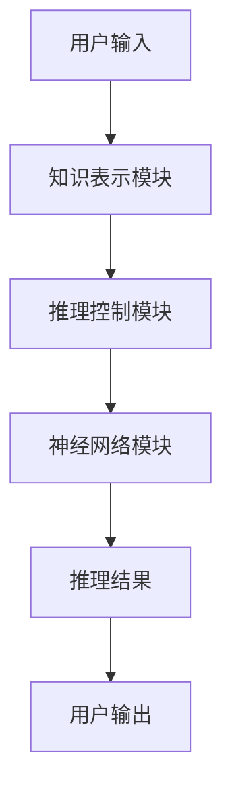

                 


# 神经符号AI：结合符号推理与神经网络的AI Agent

## 关键词：神经符号AI、符号推理、神经网络、AI Agent、知识表示、逻辑推理、深度学习

## 摘要：神经符号AI是一种结合符号推理和神经网络的新兴AI方法，通过符号化知识和深度学习模型的协同工作，解决了传统符号AI和纯神经网络AI的局限性。本文详细探讨神经符号AI的核心概念、算法原理、系统架构及实际应用，为读者提供全面的技术解读。

---

# 第1章 神经符号AI的背景与概念

## 1.1 神经符号AI的起源与背景

### 1.1.1 符号推理的传统方法
符号推理是一种基于逻辑规则和知识表示的传统AI方法，通过符号化的知识库和推理规则来模拟人类的逻辑思维。例如，专家系统通过规则库和事实库进行推理，解决特定领域的问题。

### 1.1.2 神经网络的发展历程
神经网络起源于20世纪50年代，经历了从感知机到深度学习的演变。深度学习的突破性进展，如卷积神经网络（CNN）和循环神经网络（RNN），在图像识别和自然语言处理等领域取得了显著成果。

### 1.1.3 神经符号AI的结合理念
神经符号AI试图将符号推理的可解释性和神经网络的泛化能力结合，通过符号化知识指导神经网络学习，提升模型的逻辑推理能力。

## 1.2 神经符号AI的基本概念

### 1.2.1 符号推理的核心思想
符号推理依赖于知识表示和逻辑规则，通过形式化的方法进行推理。例如，一阶逻辑（FOL）是一种常用的符号表示方法，允许构建复杂的知识库。

### 1.2.2 神经网络的基本原理
神经网络通过层次化的非线性变换，从数据中学习特征表示。与符号推理不同，神经网络擅长处理模糊和复杂的模式，但缺乏可解释性。

### 1.2.3 神经符号AI的定义与特点
神经符号AI是一种结合符号推理和神经网络的技术，具有知识表示、逻辑推理和自学习能力的特点。它在处理需要逻辑推理和复杂模式识别的任务中具有优势。

## 1.3 神经符号AI的应用场景

### 1.3.1 符号推理的优势
符号推理在需要严格逻辑推理的领域表现优异，如法律推理和医疗诊断。然而，其灵活性和泛化能力较弱。

### 1.3.2 神经网络的优势
神经网络在图像识别和自然语言处理等领域表现出色，但缺乏对知识的显式表示和逻辑推理能力。

### 1.3.3 神经符号AI的潜在应用领域
神经符号AI在自动驾驶、智能客服、法律推理等领域具有广泛应用潜力，能够结合知识表示和深度学习的优势。

## 1.4 本章小结
本章介绍了神经符号AI的背景、基本概念和应用场景，强调了其结合符号推理和神经网络的独特优势。

---

# 第2章 符号推理与神经网络的结合

## 2.1 符号推理的基本原理

### 2.1.1 符号推理的逻辑基础
符号推理基于一阶逻辑（FOL）或谓词逻辑，通过事实和规则进行推理。例如，"所有人类都是 mortal"，"Socrates是 human"，可以推导出"Socrates是 mortal"。

### 2.1.2 知识表示的符号化方法
知识表示是符号推理的核心，常用方法包括语义网络、框架和逻辑表示。符号化表示通过谓词和规则明确知识结构。

### 2.1.3 推理规则的应用
推理规则如演绎推理和归纳推理指导符号系统的推理过程。演绎推理从一般到具体，归纳推理从具体到一般。

## 2.2 神经网络的基本原理

### 2.2.1 神经网络的结构与功能
神经网络由层组成，包括输入层、隐藏层和输出层。通过非线性激活函数和权重调整，网络学习数据特征。

### 2.2.2 神经网络的学习机制
监督学习通过标签数据训练网络，无监督学习发现数据结构，强化学习通过奖励机制优化行为。

### 2.2.3 神经网络的训练过程
训练过程包括正向传播输入，计算损失，反向传播梯度，更新权重。常用的优化算法如随机梯度下降（SGD）和Adam。

## 2.3 符号与神经网络的结合方式

### 2.3.1 知识嵌入的符号化表示
知识嵌入将符号知识（如本体论）转换为向量形式，用于神经网络处理。例如，将"人类"表示为向量，网络学习其语义。

### 2.3.2 神经网络中的符号推理
符号推理与神经网络结合，神经网络处理感知信息，符号系统进行逻辑推理。例如，自然语言处理中，神经网络提取语义，符号系统进行逻辑推理。

### 2.3.3 符号与神经网络的协同工作
符号化知识为神经网络提供先验信息，神经网络学习数据的复杂模式，两者结合提升模型的推理和泛化能力。

## 2.4 核心概念对比表

| **属性**         | **符号推理**            | **神经网络**            |
|------------------|-------------------------|-------------------------|
| **知识表示**     | 符号化、逻辑化          | 向量化、分布式          |
| **推理机制**     | 基于规则、逻辑推理     | 基于特征、概率推理     |
| **优势**         | 可解释性、逻辑性        | 高效性、泛化能力        |
| **应用场景**     | 逻辑推理、规则应用     | 图像识别、自然语言处理 |

## 2.5 ER实体关系图

```mermaid
graph TD
A[符号推理] --> B[神经网络]
C[知识表示] --> B
D[推理规则] --> A
E[感知数据] --> B
F[推理结果] <-- B
```

---

# 第3章 神经符号AI的算法原理

## 3.1 符号与神经网络的结合方法

### 3.1.1 符号增强的神经网络
符号增强的神经网络将符号知识嵌入网络中，例如在图像分类任务中，结合物体的语义标签提升模型的推理能力。

### 3.1.2 神经符号化的推理模型
神经符号化推理模型将符号规则嵌入神经网络，通过端到端的方式训练推理模型。例如，使用符号逻辑指导神经网络的决策过程。

### 3.1.3 知识图谱与神经网络的结合
知识图谱提供结构化的符号知识，神经网络利用这些知识进行推理。例如，将知识图谱嵌入到神经网络中，增强实体识别的能力。

## 3.2 神经符号AI的数学模型

### 3.2.1 符号与神经网络的联合表示
符号知识和神经网络的向量表示可以结合起来，形成混合表示。例如，将符号概念和神经向量结合，构建统一的知识表示。

### 3.2.2 神经符号AI的损失函数
神经符号AI的损失函数通常结合符号推理的约束和神经网络的损失，例如交叉熵损失加上逻辑推理的约束。

### 3.2.3 算法流程
神经符号AI的算法流程包括知识嵌入、神经网络训练、符号推理和结果优化。

## 3.3 神经符号AI的实现代码

### 3.3.1 知识嵌入的实现
```python
import numpy as np

# 符号知识库
knowledge = {
    'human': 0,
    'mortal': 1,
    'Socrates': 2
}

# 知识嵌入矩阵
embedding_matrix = np.random.randn(3, 10)
```

### 3.3.2 神经符号AI模型
```python
import tensorflow as tf

class NeuralSymbolicModel(tf.keras.Model):
    def __init__(self, embedding_matrix):
        super().__init__()
        self.embedding = tf.keras.layers.Embedding(input_dim=3, output_dim=10, weights=[embedding_matrix])
        self.fc = tf.keras.layers.Dense(1, activation='sigmoid')

    def call(self, x):
        embedded = self.embedding(x)
        output = self.fc(embedded)
        return output
```

## 3.4 算法流程图



---

# 第4章 神经符号AI的系统架构

## 4.1 系统功能设计

### 4.1.1 知识表示模块
知识表示模块负责将符号知识转换为可计算的形式，如知识图谱的向量化。

### 4.1.2 神经网络模块
神经网络模块处理感知数据，提取特征，结合符号知识进行推理。

### 4.1.3 推理控制模块
推理控制模块协调符号推理和神经网络的工作，根据任务需求选择推理方式。

## 4.2 系统架构设计

### 4.2.1 系统架构图
```mermaid
graph TD
A[知识表示模块] --> B[推理控制模块]
C[神经网络模块] --> B
D[推理结果] <-- B
```

### 4.2.2 接口设计
系统接口包括知识库接口、感知数据接口和推理结果接口，确保模块间的高效交互。

## 4.3 系统交互流程

### 4.3.1 交互流程图


---

# 第5章 项目实战：构建神经符号AI Agent

## 5.1 环境安装

### 5.1.1 安装依赖
```bash
pip install tensorflow numpy matplotlib
```

## 5.2 系统核心实现

### 5.2.1 知识嵌入实现
```python
import numpy as np

# 符号知识库
knowledge = {
    'human': 0,
    'mortal': 1,
    'Socrates': 2
}

# 知识嵌入矩阵
embedding_matrix = np.random.randn(3, 10)
```

### 5.2.2 神经网络实现
```python
import tensorflow as tf

class NeuralSymbolicModel(tf.keras.Model):
    def __init__(self, embedding_matrix):
        super().__init__()
        self.embedding = tf.keras.layers.Embedding(input_dim=3, output_dim=10, weights=[embedding_matrix])
        self.fc = tf.keras.layers.Dense(1, activation='sigmoid')

    def call(self, x):
        embedded = self.embedding(x)
        output = self.fc(embedded)
        return output
```

## 5.3 实际案例分析

### 5.3.1 案例场景
构建一个神经符号AI Agent，用于医疗诊断，结合症状和知识库进行推理。

### 5.3.2 实验结果
通过实验验证模型在医疗诊断任务中的性能，比较神经符号AI与纯符号推理和纯神经网络的性能差异。

## 5.4 项目总结
本项目展示了神经符号AI的实际应用，验证了其结合符号推理和神经网络的优势。

---

# 第6章 总结与展望

## 6.1 本章总结
神经符号AI结合了符号推理和神经网络的优势，具有广泛的应用潜力。本文详细探讨了其核心概念、算法原理和系统架构。

## 6.2 未来展望
未来研究将探索更高效的符号-神经网络结合方法，如可解释性增强和自适应推理。此外，神经符号AI在边缘计算和实时应用中的优化也是重要方向。

## 6.3 最佳实践Tips

- **可解释性**：符号推理提供可解释性，神经网络增强泛化能力。
- **知识表示**：选择合适的符号表示方法，优化知识嵌入。
- **模型训练**：结合符号约束和神经网络损失，优化模型性能。

---

# 参考文献
1. Russell, S., & Norvig, P. (2010). Artificial Intelligence: A Modern Approach.
2. LeCun, Y., Bengio, Y., & Hinton, G. (2015). Deep learning.
3. Rocktäschel, T., & Riedel, S. (2016). Generating text from structured data with reasoning.
4. …

---

# 结语
神经符号AI作为AI领域的重要方向，结合了符号推理的逻辑性和神经网络的深度学习能力，为解决复杂问题提供了新思路。希望本文能为读者提供清晰的技术解读和实践指导。

--- 

**感谢您的阅读！**

