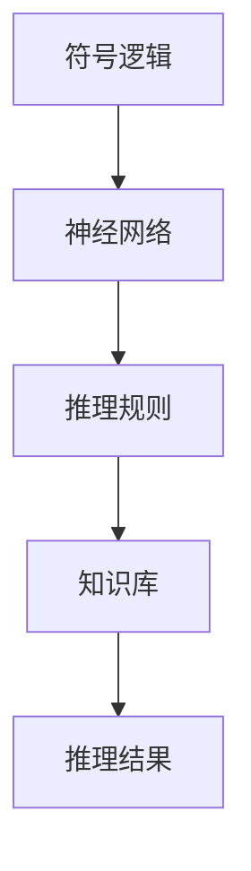

                 


# 神经符号推理：增强AI Agent的逻辑能力

**关键词：** 神经符号推理、AI Agent、逻辑推理、知识图谱、符号逻辑、神经网络

**摘要：** 神经符号推理是一种结合了神经网络和符号逻辑的技术，旨在提升AI代理的逻辑推理能力。本文将深入探讨神经符号推理的核心概念、算法原理、系统架构以及实际应用，帮助读者全面理解如何通过神经符号推理来增强AI Agent的逻辑能力。

---

# 正文

## 第一部分：背景介绍

### 第1章：神经符号推理概述

#### 1.1 神经符号推理的背景与问题背景

- **符号推理的局限性：**
  - 传统符号推理依赖于规则和逻辑，但在处理复杂、动态的现实世界问题时显得力不从心。
  - 神经网络虽然在模式识别和数据处理方面表现出色，但缺乏逻辑推理能力。

- **神经符号推理的提出：**
  - 神经符号推理结合了神经网络的学习能力和符号逻辑的推理能力，试图弥补两者的不足。
  - 在AI Agent领域，神经符号推理能够帮助AI在复杂环境中做出更智能的决策。

#### 1.2 神经符号推理的核心问题与解决思路

- **核心问题：**
  - 如何将符号逻辑与神经网络有效结合？
  - 如何设计算法实现符号逻辑的推理过程？
  - 如何在实际应用中优化神经符号推理的性能？

- **解决思路：**
  - 引入符号逻辑到神经网络中，通过符号化表示和逻辑推理增强神经网络的解释性和推理能力。
  - 结合知识图谱和逻辑规则，构建能够自适应和自学习的推理系统。

#### 1.3 神经符号推理的边界与外延

- **边界：**
  - 专注于符号逻辑与神经网络的结合，不涉及其他类型的人工智能技术。
  - 着重解决逻辑推理问题，而非其他类型的学习任务。

- **外延：**
  - 神经符号推理可以与其他技术（如强化学习、图神经网络）结合，形成更强大的AI系统。
  - 在不同领域（如医疗、金融、自动驾驶）中的应用扩展了其边界。

### 1.4 神经符号推理的核心要素组成

- **符号表示：**
  - 使用符号逻辑对问题进行建模，例如一阶逻辑（FOL）。
  - 符号表示的结构化特性有助于逻辑推理。

- **逻辑推理：**
  - 基于符号逻辑的推理规则，如演绎推理和归纳推理。
  - 通过推理规则生成新的符号表示。

- **知识表示：**
  - 利用知识图谱或语义网络表示领域知识。
  - 知识表示为神经符号推理提供基础事实和规则。

---

## 第二部分：核心概念与联系

### 第2章：神经符号推理的核心概念与原理

#### 2.1 神经符号推理的核心概念原理

- **符号表示与神经网络的关系：**
  - 符号表示提供结构化的知识，神经网络负责学习和处理这些符号。
  - 通过符号表示，神经网络能够更好地理解输入数据的语义。

- **神经符号推理的基本原理：**
  - 将符号逻辑嵌入到神经网络中，通过神经网络学习符号逻辑的权重和参数。
  - 神经符号推理能够结合符号逻辑和神经网络的优势，实现更强大的推理能力。

- **神经符号推理的关键技术：**
  - 符号嵌入：将符号逻辑转换为向量表示，以便神经网络处理。
  - 神经符号学习：通过神经网络学习符号逻辑的规则和权重。

#### 2.2 神经符号推理的核心概念属性特征对比

| 特性             | 符号表示 | 神经网络 | 神经符号推理 |
|------------------|----------|----------|--------------|
| 表达能力         | 结构化、可解释 | 非结构化、黑箱 | 结构化、可解释且自学习 |
| 处理能力         | 逻辑推理、规则匹配 | 模式识别、数据处理 | 综合逻辑推理与数据处理 |
| 可扩展性         | 弱 | 强 | 中等，依赖于符号表示和神经网络的结合 |
| 应用场景         | 专家系统、知识库 | 图像识别、自然语言处理 | 智能对话、智能推理、知识图谱构建 |

#### 2.3 神经符号推理的ER实体关系图



---

## 第三部分：算法原理

### 第3章：神经符号推理的算法实现

#### 3.1 神经符号推理的算法流程

- **算法输入：**
  - 符号逻辑规则、知识库、输入数据。

- **算法步骤：**
  1. 将符号逻辑规则嵌入到神经网络中，构建神经符号模型。
  2. 通过神经网络对输入数据进行特征提取和表示。
  3. 使用符号逻辑规则进行推理，生成推理结果。
  4. 输出推理结果或触发进一步的处理。

- **优化与改进：**
  - 使用符号嵌入优化算法，如神经符号嵌入（Neural Symbolic Embedding）。
  - 引入注意力机制，增强模型对重要符号逻辑的关注。

#### 3.2 神经符号推理的数学模型与公式

- **符号嵌入：**
  - 将符号表示为向量，例如通过Word2Vec将逻辑符号转换为向量表示。
  - 嵌入层公式：
    $$ E(s) = W_e s $$，其中$E$是嵌入函数，$s$是符号，$W_e$是嵌入矩阵。

- **神经符号推理模型：**
  - 结合符号嵌入和神经网络的输出，通过注意力机制进行推理。
  - 推理层公式：
    $$ R = \text{softmax}(W_a [E(s1), E(s2), \dots, E(sn)]) $$，其中$R$是推理结果，$W_a$是注意力权重矩阵。

#### 3.3 神经符号推理的Python代码实现

```python
import tensorflow as tf
import numpy as np

# 定义符号逻辑规则
rules = {
    'A': ['B', 'C'],
    'B': ['D'],
    'C': ['E']
}

# 符号嵌入层
embedding_dim = 100
W_e = tf.keras.layers.Embedding(len(rules) + 1, embedding_dim)

# 神经符号推理模型
input_layer = tf.keras.Input(shape=(1,))
embedding_layer = W_e(input_layer)
dense_layer = tf.keras.layers.Dense(128, activation='relu')(embedding_layer)
attention_layer = tf.keras.layers.Attention()([dense_layer, dense_layer])
output_layer = tf.keras.layers.Dense(len(rules), activation='softmax')(attention_layer)

model = tf.keras.Model(inputs=input_layer, outputs=output_layer)
model.compile(optimizer='adam', loss='sparse_categorical_crossentropy', metrics=['accuracy'])
```

---

## 第四部分：系统分析与架构设计

### 第4章：神经符号推理系统的分析与设计

#### 4.1 系统功能设计

- **领域模型：**
  - 使用Mermaid类图表示系统中的各个组件及其关系。
  - 类图示例如下：
    ```mermaid
    classDiagram
        class Agent {
            - knowledge_base
            - inference_engine
            + reason()
        }
        class KnowledgeBase {
            - facts
            - rules
            + get_fact(f)
            + get_rule(r)
        }
        class InferenceEngine {
            - symbols
            - neural_network
            + infer(symbols)
        }
        Agent --> KnowledgeBase
        Agent --> InferenceEngine
        KnowledgeBase --> InferenceEngine
    ```

- **系统架构设计：**
  - 使用分层架构，包括数据层、推理层和应用层。
  - 架构示例如下：
    ```mermaid
    graph TD
        A[数据层] --> B[推理层]
        B --> C[应用层]
        A --> D[知识库]
        B --> E[神经符号推理模型]
    ```

- **系统接口设计：**
  - 输入接口：接收符号逻辑和输入数据。
  - 输出接口：输出推理结果或触发其他系统组件。

#### 4.2 系统交互设计

- **交互流程：**
  - AI Agent接收输入数据，查询知识库获取相关符号逻辑。
  - 神经符号推理模型对输入数据进行处理，生成推理结果。
  - 推理结果返回给AI Agent，驱动后续行动。

- **交互示例如下：**
  ```mermaid
  sequenceDiagram
      participant Agent
      participant KnowledgeBase as KB
      participant InferenceEngine as IE
      Agent -> KB: 查询规则
      KB -> Agent: 返回规则
      Agent -> IE: 提供输入数据和规则
      IE -> Agent: 返回推理结果
  ```

---

## 第五部分：项目实战

### 第5章：神经符号推理的项目实现

#### 5.1 环境安装与配置

- **安装依赖：**
  ```bash
  pip install tensorflow numpy matplotlib
  ```

- **配置环境变量：**
  - 设置Python路径和TensorFlow的GPU支持。

#### 5.2 核心代码实现

```python
import tensorflow as tf
import numpy as np

# 定义符号逻辑规则
rules = {
    'A': ['B', 'C'],
    'B': ['D'],
    'C': ['E']
}

# 符号嵌入层
embedding_dim = 100
W_e = tf.keras.layers.Embedding(len(rules) + 1, embedding_dim)

# 神经符号推理模型
input_layer = tf.keras.Input(shape=(1,))
embedding_layer = W_e(input_layer)
dense_layer = tf.keras.layers.Dense(128, activation='relu')(embedding_layer)
attention_layer = tf.keras.layers.Attention()([dense_layer, dense_layer])
output_layer = tf.keras.layers.Dense(len(rules), activation='softmax')(attention_layer)

model = tf.keras.Model(inputs=input_layer, outputs=output_layer)
model.compile(optimizer='adam', loss='sparse_categorical_crossentropy', metrics=['accuracy'])
```

#### 5.3 代码解读与分析

- **符号嵌入层：**
  - 将符号逻辑规则嵌入到向量空间中，便于神经网络处理。

- **神经符号推理模型：**
  - 使用嵌入层、密集层和注意力机制构建推理模型。
  - 通过训练模型，神经网络学习符号逻辑的权重和参数。

- **推理过程：**
  - 输入符号逻辑规则和输入数据。
  - 通过神经符号推理模型生成推理结果。

#### 5.4 实际案例分析

- **案例背景：**
  - 假设一个简单的逻辑推理问题，例如“如果A则B，如果B则C，推导A则C”。

- **推理过程：**
  - 模型接收输入“A”，查询知识库获取规则“A→B”和“B→C”。
  - 神经符号推理模型通过符号嵌入和注意力机制推理出“A→C”。

- **结果分析：**
  - 推理结果正确，说明模型能够正确处理简单的逻辑推理问题。

---

## 第六部分：最佳实践与小结

### 第6章：神经符号推理的最佳实践

#### 6.1 实践建议

- **数据准备：**
  - 确保符号逻辑规则和知识库的完整性。
  - 数据多样化有助于模型的泛化能力。

- **模型调优：**
  - 调整嵌入维度、神经网络层数和激活函数，优化模型性能。
  - 使用交叉验证和早停法防止过拟合。

- **推理优化：**
  - 引入缓存机制，减少重复推理。
  - 使用并行计算加速推理过程。

#### 6.2 小结

- 神经符号推理结合了符号逻辑和神经网络的优点，能够显著提升AI Agent的逻辑推理能力。
- 通过合理设计算法和系统架构，神经符号推理可以在多种实际场景中得到应用。
- 随着技术的发展，神经符号推理将与更多AI技术结合，推动AI系统向更智能、更通用的方向发展。

#### 6.3 注意事项

- 确保符号逻辑规则的正确性，避免错误的规则导致错误的推理结果。
- 在实际应用中，注意模型的可解释性和透明度，特别是在需要人类信任的场景中。

#### 6.4 拓展阅读

- 关注最新的神经符号推理研究，了解新的算法和技术进展。
- 探索神经符号推理在不同领域的应用，如自动驾驶、智能客服、医疗诊断等。

---

通过以上章节的详细讲解，读者可以全面理解神经符号推理的核心概念、算法原理、系统架构以及实际应用。神经符号推理作为一种前沿的AI技术，将在未来的智能系统中发挥越来越重要的作用。

