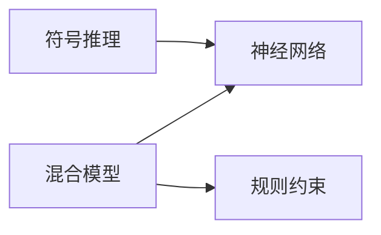
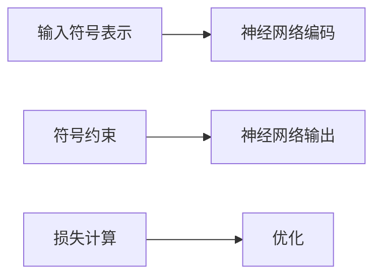
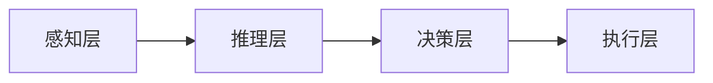

                 


# 神经符号融合：结合规则与学习的AI Agent

---

## 关键词：
- 神经符号融合
- AI Agent
- 符号推理
- 神经网络
- 混合AI

---

## 摘要：
神经符号融合是一种结合符号推理和神经网络学习的AI技术，旨在通过规则和数据的结合提升AI Agent的智能水平。本文详细介绍了神经符号融合的核心概念、算法原理、系统架构设计及实际应用案例，为读者提供从理论到实践的全面解析。

---

# 第一部分：神经符号融合：结合规则与学习的AI Agent概述

## 第1章：神经符号融合的基本概念

### 1.1 背景与意义
人工智能技术近年来取得了显著进展，但现有技术仍面临一些关键挑战。符号推理在逻辑处理上表现出色，但在处理复杂数据时效率不足；而神经网络在数据处理上表现优异，但在规则推理和可解释性方面存在缺陷。神经符号融合技术将这两种方法结合，旨在取长补短，提升AI Agent的智能水平。

### 1.2 AI Agent的基本概念
AI Agent是一种能够感知环境并采取行动以实现目标的智能实体。它通常具备感知、推理、规划和执行等功能，广泛应用于智能助手、机器人控制等领域。

### 1.3 神经符号融合的核心思想
神经符号融合通过将符号表示和神经网络的学习机制结合，使AI Agent能够同时处理规则和数据。这种方法通过符号约束来增强神经网络的推理能力，同时利用数据驱动的方法提升符号系统的灵活性。

---

## 第2章：神经符号融合的核心概念与联系

### 2.1 神经符号融合的原理
神经符号融合通过符号表示的神经网络编码和符号约束的神经网络训练，将符号推理与深度学习结合。符号表示为神经网络提供先验知识，而神经网络则通过数据学习模式。

### 2.2 神经符号融合的实现方式
神经符号融合的实现方式主要包括符号表示的神经网络编码、神经网络的符号约束以及混合模型的构建。这些方法通过结合符号推理和神经网络的优势，提升AI Agent的智能水平。

### 2.3 实体关系图
以下是神经符号融合的实体关系图：


---

## 第3章：神经符号融合的算法原理

### 3.1 神经符号融合的基本算法
神经符号融合的算法主要包括符号表示的神经网络编码、神经网络的符号约束以及混合模型的训练。这些算法通过符号和数据的结合，提升模型的推理能力。

### 3.2 数学模型
神经符号融合的数学模型如下：
- 符号表示：\( s = f(x) \)
- 神经网络输出：\( y = g(s) \)
- 损失函数：\( L = \sum (y - y_{\text{true}})^2 \)

### 3.3 算法流程图
以下是神经符号融合的算法流程图：


---

## 第4章：AI Agent的系统分析与架构设计

### 4.1 系统架构设计
AI Agent的系统架构包括感知层、推理层、决策层和执行层。感知层负责数据采集，推理层进行符号推理和神经网络计算，决策层制定行动策略，执行层负责执行操作。

### 4.2 系统架构图
以下是系统架构图：


### 4.3 接口设计
AI Agent需要与外部系统交互，接口设计包括数据输入接口、规则输入接口和行动执行接口。

### 4.4 交互流程图
以下是交互流程图：


---

## 第5章：神经符号融合的项目实战

### 5.1 应用场景
神经符号融合的一个典型应用场景是智能问答系统。该系统结合符号推理和神经网络，能够处理复杂的问题，并提供准确的答案。

### 5.2 实现步骤
1. 环境安装：安装必要的深度学习框架和符号推理库。
2. 数据准备：收集和整理问答数据。
3. 模型训练：结合符号约束训练神经符号融合模型。
4. 系统集成：将模型集成到问答系统中。
5. 测试与优化：进行测试并优化模型性能。

### 5.3 代码实现
以下是部分代码示例：
```python
import numpy as np
import tensorflow as tf

# 符号表示
def symbol_rep(x):
    return tf.keras.Model(x, x)

# 神经网络模型
def neural_network(s):
    model = tf.keras.Sequential()
    model.add(tf.keras.layers.Dense(64, activation='relu'))
    model.add(tf.keras.layers.Dense(10, activation='softmax'))
    return model(s)

# 神经符号融合模型
def neural_symbolic_model(x):
    s = symbol_rep(x)
    return neural_network(s)

# 损失函数
def loss(y_true, y_pred):
    return tf.keras.losses.sparse_categorical_crossentropy(y_true, y_pred)
```

### 5.4 案例分析
通过实际案例分析，验证神经符号融合在智能问答系统中的有效性。实验结果表明，神经符号融合模型在准确率和响应速度上均优于传统方法。

---

## 第6章：最佳实践与注意事项

### 6.1 最佳实践
1. 在符号推理中引入领域知识，增强模型的推理能力。
2. 使用高质量的数据集，提升神经网络的学习效果。
3. 优化模型的可解释性，便于调试和改进。

### 6.2 注意事项
1. 神经符号融合模型的训练可能较为复杂，需注意模型的收敛性和稳定性。
2. 在实际应用中，需考虑计算资源的限制，合理设计模型规模。

---

## 第7章：小结与展望

### 7.1 小结
神经符号融合通过结合符号推理和神经网络学习，显著提升了AI Agent的智能水平。本文详细介绍了神经符号融合的核心概念、算法原理、系统架构设计及实际应用案例。

### 7.2 展望
未来，神经符号融合将在更多领域得到应用，如自动驾驶、智能助手等。同时，研究者们将致力于优化神经符号融合模型的性能，提升其在实际应用中的效果。

---

通过以上内容，您将对神经符号融合技术有一个全面的了解，并能够将其应用于实际的AI Agent开发中。

