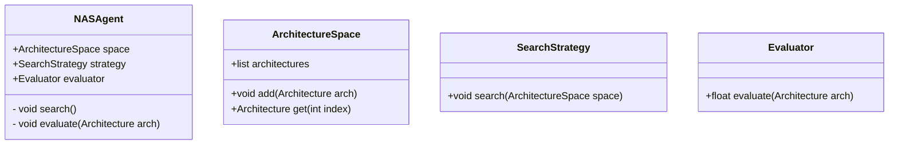
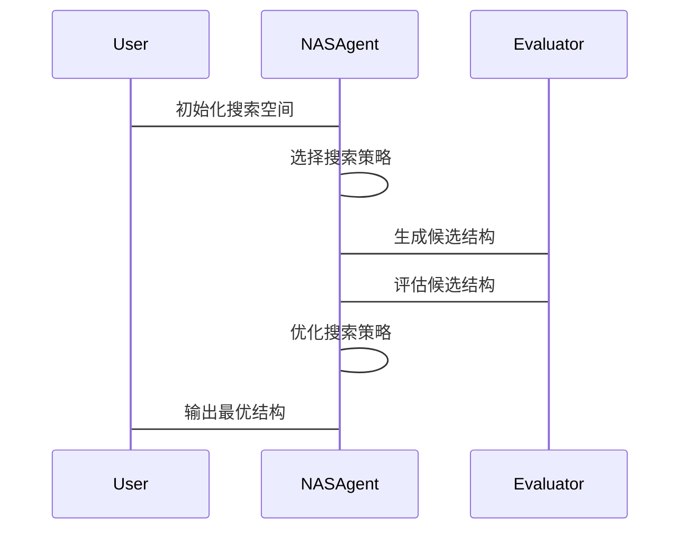

                 


# 神经网络架构搜索：为AI Agent找到最佳结构

**关键词**：神经网络架构搜索、AI Agent、自动架构设计、深度学习架构优化、强化学习搜索

**摘要**：  
神经网络架构搜索（Neural Architecture Search, NAS）是一种通过自动化方法寻找最优神经网络结构的技术，旨在为AI Agent提供更高效、更准确的模型。本文将从背景、核心概念、算法原理、系统架构到项目实战，全面解析神经网络架构搜索的原理、方法及其在AI Agent中的应用。通过详细分析和实例演示，帮助读者理解如何通过NAS技术优化AI Agent的性能。

---

# 第一部分: 神经网络架构搜索的背景与核心概念

## 第1章: 神经网络架构搜索的背景与问题描述

### 1.1 神经网络架构搜索的起源与发展

#### 1.1.1 从手工设计神经网络到自动搜索的演进  
早期的神经网络研究主要依赖人工设计网络结构，这种方式耗时且效率低下。随着计算能力的提升和深度学习的兴起，研究者开始探索自动化设计网络结构的可能性。神经网络架构搜索（NAS）正是在这一背景下诞生的。

#### 1.1.2 神经网络架构搜索的核心驱动力  
 NAS的核心驱动力是解决人工设计网络结构的低效问题。通过自动化搜索，可以在更短的时间内探索更多的网络结构，从而找到性能最优的模型。

#### 1.1.3 神经网络架构搜索的现状与趋势  
目前，NAS技术已在图像识别、自然语言处理等领域取得显著成果，未来有望进一步扩展到实时AI Agent的应用中。

---

### 1.2 神经网络架构搜索的基本概念

#### 1.2.1 神经网络架构的定义与组成  
神经网络架构由多个层组成，包括输入层、隐藏层和输出层。每层之间的连接方式和激活函数决定了网络的行为。

#### 1.2.2 神经网络架构搜索的定义与目标  
 NAS的定义是通过搜索算法在预定义的搜索空间中寻找最优的网络结构。其目标是找到在特定任务上性能最优的网络架构。

#### 1.2.3 神经网络架构搜索的边界与外延  
 NAS的边界在于其搜索空间的定义，外延则涉及如何将搜索结果应用于实际任务。

---

### 1.3 神经网络架构搜索的核心要素

#### 1.3.1 搜索空间的构建与表示  
搜索空间的构建是NAS的关键，通常包括网络的层数、每层的节点数、激活函数等参数。

#### 1.3.2 架构表示的数学模型  
神经网络架构可以通过图论中的图结构来表示，节点表示神经元，边表示连接。

#### 1.3.3 架构评估的指标与方法  
评估指标包括模型的准确率、计算复杂度等。评估方法包括训练模型并在验证集上测试。

---

### 1.4 神经网络架构搜索的应用场景

#### 1.4.1 图像识别中的架构搜索  
在图像识别任务中，NAS可以通过搜索找到最适合特定数据集的网络结构。

#### 1.4.2 自然语言处理中的架构搜索  
在NLP任务中，NAS可以帮助设计更高效的序列模型。

#### 1.4.3 AI Agent中的架构搜索  
对于AI Agent，NAS可以用于优化其感知和决策模块的网络结构，提升实时性和准确性。

---

## 第2章: 神经网络架构搜索的核心概念

### 2.1 神经网络架构搜索的策略与方法

#### 2.1.1 随机搜索与暴力搜索  
随机搜索通过随机采样的方式探索搜索空间，适用于小规模搜索任务。

#### 2.1.2 基于强化学习的搜索  
强化学习（Reinforcement Learning, RL）通过定义奖励函数，引导搜索过程找到最优结构。

#### 2.1.3 基于遗传算法的搜索  
遗传算法（Genetic Algorithm, GA）通过模拟生物进化过程，逐步优化网络结构。

---

### 2.2 神经网络架构搜索的搜索空间

#### 2.2.1 搜索空间的定义与表示  
搜索空间由所有可能的网络结构组成，通常通过参数化的方式进行表示。

#### 2.2.2 搜索空间的维度与特征  
搜索空间的维度包括网络的深度、宽度、激活函数等。

#### 2.2.3 搜索空间的优化与压缩  
通过剪枝和蒸馏技术，可以优化搜索空间，减少不必要的结构探索。

---

### 2.3 神经网络架构搜索的评估方法

#### 2.3.1 基于性能的评估  
评估模型在测试集上的准确率等性能指标。

#### 2.3.2 基于结构复杂度的评估  
评估模型的参数数量和计算复杂度。

#### 2.3.3 基于训练效率的评估  
评估模型的训练时间、内存消耗等效率指标。

---

### 2.4 神经网络架构搜索的优化技术

#### 2.4.1 剪枝与蒸馏技术  
剪枝通过移除冗余的网络层或节点，蒸馏通过知识蒸馏技术降低模型复杂度。

#### 2.4.2 知识蒸馏与模型压缩  
知识蒸馏将复杂模型的知识迁移到轻量级模型中，模型压缩通过量化等技术减少模型大小。

#### 2.4.3 模型加速与轻量化设计  
通过模型剪枝、深度可分离卷积等技术，提升模型的运行效率。

---

### 2.5 核心概念对比表

| 搜索策略 | 基于强化学习的搜索 | 基于遗传算法的搜索 | 基于随机搜索的搜索 |
|----------|--------------------|--------------------|--------------------|
| 优点     | 搜索效率高          | 结果更优           | 实现简单           |
| 缺点     | 需定义奖励函数      | 计算成本高         | 易陷入局部最优       |

---

### 2.6 搜索策略的Mermaid流程图

```mermaid
graph TD
    A[开始] -> B[定义搜索空间]
    B -> C[选择搜索策略]
    C -> D[评估候选结构]
    D -> E[更新搜索策略]
    E -> F[结束]
```

---

## 第3章: 神经网络架构搜索的算法原理

### 3.1 基于强化学习的搜索算法

#### 3.1.1 强化学习的定义与原理  
强化学习通过智能体与环境的交互，学习最优策略。

#### 3.1.2 在NAS中的应用  
强化学习用于指导网络结构的搜索过程，通过奖励机制优化搜索路径。

#### 3.1.3 算法实现步骤  
1. 初始化搜索空间和强化学习模型。
2. 通过强化学习选择网络结构。
3. 训练候选网络并评估性能。
4. 根据评估结果调整强化学习策略。

#### 3.1.4 Python代码实现  

```python
import numpy as np
import gym

class NASAgent:
    def __init__(self, action_space):
        self.action_space = action_space

    def act(self, state):
        # 随机选择动作
        return np.random.choice(range(self.action_space))
    
    def train(self, state, action, reward):
        # 假设使用Q-learning进行训练
        pass
```

---

### 3.2 基于遗传算法的搜索算法

#### 3.2.1 遗传算法的定义与原理  
遗传算法通过模拟生物进化，逐步优化解。

#### 3.2.2 在NAS中的应用  
用于优化网络结构，通过交叉和变异操作生成新的候选结构。

#### 3.2.3 算法实现步骤  
1. 初始化种群。
2. 评估种群中个体的适应度。
3. 选择适应度高的个体进行交叉和变异。
4. 重复步骤2-3，直到满足终止条件。

#### 3.2.4 Python代码实现  

```python
def genetic_search(population, fitness_function, iterations):
    for _ in range(iterations):
        population = [generate_new_architecture() for _ in range(population_size)]
        population.sort(key=lambda x: fitness_function(x))
        # 选择适应度高的个体
        selected = population[:int(len(population)/2)]
        # 交叉和变异
        new_population = []
        for i in range(len(selected)):
            # 交叉
            for j in range(i+1, len(selected)):
                new_architecture = crossover(selected[i], selected[j])
                new_population.append(mutation(new_architecture))
        population = new_population
    return population[0]
```

---

### 3.3 基于贝叶斯优化的搜索算法

#### 3.3.1 贝叶斯优化的定义与原理  
贝叶斯优化通过构建概率模型，指导搜索过程。

#### 3.3.2 在NAS中的应用  
用于优化网络结构超参数，通过概率建模减少搜索空间。

#### 3.3.3 算法实现步骤  
1. 初始化搜索空间。
2. 构建概率模型。
3. 采样并评估候选结构。
4. 更新概率模型。
5. 重复步骤3-4，直到满足终止条件。

#### 3.3.4 Python代码实现  

```python
import numpy as np
from scipy.stats import norm

def bayesian_optimization(search_space):
    # 初始化概率模型
    model = build_gp_model(search_space)
    # 采样并评估
    for _ in range(iterations):
        sample = model.suggest_next_point()
        reward = evaluate_architecture(sample)
        model.update(sample, reward)
    return model.get_best_architecture()
```

---

## 第4章: 神经网络架构搜索的系统分析与架构设计

### 4.1 系统功能设计

#### 4.1.1 系统需求分析  
分析AI Agent的网络架构搜索需求，包括任务目标、性能要求等。

#### 4.1.2 系统功能模块  
1. 搜索空间定义模块。
2. 搜索策略选择模块。
3. 模型评估模块。
4. 结果输出模块。

#### 4.1.3 系统功能流程图  

```mermaid
graph TD
    A[开始] -> B[定义搜索空间]
    B -> C[选择搜索策略]
    C -> D[生成候选结构]
    D -> E[评估候选结构]
    E -> F[优化搜索策略]
    F -> G[输出最优结构]
```

---

### 4.2 系统架构设计

#### 4.2.1 领域模型类图  



---

### 4.3 系统接口设计

#### 4.3.1 输入接口  
1. 搜索空间定义接口。
2. 搜索策略选择接口。

#### 4.3.2 输出接口  
1. 最优网络结构输出接口。
2. 搜索过程日志输出接口。

---

### 4.4 系统交互流程图  



---

## 第5章: 项目实战——基于NAS的AI Agent网络架构优化

### 5.1 项目背景

#### 5.1.1 项目目标  
设计一个AI Agent，通过NAS技术优化其网络架构。

---

### 5.2 环境配置

#### 5.2.1 安装依赖  
安装TensorFlow、Keras、Gym等库。

#### 5.2.2 环境配置代码  

```python
import sys
import os
import numpy as np
import gym
import tensorflow as tf
from tensorflow import keras
```

---

### 5.3 核心代码实现

#### 5.3.1 搜索空间定义  

```python
def define_search_space(depth=5, width=10):
    space = []
    for d in range(depth):
        for w in range(width):
            space.append((d, w))
    return space
```

#### 5.3.2 搜索策略实现  

```python
def reinforcement_learning_search(search_space):
    agent = NASAgent(len(search_space))
    best_architecture = None
    best_reward = -float('inf')
    for _ in range(iterations):
        action = agent.act(state)
        reward = evaluate_architecture(search_space[action])
        agent.train(state, action, reward)
        if reward > best_reward:
            best_reward = reward
            best_architecture = search_space[action]
    return best_architecture
```

#### 5.3.3 模型训练与评估  

```python
def train_model(architecture):
    model = keras.Sequential()
    # 根据架构定义模型
    model.compile(optimizer='adam', loss='binary_crossentropy', metrics=['accuracy'])
    model.fit(x_train, y_train, epochs=10, batch_size=32)
    return model.evaluate(x_test, y_test)

def evaluate_architecture(architecture):
    loss, accuracy = train_model(architecture)
    return accuracy
```

---

### 5.4 结果分析与优化

#### 5.4.1 模型性能分析  
分析不同架构的模型准确率和训练时间。

#### 5.4.2 模型优化策略  
通过剪枝和蒸馏技术进一步优化模型。

---

## 第6章: 总结与展望

### 6.1 本章总结  
总结本文的主要内容，包括背景、核心概念、算法原理、系统架构和项目实战。

---

### 6.2 未来展望  
展望神经网络架构搜索技术的发展，包括更高效的搜索算法、多任务优化等方向。

---

### 6.3 最佳实践 Tips  
1. 根据任务需求选择合适的搜索策略。
2. 合理设计搜索空间，避免不必要的计算。
3. 结合剪枝和蒸馏技术优化模型。

---

### 6.4 结语  
神经网络架构搜索技术为AI Agent的设计提供了新的可能性，未来随着技术的不断进步，其应用前景将更加广阔。

--- 

# END

