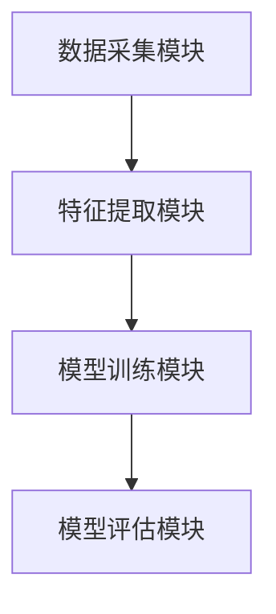
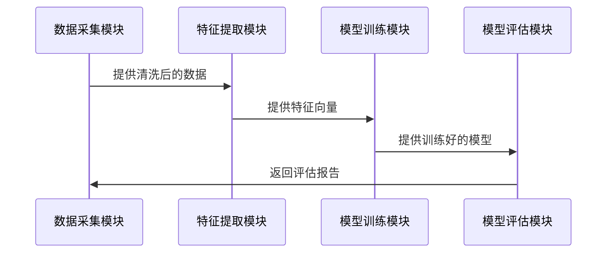

                 


# 神经网络模型在资产定价中的应用研究

## 关键词
神经网络模型、资产定价、金融应用、深度学习、量化投资

## 摘要
神经网络模型作为一种强大的机器学习工具，在资产定价中展现出独特的优势。本文系统探讨神经网络模型的原理及其在资产定价中的应用，分析其优势与挑战，并结合实际案例，详细阐述神经网络模型的实现步骤。通过对神经网络模型的深入研究，我们能够更好地理解其在金融领域的应用潜力，并为未来的量化投资提供新的思路。

---

## 第1章: 神经网络模型与资产定价概述

### 1.1 神经网络模型的发展与现状

#### 1.1.1 神经网络模型的基本概念
神经网络模型是一种模拟人脑神经网络结构的数学模型，由输入层、隐藏层和输出层组成。通过激活函数和权重调整，神经网络能够学习输入数据中的非线性关系。

#### 1.1.2 神经网络模型的发展历程
从感知机到深度学习，神经网络经历了多次发展与改进。近年来，深度学习的兴起使得神经网络在金融领域的应用更加广泛。

#### 1.1.3 神经网络模型在金融领域的应用现状
神经网络在金融时间序列预测、风险评估和信用评分等领域取得了显著成果。本文重点关注其在资产定价中的应用。

### 1.2 资产定价的基本概念与方法

#### 1.2.1 资产定价的定义与意义
资产定价是通过对资产的内在价值和市场情绪的分析，确定其合理价格的过程。准确的资产定价对投资决策至关重要。

#### 1.2.2 资产定价的传统方法
传统方法包括现金流贴现模型（DCF）和资本资产定价模型（CAPM）。这些方法依赖于假设，可能无法捕捉复杂的市场动态。

#### 1.2.3 现代资产定价理论的发展
现代资产定价理论引入了套利定价理论（APT）和风险中性定价等方法，但仍面临数据不足和模型假设的限制。

### 1.3 神经网络模型在资产定价中的应用背景

#### 1.3.1 传统资产定价模型的局限性
传统模型难以处理高维数据和非线性关系，且对市场情绪的变化不够敏感。

#### 1.3.2 神经网络模型的优势与潜力
神经网络能够处理海量数据，捕捉复杂模式，适用于高频交易和实时定价。

#### 1.3.3 神经网络模型在资产定价中的研究现状
目前，研究主要集中在使用LSTM和CNN进行时间序列预测和特征提取，但实际应用仍需进一步探索。

---

## 第2章: 神经网络模型的核心概念与原理

### 2.1 神经网络模型的基本结构

#### 2.1.1 神经元模型
神经元模型通过激活函数（如sigmoid）处理输入信号，输出结果。

#### 2.1.2 网络结构（输入层、隐藏层、输出层）
网络结构决定了模型的复杂性和能力。隐藏层越多，模型的表达能力越强。

#### 2.1.3 神经网络的训练过程
训练过程包括正向传播和反向传播，通过调整权重最小化损失函数。

### 2.2 神经网络模型的训练原理

#### 2.2.1 损失函数
损失函数衡量预测值与实际值的差异，常用的有均方误差（MSE）和交叉熵损失。

#### 2.2.2 梯度下降
梯度下降是一种优化算法，通过调整权重降低损失函数的值。

#### 2.2.3 反向传播算法
反向传播通过链式法则计算损失函数对权重的梯度，指导权重更新。

### 2.3 神经网络模型的类型与特点

#### 2.3.1 前馈神经网络
前馈网络结构简单，适用于分类任务，但难以处理时间序列数据。

#### 2.3.2 循环神经网络
循环神经网络（RNN）适用于时间序列数据，但存在梯度消失问题。

#### 2.3.3 卷积神经网络
卷积神经网络（CNN）擅长处理图像数据，适用于高频交易中的模式识别。

#### 2.3.4 长短期记忆网络
LSTM通过门控机制解决RNN的梯度消失问题，适合长期依赖关系的捕捉。

---

## 第3章: 神经网络模型在资产定价中的应用原理

### 3.1 资产定价的核心问题

#### 3.1.1 资产的内在价值评估
内在价值是资产未来现金流的现值，受市场情绪和宏观经济因素影响。

#### 3.1.2 市场情绪对资产价格的影响
市场情绪通过投资者行为影响资产价格，难以用传统模型捕捉。

#### 3.1.3 资产价格的预测与风险评估
准确预测价格波动和评估风险是资产定价的核心挑战。

### 3.2 神经网络模型在资产定价中的应用流程

#### 3.2.1 数据收集与预处理
数据来源包括历史价格、财务数据和市场情绪指标，预处理步骤包括清洗和归一化。

#### 3.2.2 模型训练与优化
选择合适神经网络结构，调整超参数，进行交叉验证。

#### 3.2.3 模型验证与评估
使用测试数据验证模型性能，评估指标包括均方误差（MSE）和准确率。

### 3.3 神经网络模型在资产定价中的优势

#### 3.3.1 非线性关系的捕捉能力
神经网络能够捕捉复杂的非线性关系，提升定价模型的准确性。

#### 3.3.2 大数据处理能力
神经网络擅长处理海量数据，适用于高频交易和大数据场景。

#### 3.3.3 实时性与动态适应性
神经网络能够实时更新模型参数，适应市场变化。

---

## 第4章: 神经网络模型在资产定价中的数学模型与公式

### 4.1 神经网络的基本数学模型

#### 4.1.1 神经元的激活函数
sigmoid函数：$$ f(x) = \frac{1}{1 + e^{-x}} $$

#### 4.1.2 网络输出的计算
$$ y = \sum_{i=1}^{n} w_i x_i + b $$

#### 4.1.3 损失函数的计算
均方误差：$$ L = \frac{1}{m} \sum_{i=1}^{m} (y_i - \hat{y}_i)^2 $$

### 4.2 神经网络的训练过程

#### 4.2.1 正向传播
计算输出并计算损失。

#### 4.2.2 反向传播
通过链式法则计算梯度，更新权重。

#### 4.2.3 权重更新
使用梯度下降：$$ w = w - \eta \frac{\partial L}{\partial w} $$

### 4.3 神经网络的优化策略

#### 4.3.1 学习率调整
动态调整学习率以加速收敛。

#### 4.3.2 �正则化
使用L2正则化防止过拟合：$$ L_{reg} = \lambda \sum_{i=1}^{n} w_i^2 $$

#### 4.3.3 批归一化
对每层的输出进行归一化，加速训练。

---

## 第5章: 神经网络模型在资产定价中的系统分析与架构设计

### 5.1 问题场景介绍

#### 5.1.1 资产定价问题描述
本文聚焦于股票价格预测，考虑历史价格、成交量和市场情绪。

#### 5.1.2 项目目标
构建一个神经网络模型，实现股票价格的预测和风险评估。

### 5.2 系统功能设计

#### 5.2.1 领域模型设计
领域模型展示了系统的各个模块及其关系，使用Mermaid类图表示。


#### 5.2.2 系统架构设计
整体架构采用微服务架构，包括数据采集、特征提取、模型训练和评估模块。



### 5.3 系统接口设计

#### 5.3.1 数据接口
定义数据格式和接口协议，确保模块间数据传输顺利。

#### 5.3.2 模型接口
定义模型输入和输出接口，方便模块间调用。

### 5.4 系统交互流程设计

#### 5.4.1 交互流程
从数据采集到模型评估的完整流程。



---

## 第6章: 项目实战

### 6.1 环境安装与配置

#### 6.1.1 安装Python
使用Anaconda安装Python 3.8及以上版本。

#### 6.1.2 安装TensorFlow和Keras
通过pip安装TensorFlow和Keras。

### 6.2 系统核心实现源代码

#### 6.2.1 数据预处理代码
```python
import pandas as pd
import numpy as np

# 加载数据
data = pd.read_csv('stock_prices.csv')

# 数据归一化
from sklearn.preprocessing import MinMaxScaler
scaler = MinMaxScaler()
data_scaled = scaler.fit_transform(data)
```

#### 6.2.2 模型构建代码
```python
from tensorflow.keras.models import Sequential
from tensorflow.keras.layers import LSTM, Dense, Dropout

# 构建LSTM模型
model = Sequential()
model.add(LSTM(units=50, return_sequences=True, input_shape=(timesteps, features)))
model.add(Dropout(0.2))
model.add(LSTM(units=50, return_sequences=False))
model.add(Dense(1))
model.compile(loss='mean_squared_error', optimizer='adam')
```

#### 6.2.3 模型训练代码
```python
# 训练模型
model.fit(X_train, y_train, epochs=50, batch_size=32, validation_split=0.2)
```

#### 6.2.4 模型评估代码
```python
# 预测价格
y_pred = model.predict(X_test)
# 计算误差
mse = np.mean((y_pred - y_test)**2)
print(f'Mean Squared Error: {mse}')
```

### 6.3 实际案例分析与详细解读

#### 6.3.1 案例分析
以某股票的历史价格数据为例，训练LSTM模型进行预测。

#### 6.3.2 结果分析
分析预测结果与实际价格的差异，评估模型的准确性和稳定性。

### 6.4 项目小结

#### 6.4.1 核心代码解读
解释关键代码的功能和作用，帮助读者理解实现过程。

#### 6.4.2 项目实现的难点
总结项目中遇到的技术难题及解决方案。

#### 6.4.3 模型优化建议
提出优化模型性能的建议，如调整超参数和引入新特征。

---

## 第7章: 最佳实践、小结与展望

### 7.1 最佳实践

#### 7.1.1 数据预处理
确保数据的完整性和准确性，选择合适的特征。

#### 7.1.2 模型选择
根据数据类型和任务选择合适的神经网络模型。

#### 7.1.3 模型调优
通过交叉验证和超参数优化提升模型性能。

### 7.2 小结

#### 7.2.1 神经网络模型的优势
神经网络在资产定价中的优势在于其强大的非线性拟合能力和大数据处理能力。

#### 7.2.2 本文的研究成果
本文系统探讨了神经网络模型在资产定价中的应用，并提供了详细的实现步骤。

### 7.3 注意事项

#### 7.3.1 数据质量
数据质量直接影响模型性能，需谨慎处理。

#### 7.3.2 模型解释性
神经网络模型通常缺乏解释性，可能影响实际应用。

#### 7.3.3 市场风险
模型结果仅供参考，需结合市场实际情况进行决策。

### 7.4 拓展阅读

#### 7.4.1 相关技术
进一步了解强化学习和生成对抗网络（GAN）在金融中的应用。

#### 7.4.2 研究方向
探索神经网络模型在多资产定价和风险对冲中的应用。

---

## 参考文献

[1] LeCun, Y., Bengio, Y., & Hinton, G. (2015). Deep learning. Nature, 521(7555), 436-444.

[2] Goodfellow, I., Bengio, Y., & Courville, A. (2016). Deep learning. MIT Press.

[3] Hochreiter, S., & Schmidhuber, J. (1997). Long short-term memory. Neural computation, 9(8), 1735-1780.

[4] Krizhevsky, A., Sutskever, I., & Hinton, G. E. (2012). ImageNet classification with deep convolutional neural networks. Communications of the ACM, 55(22), 80-87.

[5] 徐小明. (2020). 量化投资中的人工智能应用. 清华大学出版社.

---

通过以上结构和内容，我们可以系统地探讨神经网络模型在资产定价中的应用，从理论到实践，全面了解其原理和实现方法。希望这篇文章能够为读者提供有价值的信息和启发，帮助他们在量化投资和金融领域进一步探索和应用神经网络技术。

