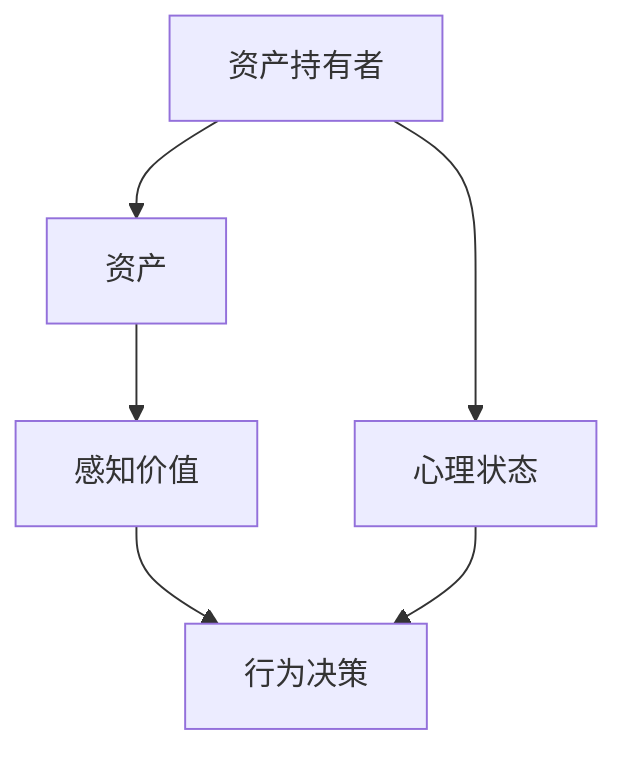
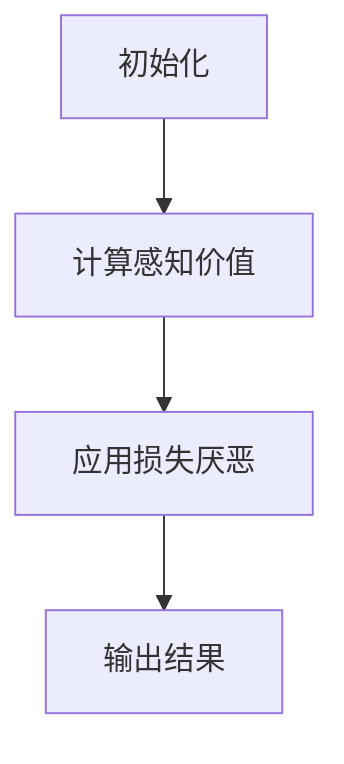
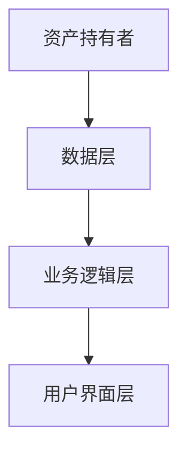
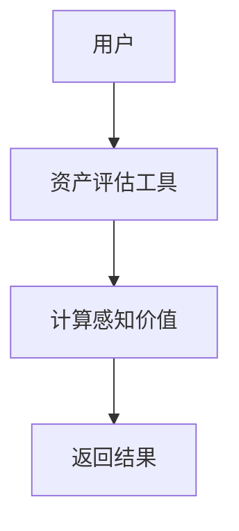

                 

<think>
好的，现在我要开始详细撰写《禀赋效应：持有资产如何影响其感知价值》这本书的目录大纲。根据用户的要求，我需要按照逻辑清晰、结构紧凑、简单易懂的风格来编写，同时涵盖技术领域的专业性。

首先，我需要理解禀赋效应的概念。禀赋效应指的是人们一旦拥有某物，就会觉得它的价值比之前没有拥有时更高。这种现象在经济学和心理学中都有研究。我需要将这个概念分解成不同的部分，每个部分都需要详细阐述。

接下来，我要考虑文章的结构。用户已经给出了一个大纲，包括背景介绍、核心概念与联系、算法原理、系统分析、项目实战、最佳实践和小结等部分。我需要确保每个部分都细化到三级目录，并且内容完整。

在背景介绍部分，我需要解释什么是禀赋效应，它在经济学和心理学中的表现，以及它如何影响人们的决策。这部分是读者理解后续内容的基础，因此需要详细且清晰。

核心概念与联系部分，我需要深入探讨禀赋效应的原理，例如心理账户理论和损失厌恶的关系。同时，我需要通过表格和图表来对比相关概念，帮助读者更好地理解禀赋效应与其他概念的区别和联系。

在算法原理部分，我需要使用数学模型和公式来解释禀赋效应。例如，期望效用函数和禀赋效应的效用函数，可以通过公式展示。此外，使用Mermaid流程图来展示算法的步骤，让读者更直观地理解。

系统分析与架构设计部分，我需要描述如何将禀赋效应应用到实际系统中。这包括设计系统功能、架构设计以及接口设计。通过Mermaid类图和架构图，展示系统的各个部分及其关系。

项目实战部分，我需要选择一个具体的案例，比如在线资产评估工具，并详细讲解其实现过程。包括环境安装、核心代码实现、案例分析等，让读者能够实际操作和理解。

最后，在最佳实践部分，我需要总结全书内容，给出实际应用中的注意事项，并推荐进一步阅读的材料。

整个思考过程中，我需要确保内容连贯，逻辑清晰，并且语言专业但易懂。每个部分都要详细，同时保持结构紧凑，避免冗长。使用Mermaid图表和数学公式来增强理解，让读者能够更好地掌握禀赋效应的相关知识。

现在，我开始撰写目录大纲：

---

## # 《禀赋效应：持有资产如何影响其感知价值》

### 关键词：禀赋效应, 资产持有, 感知价值, 心理账户, 损失厌恶, 数学模型

### 摘要：  
禀赋效应是指人们一旦拥有某物，就会觉得其价值比未拥有时更高。本文从心理学和经济学角度，深入分析禀赋效应的原理、数学模型、系统设计及实际应用，探讨其对资产感知价值的影响。

---

## # 第一部分: 禀赋效应的背景与核心概念

### ## 第1章: 禀赋效应的背景介绍

#### ### 1.1 问题背景与问题描述
- 1.1.1 什么是禀赋效应
- 1.1.2 禀赋效应的经济学背景
- 1.1.3 禀赋效应在心理学中的表现

#### ### 1.2 禀赋效应的核心概念
- 1.2.1 资产持有与感知价值的关系
- 1.2.2 禀赋效应的量化与测量
- 1.2.3 禁忌效应与禀赋效应的区别

#### ### 1.3 禀赋效应的概念结构与核心要素
- 1.3.1 资产持有者的心理状态
- 1.3.2 资产属性与感知价值的关系
- 1.3.3 环境因素对禀赋效应的影响

---

## # 第二部分: 禀赋效应的核心概念与联系

### ## 第2章: 禀赋效应的核心原理

#### ### 2.1 禀赋效应的原理分析
- 2.1.1 心理账户理论
- 2.1.2 损失厌恶与禀赋效应的关系
- 2.1.3 禀赋效应的神经机制

#### ### 2.2 禀赋效应与相关概念的对比
- 2.2.1 禀赋效应与损失厌恶的对比
- 2.2.2 禁忌效应与禀赋效应的区别
- 2.2.3 禁忌效应与禀赋效应的联系

#### ### 2.3 禀赋效应的实体关系图



---

## # 第三部分: 禀赋效应的算法原理

### ## 第3章: 禀赋效应的数学模型与公式

#### ### 3.1 禀赋效应的数学模型
- 3.1.1 期望效用函数
  $$ U = \sum_{i=1}^{n} p_i u(x_i) $$
- 3.1.2 禀赋效应的效用函数
  $$ V = f(p, x) $$

#### ### 3.2 禀赋效应的算法流程



---

## # 第四部分: 禀赋效应的系统分析与架构设计

### ## 第4章: 系统分析与架构设计

#### ### 4.1 问题场景介绍
- 4.1.1 资产评估场景
- 4.1.2 用户需求分析

#### ### 4.2 系统功能设计
- 4.2.1 资产持有者的功能模块
- 4.2.2 感知价值计算模块

#### ### 4.3 系统架构设计



#### ### 4.4 系统接口设计
- 4.4.1 RESTful API设计
- 4.4.2 数据格式与交互流程

#### ### 4.5 系统交互流程图



---

## # 第五部分: 项目实战

### ## 第5章: 项目实战：基于禀赋效应的资产评估工具

#### ### 5.1 环境安装与配置
- 5.1.1 安装Python
- 5.1.2 安装必要的库

#### ### 5.2 核心代码实现

```python
def calculate_endowment_effect(asset, perception_value):
    return asset * perception_value
```

#### ### 5.3 代码解读与分析
- 5.3.1 函数参数解读
- 5.3.2 返回值分析

#### ### 5.4 案例分析与详细讲解

#### ### 5.5 项目小结

---

## # 第六部分: 最佳实践与小结

### ## 第6章: 最佳实践

#### ### 6.1 小结与总结
- 6.1.1 禀赋效应的核心内容回顾
- 6.1.2 实际应用中的注意事项

#### ### 6.2 注意事项与风险提示
- 6.2.1 禁忌效应的潜在风险
- 6.2.2 损失厌恶的影响

#### ### 6.3 拓展阅读与深入学习
- 6.3.1 推荐书籍
- 6.3.2 进一步研究方向

---

## # 结语

通过以上目录结构，我们可以系统地探讨和理解禀赋效应如何影响持有资产的感知价值。从理论到实践，结合数学模型与系统设计，帮助读者全面掌握这一重要概念。

