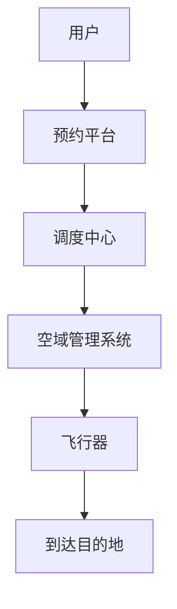

                 

# 空中出租车服务的发展前景与投资机会

## 关键词
空中出租车, 电动垂直起降飞行器, 自动驾驶技术, 空中交通管理, 投资机会

## 摘要
随着城市化进程的加速和交通拥堵问题的加剧，空中出租车服务作为一种新兴的交通方式，正逐渐成为解决城市交通问题的重要手段。本文从空中出租车的核心技术、商业模式、市场分析、投资机会等方面展开讨论，深入分析其发展前景与投资潜力，为投资者和相关企业提供有价值的参考。

---

## 第一部分: 空中出租车服务的背景与定义

### 第1章: 空中出租车服务的背景与定义

#### 1.1 空中出租车服务的定义
空
### 1.1.1 空中出租车的基本概念
空中出租车是一种利用电动垂直起降飞行器（eVTOL）或无人机等新型交通工具，通过空中交通管理系统（ATMS）实现点对点城市空中交通服务的新兴出行方式。它不同于传统出租车，能够提供更快速、更灵活的空中交通解决方案。

#### 1.1.2 空中出租车与传统出租车的对比
| 特性                | 传统出租车               | 空中出租车               |
|---------------------|--------------------------|--------------------------|
| 运行环境            | 地面道路                 | 空中                     |
| 运行速度            | 限速40-60 km/h           | 最高可达300 km/h         |
| 路线灵活性          | 受红绿灯和交通拥堵影响    | 受空域管理限制            |
| 适用场景          | 市区短途出行             | 高度城市化地区、跨城市     |

#### 1.1.3 穳空出租车的核心特征
- **点对点服务**：用户可以选择起点和终点，无需依赖固定线路。
- **快速高效**：相比地面交通，空中出租车能够大幅缩短出行时间。
- **环保节能**：采用电动技术，减少碳排放，符合可持续发展理念。

---

#### 1.2 空中出租车服务的发展背景
随着全球城市化进程的加快，城市交通拥堵问题日益严重。传统交通方式难以满足人们对高效出行的需求，因此，空中出租车作为一种新兴的交通方式应运而生。

#### 1.2.1 城市交通拥堵问题
- 城市人口密集，交通需求激增。
- 道路资源有限，导致交通拥堵严重。
- 传统交通方式难以满足高峰期的出行需求。

#### 1.2.2 新技术推动空中交通发展
- **电动技术**：电池技术的进步使得eVTOL的续航能力显著提升。
- **自动驾驶技术**：人工智能的发展使得无人机和eVTOL能够实现自动驾驶。
- **5G通信**：高速数据传输为实时交通管理提供了技术保障。

#### 1.2.3 全球城市化进程加速
- 全球城市人口预计将在2050年达到68%。
- 城市化带来更高的交通需求，推动了空中出租车服务的发展。

---

#### 1.3 空中出租车服务的现状
尽管空中出租车服务仍处于起步阶段，但全球多个国家和地区已经开始试点项目。

#### 1.3.1 全球主要国家的空中出租车项目
- **新加坡**：2020年启动全球首个无人机出租车试点项目。
- **美国**：多个城市正在测试eVTOL的可行性。
- **中国**：部分城市已经开始规划空中交通网络。

#### 1.3.2 当前技术瓶颈与市场障碍
- **技术成熟度**：eVTOL和自动驾驶技术仍需进一步验证。
- **政策法规**：空域管理法规尚未完善，存在法律障碍。

#### 1.3.3 未来发展趋势与潜力
- **技术进步**：电动技术和人工智能的进步将推动空中出租车的发展。
- **市场扩大**：随着城市化进程的加快，空中出租车市场潜力巨大。

---

## 第二部分: 空中出租车服务的核心技术与产业链

### 第2章: 空中出租车服务的核心技术与产业链

#### 2.1 空中出租车的关键技术
- **电动垂直起降飞行器（eVTOL）**：结合直升机和固定翼飞机的优势，具备垂直起降能力。
- **无人机技术**：用于短途配送和空中交通服务。
- **自动驾驶技术**：实现飞行器的自动驾驶和智能决策。

#### 2.1.1 eVTOL的技术原理
eVTOL的核心技术包括电动推进系统、旋翼设计和自动驾驶系统。通过电动机和旋翼的组合，eVTOL能够在垂直方向起降，并在水平方向飞行。

#### 2.1.2 无人机技术
无人机技术在空中出租车服务中主要用于短途配送和监控。通过无人机的高效飞行能力，可以实现快速响应和精准配送。

#### 2.1.3 自动驾驶技术
自动驾驶技术是实现空中出租车服务的关键。通过传感器、摄像头和人工智能算法，飞行器能够感知环境并做出智能决策。

---

#### 2.2 空中交通管理系统的原理
空中交通管理系统（ATMS）是空中出租车服务的核心支持系统。

#### 2.2.1 系统架构与功能
- **用户终端**：用户通过手机App或网页平台预约空中出租车。
- **调度中心**：实时监控飞行器状态，调度车辆并安排路线。
- **空域管理**：通过雷达和通信技术实现空域监控和管理。

#### 2.2.2 空中交通管理的流程图

---

#### 2.3 产业链分析
空中出租车服务的产业链包括上游、中游和下游三个部分。

#### 2.3.1 上游产业：硬件与技术供应商
- **硬件供应商**：提供eVTOL、无人机等硬件设备。
- **技术供应商**：提供自动驾驶、通信和导航技术。

#### 2.3.2 中游产业：空中出租车运营商
- **运营商**：负责飞行器的运营、调度和维护。
- **平台提供商**：提供预约、支付和管理平台。

#### 2.3.3 下游产业：用户与市场
- **用户**：通过平台预约空中出租车服务。
- **市场**：包括企业客户和个人用户。

---

## 第三部分: 空中出租车服务的商业模式与市场分析

### 第3章: 空中出租车服务的商业模式与市场分析

#### 3.1 空中出租车的商业模式
- **服务订阅模式**：用户按月支付固定费用，享受无限次空中出租车服务。
- **按需付费模式**：用户根据实际使用次数支付费用。
- **广告与数据变现模式**：通过收集用户数据并进行广告投放实现收益。

#### 3.1.1 服务订阅模式
- **优点**：用户使用成本低，运营商可以实现稳定的收入。
- **缺点**：需要大量的用户基数支持。

#### 3.1.2 按需付费模式
- **优点**：灵活性高，用户可以根据需求随时使用。
- **缺点**：收入不稳定，难以实现规模经济。

---

#### 3.2 市场规模与增长预测
根据市场研究机构的预测，全球空中出租车市场规模将在未来几年内迅速增长。

#### 3.2.1 全球市场规模分析
- 2020年：市场规模约为10亿美元。
- 2030年：市场规模预计将达到500亿美元。
- 2040年：市场规模可能突破2000亿美元。

#### 3.2.2 区域市场分布
- **亚洲**：中国、印度和东南亚国家市场需求旺盛。
- **欧洲**：英国、法国和德国正在积极推进空中出租车项目。
- **北美**：美国是全球空中出租车技术的领导者。

#### 3.2.3 市场增长驱动因素
- **技术进步**：电动技术和自动驾驶技术的快速发展。
- **政策支持**：各国政府出台了一系列支持政策。
- **市场需求**：城市化和交通拥堵问题推动了市场需求。

---

#### 3.3 竞争格局与主要企业
空中出租车服务领域的竞争格局正在逐步形成。

#### 3.3.1 主要参与者分析
- **优步（Uber）**：通过其飞行事业部（Uber Elevate）布局空中出租车市场。
- **空中客车（Airbus）**：推出了“飞的”（Airbus Voom）项目。
- **波音（Boeing）**：通过投资和合作推动空中出租车技术的发展。

#### 3.3.2 企业布局与竞争策略
- **技术驱动**：企业加大研发投入，推动技术创新。
- **市场拓展**：积极布局全球市场，抢占先机。
- **合作与并购**：通过合作和并购快速扩大市场份额。

---

## 第四部分: 空中出租车服务的投资机会与风险分析

### 第4章: 空中出租车服务的投资机会与风险分析

#### 4.1 投资机会分析
- **技术研发领域**：投资电动技术和自动驾驶技术的研发。
- **产业链整合机会**：投资上游硬件和技术供应商，或者下游的平台和运营商。
- **市场拓展潜力**：投资新兴市场，抢占未来市场。

#### 4.1.1 技术研发领域
- **投资方向**：电动技术、自动驾驶技术、通信技术。
- **投资回报**：技术成熟后，市场需求巨大。

#### 4.1.2 产业链整合机会
- **投资方向**：收购或投资产业链上下游企业。
- **投资回报**：通过整合资源，降低运营成本，提高效率。

---

#### 4.2 投资风险与挑战
- **技术风险**：技术不成熟可能导致项目失败。
- **政策风险**：空域管理法规尚未完善，存在政策不确定性。
- **市场需求风险**：市场需求可能低于预期。

#### 4.2.1 技术风险
- **技术成熟度**：eVTOL和自动驾驶技术尚未完全成熟，存在技术瓶颈。
- **研发投入**：需要大量的资金和时间投入。

#### 4.2.2 政策风险
- **法规不确定性**：空域管理法规尚未完善，可能影响项目推进。
- **政策变化**：政府政策的变化可能对市场产生重大影响。

---

#### 4.3 应对策略
- **技术创新**：加大研发投入，推动技术进步。
- **政策倡导**：积极参与政策制定，推动法规完善。
- **市场调研**：深入了解市场需求，制定合理的市场策略。

---

## 第五部分: 空中出租车服务的未来展望与挑战

### 第5章: 空中出租车服务的未来展望与挑战

#### 5.1 未来技术发展与趋势
- **电池技术**：更高能量密度的电池将推动飞行器的续航能力。
- **人工智能**：更智能的算法将提升飞行器的自动驾驶能力。
- **5G通信**：更快的数据传输速度将支持实时交通管理。

#### 5.2 市场需求与变化
- **城市化**：城市化进程的加快将推动空中出租车市场需求的增长。
- **交通方式多样化**：未来将有更多的交通方式出现，推动空中出租车服务的发展。

#### 5.3 挑战与解决方案
- **技术挑战**：需要进一步突破电池技术和自动驾驶技术。
- **政策挑战**：需要推动空域管理法规的完善。
- **市场需求挑战**：需要通过市场教育和推广提升用户接受度。

---

## 结论
空中出租车服务作为一种新兴的交通方式，具备广阔的发展前景和巨大的投资潜力。随着技术的进步和政策的完善，空中出租车服务将逐步成为城市交通的重要组成部分。投资者需要关注技术发展、市场需求和政策变化，抓住投资机会，同时做好风险防控。

---

## 参考文献
1. 优步（Uber）飞行事业部官网
2. 空中客车（Airbus）官方资料
3. 波音（Boeing）官方资料
4. 各国政府发布的相关政策文件
5. 相关学术论文和市场研究报告

