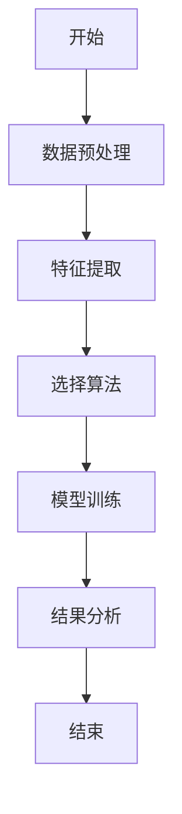

                 


# 竞争对手分析

> 关键词：竞争对手分析，商业策略，数据分析，机器学习，市场分析

> 摘要：竞争对手分析是企业在现代商业环境中制定有效战略的重要工具。本文从背景、核心概念、算法原理、系统架构到实战案例，全面解析竞争对手分析的各个方面。通过详细的技术分析和实际案例，帮助读者掌握竞争对手分析的方法和应用。

---

## 第一部分：竞争对手分析概述

### 第1章：竞争对手分析的背景与重要性

#### 1.1 竞争对手分析的定义与概念

- **定义**：竞争对手分析是通过研究市场上其他企业的产品、服务、市场策略、技术能力等，来评估自身竞争优势和潜在威胁的过程。
- **核心概念**：竞争对手分析的核心在于识别竞争对手的优劣势，发现市场机会，制定差异化策略。
- **边界与外延**：竞争对手分析不仅包括直接竞争对手，还包括潜在竞争对手和替代品供应商。

#### 1.2 竞争对手分析的重要性

- **企业战略规划的基石**：通过分析竞争对手的市场策略，企业可以制定更具针对性的发展计划。
- **市场定位与竞争优势的构建**：了解竞争对手的强项和弱项，有助于企业找到自身的独特价值。
- **创新与风险控制的关键**：竞争对手分析可以帮助企业预测市场趋势，提前规避潜在风险。

---

### 第2章：竞争对手分析的核心要素

#### 2.1 竞争环境的分析

- **行业环境分析**：包括行业市场规模、增长趋势、竞争格局等。
- **市场结构分析**：分析市场集中度、进入壁垒、供应商力量等。
- **竞争态势分析**：通过SWOT分析法，评估竞争对手的优势和劣势。

#### 2.2 竞争对手的结构与特征

- **竞争对手的分类**：直接竞争对手、间接竞争对手、潜在竞争对手。
- **竞争对手的核心竞争力分析**：产品、技术、服务、品牌等方面的优势。
- **竞争对手的市场地位分析**：市场份额、市场影响力、品牌知名度。

---

### 第3章：竞争对手分析的方法论

#### 3.1 定性分析方法

- **市场调研**：通过问卷、访谈等方式收集竞争对手信息。
- **SWOT分析**：评估竞争对手的优势、劣势、机会和威胁。
- **情景分析**：预测不同市场情景下竞争对手的可能行为。

#### 3.2 定量分析方法

- **市场份额分析**：通过数据分析，评估竞争对手的市场份额变化。
- **市场趋势分析**：利用历史数据预测未来市场走向。
- **竞争指数计算**：通过量化指标（如市场份额、增长率）评估竞争对手的竞争力。

---

## 第二部分：竞争对手分析的技术实现

### 第4章：竞争对手分析的算法原理

#### 4.1 数据挖掘与机器学习算法

- **聚类分析**：通过K-means算法将竞争对手分为不同的类别。
- **文本挖掘**：利用自然语言处理技术分析竞争对手的产品描述、用户评价等文本数据。
- **网络分析**：通过图论方法分析竞争对手之间的关系网络。

#### 4.2 算法流程图（Mermaid）



#### 4.3 算法实现代码

```python
from sklearn.cluster import KMeans
import pandas as pd

# 数据预处理
data = pd.read_csv('competitors_data.csv')
X = data[['feature1', 'feature2', 'feature3']]
model = KMeans(n_clusters=3)
model.fit(X)
print(model.labels_)
```

---

### 第5章：竞争对手分析的数学模型

#### 5.1 市场份额分析模型

- **市场份额计算公式**：
  $$ \text{市场份额} = \frac{\text{企业销售额}}{\text{市场总销售额}} \times 100\% $$
- **竞争强度分析模型**：
  $$ \text{竞争强度} = \sum_{i=1}^{n} \left( \frac{\text{竞争对手的市场份额}_i}{\text{市场总销售额}} \right) $$

#### 5.2 竞争对手定价模型

- **定价敏感性分析**：
  $$ \text{价格弹性} = \frac{\% \text{需求变化}}{\% \text{价格变化}} $$
- **利润最大化模型**：
  $$ \text{利润} = (\text{价格} - \text{成本}) \times \text{销量} $$

---

### 第6章：竞争对手分析的系统架构设计

#### 6.1 系统功能设计

- **数据采集模块**：负责收集竞争对手的产品信息、用户评价、市场数据等。
- **数据处理模块**：对采集到的数据进行清洗、转换和特征提取。
- **分析模块**：利用机器学习算法对数据进行分析，生成竞争对手的画像。
- **可视化模块**：将分析结果以图表形式展示，帮助用户直观理解。

#### 6.2 系统架构图（Mermaid）


#### 6.3 接口与交互设计

- **API接口**：提供RESTful API，供其他系统调用分析结果。
- **用户交互**：通过Web界面，用户可以输入竞争对手信息并查看分析结果。

---

## 第三部分：竞争对手分析的实战应用

### 第7章：项目实战

#### 7.1 环境安装

- **工具安装**：安装Python、Pandas、Scikit-learn等工具。
- **数据来源**：获取竞争对手的产品数据、用户评价数据等。

#### 7.2 核心代码实现

```python
import pandas as pd
from sklearn.cluster import KMeans

# 数据加载
data = pd.read_csv('competitors.csv')

# 特征选择
features = data[['price', 'rating', 'sales']]
X = features.values

# 模型训练
model = KMeans(n_clusters=3)
model.fit(X)

# 可视化
import matplotlib.pyplot as plt
plt.scatter(X[:,0], X[:,1], c=model.labels_)
plt.xlabel('Price')
plt.ylabel('Rating')
plt.show()
```

#### 7.3 代码解读与分析

- **数据加载**：从CSV文件中加载竞争对手数据。
- **特征选择**：选择价格、评分、销量作为分析特征。
- **模型训练**：使用K-means算法将竞争对手分为三类。
- **结果可视化**：通过散点图展示竞争对手的分类结果。

#### 7.4 案例分析

- **案例背景**：某电商公司希望分析竞争对手的定价策略。
- **分析结果**：通过聚类分析发现，竞争对手主要分为高端、中端和低端三个市场。
- **策略调整**：根据分析结果，调整自身定价策略，抢占市场份额。

---

### 第8章：最佳实践与小结

#### 8.1 小结

- 竞争对手分析是企业制定战略的重要工具。
- 通过定性与定量分析结合，可以更全面地评估竞争对手。
- 机器学习和数据挖掘技术的应用，使得竞争对手分析更加高效和精准。

#### 8.2 注意事项

- 数据来源的准确性和完整性是分析的基础。
- 需要结合行业特点选择合适的分析方法。
- 分析结果需要结合企业实际情况进行调整。

#### 8.3 拓展阅读

- 推荐阅读《竞争战略》（迈克尔·波特）、《数据挖掘导论》（Jiawei Han）等书籍。

---

# 结语

竞争对手分析不仅是企业生存的必要技能，更是企业创新和发展的关键。通过本文的详细讲解，读者可以全面掌握竞争对手分析的方法和应用。在实际操作中，结合企业的实际情况，灵活运用这些方法，将帮助企业制定更有效的市场策略，赢得竞争优势。

