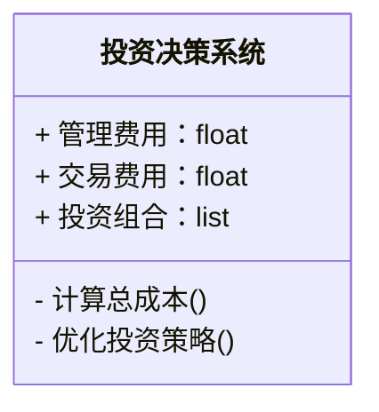
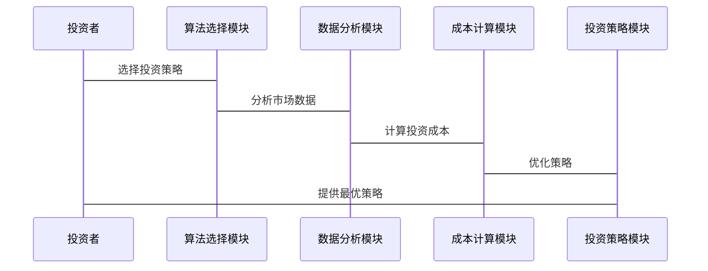

                 


# 约翰·博格尔的成本意识：长期投资成功的关键

## 关键词：
- 约翰·博格尔、成本意识、长期投资、投资策略、投资回报、指数基金、投资分析

## 摘要：
约翰·博格尔是投资界的重要人物，他强调成本意识在长期投资中的关键作用。本文将详细分析博格尔的成本意识理念，探讨其在投资决策中的应用，结合数学模型和系统设计，提供实际案例分析和最佳实践。通过本文，读者将理解如何通过成本优化实现长期投资成功。

---

# 目录大纲：《约翰·博格尔的成本意识：长期投资成功的关键》

## 第一部分：引言

### 第1章：约翰·博格尔与成本意识概述

#### 1.1 约翰·博格尔的生平与投资理念
- 1.1.1 博格尔的早期经历与职业生涯
- 1.1.2 投资领域的传奇：指数基金之父
- 1.1.3 成本意识的核心观点

#### 1.2 成本意识的定义与重要性
- 1.2.1 成本意识的定义
- 1.2.2 成本意识在投资中的关键作用
- 1.2.3 成本意识与长期投资回报的关系

## 第二部分：成本意识的核心概念

### 第2章：成本意识的理论基础

#### 2.1 投资成本的构成与影响
- 2.1.1 显性成本：管理费、交易费用
- 2.1.2 隐性成本：机会成本与时间成本

#### 2.2 成本与收益的平衡
- 2.2.1 成本-收益分析模型
- 2.2.2 短期与长期成本的权衡

## 第三部分：成本意识在投资决策中的应用

### 第3章：投资策略的成本分析

#### 3.1 投资策略的成本评估
- 3.1.1 积极型投资策略的成本分析
- 3.1.2 消极型投资策略的成本分析

#### 3.2 成本意识与资产配置
- 3.2.1 资产配置的成本影响
- 3.2.2 如何通过成本优化实现最优配置

## 第四部分：长期投资中的成本意识策略

### 第4章：长期投资的成本控制

#### 4.1 长期投资中的成本累积效应
- 4.1.1 时间对成本累积的影响
- 4.1.2 高成本投资的长期风险

#### 4.2 成本优化策略
- 4.2.1 选择低成本投资工具
- 4.2.2 长期持有策略的成本优势

## 第五部分：案例分析与系统设计

### 第5章：约翰·博格尔投资方法的系统分析

#### 5.1 投资决策系统架构
- 5.1.1 系统功能设计（领域模型）
- 5.1.2 系统架构设计（Mermaid图）
- 5.1.3 系统接口与交互（序列图）

#### 5.2 成本意识在系统中的应用
- 5.2.1 成本分析模块
- 5.2.2 投资策略优化模块

## 第六部分：项目实战与总结

### 第6章：成本意识投资实战

#### 6.1 环境安装与工具准备
- 6.1.1 数据分析工具安装
- 6.1.2 投资分析平台配置

#### 6.2 核心代码实现
- 6.2.1 成本计算函数
- 6.2.2 投资回报率计算

#### 6.3 实战案例分析
- 6.3.1 案例背景与目标
- 6.3.2 数据分析与结果解读
- 6.3.3 成本优化策略实施

## 第七部分：总结与未来展望

### 第7章：总结与未来展望

#### 7.1 成本意识的重要性
- 7.1.1 成本意识在投资中的核心地位
- 7.1.2 未来投资的趋势与挑战

#### 7.2 最佳实践与小结
- 7.2.1 投资中的成本优化策略
- 7.2.2 长期投资的成功关键

---

# 第一部分：引言

## 第1章：约翰·博格尔与成本意识概述

### 1.1 约翰·博格尔的生平与投资理念

#### 1.1.1 博格尔的早期经历与职业生涯
约翰·博格尔（John C. Bogle）是投资界的传奇人物，被誉为“指数基金之父”。他于1934年出生于美国宾夕法尼亚州，曾在宾夕法尼亚大学学习，后来加入华安互助人寿保险公司，最终创立了 Vanguard 集团，成为该公司的董事长。

#### 1.1.2 投资领域的传奇：指数基金之父
博格尔是指数基金的开创者，他在1975年推出了第一只指数基金（Vanguard 500 Index Fund），这一创新改变了投资行业。指数基金以低成本、低风险著称，为投资者提供了分散投资的机会。

#### 1.1.3 成本意识的核心观点
博格尔强调成本在投资中的重要性。他认为，长期投资回报与投资成本密切相关，低成本投资策略能够为投资者带来更高的净回报。他的成本意识理念成为 Vanguard 集团的核心原则，影响了全球的投资策略。

---

## 第二部分：成本意识的核心概念

### 第2章：成本意识的理论基础

#### 2.1 投资成本的构成与影响

##### 2.1.1 显性成本：管理费、交易费用
显性成本是投资者可以直接看到的费用，包括管理费、交易费用、托管费等。这些费用直接影响投资回报，长期累积会对收益产生显著影响。

##### 2.1.2 隐性成本：机会成本与时间成本
隐性成本是投资者因选择某种投资策略而放弃的其他投资机会的成本。时间成本则指由于资金被锁定在低回报投资中而失去的更高回报机会。

#### 2.2 成本与收益的平衡

##### 2.2.1 成本-收益分析模型
成本-收益分析模型是投资决策中的关键工具，用于评估不同投资策略的成本与收益之比。通过比较不同策略的成本和预期收益，投资者可以选择最优的投资方案。

##### 2.2.2 短期与长期成本的权衡
短期成本和长期成本的权衡需要考虑投资目标和时间 horizon。短期投资可能面临较高的交易成本和税收，而长期投资则更注重整体成本的最小化。

---

## 第三部分：成本意识在投资决策中的应用

### 第3章：投资策略的成本分析

#### 3.1 投资策略的成本评估

##### 3.1.1 积极型投资策略的成本分析
积极型投资策略涉及频繁交易和主动管理，通常伴随着较高的显性成本和隐性成本。这种策略适合短期投资者，但长期来看，高成本可能侵蚀收益。

##### 3.1.2 消极型投资策略的成本分析
消极型投资策略强调长期持有和被动管理，通常成本较低。通过指数基金等工具，投资者可以分散风险并降低管理费用，实现长期稳定的回报。

#### 3.2 成本意识与资产配置

##### 3.2.1 资产配置的成本影响
资产配置决定了投资组合的风险和收益，同时也影响成本。通过优化资产配置，投资者可以在不同资产类别中分散投资，降低整体成本。

##### 3.2.2 如何通过成本优化实现最优配置
选择低成本的资产类别和工具，避免不必要的交易和管理费用，是实现最优资产配置的关键。指数基金因其低管理费用，成为成本优化的重要工具。

---

## 第四部分：长期投资中的成本意识策略

### 第4章：长期投资的成本控制

#### 4.1 长期投资中的成本累积效应

##### 4.1.1 时间对成本累积的影响
长期投资中，即使是看似微小的成本差异，随着时间的推移也会显著影响最终收益。低成本策略能够帮助投资者在长期内积累更多的财富。

##### 4.1.2 高成本投资的长期风险
高成本投资策略可能导致收益被侵蚀，尤其是在市场波动较大的情况下。长期来看，低成本策略更具稳定性。

#### 4.2 成本优化策略

##### 4.2.1 选择低成本投资工具
投资者应选择管理费用低、交易费用低的投资工具，如指数基金、ETF等。 Vanguard 的指数基金以低成本著称，是长期投资的理想选择。

##### 4.2.2 长期持有策略的成本优势
长期持有投资可以避免频繁交易带来的额外费用，同时降低税务负担。通过减少交易次数，投资者可以降低隐性成本，提高整体回报。

---

## 第五部分：案例分析与系统设计

### 第5章：约翰·博格尔投资方法的系统分析

#### 5.1 投资决策系统架构

##### 5.1.1 系统功能设计（领域模型）


##### 5.1.2 系统架构设计（Mermaid图）
```mermaid
container 系统架构 {
    算法选择模块
    数据分析模块
    成本计算模块
    投资策略模块
}
```

##### 5.1.3 系统接口与交互（序列图）


#### 5.2 成本意识在系统中的应用

##### 5.2.1 成本分析模块
成本分析模块负责计算投资组合的显性和隐性成本，帮助投资者评估不同策略的成本影响。

##### 5.2.2 投资策略优化模块
该模块基于成本分析结果，优化投资策略，提供低成本高收益的投资方案。

---

## 第六部分：项目实战与总结

### 第6章：成本意识投资实战

#### 6.1 环境安装与工具准备

##### 6.1.1 数据分析工具安装
- 安装 Python 和相关库（Pandas, NumPy, Matplotlib）
- 安装数据分析平台（如 Jupyter Notebook）

##### 6.1.2 投资分析平台配置
- 注册并配置投资分析平台（如 Vanguard 的投资工具）
- 设置数据获取接口

#### 6.2 核心代码实现

##### 6.2.1 成本计算函数
```python
def calculate_cost(portfolio, fees):
    total_cost = sum(fees * asset for asset in portfolio)
    return total_cost
```

##### 6.2.2 投资回报率计算
```python
def calculate_return(portfolio, returns):
    total_return = sum(asset * return_ for asset, return_ in zip(portfolio, returns))
    return total_return
```

#### 6.3 实战案例分析

##### 6.3.1 案例背景与目标
分析一位投资者在不同投资策略下的成本和回报，选择最优策略。

##### 6.3.2 数据分析与结果解读
通过数据分析，比较积极型和消极型策略的成本和回报，发现低成本策略更具优势。

##### 6.3.3 成本优化策略实施
选择低成本投资工具，如指数基金，优化资产配置，长期持有，实现投资回报最大化。

---

## 第七部分：总结与未来展望

### 第7章：总结与未来展望

#### 7.1 成本意识的重要性

##### 7.1.1 成本意识在投资中的核心地位
成本意识是长期投资成功的关键因素，低成本策略能够帮助投资者实现更高的净回报。

##### 7.1.2 未来投资的趋势与挑战
随着市场的发展，低成本投资工具和技术的进步，投资策略将更加注重成本优化。未来，投资者需要更加关注自动化投资工具和智能化分析平台，以实现成本的有效控制。

#### 7.2 最佳实践与小结

##### 7.2.1 投资中的成本优化策略
选择低成本投资工具，优化资产配置，避免频繁交易，长期持有，是实现成本优化的关键。

##### 7.2.2 长期投资的成功关键
长期投资的成功不仅依赖于市场分析和策略选择，更取决于对成本的持续关注和优化。通过博格尔的成本意识理念，投资者可以在复杂多变的市场中找到稳定的投资回报。

---

# 附录

## 附录A：投资成本计算公式

$$ \text{总成本} = \sum (\text{管理费} + \text{交易费用}) $$

## 附录B：投资回报率计算公式

$$ \text{净回报率} = \frac{\text{总回报} - \text{总成本}}{\text{初始投资}} $$

---

# 结束语

通过本文的详细分析，读者可以全面理解约翰·博格尔的成本意识理念，并将其应用于实际投资决策中。希望本文能为投资者提供有价值的指导，帮助他们在长期投资中实现成功。

