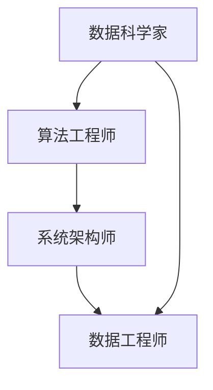
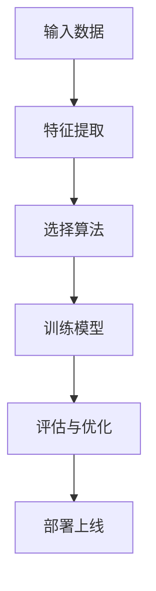

                 


# 组建高效AI开发团队的技巧

## 关键词：AI开发团队、高效协作、团队管理、算法设计、系统架构

## 摘要：本文详细探讨了组建高效AI开发团队的关键技巧，涵盖团队协作、技术挑战、算法原理、系统架构设计以及项目实战等方面，旨在帮助读者提升团队效率和项目成功率。

---

## 第一部分: 高效AI开发团队的背景与重要性

### 第1章: 高效AI开发团队的重要性

#### 1.1 问题背景与挑战
##### 1.1.1 当前AI开发中的主要问题
- **资源浪费**：重复劳动、低效协作导致时间、人力、资金浪费。
- **技术复杂性**：AI开发涉及多学科知识，技术门槛高。
- **协作困难**：团队成员间缺乏有效沟通，导致任务延期或失败。
- **效率低下**：传统开发模式难以应对AI项目的复杂性和不确定性。

##### 1.1.2 高效团队在AI开发中的必要性
- **提高效率**：高效团队能更快完成任务，降低开发成本。
- **减少错误**：通过分工协作，降低个人失误对整体项目的影响。
- **增强竞争力**：高效团队能够更快响应市场需求，提升企业竞争力。

##### 1.1.3 高效团队的核心价值与目标
- **核心价值**：通过优化协作流程和资源配置，提升团队整体效率。
- **目标**：实现高效、高质量的AI开发，满足业务需求。

---

## 第二部分: 高效AI开发团队的核心概念与联系

### 第2章: AI开发团队的核心概念与联系

#### 2.1 核心概念与原理
##### 2.1.1 团队角色分工与协作机制
- **数据科学家**：负责数据分析、特征提取和模型设计。
- **算法工程师**：负责算法实现、优化和测试。
- **系统架构师**：负责系统设计、接口开发和集成测试。
- **数据工程师**：负责数据采集、存储和预处理。

##### 2.1.2 AI开发中的技术栈与工具链
- **技术栈**：Python、TensorFlow、PyTorch、Scikit-learn等。
- **工具链**：Jupyter Notebook、Git、Docker、Kubernetes等。

##### 2.1.3 高效团队的组织结构与文化
- **扁平化管理**：减少层级，促进信息流通。
- **目标导向**：以项目目标为导向，制定合理的开发计划。
- **学习型组织**：鼓励团队成员不断学习和提升技能。

#### 2.2 核心概念的属性特征对比
##### 2.2.1 团队角色的属性对比
| 角色       | 责任                     | 技能要求                     |
|------------|--------------------------|-----------------------------|
| 数据科学家 | 数据分析与特征提取       | 数据处理、统计学、机器学习   |
| 算法工程师 | 算法实现与优化           | 编程、算法优化、数学建模     |
| 系统架构师 | 系统设计与集成           | 架构设计、系统集成、测试     |
| 数据工程师 | 数据采集与预处理         | 数据库管理、ETL开发、分布式存储 |

##### 2.2.2 技术栈的优劣势分析
| 技术栈       | 优势                     | 劣势                     |
|--------------|--------------------------|--------------------------|
| TensorFlow   | 功能强大、文档丰富       | 学习曲线较高               |
| PyTorch      | 动态计算、灵活性高       | 社区支持相对较少           |
| Scikit-learn | 入门门槛低、适合传统机器学习 | 适合复杂模型的能力有限     |

#### 2.3 ER实体关系图架构


---

## 第三部分: AI开发团队的算法原理与数学模型

### 第3章: AI开发中的算法原理与数学模型

#### 3.1 算法原理讲解
##### 3.1.1 机器学习算法的基本原理
- **线性回归**：用于预测连续型变量，数学模型为：
  $$ y = \beta_0 + \beta_1x + \epsilon $$
  其中，$\beta_0$ 是截距，$\beta_1$ 是斜率，$\epsilon$ 是误差项。

##### 3.1.2 深度学习算法的核心思想
- **神经网络**：通过多层非线性变换，学习输入到输出的映射关系。
- **反向传播**：通过链式法则计算梯度，更新权重参数，优化模型。

##### 3.1.3 自然语言处理中的关键算法
- **词嵌入**：将单词或短语映射到高维连续向量，常用模型如Word2Vec、GloVe。

#### 3.2 算法流程图


#### 3.3 算法实现代码示例
```python
import numpy as np
from sklearn.linear_model import LinearRegression

# 示例数据
X = np.array([[1], [2], [3], [4]])
y = np.array([2, 4, 6, 8])

# 训练模型
model = LinearRegression()
model.fit(X, y)

# 预测
print(model.predict([[5]]))  # 输出：[[10]]
```

---

## 第四部分: 系统分析与架构设计方案

### 第4章: 系统分析与架构设计方案

#### 4.1 项目介绍
- **项目目标**：开发一个高效的AI推荐系统，提升用户使用体验。

#### 4.2 系统功能设计
- **用户需求**：推荐个性化内容，如新闻、视频等。
- **功能模块**：
  - 数据采集模块：收集用户行为数据。
  - 特征提取模块：提取用户兴趣特征。
  - 推荐算法模块：基于协同过滤或深度学习生成推荐列表。

#### 4.3 系统架构设计


#### 4.4 系统接口设计
- **API接口**：
  - POST /api/data：提交用户行为数据。
  - GET /api/recommend：获取推荐列表。

#### 4.5 系统交互设计


---

## 第五部分: 项目实战

### 第5章: 项目实战

#### 5.1 环境安装
- **安装Python**：3.8+
- **安装依赖**：`pip install numpy scikit-learn`

#### 5.2 核心代码实现
```python
import numpy as np
from sklearn.metrics.pairwise import cosine_similarity

# 示例数据：用户-商品评分矩阵
users = ['Alice', 'Bob', 'Charlie']
items = ['Movie1', 'Movie2', 'Movie3']
ratings = {
    'Alice': {'Movie1': 5, 'Movie2': 4, 'Movie3': 3},
    'Bob': {'Movie1': 4, 'Movie2': 5, 'Movie3': 2},
    'Charlie': {'Movie1': 3, 'Movie2': 3, 'Movie3': 5}
}

# 转换为矩阵
user_item_matrix = np.array([[5,4,3],[4,5,2],[3,3,5]])

# 计算余弦相似度
similarity = cosine_similarity(user_item_matrix)

# 找出最相似的用户
def find_similar_users(user_index, similarity_matrix, k=2):
    similar_indices = [i for i in range(len(similarity_matrix[user_index])) 
                      if i != user_index]
    similar_indices.sort(key=lambda x: similarity_matrix[user_index][x], reverse=True)
    return similar_indices[:k]

# 示例：找到与Alice最相似的两个用户
similar_users = find_similar_users(0, similarity)
print(similar_users)
```

#### 5.3 代码解读与分析
- **数据结构**：使用字典存储用户评分，便于数据处理。
- **相似度计算**：通过余弦相似度找到相似用户，实现协同过滤推荐。

#### 5.4 案例分析
- **案例背景**：假设有一个电商网站，需要为用户推荐商品。
- **解决方案**：基于协同过滤算法，分析用户行为，推荐相似商品。

---

## 第六部分: 最佳实践与小结

### 第6章: 最佳实践与小结

#### 6.1 最佳实践
- **明确目标**：确保团队成员对项目目标有共同理解。
- **合理分工**：根据成员技能分配任务，避免资源浪费。
- **持续优化**：定期回顾项目进展，调整开发策略。

#### 6.2 小结
- 本文从背景、核心概念、算法、系统架构到项目实战，详细讲解了组建高效AI开发团队的技巧。
- 通过优化协作流程和资源配置，团队能够更高效地完成AI开发任务，提升项目成功率。

#### 6.3 注意事项
- **避免过度优化**：不要为了优化而优化，需结合实际需求。
- **注重团队文化**：培养积极向上的团队氛围，提升团队凝聚力。

#### 6.4 拓展阅读
- 推荐书籍：《The Lean Startup》、《Effective Teamwork》。
- 在线课程：Coursera上的《AI Fundamentals》、Udemy上的《Team Leadership for Tech Teams》。

---

以上是《组建高效AI开发团队的技巧》的详细目录大纲，涵盖从理论到实践的各个方面，帮助读者全面掌握高效AI团队的组建与管理技巧。

