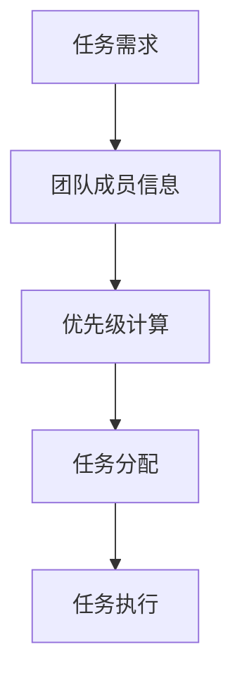

                 


# 组建高效AI开发团队：角色、技能与协作

> 关键词：AI开发团队，高效协作，角色分配，技能矩阵，团队协作

> 摘要：本文将详细探讨如何组建高效的AI开发团队，分析团队中的角色分配、技能要求及协作方式，结合实际案例和算法原理，为读者提供一套完整的解决方案。

## 第一部分：背景介绍

### 第1章：AI开发的背景与挑战

#### 1.1 AI开发的背景

- 1.1.1 AI技术的快速发展  
  人工智能技术近年来取得了突破性进展，从图像识别到自然语言处理，AI正在改变我们的生活方式和工作方式。  
  $$\text{AI的快速发展源于计算能力的提升和大数据的应用。}$$

- 1.1.2 AI在企业中的应用现状  
  当前，AI已经广泛应用于金融、医疗、教育、交通等多个领域。企业通过AI技术提高效率、降低成本、优化决策。  
  $$\text{例如，AI在金融领域的信用评估和欺诈检测中发挥了重要作用。}$$

- 1.1.3 AI开发面临的挑战  
  AI开发不仅仅是技术问题，更是一个复杂的系统工程。数据质量、算法选择、计算资源、团队协作等都是需要考虑的因素。

#### 1.2 高效AI开发团队的重要性

- 1.2.1 团队协作在AI开发中的作用  
  AI开发通常需要多个角色的协作，如数据科学家、算法工程师、项目经理等。高效协作能够显著提高开发效率和产品质量。  

- 1.2.2 高效团队对企业竞争力的影响  
  优秀的AI团队能够快速响应市场需求，为企业创造更大的价值。在竞争激烈的市场中，高效的团队是企业的核心竞争力。

- 1.2.3 AI开发团队的独特性  
  AI开发团队需要具备跨学科的知识和技能，团队成员之间的协作需要高度的默契和互补性。

#### 1.3 传统开发与AI开发的对比

- 1.3.1 传统软件开发的特点  
  传统软件开发注重模块化和可维护性，开发流程相对固定，团队角色分工明确但相对单一。

- 1.3.2 AI开发的独特性  
  AI开发具有高度的不确定性，需要频繁的实验和调整。数据是AI的核心，数据的质量和数量直接影响模型的效果。

- 1.3.3 从传统到AI开发的转变  
  AI开发需要团队具备更强的适应能力和创新能力。团队成员需要在数据处理、算法实现、模型部署等多个方面具备一定的技能。

## 第二部分：核心概念与联系

### 第2章：高效AI开发团队的核心概念

#### 2.1 团队角色与职责

- 2.1.1 数据科学家的角色与职责  
  数据科学家负责数据的采集、清洗、分析和建模。他们需要具备统计学知识和数据处理能力。  
  $$\text{数据科学家的核心技能包括数据清洗、特征工程和模型评估。}$$

- 2.1.2 AI工程师的角色与职责  
  AI工程师负责算法实现、模型优化和部署。他们需要熟悉深度学习框架（如TensorFlow、PyTorch）和后端技术。  
  $$\text{AI工程师需要掌握模型训练、调参和部署的最佳实践。}$$

- 2.1.3 项目经理的角色与职责  
  项目经理负责团队管理、进度跟踪和资源分配。他们需要具备良好的沟通能力和项目管理经验。  
  $$\text{项目经理的核心任务是确保项目按时交付并符合质量要求。}$$

- 2.1.4 其他关键角色  
  除了上述主要角色，团队中可能还需要伦理顾问、用户体验设计师等角色，确保AI应用的伦理性和可用性。

#### 2.2 技能矩阵与能力评估

- 2.2.1 技能矩阵的构建  
  技能矩阵是一个二维表格，行代表团队成员，列代表不同的技能。通过矩阵可以清晰地看到团队的整体技能水平和缺口。  
  $$\text{技能矩阵的构建需要定期更新和评估。}$$

- 2.2.2 技能评估的标准  
  技能评估可以采用定量和定性相结合的方式。定量评估可以通过考试或项目成果，定性评估可以通过行为观察和反馈。  
  $$\text{技能评估应注重实际应用能力而非理论知识。}$$

- 2.2.3 技能提升的路径  
  技能提升可以通过在线课程、实践项目、技术交流等方式进行。团队可以定期组织技术分享会和技能培训。

#### 2.3 协作流程与沟通机制

- 2.3.1 开发流程的标准化  
  标准化的开发流程能够提高团队的协作效率。通常包括需求分析、数据准备、模型训练、测试部署等阶段。  
  $$\text{标准化流程可以减少重复劳动和资源浪费。}$$

- 2.3.2 沟通机制的优化  
  有效的沟通机制能够确保团队成员之间的信息同步。可以通过每日站会、周报、项目管理工具等方式实现。  
  $$\text{沟通机制的核心是确保信息的及时性和准确性。}$$

- 2.3.3 文档管理的最佳实践  
  文档管理是团队协作的重要环节。团队应制定统一的文档格式和存储位置，确保文档的可追溯性和共享性。  
  $$\text{文档管理应注重版本控制和权限管理。}$$

### 第3章：核心概念的联系与对比

#### 3.1 核心概念的属性特征对比

- 3.1.1 团队角色的对比  
  数据科学家注重数据分析和建模，AI工程师注重算法实现和部署，项目经理注重项目管理和协调。  
  $$\text{不同角色的职责和技能存在明显差异，但也需要紧密配合。}$$

- 3.1.2 技能矩阵的对比  
  技能矩阵可以反映团队成员之间的技能互补性。通过对比可以发现团队的强项和弱项，制定针对性的培训计划。  
  $$\text{技能矩阵的对比有助于优化团队结构和能力分配。}$$

- 3.1.3 协作流程的对比  
  不同团队的协作流程可能因项目需求而异。高效的协作流程需要根据团队特点和项目特点进行定制。  
  $$\text{协作流程的优化需要不断实践和总结。}$$

#### 3.2 ER实体关系图

```mermaid
erd
    客户
    技能
    团队成员
    项目
    任务

    客户 --> 项目: 参与
    项目 --> 团队成员: 分配
    团队成员 --> 技能: 拥有
    项目 --> 任务: 包含
```

## 第三部分：算法原理讲解

### 第4章：AI团队协作算法

#### 4.1 任务分配算法

- 4.1.1 算法原理  
  任务分配算法旨在根据团队成员的技能和当前任务的需求，将任务分配给最合适的人选。  
  $$\text{任务分配的算法可以通过优先级和匹配度进行排序，选择最优解。}$$

- 4.1.2 优先级计算  
  优先级可以通过任务的紧急程度、团队成员的技能匹配度和工作负荷等因素进行综合计算。  
  $$\text{优先级计算公式：优先级 = 紧急程度 × 技能匹配度 × 工作负荷}$$

- 4.1.3 算法流程  
  1. 收集任务需求和团队成员信息。  
  2. 计算每个任务的优先级。  
  3. 根据优先级将任务分配给团队成员。  
  4. 跟踪任务执行情况并调整优先级。



## 第五部分：总结与最佳实践

### 第5章：总结与最佳实践

#### 5.1 项目总结

- 5.1.1 项目成果  
  通过高效的团队协作和合理的角色分配，项目按时完成了目标，达到了预期的效果。  
  $$\text{项目的成功离不开团队成员的共同努力和良好的协作机制。}$$

- 5.1.2 经验教训  
  在项目过程中，我们发现技能矩阵的动态更新和团队沟通的及时性是影响项目进度的重要因素。  
  $$\text{团队需要定期评估技能矩阵，并根据项目需求进行调整。}$$

#### 5.2 最佳实践

- 5.2.1 团队文化建设  
  建立开放、包容的团队文化，鼓励成员之间的交流与合作，增强团队凝聚力。  
  $$\text{团队文化的核心是信任和尊重。}$$

- 5.2.2 工具选择  
  选择合适的项目管理工具和协作工具，如Jira、Trello、Slack等，可以提高团队的协作效率。  
  $$\text{工具的选择应根据团队特点和项目需求进行。}$$

- 5.2.3 持续学习  
  AI技术发展迅速，团队成员需要不断学习新知识和新技术，保持竞争力。  
  $$\text{持续学习是团队保持活力和创新的关键。}$$

#### 5.3 未来展望

- 5.3.1 技术趋势  
  随着AI技术的不断进步，未来的AI开发将更加注重人机协作和自动化。  
  $$\text{人机协作将成为AI开发的新趋势。}$$

- 5.3.2 团队发展  
  团队需要不断优化角色分配和协作流程，适应技术的发展和市场需求的变化。  
  $$\text{团队发展需要战略规划和长期投入。}$$

- 5.3.3 挑战与机遇  
  AI开发的挑战在于数据的质量、算法的可解释性和伦理问题。这些也是未来需要重点研究的方向。  
  $$\text{机遇在于AI技术的广泛应用和持续创新。}$$

---

通过以上目录大纲，我们可以看到，组建高效AI开发团队需要从背景分析、核心概念、算法原理、系统架构、项目实战和总结等多个方面进行全面考虑。只有在团队角色、技能和协作方式上做到科学合理，才能充分发挥AI技术的潜力，推动企业的创新与发展。

