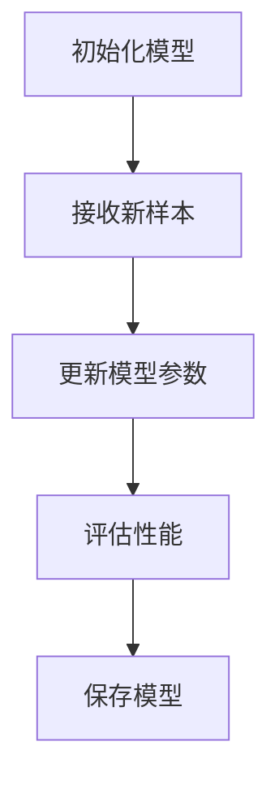
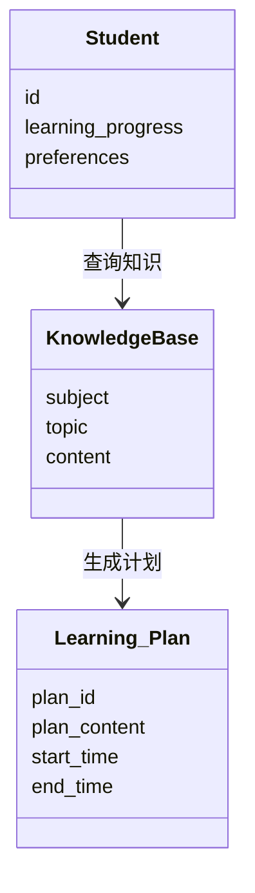

                 


# 终身学习：构建能持续进化的AI Agent

> **关键词**：终身学习、AI Agent、自适应学习、机器学习、持续进化  
> **摘要**：本文探讨了如何构建能够持续进化的AI Agent，通过终身学习的机制，使其在不断变化的环境中自适应地更新知识和技能。文章从核心概念、算法原理、系统架构到项目实战，全面分析了构建这一系统的各个方面，并给出了实际案例和未来展望。

---

## 第一章：背景与基础

### 1.1 终身学习的背景与重要性

#### 1.1.1 人工智能的发展与挑战

人工智能（AI）技术近年来取得了长足的发展，但在动态变化的环境中，AI系统往往难以适应新任务和新数据。传统AI系统依赖于固定的训练数据和模型，在面对未知问题时表现受限。终身学习（Lifelong Learning）作为一种新兴的学习范式，旨在解决这一问题。

#### 1.1.2 终身学习的概念与意义

终身学习是指AI系统能够通过持续的学习过程，在不重置的前提下，逐步积累知识和技能，以应对多样化的任务。它强调知识的迁移和累积，使得AI系统能够在不同任务之间共享学习成果，提升整体性能。

#### 1.1.3 AI Agent在终身学习中的角色

AI Agent（智能体）是能够感知环境、执行任务并做出决策的实体。结合终身学习，AI Agent能够不断更新自身的知识库和技能库，适应环境的变化，从而实现持续进化。

---

### 1.2 AI Agent的基本概念

#### 1.2.1 AI Agent的定义与分类

AI Agent是一种能够感知环境、采取行动以实现目标的智能实体。它可以分为多种类型，包括基于规则的AI Agent、基于模型的AI Agent、强化学习型AI Agent等。

#### 1.2.2 终身学习型AI Agent的特点

终身学习型AI Agent具备以下特点：
- **持续性**：能够不断学习新知识，更新模型。
- **自适应性**：能够根据新任务调整自身行为。
- **知识累积**：能够将过去学到的知识迁移到新任务中。

#### 1.2.3 AI Agent与传统AI的区别

| 特性 | AI Agent | 传统AI |
|------|-----------|--------|
| 环境感知 | 是       | 否     |
| 自主决策 | 是       | 否     |
| 持续学习 | 是       | 否     |

---

## 第二章：核心概念与联系

### 2.1 终身学习的核心原理

终身学习的核心在于知识的迁移和累积。通过在多个任务之间共享知识，AI Agent能够更快地适应新任务，减少对新数据的依赖。

#### 2.1.1 自适应学习机制

自适应学习机制包括以下步骤：
1. **感知环境**：通过传感器或接口获取环境信息。
2. **知识表示**：将获取的信息转化为可处理的形式。
3. **模型更新**：根据新数据更新已有模型或参数。
4. **知识迁移**：将已学知识迁移到新任务中。

#### 2.1.2 知识表示与更新

知识表示是终身学习的关键。常用的表示方法包括符号表示、向量表示和图结构表示。模型更新则通过优化算法实现，如基于梯度的优化方法。

---

### 2.2 AI Agent的能力构成

AI Agent的能力构成包括：
- **感知能力**：获取环境信息的能力。
- **学习能力**：从经验中学习的能力。
- **决策与执行能力**：根据学习结果做出决策并执行任务。

#### 2.2.1 感知能力

AI Agent通过传感器、API或其他接口获取环境数据。例如，在图像识别任务中，AI Agent可以通过摄像头获取图像数据。

#### 2.2.2 学习能力

学习能力是AI Agent的核心。它可以通过监督学习、无监督学习、强化学习等多种方式获取新知识。

#### 2.2.3 决策与执行能力

基于学习到的知识，AI Agent能够做出决策并执行任务。例如，在自动驾驶中，AI Agent可以根据环境数据做出转向或加速的决策。

---

### 2.3 终身学习与AI Agent的关系

终身学习为AI Agent提供了持续进化的能力，而AI Agent为终身学习提供了应用场景和实现载体。两者的结合使得AI系统能够在复杂多变的环境中保持竞争力。

---

## 第三章：算法原理与实现

### 3.1 终身学习算法的原理

终身学习算法的核心在于知识的迁移和累积。常用的算法包括模型无关方法（MIDataset）、增量式学习（IL）等。

#### 3.1.1 增量式学习算法

增量式学习是一种逐个样本更新模型的算法。其核心步骤包括：
1. **初始化模型**：建立初始模型。
2. **接收新样本**：获取新的训练数据。
3. **更新模型**：基于新数据更新模型参数。
4. **评估性能**：验证模型性能是否提升。

#### 3.1.2 知识蒸馏技术

知识蒸馏是一种将大型模型的知识迁移到小型模型的技术。通过教师模型和学生模型的协作，学生模型能够学习到教师模型的知识。

---

### 3.2 基于深度学习的终身学习算法

深度学习模型在终身学习中表现优异。常用的模型包括深度神经网络、卷积神经网络等。

#### 3.2.1 模型更新流程

模型更新流程可以用以下mermaid图表示：



#### 3.2.2 模型更新的数学公式

模型更新可以通过梯度下降算法实现：

$$
\theta_{t+1} = \theta_t - \eta \cdot \nabla L(\theta_t)
$$

其中，$\theta$ 表示模型参数，$\eta$ 表示学习率，$L$ 表示损失函数。

---

## 第四章：系统分析与架构设计

### 4.1 问题场景介绍

本文构建的AI Agent系统将应用于教育领域，帮助学生根据个性化需求推荐学习资源。

#### 4.1.1 项目介绍

本项目旨在构建一个能够根据学生学习情况动态调整学习计划的AI Agent。

#### 4.1.2 系统功能设计

系统功能包括：
1. **用户数据采集**：收集学生的学习进度和偏好。
2. **知识库构建**：建立涵盖多种学科的知识图谱。
3. **学习计划生成**：根据学生情况生成个性化学习计划。
4. **效果评估**：评估学习计划的执行效果。

#### 4.1.3 系统架构设计

系统架构包括前端、后端和数据库。前端用于用户交互，后端负责业务逻辑，数据库存储数据。

---

### 4.2 系统功能设计

#### 4.2.1 领域模型设计

领域模型可以用mermaid类图表示：



#### 4.2.2 系统架构设计

系统架构可以用mermaid架构图表示：


---

## 第五章：项目实战

### 5.1 环境安装与配置

#### 5.1.1 安装Python与相关库

```bash
pip install numpy
pip install tensorflow
pip install matplotlib
```

#### 5.1.2 安装开发工具

安装Jupyter Notebook和VS Code。

---

### 5.2 系统核心实现

#### 5.2.1 核心代码实现

以下是AI Agent的核心代码示例：

```python
import numpy as np
import tensorflow as tf

# 初始化模型
model = tf.keras.Sequential([
    tf.keras.layers.Dense(64, activation='relu'),
    tf.keras.layers.Dense(10, activation='softmax')
])

# 编译模型
model.compile(optimizer='adam', loss='sparse_categorical_crossentropy', metrics=['accuracy'])

# 训练模型
model.fit(x_train, y_train, epochs=10, batch_size=32)

# 保存模型
model.save('ai_agent_model.h5')
```

#### 5.2.2 代码解读与分析

1. **模型初始化**：使用Keras构建一个简单的神经网络模型。
2. **模型编译**：选择优化器和损失函数。
3. **模型训练**：使用训练数据更新模型参数。
4. **模型保存**：将训练好的模型保存为HDF5格式。

---

## 第六章：最佳实践与未来展望

### 6.1 小结与注意事项

- 数据质量对模型性能影响重大，需确保数据的多样性和代表性。
- 模型评估是关键，建议采用交叉验证等方法。

---

### 6.2 未来展望

未来，终身学习型AI Agent将朝着多模态学习、分布式计算和自适应优化的方向发展。

---

## 第七章：总结

本文详细探讨了如何构建能够持续进化的AI Agent，从核心概念到算法实现，再到系统设计和项目实战，为读者提供了全面的指导。通过不断学习和优化，AI Agent将能够在更多领域发挥重要作用。

---

**致谢**：感谢读者的耐心阅读，希望本文对您有所帮助！

