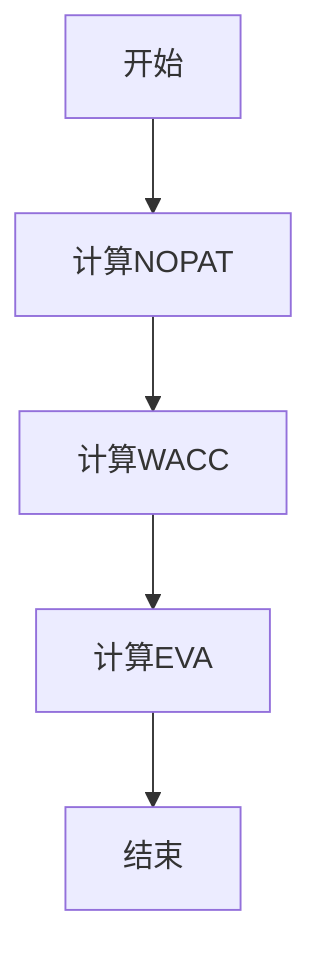
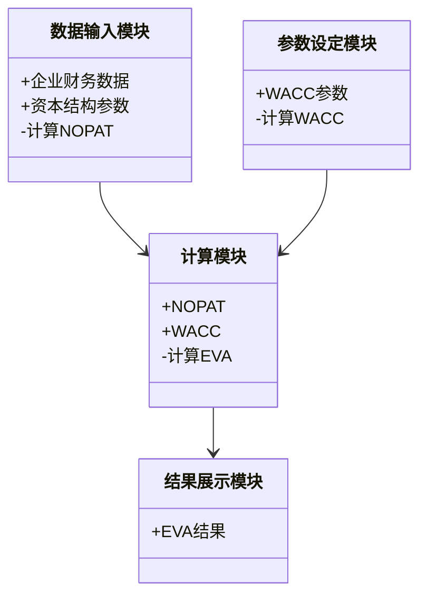

                 


# 经济利润模型：衡量真实价值创造的工具

## 关键词

- 经济利润模型
- 经济价值
- 资本成本
- 企业价值
- 投资决策

## 摘要

经济利润模型（Economic Value Added，EVA）是一种衡量企业真实价值创造的工具，它通过计算企业经济利润，将资本成本纳入考量，帮助投资者和管理者更准确地评估企业绩效。本文将从背景、理论、算法、系统设计到实际应用，全面解析经济利润模型，帮助读者理解其在现代企业管理中的重要作用。

---

# 经济利润模型：衡量真实价值创造的工具

## 第一部分：背景与概念

### 第1章：经济利润模型的背景与发展

#### 1.1 传统财务指标的局限性

传统的财务指标如净利润、ROE（净资产收益率）等，往往忽略了资本成本，导致评估企业绩效时存在偏差。例如，一家企业通过高负债融资，虽然ROE较高，但实际回报可能低于行业平均水平。这种偏差使得传统指标难以全面反映企业的真实价值。

#### 1.2 经济利润模型的提出与演变

经济利润模型由美国学者费雷德·德鲁克在20世纪70年代提出，后经改进成为EVA模型。EVA的核心在于将资本成本纳入利润计算，反映了企业使用资本的真实回报。EVA的计算公式为：

$$EVA = NOPAT - (WACC \times Capital)$$

其中，NOPAT是净经营利润，WACC是加权平均资本成本，Capital是企业资本。

#### 1.3 经济利润模型的重要性

EVA模型能够帮助企业在资本预算、并购决策等方面做出更明智的选择。例如，企业在考虑投资新项目时，可以通过EVA评估该项目是否能为股东创造真实价值。

### 第2章：经济利润模型的核心概念

#### 2.1 经济利润的定义

经济利润是指企业在扣除所有资本成本（包括债务和股权）后的净收益。与会计利润不同，经济利润更能反映企业的实际盈利能力。

#### 2.2 经济利润模型的关键要素

- **经济利润（EVA）**：核心指标，反映企业创造的超额利润。
- **资本成本（WACC）**：企业为使用资本所支付的成本，包括债务利息和股权资本成本。
- **资本（Capital）**：企业的总资本，包括债务和股权资本。

### 第3章：经济利润模型的理论基础

#### 3.1 股东价值最大化目标

EVA模型的核心目标是实现股东价值最大化。企业通过创造正的EVA，意味着其利润超过资本成本，为股东创造了真实价值。

#### 3.2 资本成本的计算与应用

资本成本的计算需要考虑企业的资本结构和市场利率。WACC的计算公式如下：

$$WACC = \left(\frac{D}{D+E}\right) \times r_d \times (1 - t) + \left(\frac{E}{D+E}\right) \times r_e$$

其中，D是债务，E是股权，r_d是债务利率，r_e是股权资本成本，t是税率。

#### 3.3 经济利润与企业价值的关系

企业价值与EVA密切相关。长期来看，EVA为正的企业，其企业价值会持续增长。因此，EVA可以作为企业价值评估的重要指标。

---

## 第二部分：经济利润模型的算法与计算

### 第4章：经济利润模型的计算方法

#### 4.1 经济利润的计算步骤

1. 计算企业的净经营利润（NOPAT）：NOPAT = EBIT（息税前利润） × (1 - 税率)。
2. 计算加权平均资本成本（WACC）。
3. 计算经济利润（EVA）：EVA = NOPAT - (WACC × 资本)。

#### 4.2 经济利润模型的实现流程

1. 数据收集：收集企业的财务数据，包括收入、成本、税后利润、资本结构等。
2. 参数设定：设定WACC的计算参数，如债务利率、股权资本成本、税率等。
3. 计算EVA：根据公式计算EVA，并分析其正负情况。

### 第5章：经济利润模型的算法实现

#### 5.1 Python代码实现

```python
def calculate_eva(nopat, wacc, capital):
    eva = nopat - (wacc * capital)
    return eva

# 示例数据
nopat = 100000
wacc = 0.08
capital = 500000

eva = calculate_eva(nopat, wacc, capital)
print(f"经济利润（EVA）为：{eva}")
```

#### 5.2 算法流程图



---

## 第三部分：经济利润模型的系统分析与设计

### 第6章：系统功能设计

#### 6.1 系统功能模块

1. 数据输入模块：输入企业财务数据。
2. 参数设定模块：设定WACC参数。
3. 计算模块：计算EVA。
4. 结果展示模块：输出EVA结果。

#### 6.2 领域模型类图



---

## 第四部分：项目实战

### 第7章：项目实战与案例分析

#### 7.1 项目背景

某制造企业希望评估新项目的真实价值，决定使用EVA模型进行分析。

#### 7.2 数据收集与处理

收集企业的财务数据，包括EBIT、税率、资本结构等。

#### 7.3 算法实现

根据EVA公式，计算NOPAT、WACC和EVA。

#### 7.4 案例分析

假设EBIT=100万元，税率=25%，资本=500万元，WACC=8%。计算EVA为：

$$EVA = 100 \times (1 - 0.25) - (0.08 \times 500) = 75 - 40 = 35$$

EVA为正，说明该项目为股东创造了价值。

---

## 第五部分：总结与展望

### 第8章：总结与展望

#### 8.1 总结

经济利润模型通过将资本成本纳入利润计算，帮助企业在复杂市场环境中做出更明智的决策。EVA模型不仅适用于企业内部管理，也是投资者评估企业价值的重要工具。

#### 8.2 展望

随着全球经济的复杂化，EVA模型将更加重要。未来，结合大数据和人工智能，EVA模型的应用将更加广泛和精准。

---

### 最佳实践 Tips

- 在计算EVA时，确保数据的准确性和完整性。
- 定期更新资本成本参数，以反映市场变化。
- 将EVA分析与其他财务指标结合使用，全面评估企业绩效。

通过以上步骤，企业可以更好地利用经济利润模型，创造可持续的价值。

