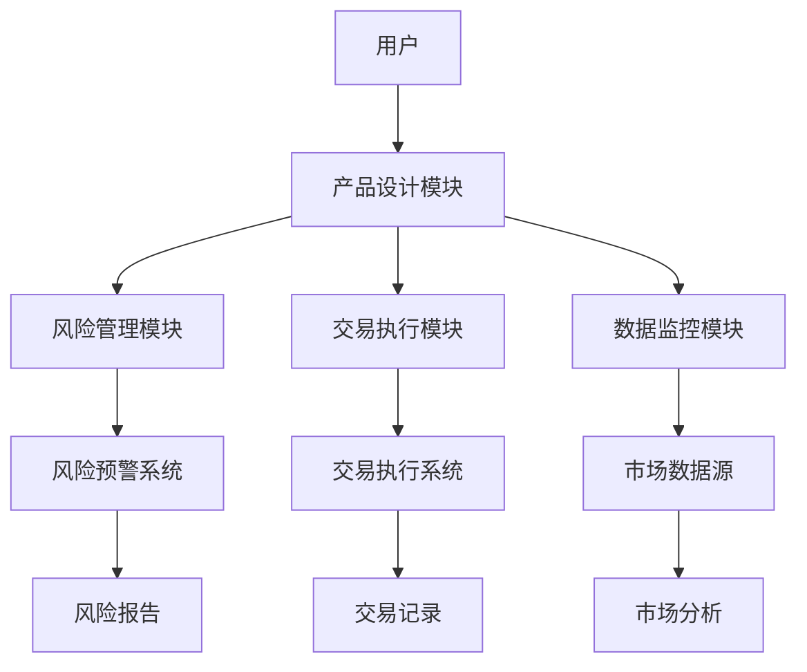

                 


# 结构性产品：定制化投资解决方案

## 关键词：结构性产品、定制化投资、金融工具、风险分析、收益结构、投资解决方案

## 摘要：结构性产品是一种复杂的金融工具，结合了不同的资产和衍生品，以满足投资者的定制化需求。本文将详细介绍结构性产品的定义、分类、核心要素，以及其在金融投资中的应用。通过分析结构性产品的定价模型、风险管理和系统架构，本文旨在帮助读者理解如何设计和实施定制化的投资解决方案。

---

# 第一部分: 结构性产品的背景与概述

## 第1章: 结构性产品的定义与特点

### 1.1 什么是结构性产品
结构性产品是一种复杂的金融工具，通常由债务工具和衍生品组合而成，其收益与特定的资产或指数的表现挂钩。这类产品允许投资者根据市场波动和自身风险偏好，定制化地获取收益。

#### 1.1.1 核心定义
结构性产品是将固定收益证券与衍生品相结合的金融工具，其收益取决于挂钩资产的表现。常见的挂钩资产包括股票、债券、商品、指数等。

#### 1.1.2 核心特点
1. **定制化收益**：投资者可以根据风险偏好选择不同收益结构的产品。
2. **风险可控**：通过组合不同的衍生品，结构性产品可以在一定程度上对冲市场风险。
3. **期限灵活**：产品期限可以从短期到长期不等，满足不同投资者的需求。

#### 1.1.3 与传统投资工具的区别
- 传统投资工具（如股票、债券）的收益直接来源于资产本身，而结构性产品的收益来源于挂钩资产的表现和衍生品的设计。
- 结构性产品通常具有嵌入式衍生品，可以通过对冲机制降低风险。

### 1.2 结构性产品的分类
结构性产品可以根据不同的标准进行分类，常见的分类方式包括收益结构、风险等级和投资期限。

#### 1.2.1 按收益结构分类
1. **固定收益型**：收益与挂钩资产的收益相关，通常有最低收益保证。
2. **浮动收益型**：收益根据挂钩资产的表现波动，无最低收益保证。
3. **混合型**：结合固定收益和浮动收益的特点，提供多样化的收益结构。

#### 1.2.2 按风险等级分类
1. **低风险型**：如挂钩短期国债的结构性产品，风险较低，收益相对稳定。
2. **中风险型**：如挂钩股票指数的结构性产品，收益波动较大。
3. **高风险型**：如挂钩高风险资产的结构性产品，收益波动剧烈。

#### 1.2.3 按投资期限分类
1. **短期结构性产品**：期限通常在1年以内，适合风险厌恶型投资者。
2. **中期结构性产品**：期限在1至5年之间，适合中风险偏好的投资者。
3. **长期结构性产品**：期限超过5年，适合高风险偏好的投资者。

### 1.3 结构性产品的优势与劣势
#### 1.3.1 投资者视角的优势
- **定制化收益**：投资者可以根据市场预期和风险偏好选择适合的产品。
- **风险可控**：通过结构性产品的设计，可以在一定程度上对冲市场风险。
- **收益潜力大**：相比传统投资工具，结构性产品在市场上涨时可能提供更高的收益。

#### 1.3.2 发行机构的视角优势
- **多样化收益来源**：通过嵌入衍生品，发行机构可以设计出多样化的收益结构。
- **风险转移**：结构性产品允许发行机构将部分市场风险转移给投资者。

#### 1.3.3 结构性产品的潜在风险
- **市场风险**：挂钩资产价格波动可能导致收益大幅下降。
- **流动性风险**：部分结构性产品可能缺乏二级市场流动性，难以及时变现。
- **信用风险**：如果发行机构信用评级下降，可能影响产品的收益支付。

---

## 第2章: 结构性产品在金融投资中的作用

### 2.1 结构性产品在风险管理中的应用
#### 2.1.1 风险对冲机制
结构性产品可以通过嵌入衍生品来对冲市场风险。例如，投资者可以通过购买挂钩股票指数的结构性产品，同时卖出相应的期权来对冲价格波动风险。

#### 2.1.2 风险收益匹配
结构性产品允许投资者根据风险偏好选择不同的收益结构，从而实现风险与收益的最佳匹配。

#### 2.1.3 风险定价模型
结构性产品的定价需要考虑挂钩资产的风险溢价、波动率等因素。常见的风险定价模型包括Black-Scholes模型和VaR模型。

### 2.2 结构性产品在资产配置中的作用
#### 2.2.1 资产配置的基本原理
资产配置是将资金分配到不同的资产类别中，以实现风险分散和收益最大化。结构性产品可以通过组合不同资产的收益来优化资产配置。

#### 2.2.2 结构性产品在资产配置中的应用
投资者可以利用结构性产品来增强资产配置的灵活性。例如，通过购买挂钩商品指数的结构性产品，投资者可以在不直接持有商品的情况下，获得商品价格波动的收益。

#### 2.2.3 资产配置的动态调整
结构性产品允许投资者根据市场变化动态调整资产配置。例如，当市场下跌时，投资者可以选择挂钩保本资产的结构性产品来锁定收益。

### 2.3 结构性产品在投资组合中的地位
#### 2.3.1 投资组合的构成要素
投资组合通常包括股票、债券、基金等多种资产。结构性产品可以作为补充工具，提供多样化的收益来源。

#### 2.3.2 结构性产品在投资组合中的角色
结构性产品可以作为投资组合中的风险对冲工具或收益增强工具。例如，投资者可以通过购买挂钩波动率的结构性产品来对冲市场下跌风险。

#### 2.3.3 投资组合的风险收益平衡
结构性产品可以帮助投资者在不同市场环境下实现风险收益的平衡。例如，当市场上涨时，选择高风险的结构性产品可以获得更高收益；当市场下跌时，选择保本型的结构性产品可以锁定收益。

---

## 第3章: 结构性产品的核心要素

### 3.1 收益结构与风险分析
#### 3.1.1 收益结构的构成要素
收益结构是结构性产品的核心要素之一，主要包括挂钩资产、衍生品结构和收益分配机制。

#### 3.1.2 风险分析的核心指标
投资者需要关注结构性产品的风险指标，如VaR（风险价值）和RAR（风险调整后的收益）。这些指标可以帮助投资者评估产品的风险水平和收益潜力。

#### 3.1.3 收益与风险的匹配策略
投资者需要根据自身的风险承受能力和收益预期，选择适合的结构性产品。例如，风险厌恶型投资者可以选择低风险、固定收益的结构性产品；而风险偏好型投资者可以选择高风险、浮动收益的结构性产品。

### 3.2 核心概念与联系
#### 3.2.1 核心概念的定义与属性
结构性产品的核心概念包括挂钩资产、衍生品结构、收益分配机制和风险对冲工具。这些概念相互关联，共同决定了产品的收益和风险特征。

#### 3.2.2 核心概念之间的关系
挂钩资产的波动性影响衍生品的定价，而衍生品的结构决定了收益分配机制。投资者需要综合考虑这些因素，才能选择适合的结构性产品。

#### 3.2.3 核心概念的数学模型
结构性产品的定价通常需要使用衍生品定价模型，如Black-Scholes模型。以下是Black-Scholes模型的公式：

$$ C = S_0 e^{-q t} N(d_1) - K e^{-r t} N(d_2) $$

其中：
- \( C \) 是看涨期权的价值
- \( S_0 \) 是标的资产的价格
- \( q \) 是股息率
- \( t \) 是时间
- \( K \) 是执行价格
- \( r \) 是无风险利率
- \( N(d_1) \) 和 \( N(d_2) \) 是标准正态分布的累积分布函数
- \( d_1 = \frac{\ln(S_0/K) + (r + \sigma^2/2)t}{\sigma \sqrt{t}} \)
- \( d_2 = d_1 - \sigma \sqrt{t} \)

### 3.3 结构性产品的优势与劣势
#### 3.3.1 优势
- **定制化收益**：投资者可以根据市场预期和风险偏好选择适合的产品。
- **风险可控**：通过结构性产品的设计，可以在一定程度上对冲市场风险。

#### 3.3.2 劣势
- **复杂性**：结构性产品的设计复杂，投资者需要具备一定的金融知识才能理解其风险和收益特征。
- **流动性风险**：部分结构性产品可能缺乏二级市场流动性，难以及时变现。

---

## 第4章: 结构性产品的定价与估值

### 4.1 结构性产品的定价模型
#### 4.1.1 定价模型的选择
结构性产品的定价需要考虑挂钩资产的波动率、风险溢价和市场流动性等因素。常用的定价模型包括Black-Scholes模型和蒙特卡洛模拟。

#### 4.1.2 定价模型的实现
以下是使用Python实现Black-Scholes模型的代码示例：

```python
import numpy as np
from scipy.stats import norm

def black_scholes(S, K, r, sigma, t, q=0):
    """
    计算欧式看涨期权的价值。
    参数:
    S: 标的资产价格
    K: 执行价格
    r: 无风险利率
    sigma: 标的资产波动率
    t: 时间，单位为年
    q: 股息率，默认为0
    返回:
    期权的价值
    """
    d1 = (np.log(S/K) + (r - q + sigma**2/2)*t) / (sigma * np.sqrt(t))
    d2 = d1 - sigma * np.sqrt(t)
    C = S * np.exp(-q * t) * norm.cdf(d1) - K * np.exp(-r * t) * norm.cdf(d2)
    return C

# 示例
S = 100
K = 105
r = 0.05
sigma = 0.2
t = 1
q = 0

price = black_scholes(S, K, r, sigma, t, q)
print(f"期权价格为：{price}")
```

#### 4.1.3 定价模型的应用
投资者和发行机构可以使用定价模型来评估结构性产品的公允价值。例如，发行机构可以根据模型计算出产品的发行价格，而投资者可以根据模型评估产品的内在价值。

### 4.2 结构性产品的估值方法
#### 4.2.1 市场定价法
市场定价法是根据市场上类似产品的交易价格来评估结构性产品的价值。这种方法简单直观，但可能受到市场流动性的影响。

#### 4.2.2 内在价值法
内在价值法是根据结构性产品的现金流和风险特征来评估其价值。这种方法需要考虑挂钩资产的未来表现和衍生品的结构设计。

#### 4.2.3 风险调整后的收益法
风险调整后的收益法是将结构性产品的收益与其风险进行匹配，从而评估其价值。这种方法可以帮助投资者识别高收益低风险或低收益高风险的产品。

### 4.3 结构性产品的定价与估值的注意事项
#### 4.3.1 市场波动的影响
挂钩资产的波动性是影响结构性产品定价的重要因素。投资者需要关注市场的波动性，并根据波动性调整其投资策略。

#### 4.3.2 时间因素的影响
结构性产品的定价需要考虑时间因素，如产品期限和市场波动的时间跨度。时间因素会影响期权的内在价值和外在价值。

#### 4.3.3 模型假设的合理性
定价模型的假设需要合理，例如波动率的估计和风险溢价的设定。如果假设不合理，可能会导致定价偏差。

---

## 第5章: 结构性产品的风险管理与预警机制

### 5.1 结构性产品的风险来源
#### 5.1.1 市场风险
市场风险是由于挂钩资产价格波动导致的收益不确定性。例如，股票市场的剧烈波动可能导致结构性产品收益大幅下降。

#### 5.1.2 信用风险
信用风险是由于发行机构的信用评级下降导致的收益不确定性。如果发行机构出现财务问题，可能会影响产品的收益支付。

#### 5.1.3 流动性风险
流动性风险是由于结构性产品缺乏二级市场流动性导致的变现困难。投资者可能需要在产品到期后才能收回本金和收益。

### 5.2 结构性产品的风险预警机制
#### 5.2.1 风险指标的设定
投资者和发行机构需要设定风险预警指标，如VaR（风险价值）和CVaR（条件风险价值）。当风险指标超过设定阈值时，需要采取相应的风险管理措施。

#### 5.2.2 风险对冲策略
为了应对市场风险，投资者可以采取多种风险对冲策略，如购买对冲期权或调整投资组合的构成。例如，投资者可以通过卖出看涨期权来对冲结构性产品价格下跌的风险。

#### 5.2.3 风险管理工具的应用
投资者可以使用多种风险管理工具来监控和管理结构性产品的风险。例如，使用VaR模型来评估产品的潜在损失，或者使用压力测试来评估产品在极端市场条件下的表现。

### 5.3 结构性产品的风险管理案例
#### 5.3.1 案例背景
2008年金融危机期间，结构性产品的需求大幅下降，许多投资者因市场波动而遭受重大损失。

#### 5.3.2 风险管理措施
- **产品结构调整**：发行机构可以调整产品结构，如缩短产品期限或降低挂钩资产的风险。
- **风险揭示与教育**：发行机构需要向投资者充分揭示结构性产品的风险，并提供必要的投资教育，帮助投资者做出明智的投资决策。
- **风险管理技术的应用**：投资者可以利用风险管理技术，如动态对冲和实时监控，来降低结构性产品的风险。

#### 5.3.3 案例分析与总结
通过分析2008年金融危机期间的结构性产品案例，可以得出以下结论：
1. 结构性产品的风险需要充分揭示和管理。
2. 投资者需要具备一定的金融知识，才能理解结构性产品的风险和收益特征。
3. 发行机构需要加强风险管理能力，以应对市场波动和投资者需求的变化。

---

## 第6章: 结构性产品的系统架构与设计

### 6.1 系统架构设计
#### 6.1.1 系统功能模块
结构性产品管理系统通常包括以下几个功能模块：
- **产品设计模块**：用于设计和定制结构性产品。
- **风险管理模块**：用于评估和管理结构性产品的风险。
- **交易执行模块**：用于执行结构性产品的交易。
- **数据监控模块**：用于监控市场数据和产品表现。

#### 6.1.2 系统架构图
以下是结构性产品管理系统的架构图：



#### 6.1.3 模块之间的交互
- 用户通过产品设计模块定制结构性产品。
- 产品设计模块将产品参数传递给风险管理模块，进行风险评估。
- 风险管理模块生成风险报告，并提供风险预警。
- 交易执行模块根据用户指令执行交易，并记录交易数据。
- 数据监控模块实时监控市场数据和产品表现，提供实时反馈。

### 6.2 系统设计的实现
#### 6.2.1 系统功能设计
- **产品设计**：允许用户自定义结构性产品的收益结构和风险参数。
- **风险管理**：评估结构性产品的风险，并提供风险预警。
- **交易执行**：执行结构性产品的买卖交易。
- **数据监控**：实时监控市场数据和产品表现。

#### 6.2.2 系统功能的代码实现
以下是使用Python实现结构性产品管理系统的一个简单示例：

```python
class Structural_product:
    def __init__(self, name, type, risk_level):
        self.name = name
        self.type = type
        self.risk_level = risk_level

    def calculate_return(self, market_data):
        # 根据市场数据计算收益
        return self.risk_level * market_data

    def assess_risk(self, market_conditions):
        # 根据市场条件评估风险
        if market_conditions == 'volatile':
            return 'high'
        elif market_conditions == 'stable':
            return 'low'
        else:
            return 'medium'

# 示例使用
product = structural_product('SPX Call Option', 'equity', 0.2)
print(f"Product Name: {product.name}")
print(f"Risk Level: {product.risk_level}")
print(f"Return: {product.calculate_return(100)}%")
print(f"Risk Assessment: {product.assess_risk('volatile')}")
```

#### 6.2.3 系统功能的优化与扩展
- **数据驱动优化**：通过收集和分析市场数据，优化系统的风险评估和收益计算。
- **模块化设计**：将系统功能模块化，方便后续的扩展和维护。
- **用户界面优化**：设计直观的用户界面，方便用户操作和管理结构性产品。

---

## 第7章: 结构性产品的项目实战

### 7.1 项目背景介绍
#### 7.1.1 项目目标
设计和实施一个基于结构性产品的定制化投资解决方案，帮助投资者实现风险可控下的收益最大化。

#### 7.1.2 项目需求
- 开发一个结构性产品管理系统，支持产品设计、风险管理、交易执行和数据监控等功能。
- 提供用户友好的界面，方便投资者定制和管理结构性产品。

#### 7.1.3 项目范围
- 产品设计模块：支持多种收益结构和风险参数的设置。
- 风险管理模块：提供实时风险评估和预警功能。
- 交易执行模块：支持结构性产品的买卖交易。
- 数据监控模块：实时监控市场数据和产品表现。

### 7.2 项目实现过程
#### 7.2.1 系统环境安装
- 安装必要的开发工具，如Python、Jupyter Notebook、数据库管理工具等。
- 安装相关的Python库，如numpy、pandas、scipy、mermaid等。

#### 7.2.2 核心系统实现
- **产品设计模块**：允许用户自定义结构性产品的收益结构和风险参数。
- **风险管理模块**：评估结构性产品的风险，并提供风险预警。
- **交易执行模块**：执行结构性产品的买卖交易。
- **数据监控模块**：实时监控市场数据和产品表现。

#### 7.2.3 代码实现与解读
以下是结构性产品管理系统的代码实现示例：

```python
import numpy as np
import pandas as pd
from scipy.stats import norm

class StructuralProductManager:
    def __init__(self):
        self.products = []

    def add_product(self, product):
        self.products.append(product)

    def remove_product(self, product_name):
        for product in self.products:
            if product.name == product_name:
                self.products.remove(product)
                break

    def calculate_portfolio_value(self, market_data):
        total_value = 0
        for product in self.products:
            total_value += product.calculate_return(market_data)
        return total_value

class StructuralProduct:
    def __init__(self, name, type, risk_level):
        self.name = name
        self.type = type
        self.risk_level = risk_level

    def calculate_return(self, market_data):
        return self.risk_level * market_data

    def assess_risk(self, market_conditions):
        if market_conditions == 'volatile':
            return 'high'
        elif market_conditions == 'stable':
            return 'low'
        else:
            return 'medium'

# 示例使用
manager = StructuralProductManager()
product1 = StructuralProduct('SPX Call Option', 'equity', 0.2)
product2 = StructuralProduct('Treasury Bond', 'fixed income', 0.05)
manager.add_product(product1)
manager.add_product(product2)

print(f"Product 1: {product1.name}, Risk Level: {product1.risk_level}")
print(f"Product 2: {product2.name}, Risk Level: {product2.risk_level}")
print(f"Portfolio Value: {manager.calculate_portfolio_value(100)}")
```

#### 7.2.4 项目实现的注意事项
- **数据准确性**：确保市场数据的准确性和实时性。
- **系统稳定性**：保证系统的稳定运行，避免因技术故障导致的交易失败。
- **用户权限管理**：根据用户角色分配不同的权限，确保系统的安全性。

### 7.3 项目实战总结
#### 7.3.1 项目成果
通过本项目的实施，我们成功开发了一个结构性产品管理系统，支持产品的设计、风险管理和交易执行等功能。

#### 7.3.2 项目经验
- **技术实现**：通过模块化设计和Python编程，实现了系统的功能需求。
- **风险管理**：通过风险评估和预警机制，降低了结构性产品的投资风险。
- **用户需求**：通过用户友好的界面设计，提高了系统的易用性。

#### 7.3.3 项目改进方向
- **功能扩展**：增加更多类型的结构性产品，满足不同投资者的需求。
- **性能优化**：通过优化算法和数据库设计，提高系统的运行效率。
- **用户体验**：进一步优化用户界面，提高用户的使用体验。

---

## 第8章: 结构性产品的总结与展望

### 8.1 结构性产品的总结
结构性产品是一种复杂的金融工具，其定制化收益和风险对冲机制使其在金融投资中具有重要地位。通过合理设计和管理，结构性产品可以帮助投资者实现风险可控下的收益最大化。

### 8.2 结构性产品的未来展望
随着金融市场的不断发展，结构性产品将面临更多的机遇和挑战。未来，结构性产品的设计和管理将更加依赖于大数据和人工智能技术，投资者需要不断提升自身的金融知识和风险管理能力，才能在复杂的市场环境中做出明智的投资决策。

### 8.3 最佳实践 Tips
- **了解结构性产品的核心要素**：投资者需要了解结构性产品的收益结构、风险特征和定价模型。
- **选择适合的结构性产品**：根据自身的风险偏好和市场预期，选择适合的结构性产品。
- **关注市场波动和发行机构的信用风险**：投资者需要密切关注市场的波动性和发行机构的信用状况，以降低投资风险。
- **合理配置资产**：将结构性产品作为资产配置的一部分，合理配置不同类型资产，以实现风险分散和收益最大化。

### 8.4 结语
结构性产品是一种复杂的金融工具，其定制化收益和风险对冲机制使其在金融投资中具有重要地位。通过合理设计和管理，结构性产品可以帮助投资者实现风险可控下的收益最大化。未来，随着金融市场的不断发展，结构性产品的设计和管理将更加依赖于大数据和人工智能技术，投资者需要不断提升自身的金融知识和风险管理能力，才能在复杂的市场环境中做出明智的投资决策。

---

通过以上目录和内容设计，读者可以系统地了解结构性产品的定义、分类、核心要素、定价模型、风险管理方法以及系统架构设计。同时，通过项目实战部分，读者可以掌握结构性产品的实际应用和开发技巧，从而更好地应对复杂的金融市场环境。

