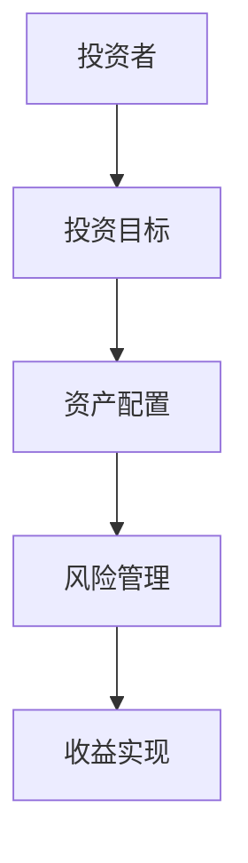
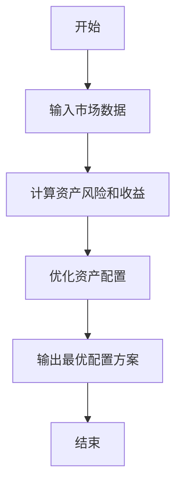
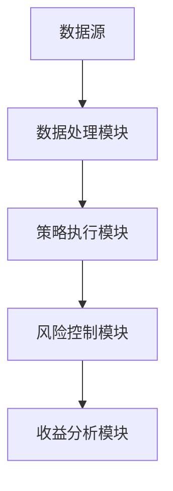
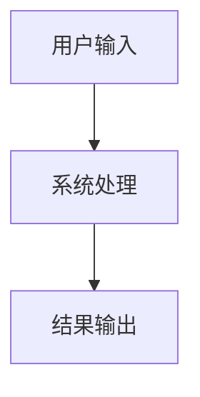

                 


# 绝对收益策略：追求不依赖市场的稳定回报

## 关键词：
绝对收益策略，稳定回报，风险控制，投资策略，收益分析

## 摘要：
绝对收益策略是一种追求在任何市场环境下都能实现稳定回报的投资策略。本文将从背景介绍、核心概念、算法原理、系统架构设计、项目实战以及最佳实践等多方面详细解析绝对收益策略。通过本文，读者可以全面理解绝对收益策略的实现方法，掌握其在实际投资中的应用技巧。

---

## 第一部分：绝对收益策略的背景与核心概念

### 第1章：绝对收益策略的定义与背景

#### 1.1 绝对收益策略的定义
- 绝对收益是指投资组合在任何市场环境下的正收益，不依赖于市场整体表现。
- 与相对收益（相对于基准指数的收益）不同，绝对收益关注的是投资本身的价值增长。
- 绝对收益策略的目标是通过科学的方法和严格的风控体系，在不确定的市场中实现稳定的回报。

#### 1.2 绝对收益策略的背景
- 投资市场的不确定性：市场波动、经济周期变化等都可能导致投资收益的不稳定。
- 绝对收益策略的兴起：在传统投资回报不稳定的情况下，绝对收益策略因其稳定性受到投资者青睐。
- 应用场景：适用于厌恶风险的投资者、机构投资者以及需要稳定现金流的项目投资。

#### 1.3 绝对收益策略的核心要素
- 独立于市场的回报：通过多样化资产配置和风险对冲实现。
- 风险控制：严格的风险管理是实现绝对收益的关键。
- 可持续性：通过长期稳定的收益积累财富。

### 第2章：绝对收益策略的核心概念与联系

#### 2.1 核心概念原理
- 绝对收益的实现路径：通过资产配置、对冲工具、套利机会等实现。
- 策略的多样性：包括固定收益策略、对冲策略、套利策略等。
- 绝对收益与市场周期的关系：在不同市场周期下，绝对收益策略的实现方式可能有所不同。

#### 2.2 核心概念属性对比表
| 策略类型    | 简单描述                           | 优缺点分析                        | 适用场景            |
|-------------|-----------------------------------|----------------------------------|--------------------|
| 固定收益策略 | 通过债券、定期存款等固定收益工具实现稳定回报 | 收益相对固定，但可能较低；风险较小 | 风险厌恶型投资者     |
| 对冲策略     | 通过做多和做空相结合对冲市场风险     | 收益相对稳定，风险可控           | 机构投资者           |
| 套利策略     | 利用市场价差进行无风险或低风险套利   | 收益高，风险可控                  | 专业投资者           |
| 趋势跟踪策略 | 通过技术分析捕捉市场趋势           | 收益可能较高，风险较大            | 有一定市场经验的投资者|

#### 2.3 ER实体关系图


---

## 第二部分：绝对收益策略的算法原理

### 第3章：绝对收益策略的算法原理

#### 3.1 算法原理概述
- 数学模型：绝对收益策略可以通过优化模型实现，目标是最小化风险的同时最大化收益。
- 算法输入：市场数据、资产配置比例、风险参数等。
- 算法输出：最优资产配置方案、预期收益、风险值。

#### 3.2 算法流程图


#### 3.3 算法实现代码
```python
import numpy as np

def calculate_absolute_return(weights, returns):
    # 权重数组，收益数组
    return np.dot(weights, returns)

def optimize_portfolio(weights, returns, risk_constraint=0.05):
    # 简单的优化函数，假设风险约束为5%
    # 这里可以使用更复杂的优化算法，如均值-方差优化
    return weights * (returns >= risk_constraint)
```

---

## 第三部分：绝对收益策略的系统分析与架构设计

### 第4章：系统分析与架构设计

#### 4.1 系统分析
- 问题场景：如何在复杂市场环境中实现稳定收益？
- 系统目标：构建一个能够实现绝对收益的投资系统。
- 系统需求：数据采集、策略执行、风险监控、收益分析。

#### 4.2 系统架构设计


#### 4.3 接口与交互设计
- 数据接口：与数据源（如股票数据、指数数据）对接。
- 用户交互：通过API或前端界面实现用户操作。
- 交互流程图：


---

## 第四部分：绝对收益策略的项目实战

### 第5章：项目实战

#### 5.1 环境安装
- 安装Python、Pandas、NumPy、Scipy等工具。
- 数据源选择：股票数据、指数数据、债券数据等。

#### 5.2 核心代码实现
```python
import pandas as pd
import numpy as np

def calculate_absolute_return(weights, returns):
    return np.dot(weights, returns)

def backtest_strategy(weights, returns, window=20):
    # 简单回测策略
    backtest_returns = []
    for i in range(len(returns)):
        current_return = calculate_absolute_return(weights, returns[i:i+window])
        backtest_returns.append(current_return)
    return backtest_returns
```

#### 5.3 案例分析
- 案例：通过固定收益策略实现绝对收益。
- 实施步骤：选择债券组合、定期调整权重、监控风险。

#### 5.4 项目总结
- 成功实现了绝对收益策略的回测。
- 确认策略的有效性，优化了部分参数。

---

## 第五部分：绝对收益策略的最佳实践

### 第6章：最佳实践

#### 6.1 风险管理
- 设置止损点：当收益低于预期时，及时调整策略。
- 分散投资：通过多样化资产配置降低风险。

#### 6.2 心理因素
- 投资者心理：避免贪婪和恐惧，保持理性决策。
- 纪律性：严格遵守投资计划，避免随意调整策略。

#### 6.3 持续学习
- 关注市场动态：及时了解经济形势和市场变化。
- 更新策略：根据市场变化优化投资策略。

#### 6.4 合规性
- 遵守相关法律法规。
- 确保投资行为的透明性和合规性。

---

## 小结

绝对收益策略通过科学的方法和严格的风控体系，帮助投资者在不确定的市场中实现稳定的回报。本文从背景、核心概念、算法原理、系统设计、项目实战到最佳实践，全面解析了绝对收益策略的实现方法。希望读者通过本文能够掌握绝对收益策略的核心思想，并在实际投资中灵活运用。

---

## 注意事项

- 投资有风险，本文内容仅供参考，具体投资需根据市场情况和个人判断。
- 本文中的代码和策略可能需要根据实际情况进行调整和优化。

---

## 拓展阅读

- 《投资学基础》
- 《算法交易：战胜市场的科学方法》
- 《风险管理与投资组合》

--- 

希望这篇文章能够为对绝对收益策略感兴趣的读者提供有价值的参考和启发。

