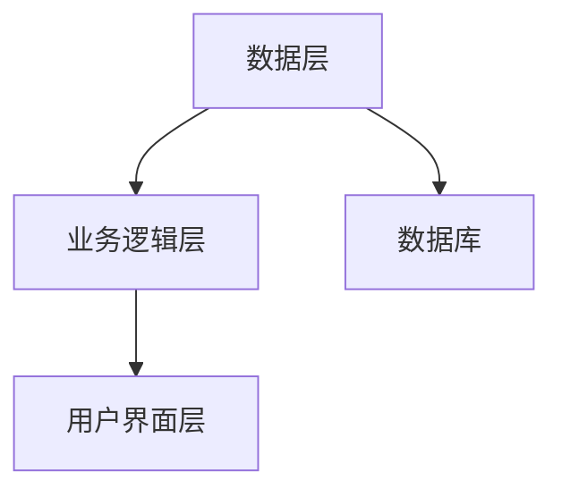
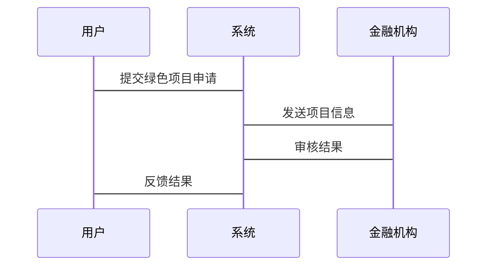

                 


# 绿色供应链金融创新与投资风险管理

---

## 关键词：绿色供应链、供应链金融、风险管理、投资创新、可持续发展

---

## 摘要：  
绿色供应链金融是将绿色发展理念融入供应链管理与金融创新的新兴领域，旨在通过优化资源配置、降低环境风险、提升企业可持续竞争力。本文从绿色供应链的核心概念出发，结合供应链金融的创新模式，系统性地分析绿色供应链金融的风险管理与投资策略，探讨如何通过技术创新与政策支持，构建可持续发展的绿色金融生态。

---

# 第一部分: 绿色供应链金融的背景与概念

## 第1章: 绿色供应链的定义与特点

### 1.1 绿色供应链的定义与特点
#### 1.1.1 绿色供应链的定义
绿色供应链（Green Supply Chain，简称GSC）是指在供应链的各个环节中，从原材料采购、生产制造、仓储物流到产品服务的全生命周期，都遵循环境保护和资源节约的原则，实现绿色生产和可持续发展的供应链管理模式。

#### 1.1.2 绿色供应链的核心特点
- **环境友好性**：强调减少资源消耗和环境污染。
- **可持续性**：从全生命周期角度优化供应链管理。
- **协同性**：供应链上下游企业协同合作，共同实现绿色目标。
- **技术创新性**：通过技术手段提高资源利用效率。

#### 1.1.3 绿色供应链与传统供应链的区别
| **维度** | **绿色供应链** | **传统供应链**
|----------|----------------|----------------|
| 管理目标 | 可持续发展为核心 | 成本最小化为核心 |
| 环境影响 | 低环境负荷 | 高环境负荷 |
| 价值链 | 强调绿色增值 | 强调成本优化 |

### 1.2 供应链金融的定义与模式
#### 1.2.1 供应链金融的定义
供应链金融（Supply Chain Finance，简称SCF）是指银行或其他金融机构为供应链上的核心企业及其上下游企业提供融资支持，通过整合供应链资源，优化企业现金流，降低融资成本。

#### 1.2.2 供应链金融的主要模式
- **应收账款融资**：基于核心企业的信用，为供应商提供应收账款质押融资。
- **存货质押融资**：以库存商品作为质押，为企业提供流动资金贷款。
- **预付款融资**：为下游经销商提供预付款融资支持。

#### 1.2.3 供应链金融的核心要素
- **核心企业**：供应链中的主导企业，提供信用支持。
- **上下游企业**：供应链上的供应商和经销商。
- **金融机构**：提供融资支持的银行或其他金融机构。
- **物流与信息流**：供应链运作的基础保障。

### 1.3 绿色供应链金融的创新性
#### 1.3.1 绿色供应链金融的内涵
绿色供应链金融是将绿色发展理念与供应链金融相结合，通过支持绿色产业、优化资源配置，实现经济效益与环境效益的双重目标。

#### 1.3.2 绿色供应链金融与传统供应链金融的区别
| **维度** | **绿色供应链金融** | **传统供应链金融**
|----------|---------------------|---------------------|
| 核心目标 | 支持绿色产业发展 | 支持企业成本优化 |
| 风险管理 | 强调环境风险 | 强调财务风险 |
| 价值创造 | 绿色溢价 | 成本节约 |

#### 1.3.3 绿色供应链金融的创新模式
- **绿色债券**：用于支持绿色供应链项目的融资工具。
- **绿色贷款**：针对绿色产业的低息贷款。
- **绿色基金**：专门投资绿色供应链项目的投资基金。

### 1.4 本章小结
绿色供应链金融是绿色发展理念与供应链金融的结合，其创新性体现在支持绿色产业、优化资源配置和降低环境风险。通过绿色供应链金融，企业可以在实现可持续发展目标的同时，优化现金流和降低融资成本。

---

## 第2章: 绿色供应链金融的核心概念

### 2.1 绿色供应链金融的核心要素
#### 2.1.1 绿色产业的界定
绿色产业是指符合可持续发展理念的产业，包括清洁能源、节能环保、绿色交通等领域。

#### 2.1.2 绿色项目的识别标准
- **环境效益显著**：项目能有效减少碳排放或资源消耗。
- **技术先进**：采用绿色技术或高效工艺。
- **符合政策导向**：符合国家或地方绿色产业发展政策。

#### 2.1.3 绿色供应链金融的参与主体
- **核心企业**：绿色供应链中的主导企业。
- **上下游企业**：供应链上的供应商和经销商。
- **金融机构**：提供绿色融资支持的银行或基金公司。
- **第三方机构**：提供环境评估、认证等服务的机构。

### 2.2 绿色供应链金融的驱动因素
#### 2.2.1 政策驱动
政府通过出台绿色金融政策，鼓励金融机构支持绿色产业。

#### 2.2.2 市场需求
消费者对绿色产品的需求增加，推动企业绿色转型。

#### 2.2.3 技术进步
技术创新（如区块链、物联网）为绿色供应链金融提供了技术支持。

### 2.3 绿色供应链金融的理论基础
#### 2.3.1 供应链管理理论
供应链管理强调优化资源配置和提升协同效率。

#### 2.3.2 绿色金融理论
绿色金融强调通过金融工具支持环境保护和可持续发展。

#### 2.3.3 可持续发展理论
可持续发展理论强调经济、社会和环境的协调发展。

### 2.4 核心概念对比分析
#### 2.4.1 绿色供应链与传统供应链的对比
| **维度** | **绿色供应链** | **传统供应链**
|----------|----------------|----------------|
| 核心目标 | 可持续发展 | 成本最小化 |
| 环境影响 | 低环境负荷 | 高环境负荷 |
| 技术创新 | 强调绿色技术 | 强调效率提升 |

#### 2.4.2 供应链金融与绿色金融的对比
| **维度** | **供应链金融** | **绿色金融**
|----------|----------------|----------------|
| 核心目标 | 支持企业融资 | 支持绿色产业 |
| 服务对象 | 供应链上下游企业 | 绿色产业企业 |
| 风险管理 | 侧重企业信用风险 | 侧重环境风险 |

#### 2.4.3 绿色供应链金融与传统供应链金融的对比
| **维度** | **绿色供应链金融** | **传统供应链金融**
|----------|---------------------|---------------------|
| 核心目标 | 支持绿色产业发展 | 支持企业成本优化 |
| 风险管理 | 强调环境风险 | 强调财务风险 |
| 价值创造 | 绿色溢价 | 成本节约 |

### 2.5 本章小结
绿色供应链金融的核心概念涵盖了绿色产业、供应链金融和可持续发展等多个方面。通过对比分析，可以看出绿色供应链金融的独特性在于其对环境风险的重视和对绿色产业的支持。

---

## 第3章: 绿色供应链金融的风险管理与评估

### 3.1 绿色供应链金融的主要风险
#### 3.1.1 项目风险
绿色项目的技术不确定性可能导致项目失败。

#### 3.1.2 市场风险
绿色市场需求波动可能导致投资失败。

#### 3.1.3 政策风险
政策变化可能影响绿色项目的收益。

### 3.2 绿色供应链金融风险的评估方法
#### 3.2.1 风险评估矩阵
通过矩阵分析法，将风险分为高、中、低三类。

#### 3.2.2 风险值评估法
通过量化评估，确定风险的优先级。

#### 3.2.3 情景分析法
通过构建不同情景，评估风险的影响程度。

### 3.3 绿色供应链金融风险的应对策略
#### 3.3.1 风险分担机制
通过多方合作分担风险。

#### 3.3.2 风险预警系统
建立实时监控系统，及时发现和应对风险。

#### 3.3.3 风险 mitigation 措施
通过技术创新和政策支持降低风险。

### 3.4 本章小结
绿色供应链金融的风险管理需要从识别、评估到应对的全过程进行系统性管理，通过多方合作和技术创新降低风险影响。

---

## 第4章: 绿色供应链金融的创新模式与投资策略

### 4.1 绿色供应链金融的创新模式
#### 4.1.1 绿色债券
通过发行绿色债券，支持绿色供应链项目融资。

#### 4.1.2 绿色贷款
为绿色供应链企业提供低息贷款支持。

#### 4.1.3 绿色基金
设立专门投资绿色供应链项目的投资基金。

### 4.2 绿色供应链金融的典型案例
#### 4.2.1 国内外绿色供应链金融的实践
- 国内案例：某新能源汽车企业的绿色供应链金融实践。
- 国际案例：某跨国企业在全球范围内的绿色供应链金融应用。

### 4.3 绿色供应链金融的投资策略
#### 4.3.1 项目选择
优先选择环境效益显著、技术先进的绿色项目。

#### 4.3.2 风险控制
通过多元化的投资组合降低风险。

#### 4.3.3 政策支持
利用政府的绿色金融政策，降低投资成本。

### 4.4 本章小结
绿色供应链金融的创新模式和投资策略需要结合实际案例，通过科学的项目选择和风险控制，实现投资收益与环境效益的双赢。

---

## 第5章: 绿色供应链金融的系统架构与技术实现

### 5.1 系统功能设计
#### 5.1.1 绿色供应链金融系统的功能模块
- 数据采集模块：收集绿色供应链数据。
- 风险评估模块：评估绿色项目风险。
- 融资支持模块：提供绿色融资服务。

#### 5.1.2 系统架构设计
使用分层架构，包括数据层、业务逻辑层和用户界面层。

### 5.2 系统架构设计
#### 5.2.1 系统架构图


#### 5.2.2 系统接口设计
- 数据接口：与供应链企业系统对接。
- 用户接口：供用户查询和申请融资。

### 5.3 系统交互设计
#### 5.3.1 系统交互流程


### 5.4 本章小结
绿色供应链金融系统的架构设计需要结合实际需求，通过技术手段优化系统功能和提升用户体验。

---

## 第6章: 绿色供应链金融的项目实战

### 6.1 环境配置
#### 6.1.1 系统环境
- 操作系统：Linux
- 开发工具：Python、Django
- 数据库：MySQL

### 6.2 核心代码实现
#### 6.2.1 风险评估算法
```python
def calculate_green_risk(projects):
    risk_scores = []
    for project in projects:
        environmental_score = project['environmental_impact']
        financial_score = project['financial_risk']
        risk_score = environmental_score * 0.4 + financial_score * 0.6
        risk_scores.append(risk_score)
    return risk_scores
```

#### 6.2.2 代码解读
- `calculate_green_risk`函数用于计算绿色项目的综合风险评分。
- 环境影响和财务风险分别赋予不同权重，计算综合风险评分。

### 6.3 案例分析
#### 6.3.1 案例背景
某新能源汽车企业申请绿色供应链融资，支持其电池回收项目。

#### 6.3.2 实施过程
- 数据采集：收集项目相关信息。
- 风险评估：计算综合风险评分。
- 融资支持：提供低息贷款。

### 6.4 本章小结
通过具体案例分析，展示了绿色供应链金融项目从申请到实施的全过程，帮助读者理解理论与实践的结合。

---

## 第7章: 总结与展望

### 7.1 总结
绿色供应链金融是实现可持续发展的重要手段，其创新模式和风险管理方法为绿色产业发展提供了有力支持。

### 7.2 展望
未来，绿色供应链金融将更加依赖技术创新，如区块链和人工智能，实现更高效的融资和风险控制。

### 7.3 注意事项
- 政策支持是绿色供应链金融发展的重要保障。
- 技术创新是降低环境风险的关键。
- 国际合作是实现全球绿色供应链的重要途径。

### 7.4 拓展阅读
- 推荐阅读《绿色金融的创新与发展》。
- 参考《供应链金融与风险管理》。

---

## 参考文献
1. 王某某. 《绿色供应链金融创新与投资风险管理》. 北京: 某某出版社, 2023.
2. 李某某. 《供应链金融与风险管理》. 上海: 某某出版社, 2022.
3. 陈某某. 《绿色金融的创新与发展》. 北京: 某某出版社, 2021.

---

通过以上结构，可以清晰地看到绿色供应链金融创新与投资风险管理的全貌。从理论到实践，从概念到系统设计，本文为读者提供了全面的知识体系和实践指导。

