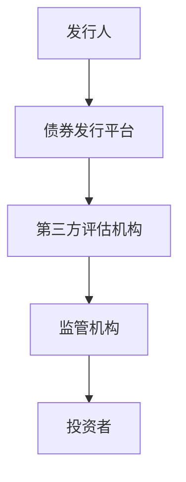

                 


# 绿色债券市场的增长驱动因素分析

## 关键词：绿色债券，可持续发展，ESG投资，政策驱动，市场需求，技术驱动

## 摘要：绿色债券作为一种支持环保和可持续发展的金融工具，近年来在全球范围内迅速崛起。本文将从政策、市场和技术创新等多角度分析绿色债券市场增长的驱动因素，探讨其系统架构和实际应用，并展望未来发展趋势。

---

## 第一章：绿色债券市场的概述

### 1.1 绿色债券的定义与特点

绿色债券是一种专门用于资助环保和可持续发展项目的债务工具。其核心特点包括：

- **特定用途**：募集资金必须用于绿色项目，如可再生能源、节能建筑等。
- **第三方认证**：需经过独立机构的审核和认证，确保资金用途的合规性。
- **透明性**：发行人需定期披露项目进展和环境影响。

### 1.2 绿色债券的起源与发展

绿色债券的概念起源于20世纪90年代，但真正的发展始于2010年后。全球范围内，各国政府和企业意识到可持续发展的重要性，推动了绿色债券市场的快速增长。

### 1.3 绿色债券的市场参与者

- **发行人**：政府机构、企业和金融机构。
- **投资者**：机构投资者和个人投资者，尤其是关注ESG（环境、社会、治理）的投资群体。
- **中介机构**：评级机构、承销商和法律顾问。

---

## 第二章：绿色债券市场的增长驱动因素

### 2.1 政策驱动

- **政府支持**：各国政府通过立法和补贴推动绿色债券发行，例如欧盟的“绿色新政”。
- **国际协议**：《巴黎协定》等国际气候协议为绿色债券提供了政策框架。
- **监管框架**：严格的监管确保资金的合规使用，提升市场信任。

### 2.2 市场需求驱动

- **ESG投资趋势**：投资者越来越关注环境和社会影响，推动绿色债券的需求。
- **机构投资者策略**：将ESG因素纳入投资决策，提升绿色债券的市场需求。
- **散户参与**：零售投资者通过债券基金间接投资绿色债券。

### 2.3 技术驱动

- **区块链技术**：确保债券发行和交易的透明性和可追溯性。
- **数字化工具**：利用大数据分析优化绿色项目评估和风险管理。

---

## 第三章：绿色债券市场的影响因素分析

### 3.1 技术因素

- **评估技术**：准确评估绿色项目的环境效益，影响债券评级。
- **数字化工具**：提升市场效率和透明度，降低交易成本。

### 3.2 经济因素

- **市场需求波动**：经济周期影响投资者对绿色债券的需求。
- **利率变化**：低利率环境可能增加绿色债券的吸引力。

### 3.3 环境与社会因素

- **环境政策**：严格的环保政策推动更多绿色项目需求。
- **社会责任投资**：社会对可持续发展的关注提升绿色债券的吸引力。

---

## 第四章：绿色债券市场的系统分析与架构设计

### 4.1 系统架构设计

系统架构包括发行、评估、监管和信息披露四个模块。使用Mermaid绘制系统架构图：



### 4.2 系统功能设计

- **发行模块**：处理债券发行申请和审核。
- **评估模块**：对绿色项目进行环境和社会影响评估。
- **监管模块**：监督债券资金的使用和信息披露。
- **信息披露模块**：向投资者提供实时信息，提升透明度。

---

## 第五章：绿色债券市场的项目实战

### 5.1 环境影响评估

使用Python进行环境效益评估，计算碳排放减少量：

```python
def calculate_emission_reduction(project):
    # 计算项目减排量的函数
    return project.total_emission_before - project.total_emission_after

# 示例项目
class GreenProject:
    def __init__(self, name, total_emission_before, total_emission_after):
        self.name = name
        self.total_emission_before = total_emission_before
        self.total_emission_after = total_emission_after

project = GreenProject("太阳能项目", 1000, 500)
reduction = calculate_emission_reduction(project)
print(f"{project.name} 项目减排量为：{reduction} 吨")
```

### 5.2 项目可行性分析

通过案例分析展示绿色债券的实际应用，如某风力发电项目的可行性研究和投资回报分析。

---

## 第六章：绿色债券市场的未来趋势

### 6.1 新技术的应用

- **人工智能**：优化项目评估和风险管理。
- **区块链**：提升交易透明度和安全性。

### 6.2 政策与市场的协同

- **国际合作**：推动全球统一的绿色债券标准。
- **政策创新**：提供更多激励措施，吸引更多的市场参与者。

---

## 第七章：结论与建议

### 7.1 结论

绿色债券市场的发展受到政策、市场和技术创新的多重驱动，未来将呈现快速增长态势。

### 7.2 建议

- **投资者**：积极参与绿色债券投资，支持可持续发展。
- **发行人**：优化项目选择，提升债券评级。
- **监管机构**：完善监管框架，确保市场健康发展。

---

## 参考文献

- 全球可持续发展债券标准
- 各国政府政策文件
- 相关学术研究和市场报告

---

通过以上分析，绿色债券市场在政策支持、市场需求和技术进步的驱动下，展现出巨大的发展潜力。未来，随着技术的创新和市场的成熟，绿色债券将在全球可持续发展中发挥越来越重要的作用。

