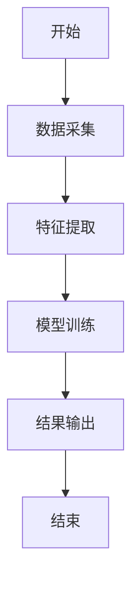

                 


# 绿色债券：可持续发展融资的投资机会

## 关键词：绿色债券，可持续发展，投资机会，环境效益，金融创新，气候变化

## 摘要：绿色债券作为一种创新的融资工具，为可持续发展项目提供了重要的资金支持。本文将详细分析绿色债券的背景、核心概念、评级模型、环境效益、系统架构、项目实战和最佳实践，帮助投资者和金融从业者更好地理解绿色债券的投资机会和潜在风险。

---

# 第1章 绿色债券的背景与定义

## 1.1 绿色债券的背景与问题背景

### 1.1.1 可持续发展与气候变化的挑战
- 全球气候变化的加剧要求各国加速绿色转型。
- 可持续发展已成为全球共识，但传统融资模式难以满足绿色项目的需求。
- 绿色债券的兴起为绿色项目提供了新的资金来源。

### 1.1.2 传统融资模式的局限性
- 传统债券主要用于企业扩张和债务融资，缺乏对环境效益的关注。
- 绿色项目往往需要长期投资，但传统融资渠道难以匹配其周期和风险特征。

### 1.1.3 绿色债券的兴起与发展趋势
- 绿色债券的定义和分类逐步完善，市场规模快速扩大。
- 国际机构和各国政府推动绿色债券发展，政策支持不断加强。

## 1.2 绿色债券的核心概念与问题描述

### 1.2.1 绿色债券的定义与核心要素
- 绿色债券是指用于支持具有环境效益的项目的债券。
- 核心要素包括资金用途、项目评估、信息披露和第三方认证。

### 1.2.2 绿色债券的目标与边界
- 目标：支持绿色项目，促进可持续发展。
- 边界：绿色债券仅支持特定的绿色项目，需符合国际标准。

### 1.2.3 绿色债券的分类与应用场景
- 分类：根据发行主体、用途和期限分类。
- 应用场景：可再生能源、绿色建筑、污染治理等领域。

---

# 第2章 绿色债券的运作机制与核心原理

## 2.1 绿色债券的发行与运作流程

### 2.1.1 绿色债券的发行主体与发行流程
- 发行主体：政府、企业和国际机构。
- 发行流程：项目评估、债券发行、资金使用和信息披露。

### 2.1.2 绿色债券的资金用途与监管要求
- 资金用途：支持绿色项目，确保资金专款专用。
- 监管要求：需符合国际标准和第三方认证。

### 2.1.3 绿色债券的评级与认证机制
- 评级：反映债券的信用风险和环境效益。
- 认证：由第三方机构对债券的绿色属性进行评估。

## 2.2 绿色债券的核心原理与概念结构

### 2.2.1 绿色债券的金融属性与风险特征
- 金融属性：兼具债务和收益属性。
- 风险特征：信用风险、市场风险和环境风险。

### 2.2.2 绿色债券的环境效益与社会价值
- 环境效益：减少碳排放，保护生态环境。
- 社会价值：促进就业，改善社会福祉。

### 2.2.3 绿色债券的市场参与与利益相关者
- 利益相关者：发行人、投资者、监管机构和第三方机构。

---

# 第3章 绿色债券的环境效益与社会影响

## 3.1 绿色债券的环境效益分析

### 3.1.1 绿色债券对气候变化的贡献
- 减少温室气体排放，支持可再生能源项目。

### 3.1.2 绿色债券对环境保护的支持
- 用于污染治理、生态保护和绿色建筑。

### 3.1.3 绿色债券对可持续发展的推动
- 促进绿色技术创新，支持绿色产业链发展。

## 3.2 绿色债券的社会影响与经济效益

### 3.2.1 绿色债券对社会就业的影响
- 支持绿色产业，创造更多就业岗位。

### 3.2.2 绿色债券对经济发展的促进
- 通过绿色投资带动经济增长。

### 3.2.3 绿色债券的长期社会效益
- 提高社会福祉，推动全球可持续发展。

---

# 第4章 绿色债券的评级与风险分析

## 4.1 绿色债券的评级模型与算法原理

### 4.1.1 绿色债券评级的核心原理
- 评级模型：结合信用风险和环境效益进行综合评估。
- 算法流程：数据采集、特征提取、模型训练和结果输出。

### 4.1.2 绿色债券评级的数学模型
- 示例模型：线性回归模型用于预测债券评级。
- 公式：$$ 评级 = \beta_0 + \beta_1 \times 收益率 + \epsilon $$

### 4.1.3 绿色债券评级的Python代码实现
```python
import pandas as pd
from sklearn.linear_model import LinearRegression

# 数据准备
data = pd.DataFrame({
    '收益': [0.05, 0.06, 0.04, 0.07],
    '评级': [3, 4, 3, 5]
})

# 模型训练
model = LinearRegression()
model.fit(data[['收益']], data['评级'])

# 预测评级
预测收益 = 0.06
预测评级 = model.predict([[预测收益]])
print("预测评级:", 预测评级)
```

### 4.1.4 绿色债券评级的流程图


## 4.2 绿色债券的风险分析与管理

### 4.2.1 绿色债券的主要风险类型
- 信用风险：债券发行人违约的风险。
- 市场风险：债券价格波动的风险。
- 环境风险：绿色项目失败的风险。

### 4.2.2 绿色债券风险的管理策略
- 信用风险管理：加强发行人资质审核。
- 市场风险管理：分散投资，降低市场波动影响。
- 环境风险管理：加强项目评估和监督。

---

# 第5章 绿色债券的环境效益与经济效益

## 5.1 绿色债券的环境效益分析

### 5.1.1 环境效益的量化方法
- 使用生命周期评估（LCA）方法。
- 示例公式：$$ 环境效益 = \sum_{i=1}^{n} 环境影响_i \times 权重_i $$

### 5.1.2 绿色债券对环境改善的贡献
- 减少碳排放，保护生态系统。

## 5.2 绿色债券的经济效益分析

### 5.2.1 绿色债券的经济回报
- 投资者可通过绿色债券获得稳定收益。
- 示例公式：$$ 投资回报率 = \frac{收益 - 本金}{本金} \times 100\% $$

### 5.2.2 绿色债券对社会经济的促进
- 通过支持绿色产业，推动经济增长。

---

# 第6章 绿色债券的系统架构与设计

## 6.1 绿色债券评估系统的架构设计

### 6.1.1 系统功能设计
- 数据采集模块：收集债券发行信息和项目数据。
- 评级计算模块：基于算法模型计算债券评级。
- 信息展示模块：展示债券评级和环境效益。

### 6.1.2 系统架构图


## 6.2 绿色债券评估系统的实现

### 6.2.1 系统实现步骤
- 数据准备：收集债券发行信息和项目数据。
- 模型训练：基于历史数据训练评级模型。
- 系统集成：实现模块化设计，确保系统稳定运行。

---

# 第7章 绿色债券的项目实战

## 7.1 绿色债券的发行案例分析

### 7.1.1 某国政府绿色债券发行案例
- 发行目的：支持可再生能源项目。
- 资金用途：建设太阳能电站和风力发电站。

### 7.1.2 某企业绿色债券发行案例
- 发行主体：某清洁能源企业。
- 资金用途：扩建绿色能源生产基地。

## 7.2 绿色债券的环境效益计算

### 7.2.1 环境效益的计算方法
- 使用碳排放因子计算减排量。
- 示例公式：$$ 减排量 = \frac{能源消耗}{碳排放因子} $$

### 7.2.2 经济效益的评估
- 计算投资回报率和净现值。
- 示例公式：$$ 净现值 = \sum_{t=1}^{n} 现金流_t \times (1 + r)^{-t} $$

---

# 第8章 绿色债券的最佳实践与小结

## 8.1 绿色债券投资的注意事项

### 8.1.1 风险控制
- 关注发行人的信用状况。
- 评估项目的环境效益和可行性。

### 8.1.2 投资策略
- 分散投资，降低风险。
- 关注政策支持和市场趋势。

## 8.2 绿色债券的未来展望

### 8.2.1 市场发展趋势
- 绿色债券市场规模将继续扩大。
- 产品创新将加速，出现更多类型的绿色债券。

### 8.2.2 投资机会
- 可再生能源、绿色建筑等领域将有更多的投资机会。

---

# 结语

绿色债券作为可持续发展的重要融资工具，为投资者和项目方提供了双赢的机会。随着全球对绿色发展的需求增加，绿色债券的投资机会将更加广泛。投资者应关注市场动态，合理评估风险，抓住绿色债券带来的投资机会。

---

以上是文章的完整目录和内容概览，具体内容可根据实际需求进一步扩展和详细阐述。

