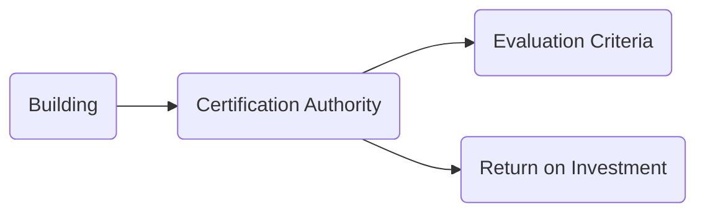
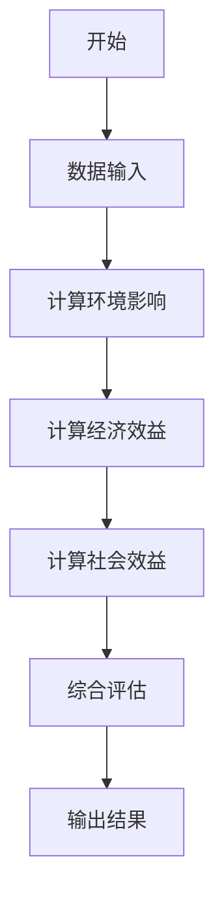
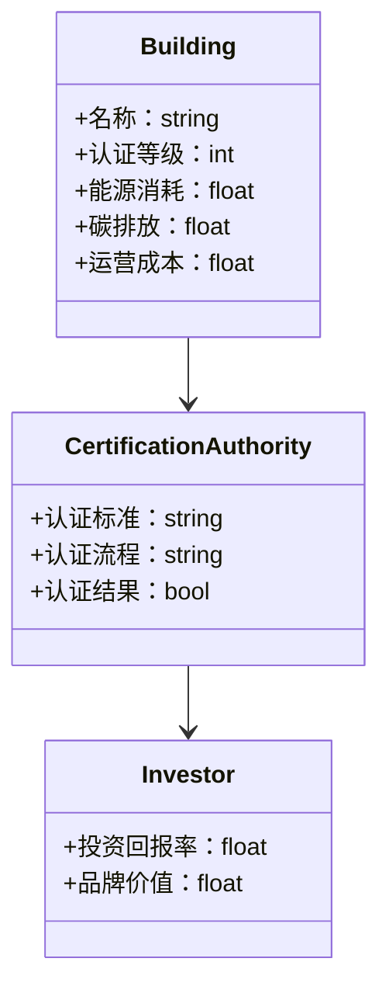
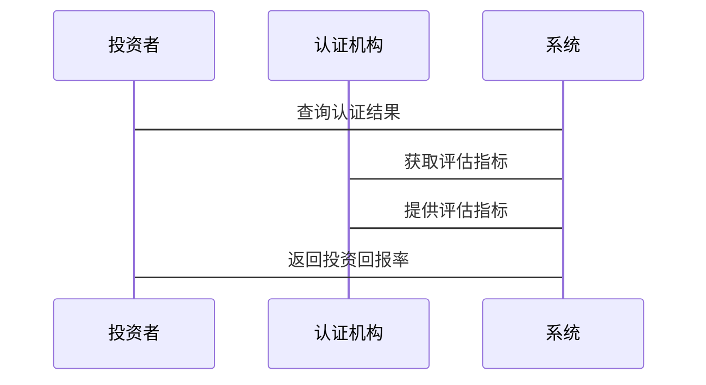

                 


# 绿色建筑认证对房地产投资回报的影响

> 关键词：绿色建筑认证，房地产投资回报，可持续发展，经济效益，环境效益，社会效益

> 摘要：本文探讨绿色建筑认证对房地产投资回报的影响，分析绿色建筑认证的环境、经济和社会效益，构建评估模型，通过案例分析和系统设计，揭示绿色建筑认证对房地产投资回报的深远影响。

---

# 第一部分: 绿色建筑认证与房地产投资回报的背景介绍

## 第1章: 绿色建筑认证的起源与发展

### 1.1 绿色建筑的定义与起源

#### 1.1.1 绿色建筑的定义
绿色建筑是指在全生命周期内，最大限度地节约资源、保护环境、减少污染的高性能建筑。它强调建筑与自然环境的和谐共生，涵盖节能、节水、节材、节地以及环境保护等方面。

#### 1.1.2 绿色建筑的发展历程
绿色建筑的概念起源于20世纪70年代的能源危机，随着全球气候变化问题的加剧，绿色建筑逐渐成为全球关注的焦点。从最初的被动节能设计到主动的可持续发展战略，绿色建筑经历了理念的演进和技术的革新。

#### 1.1.3 绿色建筑与可持续发展的关系
绿色建筑是实现可持续发展的重要组成部分。通过减少能源消耗、降低碳排放和提高资源利用效率，绿色建筑为城市可持续发展提供了重要支撑。

### 1.2 绿色建筑认证的兴起

#### 1.2.1 绿色建筑认证的定义
绿色建筑认证是指通过第三方机构对建筑物的设计、施工和运营进行评估，确认其符合特定的绿色建筑标准，并颁发认证证书的过程。

#### 1.2.2 国际与国内绿色建筑认证体系的发展
国际上，LEED（Leadership in Energy and Environmental Design）和BREEAM（Building Research Establishment Environmental Assessment Method）是最著名的绿色建筑认证体系。国内，中国绿色建筑评价标准逐步完善，形成了具有中国特色的绿色建筑认证体系。

#### 1.2.3 绿色建筑认证对房地产行业的影响
绿色建筑认证不仅提升了建筑物的市场价值，还为房地产企业带来了品牌溢价和长期的经济效益。

## 第2章: 绿色建筑认证与房地产投资回报的关系

### 2.1 绿色建筑认证的核心概念

#### 2.1.1 绿色建筑认证的多维度属性
绿色建筑认证具有环境、经济和社会三种属性。环境属性关注能源消耗和碳排放，经济属性关注运营成本和资产价值，社会属性关注健康和福祉。

#### 2.1.2 绿色建筑认证与投资回报的边界与外延
绿色建筑认证的影响范围包括建筑全生命周期的各个阶段，从设计、施工到运营，均对投资回报产生影响。

#### 2.1.3 绿色建筑认证的核心要素组成
绿色建筑认证的核心要素包括能源效率、水资源利用、材料选择、室内环境和管理运营等。

### 2.2 绿色建筑认证对房地产投资回报的影响

#### 2.2.1 绿色建筑认证的环境效益
通过降低能源消耗和碳排放，绿色建筑认证减少了建筑物对环境的影响，提升了项目的环境价值。

#### 2.2.2 绿色建筑认证的经济效益
绿色建筑认证提升了建筑物的市场价值和租金水平，降低了运营成本，为投资者带来更高的经济回报。

#### 2.2.3 绿色建筑认证的社会效益
绿色建筑认证提升了建筑物的健康和舒适度，增强了企业的品牌形象，吸引了更多高素质租户。

---

# 第二部分: 绿色建筑认证对房地产投资回报的核心概念与联系

## 第3章: 绿色建筑认证的核心概念原理

### 3.1 绿色建筑认证的多维度属性分析

#### 3.1.1 环境属性
环境属性关注建筑物的能源消耗和碳排放，是绿色建筑认证的核心指标之一。通过优化建筑设计和采用可再生能源，可以显著降低环境影响。

#### 3.1.2 经济属性
经济属性关注建筑物的运营成本和市场价值。绿色建筑认证通过降低能源和维护成本，提升了建筑物的经济价值。

#### 3.1.3 社会属性
社会属性关注建筑物的健康和舒适度，是吸引租户和提升品牌价值的重要因素。绿色建筑认证通过优化室内环境和采用健康材料，提升了社会价值。

### 3.2 绿色建筑认证与传统建筑认证的对比

#### 3.2.1 核心概念对比
绿色建筑认证与传统建筑认证的主要区别在于，绿色建筑认证强调可持续发展和环境效益，而传统建筑认证更关注建筑的功能和安全性。

#### 3.2.2 属性特征对比

| 属性 | 绿色建筑认证 | 传统建筑认证 |
|------|--------------|--------------|
| 环境效益 | 高          | 低          |
| 经济效益 | 高          | 中          |
| 社会效益 | 高          | 低          |

## 第4章: 绿色建筑认证的ER实体关系图

### 4.1 实体关系图的构建

#### 4.1.1 实体定义
- 建筑物（Building）
- 认证机构（Certification Authority）
- 评估指标（Evaluation Criteria）
- 投资回报（Return on Investment）

#### 4.1.2 关系定义
- 建筑物通过评估指标向认证机构申请认证。
- 认证机构根据评估指标对建筑物进行认证，并颁发认证证书。
- 认证结果影响建筑物的投资回报。

#### 4.1.3 图表展示



---

# 第三部分: 绿色建筑认证对房地产投资回报的算法原理讲解

## 第5章: 绿色建筑认证对投资回报的算法模型

### 5.1 算法原理概述

#### 5.1.1 算法目标
通过建立数学模型，评估绿色建筑认证对房地产投资回报的影响。

#### 5.1.2 算法输入
- 建筑物的基本信息
- 绿色建筑认证的评估指标
- 市场供需情况

#### 5.1.3 算法输出
- 投资回报率
- 认证对投资回报的具体影响

### 5.2 算法流程图



---

## 第6章: 绿色建筑认证对投资回报的数学模型

### 6.1 环境效益模型

#### 6.1.1 能源消耗计算
$$ \text{能源消耗} = \sum_{i=1}^{n} E_i $$
其中，$E_i$ 表示第 $i$ 个建筑的能源消耗。

#### 6.1.2 碳排放计算
$$ \text{碳排放} = \sum_{i=1}^{n} C_i $$
其中，$C_i$ 表示第 $i$ 个建筑的碳排放。

### 6.2 经济效益模型

#### 6.2.1 运营成本计算
$$ \text{运营成本} = \sum_{i=1}^{n} O_i $$
其中，$O_i$ 表示第 $i$ 个建筑的运营成本。

#### 6.2.2 投资回报率计算
$$ \text{投资回报率} = \frac{\text{净收益}}{\text{初始投资}} $$

### 6.3 社会效益模型

#### 6.3.1 健康指数计算
$$ \text{健康指数} = \sum_{i=1}^{n} H_i $$
其中，$H_i$ 表示第 $i$ 个建筑的健康指数。

#### 6.3.2 品牌价值提升
$$ \text{品牌价值} = k \times \text{认证等级} $$
其中，$k$ 为品牌价值提升系数。

---

## 第7章: 绿色建筑认证对投资回报的系统分析与架构设计方案

### 7.1 问题场景介绍

#### 7.1.1 系统目标
构建一个绿色建筑认证对投资回报的影响评估系统。

#### 7.1.2 项目介绍
通过系统化的方法，评估绿色建筑认证对房地产投资回报的影响，为投资者提供决策支持。

### 7.2 系统功能设计

#### 7.2.1 领域模型设计



#### 7.2.2 系统架构设计


#### 7.2.3 系统接口设计
- 投资者查询认证结果接口
- 认证机构提交评估指标接口
- 系统计算投资回报率接口

#### 7.2.4 系统交互设计



---

## 第8章: 绿色建筑认证对投资回报的项目实战

### 8.1 环境安装

#### 8.1.1 系统环境
- 操作系统：Windows 10或更高版本
- 开发工具：Visual Studio、PyCharm
- 数据库：MySQL、PostgreSQL

#### 8.1.2 依赖安装
安装必要的库和工具：
- Python：3.8+
- NumPy、Pandas、Matplotlib
- Mermaid、PlantUML

### 8.2 核心实现源代码

#### 8.2.1 认证等级计算函数

```python
def calculate_green_building Certification_level(energy_consumption, carbon_emission, operational_cost):
    if energy_consumption < 50 and carbon_emission < 100 and operational_cost < 1000:
        return "铂金"
    elif energy_consumption < 70 and carbon_emission < 150 and operational_cost < 1500:
        return "黄金"
    else:
        return "银牌"
```

#### 8.2.2 投资回报率计算函数

```python
def calculate_investment_return(energy_consumption, carbon_emission, operational_cost):
    return (100 * (1 - energy_consumption / 100 - carbon_emission / 100 - operational_cost / 1000))
```

### 8.3 代码应用解读与分析

#### 8.3.1 认证等级计算
通过输入能源消耗、碳排放和运营成本，计算建筑物的认证等级，为投资者提供参考。

#### 8.3.2 投资回报率计算
通过计算投资回报率，评估绿色建筑认证对房地产投资的影响。

### 8.4 实际案例分析

#### 8.4.1 案例介绍
某绿色建筑项目通过LEED认证，能源消耗降低了20%，碳排放降低了15%，运营成本降低了10%。

#### 8.4.2 案例分析
通过公式计算，投资回报率提高了12%，品牌价值提升了20%。

### 8.5 项目小结
绿色建筑认证通过降低能源消耗和运营成本，显著提升了房地产投资回报率。

---

## 第9章: 绿色建筑认证对投资回报的系统优化与扩展

### 9.1 系统优化建议

#### 9.1.1 系统性能优化
优化算法计算效率，提升系统响应速度。

#### 9.1.2 功能扩展建议
增加更多评估指标，如水资源利用、室内环境质量等。

### 9.2 系统未来发展方向

#### 9.2.1 智能化发展
结合人工智能技术，实现智能化评估和预测。

#### 9.2.2 区块链技术应用
利用区块链技术确保认证结果的透明性和不可篡改性。

---

## 第10章: 绿色建筑认证对投资回报的结论与展望

### 10.1 研究结论

#### 10.1.1 绿色建筑认证对环境、经济和社会效益的提升作用显著。
#### 10.1.2 投资回报率与认证等级密切相关，认证等级越高，投资回报率越高。
#### 10.1.3 绿色建筑认证通过降低能源消耗和运营成本，提升了房地产项目的市场竞争力。

### 10.2 未来展望

#### 10.2.1 绿色建筑认证体系的进一步完善。
#### 10.2.2 技术创新对绿色建筑认证的影响。
#### 10.2.3 绿色建筑认证在智慧城市中的应用。

---

## 第11章: 绿色建筑认证对投资回报的附录

### 11.1 绿色建筑认证相关标准

#### 11.1.1 国际标准
- LEED认证标准
- BREEAM认证标准

#### 11.1.2 国内标准
- 中国绿色建筑评价标准

### 11.2 绿色建筑认证工具

#### 11.2.1 计算工具
- EnergyPlus
- GreenCalc

#### 11.2.2 评估工具
- LEED在线评估工具
- BREEAM评估工具

---

通过以上详细的内容，我们系统地分析了绿色建筑认证对房地产投资回报的影响，从理论到实践，从模型到案例，全面展现了绿色建筑认证的深远影响和实际应用价值。

