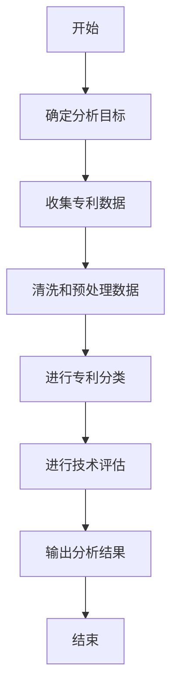
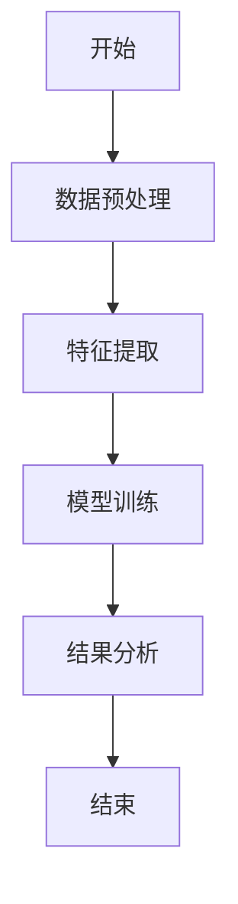

                 


# 绿色技术专利分析与投资机会识别方法

> 关键词：绿色技术、专利分析、投资机会、技术评估、市场潜力

> 摘要：绿色技术作为推动可持续发展的重要力量，其专利分析对于识别投资机会具有重要意义。本文通过系统分析绿色技术专利的特点、分类方法及评估模型，结合实际案例，详细阐述了如何利用专利数据识别绿色技术领域的投资机会，并探讨了绿色技术专利分析的未来发展趋势。

---

# 第一部分：绿色技术专利分析与投资机会识别概述

## 第1章：绿色技术与专利分析的背景介绍

### 1.1 绿色技术的定义与内涵

#### 1.1.1 绿色技术的核心概念
绿色技术是指能够减少资源消耗、降低污染排放、提高能源利用效率，并促进可持续发展的技术。其核心在于通过技术创新解决环境问题，同时实现经济和社会的可持续发展。

#### 1.1.2 绿色技术的分类与应用场景
绿色技术可以分为以下几类：
1. **清洁能源技术**：如太阳能、风能、生物质能等可再生能源技术。
2. **节能环保技术**：如节能设备、污染治理技术等。
3. **绿色材料技术**：如可降解材料、环保材料等。
4. **循环经济技术**：如废物资源化、循环利用技术等。

绿色技术广泛应用于工业、农业、交通、建筑等多个领域，是实现碳中和目标的重要技术支撑。

#### 1.1.3 绿色技术与可持续发展的关系
绿色技术是实现联合国可持续发展目标（SDGs）的重要手段。通过绿色技术的应用，可以有效减少对环境的负面影响，促进经济的可持续发展，同时为全球气候变化问题提供解决方案。

---

### 1.2 专利分析的背景与意义

#### 1.2.1 专利分析的基本概念
专利分析是通过对专利数据的挖掘和分析，研究某一领域的技术发展趋势、竞争格局、技术热点等问题。专利数据包括专利申请数量、专利分布领域、专利技术特点等。

#### 1.2.2 绿色技术专利分析的重要性
绿色技术专利分析可以帮助投资者识别具有市场潜力的技术领域，评估技术的成熟度和市场竞争力，从而为投资决策提供科学依据。

#### 1.2.3 专利分析在投资决策中的作用
专利分析可以为投资者提供以下信息：
1. **技术成熟度**：评估某项技术是否处于研发阶段或已经成熟。
2. **市场潜力**：判断某项技术的市场规模和增长潜力。
3. **技术风险**：评估技术的法律风险和市场竞争风险。

---

### 1.3 绿色技术专利分析的现状与挑战

#### 1.3.1 当前绿色技术专利的分布特点
当前绿色技术专利主要集中在清洁能源、节能环保等领域。中国、美国、欧洲是绿色技术专利的主要申请地区。

#### 1.3.2 绿色技术专利分析的主要挑战
1. **数据获取难度**：绿色技术专利分布广泛，数据获取成本较高。
2. **技术复杂性**：绿色技术涉及多个技术领域，分析难度较大。
3. **动态变化**：绿色技术发展迅速，专利数据需要及时更新。

#### 1.3.3 未来研究方向与发展趋势
未来绿色技术专利分析将更加注重技术的交叉性和创新性，同时结合人工智能和大数据技术，提高分析的效率和准确性。

---

## 第2章：绿色技术专利分析的核心概念与联系

### 2.1 绿色技术专利分析的原理

#### 2.1.1 专利数据的特征与属性
专利数据主要包括以下特征：
1. **专利名称**：描述技术的核心内容。
2. **专利申请人**：专利的发明人或申请单位。
3. **专利申请日期**：专利的申请时间。
4. **专利技术领域**：专利所属的技术领域。

#### 2.1.2 专利分类与技术领域的关系
专利分类是将专利按照技术领域进行归类的过程。常用的分类方法包括国际专利分类（IPC）和美国专利分类（USPC）。

#### 2.1.3 专利分析的主要方法与工具
常用的专利分析方法包括：
1. **文献计量分析**：通过统计专利数量和分布，分析技术发展趋势。
2. **引文分析**：通过分析专利的引用情况，研究技术的依赖性和创新性。
3. **技术生命周期分析**：通过分析专利申请的时间分布，判断技术所处的生命周期阶段。

---

### 2.2 核心概念对比分析

#### 2.2.1 绿色技术与传统技术的对比
| 对比维度 | 绿色技术 | 传统技术 |
|----------|----------|----------|
| 技术目标 | 减少资源消耗，保护环境 | 追求效率和经济效益 |
| 技术特点 | 强调可持续性和环保性 | 强调效率和经济性 |
| 应用领域 | 清洁能源、节能环保等 | 制造业、能源等领域 |

#### 2.2.2 专利技术与非专利技术的对比
| 对比维度 | 专利技术 | 非专利技术 |
|----------|----------|----------|
| 技术保密性 | 高 | 低 |
| 技术扩散性 | 低 | 高 |
| 技术保护性 | 高 | 低 |

#### 2.2.3 不同领域绿色技术的对比
以清洁能源为例，太阳能和风能的专利数量和分布特点存在显著差异。太阳能技术的专利数量更多，且分布较为集中；而风能技术的专利分布较为分散。

---

### 2.3 实体关系图与流程图

#### 2.3.1 绿色技术专利分析的实体关系图（ER图）

```mermaid
erd
    entity 绿色技术 {
        key 专利号
        属性 专利名称、申请人、申请日期、技术领域
    }
    entity 专利分类 {
        key 分类号
        属性 分类名称、分类说明
    }
    entity 技术评估 {
        key 评估编号
        属性 技术成熟度、市场潜力、专利价值
    }
    绿色技术 --> 专利分类 : 分属于
    绿色技术 --> 技术评估 : 依据
```

#### 2.3.2 绿色技术专利分析的流程图（Mermaid）



---

## 第3章：绿色技术专利分析的算法原理

### 3.1 算法原理概述

#### 3.1.1 文本挖掘与自然语言处理在专利分析中的应用
文本挖掘技术可以用于提取专利文本中的关键词和主题，自然语言处理技术可以用于分析专利文本的语义关系。

#### 3.1.2 机器学习算法在专利分类中的应用
常用的机器学习算法包括支持向量机（SVM）、随机森林（Random Forest）和神经网络（NN）等。

#### 3.1.3 图论算法在专利网络分析中的应用
图论算法可以用于构建专利网络，分析专利之间的关联性。

---

### 3.2 算法流程图与代码实现

#### 3.2.1 绿色技术专利分析的算法流程图（Mermaid）



#### 3.2.2 Python代码实现（示例）

```python
import pandas as pd
from sklearn.feature_extraction.text import TfidfVectorizer
from sklearn.svm import SVC

# 数据加载
patent_data = pd.read_csv('patent.csv')

# 特征提取
vectorizer = TfidfVectorizer(max_features=1000)
X = vectorizer.fit_transform(patent_data['description'])

# 模型训练
model = SVC()
model.fit(X, patent_data['technology'])

# 模型预测
new_patent = ['This is a description of a new green technology.']
new_X = vectorizer.transform(new_patent)
predicted_technology = model.predict(new_X)
```

---

## 第4章：绿色技术专利分析的数学模型与公式

### 4.1 技术成熟度评估模型

#### 4.1.1 技术成熟度评分公式
$$ 技术成熟度 = \frac{\sum \text{专利引用次数}}{\text{专利数量}} $$

#### 4.1.2 技术成熟度与市场潜力的关系
技术成熟度越高，市场潜力越大。

---

## 第5章：绿色技术专利分析的系统架构设计

### 5.1 系统功能模块设计

#### 5.1.1 数据采集模块
数据采集模块负责从专利数据库中获取绿色技术专利数据。

#### 5.1.2 数据分析模块
数据分析模块负责对专利数据进行清洗、分类和评估。

---

## 第6章：绿色技术专利分析的项目实战

### 6.1 环境安装与数据准备

#### 6.1.1 环境安装
需要安装以下工具和库：
- Python
- Pandas
- Scikit-learn
- Mermaid

#### 6.1.2 数据准备
从专利数据库中获取绿色技术专利数据，清洗和预处理数据。

---

### 6.2 系统核心实现源代码

#### 6.2.1 数据清洗代码

```python
import pandas as pd

# 数据清洗
def clean_data(data):
    data.dropna(inplace=True)
    data = data[data['technology'] == 'green']
    return data

patent_data = pd.read_csv('patent.csv')
cleaned_data = clean_data(patent_data)
```

---

### 6.3 实际案例分析

#### 6.3.1 案例背景
以太阳能技术为例，分析其专利数量、申请人和市场潜力。

#### 6.3.2 分析结果
太阳能技术专利数量逐年增加，主要申请人包括多家知名企业和研究机构。

---

### 6.4 项目小结

通过绿色技术专利分析，可以帮助投资者识别具有市场潜力的技术领域，评估技术的成熟度和市场竞争力，从而为投资决策提供科学依据。

---

## 第7章：最佳实践、小结与注意事项

### 7.1 最佳实践
1. **数据来源**：选择权威的专利数据库。
2. **技术领域**：重点关注技术成熟度高、市场潜力大的领域。
3. **工具选择**：根据需求选择合适的文本挖掘和机器学习工具。

### 7.2 小结
绿色技术专利分析是识别投资机会的重要方法，通过系统分析和评估，可以帮助投资者找到具有市场潜力的技术领域。

### 7.3 注意事项
1. **数据隐私**：注意保护专利数据的隐私和安全。
2. **技术更新**：及时更新专利数据和分析模型。

### 7.4 拓展阅读
推荐阅读以下书籍和论文：
1. 《专利分析与技术管理》
2. 《绿色技术与可持续发展》

---

通过以上分析，我们可以系统地识别绿色技术专利中的投资机会，并为投资决策提供科学依据。

